# 技术分享 | MySQL 网络延时参数设置建议

**原文链接**: https://opensource.actionsky.com/20201013-mysql/
**分类**: MySQL 新特性
**发布时间**: 2020-10-13T00:31:35-08:00

---

作者：毛思平
工作11年，从事数据库工作7年，主要在金融行业。主要是做oracle,mysql。现在在农行软开中心主要做数据库应用方面的研究。
本文来源：原创投稿
*爱可生开源社区出品，原创内容未经授权不得随意使用，转载请联系小编并注明来源。
近期投产生产 MySQL组复制集群偶尔出现节点被逐出集群的情况，怀疑是网络抖动导致。查询官方文档发现，MySQL 8.0.13 版本引入集群网络延迟容错参数group_replication_member_expel_timeout。
**该参数的官方解释：**
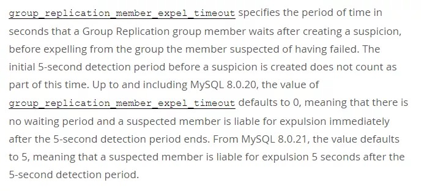											
**翻译：**
group_replication_member_expel_timeout 指定组复制组成员在产生怀疑之后，从组中排除怀疑失败的成员之前等待的时间（以秒为单位）。在产生怀疑之前的最初 5 秒检测时间不计入该时间。直到并包括 MySQL 8.0.20 在内，group_replication_member_expel_timeout 默认值均为 0，这意味着没有等待时间，并且在 5 秒钟的检测时间结束后，可疑成员应立即被驱逐。从 MySQL 8.0.21 开始，该值默认为 5，这意味着在 5 秒钟的检测时间后如果该节点还是不正常，那会在等 5 秒钟，如果可疑成员还是不正常，超过这个时间将被驱逐。
为验证该参数对集群影响，我们通过实验模拟不同时长的网络延迟，然后调整group_replication_member_expel_timeout 值观察该参数值对集群驱逐故障节点的影响。
**测试环境如下：**
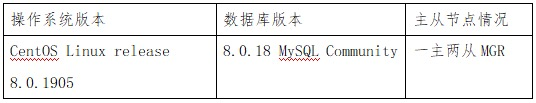											
**测试方法：**
1、设置各节点 group_replication_member_expel_timeout 值Y。2、在节点模拟网络断开并设置断开时长X。3、待网络恢复后查看各节点数据库日志,记录数据库状态变化及变化时间。4、登陆数据库查看集群状态。5、记录测试结果。6、分别调整Y值或X值循环1-5步，循环测试。
**测试命令：**
`-- 模拟网络延时``# tc qdisc add dev eth0 root netem delay 10s`
`-- 查看集群状态`
`mysql> select * from performance_schema.replication_group_member_stats;
``-- 查看数据库日志``# tail -f mysqld.log`
**测试过程：**
1.首先设置各节点 group_replication_member_expel_timeout 值5；
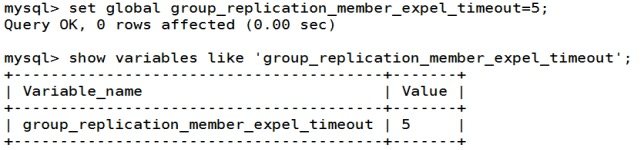											
2.设置网络延迟前检查集群状态
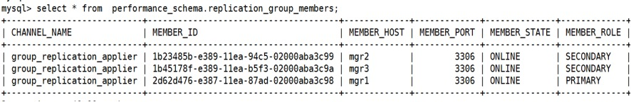											
3.在 mgr2 节点通过tc模拟网络延迟为 10 秒，并记录开始时间； 
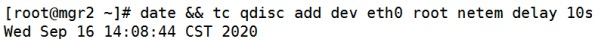											
4.通过 mgr1 节点查看集群状态，先开始集群状态是 UNREACHABLE（故障检测过程怀疑无法联系该成员，因为组消息已超时。)，后面节点超时后被踢出集群；
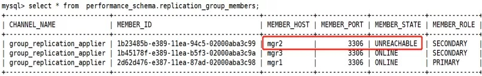											
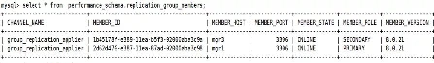											
5.通过观察 mgr2 节点的错误日志，在 14:08:50，也就是设置延迟 6 秒钟后，mgr2 节点无法访问 mgr1、mgr3 两个节点；在 14:08:54，与 mgr3 节点双向连接出现问题，说明在检测期 + group_replication_member_expel_timeout 这个 10 秒的周期内，mgr2 与其他节点无法联系，被踢出集群；
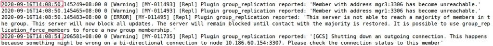											
6.在 mgr2 节点取消 tc 模拟网络延迟 tc qdisc del dev eth0 root 
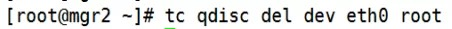											
7.在网络恢复后，mgr2 节点由于 auto-rejoin 机制，尝试重新加入集群，并通过 binlog 恢复数据，数据和其他节点一致后，恢复正常；
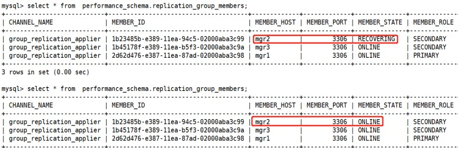											
**注意：如果网络延迟长时间未恢复，故障节点会出现 ERROR 状态，这时需要通过重启组复制，进行恢复；**
**测试结果：**
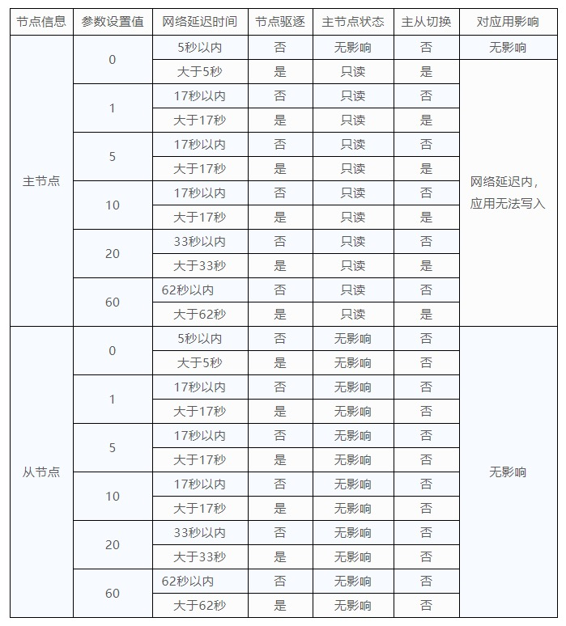											
**参数设置建议：**
从目前测试结果来看，参数 group_replication_member_expel_timeout 的设置能避免数据库集群间出现网络延迟时，延迟节点被立即逐出集群。考虑到数据库繁忙期间无法及时响应其他节点探测的情况或者数据库变更关闭节点情况，该值建议初始设置为5，正常网络延迟都在1秒以内，如果出现故障要设置这个超时退出的时间，建议先ping一下ip，确定网络延迟情况，在进行设置。
**需要注意：**
1.如果退出超时时间设置过长，要确保 XCom 的消息缓存足够大，可以容纳指定时间段以及初始5秒检测时间段内的预期消息量，否则成员将无法重新连接；可以使用group_replication_message_cache_size 系统变量来调整缓存大小限制。
2.如果网络恢复后，故障节点会尝试自动加入集群，从 MySQL 8.0.21 开始，默认是3次，这意味着该成员自动进行3次尝试重新加入集群，每次间隔5分钟；可以通过group_replication_autorejoin_tries 这个参数调整尝试自动加入集群的次数。
### 参考资料
- https://dev.mysql.com/doc/refman/8.0/en/group-replication-responses-failure-expel.html
- https://dev.mysql.com/doc/refman/8.0/en/group-replication-options.html
- https://mp.weixin.qq.com/s/DPFmCGmEfubRWpoikbY-XQ