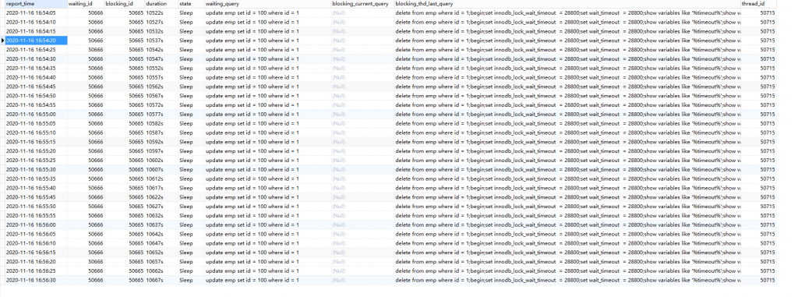

# 技术分享 | MySQL 行锁超时排查方法优化

**原文链接**: https://opensource.actionsky.com/20210221-mysql/
**分类**: MySQL 新特性
**发布时间**: 2021-02-21T00:59:11-08:00

---

作者：xuty
本文来源：原创投稿* 爱可生开源社区出品，原创内容未经授权不得随意使用，转载请联系小编并注明来源。
## 一、大纲
`#### 20191219 10:10:10,234 | com.alibaba.druid.filter.logging.Log4jFilter.statementLogError(Log4jFilter.java:152) | ERROR |  {conn-10593, pstmt-38675} execute error. update xxx set xxx = ? , xxx = ?  where RowGuid = ?
com.mysql.jdbc.exceptions.jdbc4.MySQLTransactionRollbackException: Lock wait timeout exceeded; try restarting transaction
`之前在 [[如何有效排查解决 MySQL 行锁等待超时问题] ](http://mp.weixin.qq.com/s?__biz=MzU2NzgwMTg0MA==&mid=2247487618&idx=1&sn=62ee0349fec884ef3073ab00e1651365&chksm=fc96f21dcbe17b0be04f51722af91bc1c2fbe152eaca6b839e8137372813a6790e5d3a8cc46a&scene=21#wechat_redirect)文章中介绍了如何监控解决行锁超时报错，当时介绍的监控方案主要是以 `shell 脚本 + general_log` 来捕获行锁等待信息，后来感觉比较麻烦，因此优化后改成用 `Event + Procedure` 的方法定时在 MySQl 内执行，将行锁等待信息记录到日志表中，并且加入了 pfs 表中的事务上下文信息，这样可以省去登陆服务器执行脚本与分析 general_log 的过程，更加便捷。
因为用到了 `Event` 和 `performance_schema` 下的系统表，所以需要打开两者的配置，pfs 使用默认监控项就可以，这里主要使用到的是 `events_statements_history` 表，默认会保留会话 10 条 SQL。
`performance_schema = on
event_scheduler = 1 `## 
## 二、步骤
> 目前该方法仅在 MySQL 5.7 版本使用过，MySQL 8.0 未测试。
#### 2.1 创建库
`create database `innodb_monitor`;
`#### 2.2 创建存储过程
```
use innodb_monitor;
delimiter ;;
CREATE PROCEDURE pro_innodb_lock_wait_check()
BEGIN
 declare wait_rows int;
 
set group_concat_max_len = 1024000;
CREATE TABLE IF NOT EXISTS `innodb_lock_wait_log` (
  `report_time` datetime DEFAULT NULL,
  `waiting_id` int(11) DEFAULT NULL,
  `blocking_id` int(11) DEFAULT NULL,
  `duration` varchar(50) DEFAULT NULL,  
  `state` varchar(50) DEFAULT NULL,
  `waiting_query` longtext DEFAULT NULL,
  `blocking_current_query` longtext DEFAULT NULL,
  `blocking_thd_last_query` longtext,
  `thread_id` int(11) DEFAULT NULL
);
 select count(*) into wait_rows from information_schema.innodb_lock_waits ;
 if wait_rows > 0 THEN 
   insert into `innodb_lock_wait_log`  SELECT now(),r.trx_mysql_thread_id waiting_id,b.trx_mysql_thread_id blocking_id,concat(timestampdiff(SECOND,r.trx_wait_started,CURRENT_TIMESTAMP()),'s') AS duration,
     t.processlist_command state,r.trx_query waiting_query,b.trx_query blocking_current_query,group_concat(left(h.sql_text,10000) order by h.TIMER_START DESC SEPARATOR ';\n') As blocking_thd_query_history,thread_id
    FROM information_schema.innodb_lock_waits w JOIN information_schema.innodb_trx b ON b.trx_id = w.blocking_trx_id JOIN information_schema.innodb_trx r ON r.trx_id = w.requesting_trx_id
     LEFT JOIN performance_schema.threads t on t.processlist_id = b.trx_mysql_thread_id LEFT JOIN performance_schema.events_statements_history h USING(thread_id) group by thread_id,r.trx_id order by r.trx_wait_started;
 
 end if;
END
;;
```
#### 2.3 创建事件
事件 `每隔 5 秒` （通常等于 `innodb_lock_wait_timeout` 的值）执行一次，持续监控 `7 天`，结束后会自动删除事件，也可以自定义保留时长。
`use innodb_monitor;
delimiter ;;
CREATE EVENT `event_innodb_lock_wait_check`
ON SCHEDULE EVERY 5 SECOND 
 STARTS CURRENT_TIMESTAMP 
 ENDS CURRENT_TIMESTAMP + INTERVAL 7 DAY
ON COMPLETION NOT PRESERVE
ENABLE
DO
call pro_innodb_lock_wait_check();
;;
`#### 2.4 事件启停
```
--1为全局开启事件,0为全局关闭
mysql > SET GLOBAL event_scheduler = 1;
--临时关闭事件
mysql > ALTER EVENT event_innodb_lock_wait_check DISABLE;
--关闭开启事件
mysql > ALTER EVENT event_innodb_lock_wait_check  ENABLE;
```
## 三、日志表
再根据应用日志报错时间点及 SQL 分析 `innodb_lock_wait_log` 表。其中主要有 2 种场景：
- `blocking_current_query 不为空`，说明阻塞事务处于运行状态，这时候需要分析当前运行 SQL 是否存在性能问题。
- `blocking_current_query 为空`，state 为 Sleep，此时阻塞事务处于挂起状态，即不再运行 SQL，此时需要通过分析 `blocking_thd_last_query` 分析事务上下文，注意该列中的 SQL 为时间降序，即从下往上执行。
											
**文章推荐：**
[技术分享 | 大量 Opening tables 案例分析](https://opensource.actionsky.com/20201217-mysql/)
[故障分析 | 崩溃恢复巨慢原因分析](https://opensource.actionsky.com/20201113-mysql/)
[技术分享 | MySQL 内存管理初探](https://opensource.actionsky.com/20201009-mysql/)