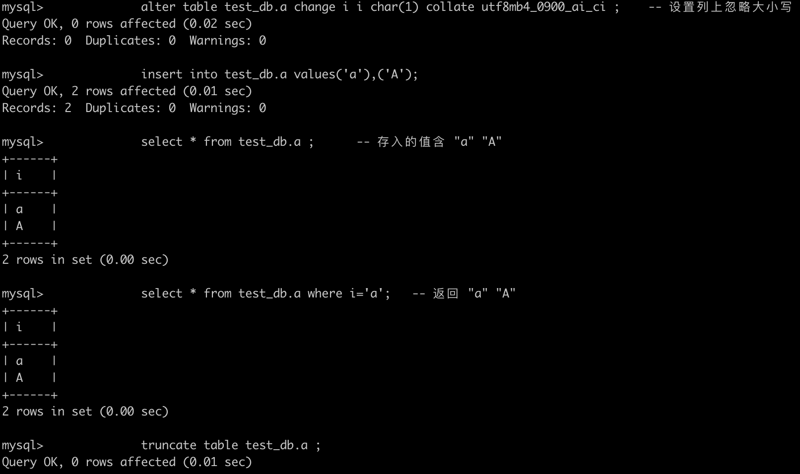
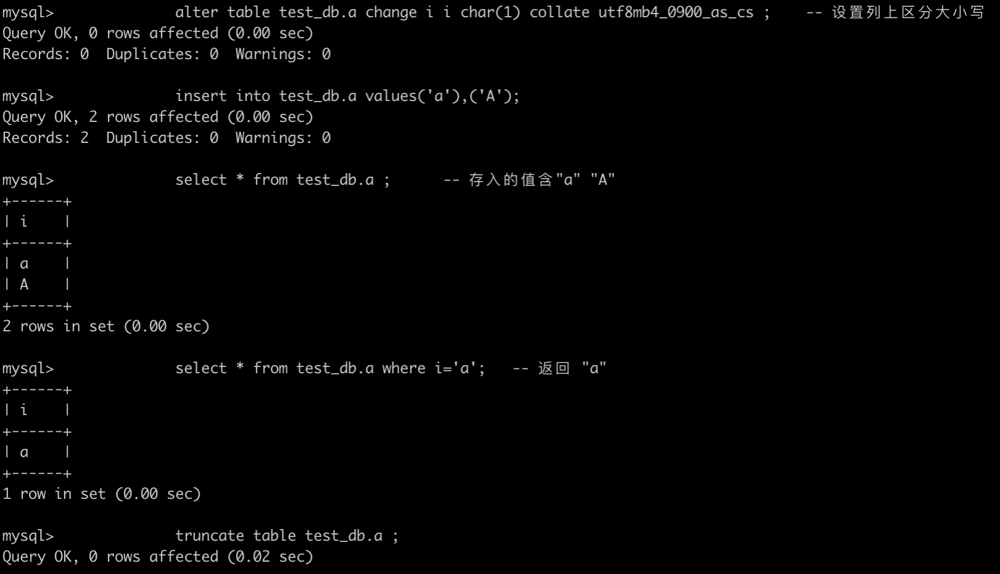

# 技术分享 | MySQL&#8211;测试&#8211;排序规则 collation

**原文链接**: https://opensource.actionsky.com/%e6%8a%80%e6%9c%af%e5%88%86%e4%ba%ab-mysql-%e6%b5%8b%e8%af%95-%e6%8e%92%e5%ba%8f%e8%a7%84%e5%88%99-collation/
**分类**: MySQL 新特性
**发布时间**: 2022-10-18T20:14:13-08:00

---

作者：姚嵩
外星人&#8230;
本文来源：原创投稿
*爱可生开源社区出品，原创内容未经授权不得随意使用，转载请联系小编并注明来源。
#### 摘抄：
[https://dev.mysql.com/doc/refman/8.0/en/charset-general.html](https://dev.mysql.com/doc/refman/8.0/en/charset-general.html)
[https://dev.mysql.com/doc/refman/8.0/en/charset-server.html](https://dev.mysql.com/doc/refman/8.0/en/charset-server.html)
[https://dev.mysql.com/doc/refman/8.0/en/charset-database.html](https://dev.mysql.com/doc/refman/8.0/en/charset-database.html)
[https://dev.mysql.com/doc/refman/8.0/en/charset-table.html](https://dev.mysql.com/doc/refman/8.0/en/charset-table.html)
[https://dev.mysql.com/doc/refman/8.0/en/charset-literal.html](https://dev.mysql.com/doc/refman/8.0/en/charset-literal.html)
#### 背景：
客户反应查询返回的结果不符合预期，读取时想要实现⼤⼩写区分；
#### 简介：
排序规则 collation 是⼀个字符集的字符进⾏⽐较的⼀组规则；
⾄少会有两个规则：
- 是否区分⼤⼩写；
- 编码；
常⽤的规则是是否区分⼤⼩写。
**字符集和排序规则的默认选择：**
如果你仅指定字符集，⽽不指定排序规则，则排序规则为字符集默认的排序规则；
如果你仅指定排序规则，不指定字符集，则字符集为排序规则对应的字符集；
例外项⻅：
&#8220;设置对象的字符集和排序规则&#8221; 中 &#8220;说明&#8221;列中包含的内容。
**查看字符集与其默认的排序规则：**
`SHOW CHARACTER SET ;`
或者
`select * from INFORMATION_SCHEMA.CHARACTER_SETS ; `
**查看字符集包含的排序规则：**
`SHOW COLLATION WHERE Charset = 'utf8mb4';` &#8212; 这⾥的utf8mb4是具体的字符集
**查看数据库的默认字符集和排序规则：**
USE db_name;
SELECT @@character_set_database, @@collation_database;
或者
SELECT DEFAULT_CHARACTER_SET_NAME, DEFAULT_COLLATION_NAME
FROM INFORMATION_SCHEMA.SCHEMATA WHERE SCHEMA_NAME = &#8216;db_name&#8217;;
**设置对象的字符集和排序规则：**
| 对象 | 字符集 | 排序规则 | 说明 |
| --- | --- | --- | --- |
| server | character_set_server | collation_server | 如果create database时未带上字符集和排序规则，则使⽤server中声明的作为默认值； |
| database | 建库时的CHARACTER SET ⼦句；character_set_database | 建库时的COLLATE ⼦句；collation_database | 如果create table时未带上字符集和排序规则，则使⽤数据库中声明的作为默认值；如果load data时未带上character set⼦句，则使⽤character_set_database作为默认值；如果在创建routine时未带上字符集和排序规则，则使⽤数据库中声明的作为默认值； |
| table | 建表时的CHARACTER SET ⼦句； | 建表时的COLLATE ⼦句； | 如果未在单个列上指定字符集和排序规则，则将表中声明的作为默认值； |
| column | 建表时字段定义上的CHARACTER SET ⼦句； | 建表时字段定义上的 COLLATE ⼦句； |
| 字符串 | SELECT _utf8mb4&#8217;abc&#8217; ; | SELECT &#8216;abc&#8217; COLLATE utf8_general_ci; | 如果未指定字符集但指定了排序规则，则字符集使⽤ character_set_connection；如果未指定字符集和排序规则，则使⽤character_set_connection和collation_connection作为默认值； |
#### 说明：
如果客户是查询表中的数据，那么寻找数据时是否忽略⼤⼩写，取决于对应字段上的COLLATE⼦句中定义的排序规则；
如果客户是直接查询字符串，那么寻找数据时是否忽略⼤⼩写，取决于collation_connection的值；
数据存⼊不受collation影响，数据查询受collation影响。
#### 测试案例：
##### 测试环境：
MySQL Version：8.0.28
#### 基础环境：
create database if not exists test_db ;
use test_db;
drop table if exists test_db.a ;
create table test_db.a(i char(1)) engine=InnoDB default charset=utf8mb4 ;
##### 测试:确认collate是否影响数据的存⼊
查询表中的数据时，值是否返回受字段上的collation影响
步骤：
alter table test_db.a change i i char(1) collate utf8mb4_0900_ai_ci ; -- 设置列上忽略⼤⼩写
insert into test_db.a values('a'),('A'); 
select * from test_db.a ; -- 存⼊的值含 "a" "A"
select * from test_db.a where i='a'; -- 返回 "a" "A"
truncate table test_db.a ; 
alter table test_db.a change i i char(1) collate utf8mb4_0900_as_cs ; -- 设置列上区分⼤⼩写
insert into test_db.a values('a'),('A'); 
select * from test_db.a ; -- 存⼊的值含"a" "A"
select * from test_db.a where i='a'; -- 返回 "a"
truncate table test_db.a ;
**结果截图：**

#### 说明：
数据存⼊不受表字段上的collate影响；
但是搜索记录时会受表字段上的collate影响。