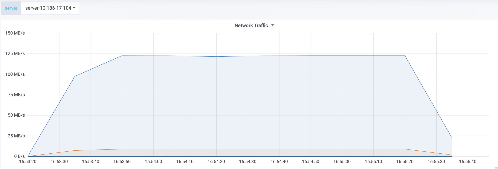
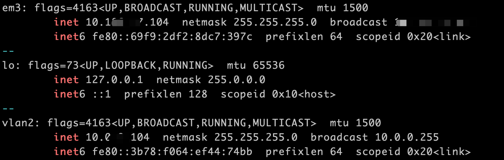
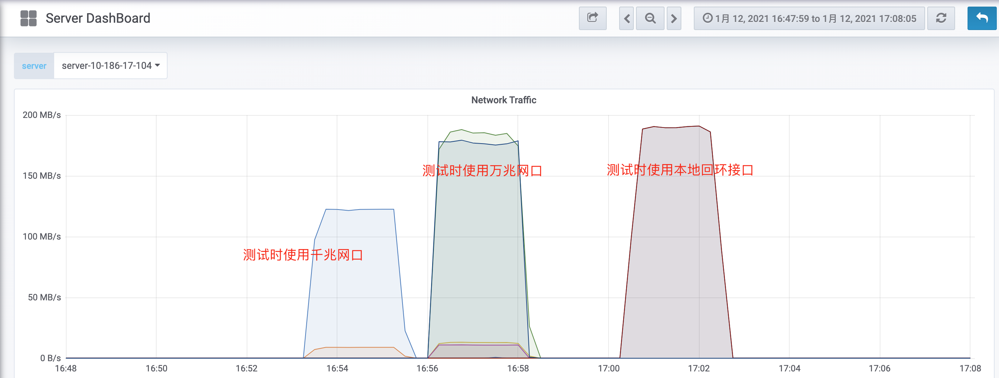
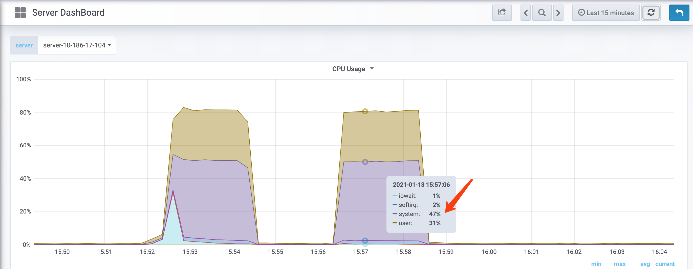
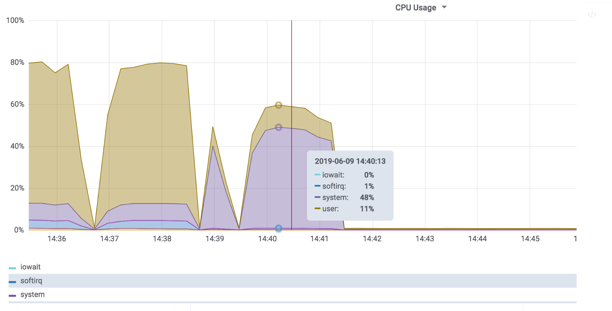

# 技术分享 | MySQL: 压测结果很差怎么办

**原文链接**: https://opensource.actionsky.com/20211214-yace/
**分类**: 技术干货
**发布时间**: 2021-12-13T23:15:42-08:00

---

<
section id=&#8221;nice&#8221; data-tool=&#8221;mdnice编辑器&#8221; data-website=&#8221;https://www.mdnice.com&#8221; style=&#8221;font-size: 14px; color: black; padding: 0 10px; line-height: 1.6; word-spacing: 0px; letter-spacing: 0px; word-break: break-word; word-wrap: break-word; text-align: left; font-family: Optima-Regular, Optima, PingFangSC-light, PingFangTC-light, &#8216;PingFang SC&#8217;, Cambria, Cochin, Georgia, Times, &#8216;Times New Roman&#8217;, serif;&#8221;>
作者：胡呈清
爱可生 DBA 团队成员，擅长故障分析、性能优化，个人博客：https://www.jianshu.com/u/a95ec11f67a8，欢迎讨论。
本文来源：原创投稿
*爱可生开源社区出品，原创内容未经授权不得随意使用，转载请联系小编并注明来源。
老板让你做一个 MySQL 的性能基准测试，测来测去发现明明机器配置很高，但 tps 就是上不去，为什么？
首先我们很容易想到的就是 InnoDB 缓冲池设置的不够大、 redo log 太小、数据没有充分预热、 sysbench 线程数开的太少&#8230; 这些是很常见的原因，今天我们来看一些不那么显而易见的情况。
以下案例的硬件配置为：64core、256Gmemory、raid 10 15K 机械盘。
## 网络瓶颈
一次压测结果是这样的：
`sysbench oltp_read_write --mysql-host=10.18x.xx.104 --mysql-port=3308  \
--mysql-user=sysbench --mysql-password=sysbench --mysql-db=sbtest --tables=10 \
--table-size=10000000 --report-interval=5 --threads=200 --time=600 run
##结果：
SQL statistics:
queries performed:
read:                            4682958
write:                           1337988
other:                           668994
total:                           6689940
transactions:                        334497 (2783.82 per sec.)
queries:                             6689940 (55676.32 per sec.)
ignored errors:                      0      (0.00 per sec.)
reconnects:                          0      (0.00 per sec.)
`
结果 tps 只有 2800，显然对不起这么高的硬件，这时候就得观察负载了，一般最明显的一点就是 CPU 使用率低，比如这个案例在我的环境上 CPU 使用率只有36%，而网卡流量很高达到 124MB/s ，差不多就是千兆网卡的极限了(1000Mb/s / 8)：

这时候就得意识到“我是不是用错网卡了”？为啥这么说呢，因为一般都会配两块网卡分别访问内外网，快速查看网络接口：`ifconfig -a|grep -B 1 inet`。立马就看到确实是双网卡，我们压测用的是em3，还有另外一个网络接口 vlan2 ：

然后再确认下带宽： `ethtool {dev_name} |grep Speed`。em3 是千兆带宽，压测时 124MB/s 的流量已经打满了：

所以在sysbench压测时换成 vlan2 万兆网络接口后（即修改 &#8211;mysql-host=10.0.xx.104），轻松到1万。如果实在没有万兆网卡怎么办？那就在本地使用回环接口进行测试吧。下图是使用3个网口测试的网络流量图，明显可以看出千兆网口的网络瓶颈：

## SSL
MySQL8.0 或者 MySQL5.7 企业版压测时会遇到一个坑：默认开启 SSL，压测结果 tps 只有3700：
`sysbench oltp_read_write --mysql-host=10.18x.xx.104 --mysql-port=3308  \
--mysql-user=sysbench --mysql-password=sysbench --mysql-db=sbtest --tables=10 \
--table-size=10000000 --report-interval=5 --threads=200 --time=600 run
##结果：
SQL statistics:
queries performed:
read:                            6303388
write:                           1800968
other:                           900484
total:                           9004840
transactions:                        450242 (3747.71 per sec.)
queries:                             9004840 (74954.25 per sec.)
Latency (ms):
min:                                    6.35
avg:                                   53.31
max:                                  542.71
95th percentile:                      104.84
sum:                             24004566.42         
`
和前面说的一样，观察系统负载，发现 CPU 使用率已经用到了 80% ，但是 CPU system 时间反常的高，再去看压测结果 95% 的响应时间也很高需要 100 多毫秒，正是因为需要消耗大量的系统资源进行加密连接：

解决办法就是配置文件写入 skip-ssl 重启 MySQL。其实 sysbench 有个参数 &#8211;mysql-ssl[=on|off]，看说明只要设置为 off 就可以关闭 ssl 连接，但实测并没有用，通过 `select * from status_by_thread where VARIABLE_NAME like '%ssl%'`;查看连接还是开启 ssl 的，对 ssl 机制比较懵逼，欢迎有了解的大佬留言。
## sort_buffer_size
sort_buffer_size 会影响 sysbench 性能吗？官方文档有这样的描述：
> 
On Linux, there are thresholds of 256KB and 2MB where larger values may significantly slow down memory allocation, so you should consider staying below one of those values.
也许你会觉得问题不大，但实际看下面这组测试结果：11000tps VS 930tps
`## sort_buffer_size=31M
SQL statistics:
queries performed:
read:                            16358846
write:                           4673956
other:                           2336978
total:                           23369780
transactions:                        1168489 (11678.75 per sec.)
queries:                             23369780 (233574.94 per sec.)
## sort_buffer_size=32M
SQL statistics:
queries performed:
read:                            392182
write:                           112052
other:                           56026
total:                           560260
transactions:                        28013  (930.07 per sec.)
queries:                             560260 (18601.38 per sec.)
`
事实就是这么不可思议，当 sort_buffer_size 达到阈值32M后（我测试的阈值和文档给出的阈值256K、2M不一样），内存分配方式发生改变，内存分配效率变低， CPU system 时间剧增：

细说一下内存分配方式变化为什么会引起这个结果，参考：【技术分享 | MySQL 内存管理初探】
malloc() 是 C 标准库提供的内存分配函数，对应到系统调用上，有两种实现方式，即 brk() 和 mmap()。
- 
brk 方式
对于小块内存（
优缺点：brk() 方式可以减少缺页异常的发生，提高内存访问效率。不过，由于这些内存没有归还系统，所以在内存工作繁忙时，频繁的内存分配和释放会造成内存碎片。
- 
mmap 匿名映射方式
对于大块内存（>128K），C 标准库使用 mmap() 来分配，也就是在文件映射段找一块空闲内存分配出去。mmap() 方式分配的内存，会在释放时直接归还系统，所以每次 mmap 都会发生缺页异常。
优缺点：mmap() 方式可以将内存及时返回给系统，避免 OOM。但是工作繁忙时，频繁的内存分配会导致大量的缺页异常，使内核的管理负担增大。这也是 malloc 只对大块内存使用 mmap 的原因。
所谓的缺页异常是指进程申请内存后，只分配了虚拟内存。这些所申请的虚拟内存，只有在首次访问时才会分配真正的物理内存，也就是通过缺页异常进入内核中，再由内核来分配物理内存（本质就是建立虚拟内存与物理内存的地址映射）。
brk() 方式申请的堆内存由于释放内存后并不会归还给系统，所以下次申请内存时，并不需要发生缺页异常。
mmap() 方式申请的动态内存会在释放内存后直接归还系统，所以下次申请内存时，会发生缺页异常（增加内核态 CPU 开销）。
## 总结
当压
测结果不乐观，第一时间去看 CPU 使用率，只要总使用率低，或者 iowait、system 高，都是异常情况，需要去排查原因。my.cnf 规范模板可以解决大部分的压测结果异常的问题，另一方面则需要我们掌握基本的分析方法，再配合一些过往经验，就能测出理想的数据了。