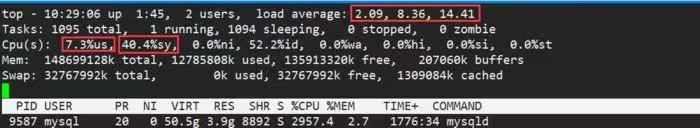
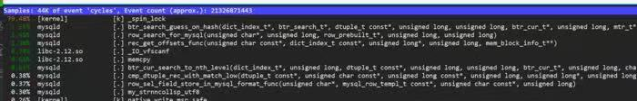
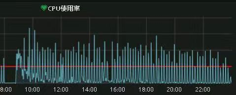
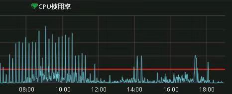

# 技术分享 | MySQL：timestamp 时区转换导致 CPU %sys 高的问题

**原文链接**: https://opensource.actionsky.com/20191112-mysql/
**分类**: MySQL 新特性
**发布时间**: 2019-11-12T01:07:19-08:00

---

**作者：****高鹏**文章末尾有他著作的《深入理解 MySQL 主从原理 32 讲》，深入透彻理解 MySQL 主从，GTID 相关技术知识。本文为学习记录，可能有误请谅解。
这个问题是一个朋友遇到的@风云，并且这位朋友已经得出了近乎正确的判断，下面进行一些描述。
**一、问题展示**下面是问题当时的系统负载如下：
											
我们可以看到 40.4%sy 正是系统调用负载较高的表现，随即朋友采集了 perf 如下：
											
接下来朋友采集了 pstack 给我，我发现大量的线程处于如下状态下：
- `Thread 38 (Thread 0x7fe57a86f700 (LWP 67268)):`
- `#0  0x0000003dee4f82ce in __lll_lock_wait_private () from /lib64/libc.so.6`
- `#1  0x0000003dee49df8d in _L_lock_2163 () from /lib64/libc.so.6`
- `#2  0x0000003dee49dd47 in __tz_convert () from /lib64/libc.so.6`
- `#3  0x00000000007c02e7 in Time_zone_system::gmt_sec_to_TIME(st_mysql_time*, long) const ()`
- `#4  0x0000000000811df6 in Field_timestampf::get_date_internal(st_mysql_time*) ()`
- `#5  0x0000000000809ea9 in Field_temporal_with_date::val_date_temporal() ()`
- `#6  0x00000000005f43cc in get_datetime_value(THD*, Item***, Item**, Item*, bool*) ()`
- `#7  0x00000000005e7ba7 in Arg_comparator::compare_datetime() ()`
- `#8  0x00000000005eef4e in Item_func_gt::val_int() ()`
- `#9  0x00000000006fc6ab in evaluate_join_record(JOIN*, st_join_table*) ()`
- `#10 0x0000000000700e7e in sub_select(JOIN*, st_join_table*, bool) ()`
- `#11 0x00000000006fecc1 in JOIN::exec() ()`
我们可以注意一下 __tz_convert 这正是时区转换的证据。
**二、关于 timestamp 简要说明**timestamp：占用 4 字节，内部实现是新纪元时间（1970-01-01 00:00:00）以来的秒，那么这种格式在展示给用户的时候就需要做必要的时区转换才能得到正确数据。下面我们通过访问 ibd 文件来查看一下内部表示方法，使用到了我的两个工具 innodb 和 bcview。> 详细参考：https://www.jianshu.com/p/719f1bbb21e8。
**timestamp 的内部表示**建立一个测试表- `mysql> show variables like '%time_zone%';`
- `+------------------+--------+`
- `| Variable_name    | Value  |`
- `+------------------+--------+`
- `| system_time_zone | CST    |`
- `| time_zone        | +08:00 |`
- `+------------------+--------+`
- 
- `mysql> create table tmm(dt timestamp);`
- `Query OK, 0 rows affected (0.04 sec)`
- 
- `mysql> insert into tmm values('2019-01-01 01:01:01');`
- `Query OK, 1 row affected (0.00 sec)`
我们来查看一下内部表示如下：- `[root@gp1 test]# ./bcview tmm.ibd 16 125 25|grep 00000003`
- `current block:00000003--Offset:00125--cnt bytes:25--data is:000001ac3502000000070d52c80000002f01105c2a4b4d0000`
整理一下如下：
- 000001ac3502：rowid
- 000000070d52：trx id
- c80000002f0110：roll ptr
- 5c2a4b4d：timestamp 类型的实际数据十进制为 1546275661
我们使用 Linux 命令如下：
- `[root@gp1 ~]# date -d @1546275661`
- `Tue Jan  1 01:01:01 CST 2019`
因为我的 Linux 也是 CST +8 时区这里数据也和 MySQL 中显示一样。下面我们调整一下时区再来看看取值如下：- `mysql> set time_zone='+06:00';`
- `Query OK, 0 rows affected (0.00 sec)`
- 
- `mysql> select * from tmm;`
- `+---------------------+`
- `| dt                  |`
- `+---------------------+`
- `| 2018-12-31 23:01:01 |`
- `+---------------------+`
- `1 row in set (0.01 sec)`
这里可以看到减去了 2 个小时，因为我的时区从 +8 变为了 +6。
**三、timestamp 转换**
在进行新纪元时间（1970-01-01 00:00:00）以来的秒到实际时间之间转换的时候 MySQL 根据参数 time_zone 的设置有两种选择：
- 
time_zone 设置为 SYSTEM 的话：使用 sys_time_zone 获取的 OS 会话时区，同时使用 OS API 进行转换。对应转换函数 Time_zone_system::gmt_sec_to_TIME
- 
time_zone 设置为实际的时区的话：比如 ‘+08:00’，那么使用使用 MySQL 自己的方法进行转换。对应转换函数 Time_zone_offset::gmt_sec_to_TIME
实际上 Time_zone_system 和 Time_zone_offset 均继承于 Time_zone 类，并且实现了 Time_zone 类的虚函数进行了重写，因此上层调用都是 Time_zone::gmt_sec_to_TIME。
注意这种转换操作是每行符合条件的数据都需要转换的。
**四、问题修复方案**
我们从问题栈帧来看这个故障使用的是 Time_zone_system::gmt_sec_to_TIME 函数进行转换的，因此可以考虑如下：
- time_zone：设置为指定的时区，比如 ‘+08:00’。这样就不会使用 OS API 进行转换了，而转为 MySQL 自己的内部实现 调用 Time_zone_offset::gmt_sec_to_TIME 函数。但是需要注意的是，如果使用 MySQL 自己的实现那么 us% 会加剧。
- 使用 datetime 代替 timestamp，新版本 datetime 为 5 个字节，只比 timestamp 多一个字节。
**五、修复前后**
%sy 使用量对比 据朋友说他大概在上午 11 点多完成了修改，做的方式是将 time_zone 修改为 ‘+08:00’，下面展示修改前后 CPU 使用率的对比：
修复前：
											
修复后：
											
**六、备用栈帧**
- time_zone=‘SYSTEM’转换栈帧
- `#0  Time_zone_system::gmt_sec_to_TIME (this=0x2e76948, tmp=0x7fffec0f3ff0, t=1546275661) at /root/mysqlall/percona-server-locks-detail-5.7.22/sql/tztime.cc:1092`
- `#1  0x0000000000f6b65c in Time_zone::gmt_sec_to_TIME (this=0x2e76948, tmp=0x7fffec0f3ff0, tv=...) at /root/mysqlall/percona-server-locks-detail-5.7.22/sql/tztime.h:60`
- `#2  0x0000000000f51643 in Field_timestampf::get_date_internal (this=0x7ffe7ca66540, ltime=0x7fffec0f3ff0)`
- `    at /root/mysqlall/percona-server-locks-detail-5.7.22/sql/field.cc:6014`
- `#3  0x0000000000f4ff49 in Field_temporal_with_date::val_str (this=0x7ffe7ca66540, val_buffer=0x7fffec0f4370, val_ptr=0x7fffec0f4370)`
- `    at /root/mysqlall/percona-server-locks-detail-5.7.22/sql/field.cc:5429`
- `#4  0x0000000000f11d7b in Field::val_str (this=0x7ffe7ca66540, str=0x7fffec0f4370) at /root/mysqlall/percona-server-locks-detail-5.7.22/sql/field.h:866`
- `#5  0x0000000000f4549d in Field::send_text (this=0x7ffe7ca66540, protocol=0x7ffe7c001e88) at /root/mysqlall/percona-server-locks-detail-5.7.22/sql/field.cc:1725`
- `#6  0x00000000014dfb82 in Protocol_text::store (this=0x7ffe7c001e88, field=0x7ffe7ca66540)`
- `    at /root/mysqlall/percona-server-locks-detail-5.7.22/sql/protocol_classic.cc:1415`
- `#7  0x0000000000fb06c0 in Item_field::send (this=0x7ffe7c006ec0, protocol=0x7ffe7c001e88, buffer=0x7fffec0f4760)`
- `    at /root/mysqlall/percona-server-locks-detail-5.7.22/sql/item.cc:7801`
- `#8  0x000000000156b15c in THD::send_result_set_row (this=0x7ffe7c000b70, row_items=0x7ffe7c005d58)`
- `    at /root/mysqlall/percona-server-locks-detail-5.7.22/sql/sql_class.cc:5026`
- `#9  0x0000000001565758 in Query_result_send::send_data (this=0x7ffe7c006e98, items=...) at /root/mysqlall/percona-server-locks-detail-5.7.22/sql/sql_class.cc:2932`
- `#10 0x0000000001585490 in end_send (join=0x7ffe7c007078, qep_tab=0x7ffe7c0078d0, end_of_records=false)`
- `    at /root/mysqlall/percona-server-locks-detail-5.7.22/sql/sql_executor.cc:2925`
- `#11 0x0000000001582059 in evaluate_join_record (join=0x7ffe7c007078, qep_tab=0x7ffe7c007758)`
- time_zone=‘+08:00’转换栈帧
- `#0  Time_zone_offset::gmt_sec_to_TIME (this=0x6723d90, tmp=0x7fffec0f3ff0, t=1546275661) at /root/mysqlall/percona-server-locks-detail-5.7.22/sql/tztime.cc:1418`
- `#1  0x0000000000f6b65c in Time_zone::gmt_sec_to_TIME (this=0x6723d90, tmp=0x7fffec0f3ff0, tv=...) at /root/mysqlall/percona-server-locks-detail-5.7.22/sql/tztime.h:60`
- `#2  0x0000000000f51643 in Field_timestampf::get_date_internal (this=0x7ffe7ca66540, ltime=0x7fffec0f3ff0)`
- `    at /root/mysqlall/percona-server-locks-detail-5.7.22/sql/field.cc:6014`
- `#3  0x0000000000f4ff49 in Field_temporal_with_date::val_str (this=0x7ffe7ca66540, val_buffer=0x7fffec0f4370, val_ptr=0x7fffec0f4370)`
- `    at /root/mysqlall/percona-server-locks-detail-5.7.22/sql/field.cc:5429`
- `#4  0x0000000000f11d7b in Field::val_str (this=0x7ffe7ca66540, str=0x7fffec0f4370) at /root/mysqlall/percona-server-locks-detail-5.7.22/sql/field.h:866`
- `#5  0x0000000000f4549d in Field::send_text (this=0x7ffe7ca66540, protocol=0x7ffe7c001e88) at /root/mysqlall/percona-server-locks-detail-5.7.22/sql/field.cc:1725`
- `#6  0x00000000014dfb82 in Protocol_text::store (this=0x7ffe7c001e88, field=0x7ffe7ca66540)`
- `    at /root/mysqlall/percona-server-locks-detail-5.7.22/sql/protocol_classic.cc:1415`
- `#7  0x0000000000fb06c0 in Item_field::send (this=0x7ffe7c006ec0, protocol=0x7ffe7c001e88, buffer=0x7fffec0f4760)`
- `    at /root/mysqlall/percona-server-locks-detail-5.7.22/sql/item.cc:7801`
- `#8  0x000000000156b15c in THD::send_result_set_row (this=0x7ffe7c000b70, row_items=0x7ffe7c005d58)`
- `    at /root/mysqlall/percona-server-locks-detail-5.7.22/sql/sql_class.cc:5026`
- `#9  0x0000000001565758 in Query_result_send::send_data (this=0x7ffe7c006e98, items=...) at /root/mysqlall/percona-server-locks-detail-5.7.22/sql/sql_class.cc:2932`
- `#10 0x0000000001585490 in end_send (join=0x7ffe7c007078, qep_tab=0x7ffe7c0078d0, end_of_records=false)`
- `    at /root/mysqlall/percona-server-locks-detail-5.7.22/sql/sql_executor.cc:2925`
- `#11 0x0000000001582059 in evaluate_join_record (join=0x7ffe7c007078, qep_tab=0x7ffe7c007758)`
最后推荐高鹏的专栏《深入理解MySQL主从原理 32讲》，想要透彻了解学习MySQL 主从原理的朋友不容错过。作者微信：gp_22389860
											
**社区近期动态**
**No.1**
**Mycat 问题免费诊断**
诊断范围支持：
Mycat 的故障诊断、源码分析、性能优化
服务支持渠道：
技术交流群，进群后可提问
QQ群（669663113）
社区通道，邮件&电话
osc@actionsky.com
现场拜访，线下实地，1天免费拜访
关注“爱可生开源社区”公众号，回复关键字“Mycat”，获取活动详情。
**No.2**
**社区技术内容征稿**
征稿内容：
格式：.md/.doc/.txt
主题：MySQL、分布式中间件DBLE、数据传输组件DTLE相关技术内容
要求：原创且未发布过
奖励：作者署名；200元京东E卡+社区周边
投稿方式：
邮箱：osc@actionsky.com
格式：[投稿]姓名+文章标题
以附件形式发送，正文需注明姓名、手机号、微信号，以便小编及时联系