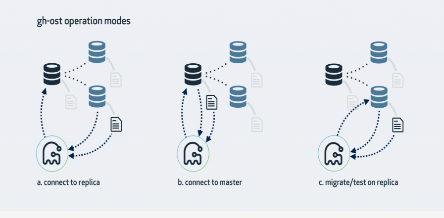
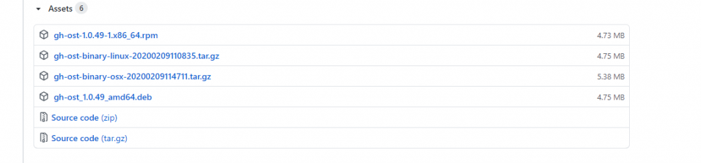

# 技术分享 | Online DDL 工具 gh-ost

**原文链接**: https://opensource.actionsky.com/20200730-mysql/
**分类**: MySQL 新特性
**发布时间**: 2020-07-30T00:33:39-08:00

---

作者：翟硕
爱可生 DBA 团队成员，负责公司 DMP 产品的运维和客户 MySQL 问题的处理。擅长数据库故障处理。对数据库技术和 python 有着浓厚的兴趣。
本文来源：原创投稿
*爱可生开源社区出品，原创内容未经授权不得随意使用，转载请联系小编并注明来源。
**一、gh-ost 介绍**
**gh-ost** 是 GitHub 发布的一款用于 MySQL 的无触发器在线模式迁移解决方案。它是可测试的，并提供暂停，动态控制/重新配置，审计和许多操作特权。它在整个迁移过程中，对主服务器产生的工作量很少，与已迁移表上的现有工作分离。
**gh-ost** 与所有现有的在线模式更改工具都以类似的方式操作：它们以与原始表相似的方式创建幽灵表，将数据从原始表缓慢且增量地复制到幽灵表，同时应用正在进行的更改（INSERT，DELETE，UPDATE）到幽灵表。最后，在适当的时候，它用幽灵表替换了原始表。**gh-ost** 使用相同的模式。但是，它与所有现有工具的不同之处在于不使用触发器。取而代之的是，**gh-ost** 使用二进制日志流捕获表的更改，然后将其异步应用到幽灵表。
**gh-ost** 承担一些其他工具留给数据库执行的任务。**gh-ost** 可以更好地控制迁移过程；可以真正暂停它；可以真正将迁移的写入负载与主服务器的工作负载分离。此外，它还提供了许多可操作的特权，使其更安全、可信赖且易于使用。
**二、gh-ost 的三种模式架构**
											
2.1 连接从库，在主库转换****
这是 gh-ost 默认的工作模式，它会查看从库情况，找到集群的主库并且连接上去，对主库侵入最少。大体步骤是：- 在主库上创建 _xxx_gho（和原表表结构一致）、_xxx_ghc（记录变更日志），并修改 _xxx_gho 表结构；
- 从 slave 上读取二进制日志事件，将变更应用到主库上的 _xxx_gho 表；
- 在主库上读源表的数据写入 _xxx_gho 表中；
- 在主库上完成表切换。
2.2 连接主库，在主库转换
需要使用 **&#8211;allow-on-master** 选项：
- 在主库上创建 _xxx_gho、_xxx_ghc，并修改 _xxx_gho 表结构；
- 从主库上读取二进制日志事件，将变更应用到主库上的 _xxx_gho 表；
- 在主库上读源表的数据写入 _xxx_gho 表中；
- 在主库上完成表切换。
2.3 在从库上测试和转换
这种模式会在从库上做修改。gh-ost 仍然会连上主库，但所有操作都是在从库上做的，不会对主库产生任何影响。在操作过程中，gh-ost 也会不时地暂停，以便从库的数据可以保持最新。**&#8211;migrate-on-replica** 选项让 gh-ost 直接在从库上修改表。最终的切换过程也是在从库正常复制的状态下完成的。**&#8211;test-on-replica** 表明操作只是为了测试目的。在进行最终的切换操作之前，复制会被停止。原始表和临时表会相互切换，再切换回来，最终相当于原始表没被动过。主从复制暂停的状态下，你可以检查和对比这两张表中的数据。
**三、下载安装**
3.1 下载
访问github，在此页面 https://github.com/github/gh-ost/releases 下载 gh-ost 最新的 rpm 安装包。
											
或者使用 wget 获取安装包- 
- 
`# 使用 wget 获取安装包``[root@10-186-61-20 ~]# wget https://github.com/github/gh-ost/releases/download/v1.0.49/gh-ost-1.0.49-1.x86_64.rpm`
3.2 安装
- 
- 
- 
- 
- 
- 
- 
- 
- 
`使用 rpm 命令进行安装``    # 使用rpm安装``    [root@10-186-61-20 ~]# rpm -ivh gh-ost-1.0.49-1.x86_64.rpm ``    Preparing...                          ################################# [100%]``    Updating / installing...``       1:gh-ost-1:1.0.49-1                ################################# [100%]``    # 验证是否安装成功``    [root@10-186-61-20 ~]# gh-ost --version``    1.0.49`
**四、使用**
4.1 常用参数介绍
											
4.2 交互式命令- 需要安装 **nmap-ncat** 包来使用 nc 命令
- 使用方式为 **echo &#8220;命令&#8221; | nc -U socket文件名**，例如：**echo status | nc -U sbtest1.gh-ost.socket**
**4.2.1 status**查看详细的执行状态信息。- 
- 
- 
- 
- 
- 
- 
- 
- 
- 
- 
- 
`[root@10-186-61-96 tmp]# echo status | nc -U sbtest1.gh-ost.socket``# Migrating `sbtest`.`sbtest1`; Ghost table is `sbtest`.`_sbtest1_gho```# Migrating 10-186-61-20:3306; inspecting 10-186-61-20:3306; executing on 10-186-61-96``# Migration started at Mon Feb 17 02:08:10 +0000 2020``# chunk-size: 100000; max-lag-millis: 1500ms; dml-batch-size: 100; max-load: Threads_running=100; critical-load: Threads_running=1000; nice-ratio: 0.000000``# throttle-flag-file: /tmp/sbtest1.throttle ``# throttle-additional-flag-file: /tmp/gh-ost.throttle ``# throttle-control-replicas count: 1``# postpone-cut-over-flag-file: /tmp/sbtest1.postpone ``# panic-flag-file: /tmp/sbtest1.panic``# Serving on unix socket: /tmp/sbtest1.gh-ost.socket``Copy: 19733607/19731368 100.0%; Applied: 3425325; Backlog: 863/1000; Time: 5h18m48s(total), 5h18m48s(copy); streamer: mysql_bin.000083:192819590; Lag: 0.01s, State: throttled, 10.186.61.96:3306 replica-lag=3.686724s; ETA: due`
**4.2.2 sup**
打印简短的状态信息。- 
- 
`[root@10-186-61-96 tmp]# echo sup | nc -U sbtest1.gh-ost.socket``Copy: 19833607/19731368 100.5%; Applied: 3479988; Backlog: 1000/1000; Time: 5h22m21s(total), 5h22m21s(copy); streamer: mysql_bin.000084:12427624; Lag: 1.61s, State: migrating; ETA: due`
**4.2.3 coordinates**
打印当前检查的 binlog 的位置信息。- 
- 
`[root@10-186-61-96 tmp]# echo coordinates |nc -U sbtest1.gh-ost.socket ``mysql_bin.000131:10563681`
**4.2.4 可动态修改的参数**
具体参数含义参考常用参数介绍。- 
- 
- 
- 
- 
- 
- 
- 
- 
- 
`chunk-size=<newsize>                 # Set a new chunk-size``dml-batch-size=<newsize>             # Set a new dml-batch-size``nice-ratio=<ratio>                   # Set a new nice-ratio, immediate sleep after each row-copy operation, float (examples: 0 is aggressive, 0.7 adds 70% runtime, 1.0 doubles runtime, 2.0 triples runtime, ...)``critical-load=<load>                 # Set a new set of max-load thresholds``max-lag-millis=<max-lag>             # Set a new replication lag threshold``replication-lag-query=<query>        # Set a new query that determines replication lag (no quotes)``max-load=<load>                      # Set a new set of max-load thresholds``throttle-query=<query>               # Set a new throttle-query (no quotes)``throttle-http=<URL>                  # Set a new throttle URL``throttle-control-replicas=<replicas> # Set a new comma delimited list of throttle control replicas`
使用示例：
- 
```
[root@10-186-61-96 tmp]# echo "chunk-size=10000" |nc -U sbtest1.gh-ost.socket
```
**4.2.5 强制节流和取消节流**
- 
- 
`throttle                             # Force throttling``no-throttle                          # End forced throttling (other throttling may still apply)`
**4.2.6 取消推迟转换**
gh-ost 默认在完成所有的 copy 动作后，不会马上转换原表和幽灵表，而是继续读取binlog应用到幽灵表中，直到发出转换的动作，所以发出此命令会立刻开始转换。
- 
`unpostpone                           # Bail out a cut-over postpone; proceed to cut-over`
**4.2.7 立刻停止进程**
不清理现场，发出此命令后会立刻停止所有动作并退出进程。
- 
`panic                                # panic and quit without cleanup`
**4.2.8 help**打印出所有可用命令与解释。
- 
- 
- 
- 
- 
- 
- 
- 
- 
- 
- 
- 
- 
- 
- 
- 
- 
- 
- 
- 
- 
```
[root@10-186-61-103 tmp]# echo help  | nc -U sbtest1.gh-ost.socket `available commands:``status                               # Print a detailed status message``sup                                  # Print a short status message``coordinates                             # Print the currently inspected coordinates``chunk-size=<newsize>                 # Set a new chunk-size``dml-batch-size=<newsize>             # Set a new dml-batch-size``nice-ratio=<ratio>                   # Set a new nice-ratio, immediate sleep after each row-copy operation, float (examples: 0 is aggressive, 0.7 adds 70% runtime, 1.0 doubles runtime, 2.0 triples runtime, ...)``critical-load=<load>                 # Set a new set of max-load thresholds``max-lag-millis=<max-lag>             # Set a new replication lag threshold``replication-lag-query=<query>        # Set a new query that determines replication lag (no quotes)``max-load=<load>                      # Set a new set of max-load thresholds``throttle-query=<query>               # Set a new throttle-query (no quotes)``throttle-http=<URL>                  # Set a new throttle URL``throttle-control-replicas=<replicas> # Set a new comma delimited list of throttle control replicas``throttle                             # Force throttling``no-throttle                          # End forced throttling (other throttling may still apply)``unpostpone                           # Bail out a cut-over postpone; proceed to cut-over``panic                                # panic and quit without cleanup``help                                 # This message``- use '?' (question mark) as argument to get info rather than set. e.g. "max-load=?" will just print out current max-load
```
4.3 使用示例
> 本示例模拟更改字段数据类型，将 sbtest1 表的 c 字段由 char(120) 改为varchar(200)。采用连接从库，在主库转换的模式架构。
- CPU：4C
- 内存：4G
- 操作系统版本：CentOS 7.5.1804
- MySQL版本：5.7.29
- MySQL架构：主从复制主库：10.186.61.88:3306从库：10.186.61.101:3306
- gh-ost版本：1.0.4
**4.3.2 准备工作**
检查从库的 binlog_format 参数和 log_slave_update 参数是或否正确。
- 
- 
- 
- 
- 
- 
- 
mysql> select @@global.binlog_format,@@log_slave_updates;``+------------------------+---------------------+``| @@global.binlog_format | @@log_slave_updates |``+------------------------+---------------------+``| ROW                    |                   1 |``+------------------------+---------------------+``1 row in set (0.00 sec)`
确定需要变更的表没有被复制过滤。
- 
- 
- 
- 
- 
- 
- 
- 
- 
- 
```
mysql> show slave status\G`*************************** 1. row ***************************``-- 省略其他信息``              Replicate_Do_DB: ``          Replicate_Ignore_DB: ``           Replicate_Do_Table: ``       Replicate_Ignore_Table: ``      Replicate_Wild_Do_Table: ``  Replicate_Wild_Ignore_Table: ``-- 省略其他信息
```
确认需要变更的表存在主键或者非空的唯一键。
- 
- 
- 
- 
- 
- 
- 
- 
- 
- 
```
mysql> desc sbtest1;``+-------+-----------+------+-----+---------+----------------+``| Field | Type      | Null | Key | Default | Extra          |``+-------+-----------+------+-----+---------+----------------+``| id    | int(11)   | NO   | PRI | NULL    | auto_increment |``| k     | int(11)   | NO   | MUL | 0       |                |``| c     | char(120) | NO   |     |         |                |``| pad   | char(60)  | NO   |     |         |                |``+-------+-----------+------+-----+---------+----------------+``4 rows in set (0.00 sec)
```
创建 ghost 使用的变更用户。
- 
- 
```
mysql> GRANT ALTER, CREATE, DELETE, DROP, INDEX, INSERT, LOCK TABLES, SELECT, TRIGGER, UPDATE,SUPER, REPLICATION SLAVE on *.* TO ghost@'%' identified by 'ghost';``Query OK, 0 rows affected, 1 warning (0.01 sec)
```
将用户和密码写入工作目录的配置文件中。
- 
- 
- 
- 
```
[root@10-186-61-88 ~]# cat ghost.conf ``[client]``user=ghost``password=ghost
```
**4.3.3 开始执行更改操作**
开启一个 screen，防止变更中途连接断开。
- 
[root@10-186-61-88 ~]# screen`
将变更的 alter 语句写成以下形式。
- 
```
modify c varchar(200) not null default ""
```
执行命令开始变更，变更之前先去掉 `&#8211;execute` 选项模拟执行过程，查看执行中是否有问题。
- 
- 
- 
- 
- 
- 
- 
- 
- 
- 
- 
- 
- 
- 
- 
- 
- 
- 
- 
- 
- 
- 
- 
- 
- 
- 
- 
- 
- 
- 
- 
- 
- 
- 
- 
- 
- 
- 
- 
- 
- 
- 
- 
- 
- 
- 
- 
- 
- 
- 
- 
- 
- 
- 
- 
- 
- 
- 
- 
- 
- 
- 
- 
- 
- 
- 
- 
- 
- 
- 
- 
- 
- 
- 
- 
- 
- 
- 
- 
- 
- 
- 
- 
- 
- 
- 
- 
- 
- 
- 
- 
- 
- 
- 
- 
- 
- 
- 
- 
- 
- 
```
[root@10-186-61-88 ~]# gh-ost --conf=ghost.conf --database=sbtest --table=sbtest1 \`--alter='modify c varchar(200) not null default ""' --max-load=Threads_running=100 \``--critical-load=Threads_running=1000 --critical-load-interval-millis=100 \``--chunk-size=100000 --throttle-control-replicas="10.186.61.101:3306" \``--max-lag-millis=1500 --host=10.186.61.101 --port=3306 --verbose  \ ``--default-retries=120 --dml-batch-size=100  \``--assume-rbr --assume-master-host=10.186.61.88 \``--panic-flag-file=/tmp/sbtest1.panic \``--postpone-cut-over-flag-file=/tmp/sbtest1.postpone \``--throttle-flag-file=/tmp/sbtest1.throttle \``--timestamp-old-table \``--serve-socket-file=/tmp/sbtest1.gh-ost.socket ``
``2020-07-24 15:06:28 INFO starting gh-ost 1.0.49``2020-07-24 15:06:28 INFO Migrating `sbtest`.`sbtest1```2020-07-24 15:06:28 INFO connection validated on 10.186.61.101:3306``2020-07-24 15:06:28 INFO User has SUPER, REPLICATION SLAVE privileges, and has ALL privileges on `sbtest`.*``2020-07-24 15:06:28 INFO binary logs validated on 10.186.61.101:3306``2020-07-24 15:06:28 INFO Inspector initiated on 10-186-61-101:3306, version 5.7.29-log``2020-07-24 15:06:28 INFO Table found. Engine=InnoDB``2020-07-24 15:06:28 INFO Estimated number of rows via EXPLAIN: 4814427``2020-07-24 15:06:28 INFO Master forced to be 10.186.61.88:3306``2020-07-24 15:06:28 INFO log_slave_updates validated on 10.186.61.101:3306``2020-07-24 15:06:28 INFO connection validated on 10.186.61.101:3306``2020-07-24 15:06:28 INFO Connecting binlog streamer at mysql_bin.000008:95041262``[2020/07/24 15:06:28] [info] binlogsyncer.go:133 create BinlogSyncer with config {99999 mysql 10.186.61.101 3306 ghost    false false <nil> false UTC true 0 0s 0s 0 false}``[2020/07/24 15:06:28] [info] binlogsyncer.go:354 begin to sync binlog from position (mysql_bin.000008, 95041262)``[2020/07/24 15:06:28] [info] binlogsyncer.go:203 register slave for master server 10.186.61.101:3306``[2020/07/24 15:06:28] [info] binlogsyncer.go:723 rotate to (mysql_bin.000008, 95041262)``2020-07-24 15:06:28 INFO rotate to next log from mysql_bin.000008:0 to mysql_bin.000008``2020-07-24 15:06:28 INFO connection validated on 10.186.61.88:3306``2020-07-24 15:06:28 INFO connection validated on 10.186.61.88:3306``2020-07-24 15:06:28 INFO will use time_zone='SYSTEM' on applier``2020-07-24 15:06:28 INFO Examining table structure on applier``2020-07-24 15:06:28 INFO Applier initiated on 10-186-61-88:3306, version 5.7.29-log``2020-07-24 15:06:28 INFO Dropping table `sbtest`.`_sbtest1_ghc```2020-07-24 15:06:28 INFO Table dropped``2020-07-24 15:06:28 INFO Creating changelog table `sbtest`.`_sbtest1_ghc```2020-07-24 15:06:28 INFO Changelog table created``2020-07-24 15:06:28 INFO Creating ghost table `sbtest`.`_sbtest1_gho```2020-07-24 15:06:28 INFO Ghost table created``2020-07-24 15:06:28 INFO Altering ghost table `sbtest`.`_sbtest1_gho```2020-07-24 15:06:28 INFO Ghost table altered``2020-07-24 15:06:28 INFO Created postpone-cut-over-flag-file: /tmp/sbtest1.postpone``2020-07-24 15:06:28 INFO Waiting for ghost table to be migrated. Current lag is 0s``2020-07-24 15:06:28 INFO Intercepted changelog state GhostTableMigrated``2020-07-24 15:06:28 INFO Handled changelog state GhostTableMigrated``2020-07-24 15:06:28 INFO Chosen shared unique key is PRIMARY``2020-07-24 15:06:28 INFO Shared columns are id,k,c,pad``2020-07-24 15:06:28 INFO Listening on unix socket file: /tmp/sbtest1.gh-ost.socket``2020-07-24 15:06:28 INFO Migration min values: [1]``2020-07-24 15:06:28 INFO Migration max values: [5000000]``2020-07-24 15:06:28 INFO Waiting for first throttle metrics to be collected``2020-07-24 15:06:28 INFO First throttle metrics collected``# Migrating `sbtest`.`sbtest1`; Ghost table is `sbtest`.`_sbtest1_gho```# Migrating 10-186-61-88:3306; inspecting 10-186-61-101:3306; executing on 10-186-61-88``# Migration started at Fri Jul 24 15:06:28 +0800 2020``# chunk-size: 100000; max-lag-millis: 1500ms; dml-batch-size: 100; max-load: Threads_running=100; critical-load: Threads_running=1000; nice-ratio: 0.000000``# throttle-flag-file: /tmp/sbtest1.throttle ``# throttle-additional-flag-file: /tmp/gh-ost.throttle ``# throttle-control-replicas count: 1``# postpone-cut-over-flag-file: /tmp/sbtest1.postpone [set]``# panic-flag-file: /tmp/sbtest1.panic``# Serving on unix socket: /tmp/sbtest1.gh-ost.socket``2020-07-24 15:06:28 INFO Row copy complete``# Migrating `sbtest`.`sbtest1`; Ghost table is `sbtest`.`_sbtest1_gho```# Migrating 10-186-61-88:3306; inspecting 10-186-61-101:3306; executing on 10-186-61-88``# Migration started at Fri Jul 24 15:06:28 +0800 2020``# chunk-size: 100000; max-lag-millis: 1500ms; dml-batch-size: 100; max-load: Threads_running=100; critical-load: Threads_running=1000; nice-ratio: 0.000000``# throttle-flag-file: /tmp/sbtest1.throttle ``# throttle-additional-flag-file: /tmp/gh-ost.throttle ``# throttle-control-replicas count: 1``# postpone-cut-over-flag-file: /tmp/sbtest1.postpone [set]``# panic-flag-file: /tmp/sbtest1.panic``# Serving on unix socket: /tmp/sbtest1.gh-ost.socket``Copy: 0/4814427 0.0%; Applied: 0; Backlog: 0/1000; Time: 0s(total), 0s(copy); streamer: mysql_bin.000008:95044050; Lag: 0.03s, State: migrating; ETA: N/A``Copy: 0/0 100.0%; Applied: 0; Backlog: 0/1000; Time: 0s(total), 0s(copy); streamer: mysql_bin.000008:95044050; Lag: 0.03s, State: migrating; ETA: due``2020-07-24 15:06:28 INFO New table structure follows``CREATE TABLE `_sbtest1_gho` (``  `id` int(11) NOT NULL AUTO_INCREMENT,``  `k` int(11) NOT NULL DEFAULT '0',``  `c` varchar(200) NOT NULL DEFAULT '',``  `pad` char(60) NOT NULL DEFAULT '',``  PRIMARY KEY (`id`),``  KEY `k_1` (`k`)``) ENGINE=InnoDB DEFAULT CHARSET=utf8mb4``[2020/07/24 15:06:28] [info] binlogsyncer.go:164 syncer is closing...``2020-07-24 15:06:28 INFO Closed streamer connection. err=<nil>``2020-07-24 15:06:28 INFO Dropping table `sbtest`.`_sbtest1_ghc```[2020/07/24 15:06:28] [error] binlogstreamer.go:77 close sync with err: sync is been closing...``[2020/07/24 15:06:28] [info] binlogsyncer.go:179 syncer is closed``2020-07-24 15:06:28 INFO Table dropped``2020-07-24 15:06:28 INFO Dropping table `sbtest`.`_sbtest1_gho```2020-07-24 15:06:28 INFO Table dropped``2020-07-24 15:06:28 INFO Done migrating `sbtest`.`sbtest1```2020-07-24 15:06:28 INFO Removing socket file: /tmp/sbtest1.gh-ost.socket``2020-07-24 15:06:28 INFO Tearing down inspector``2020-07-24 15:06:28 INFO Tearing down applier``2020-07-24 15:06:28 INFO Tearing down streamer``2020-07-24 15:06:28 INFO Tearing down throttler``# Done
```
确认无误后，即可开始正式的更改工作。- 
- 
- 
- 
- 
- 
- 
- 
- 
- 
- 
- 
- 
- 
- 
```
gh-ost --conf=ghost.conf --database=sbtest --table=sbtest1 \``--alter='modify c varchar(200) not null default ""' \``--max-load=Threads_running=100  \``--critical-load=Threads_running=1000 \``--critical-load-interval-millis=100 --chunk-size=100000 \``--throttle-control-replicas="10.186.61.101:3306" \``--max-lag-millis=1500 --host=10.186.61.101 \``--port=3306 --verbose   --default-retries=120 \``--dml-batch-size=100  --assume-rbr \``--assume-master-host=10.186.61.88 \``--panic-flag-file=/tmp/sbtest1.panic \``--postpone-cut-over-flag-file=/tmp/sbtest1.postpone \``--throttle-flag-file=/tmp/sbtest1.throttle \``--timestamp-old-table \``--serve-socket-file=/tmp/sbtest1.gh-ost.socket --execute
```
执行过程中会有如下的日志打印，代表的含义如下：
- Copy：从原表 copy row 的进度，三列分别代表已 cpoy 的行、预估行数、进度
- Applied：表示从二进制日志中读取并应用到幽灵表上的行数
- Backlog：当前处理二进制日志的积压数量
- Time：执行时间
- streamer：当前处理到的二进制日志的位置
- Lag：延时时间
- State：状态（migrating：正常迁移，throttled：限流中，postponing cut-over：等待转换）
- ETA：预估的完成耗时
- 
- 
Copy: 300000/4814427 6.2%; Applied: 0; Backlog: 0/1000; Time: 6s(total), 6s(copy); streamer: mysql_bin.000008:116441176; Lag: 1.72s, State: throttled, lag=1.824079s; ETA: 1m30s``Copy: 300000/4814427 6.2%; Applied: 0; Backlog: 0/1000; Time: 7s(total), 7s(copy); streamer: mysql_bin.000008:133260367; Lag: 1.42s, State: migrating; ETA: 1m45s`
当状态成为 postponing cut-over 后，我们就可以进行下一步的转换环节，转换方式有两种，第一种是删除创建的标志文件，标志文件为 **&#8211;postpone-cut-over-flag-file** 选项定义的。第二种是执行交互式命令，这里我们采用第二种。
通过输出的日志，我们可以看到状态已经处于 postponing cut-over。- 
- 
`Copy: 5000000/5000000 100.0%; Applied: 0; Backlog: 0/1000; Time: 18m0s(total), 1m49s(copy); streamer: mysql_bin.000011:254596764; Lag: 0.02s, State: postponing cut-over; ETA: due``Copy: 5000000/5000000 100.0%; Applied: 0; Backlog: 0/1000; Time: 18m30s(total), 1m49s(copy); streamer: mysql_bin.000011:254786245; Lag: 0.02s, State: postponing cut-over; ETA: du`
执行以下命令。- 
```
[root@10-186-61-88 tmp]# echo "unpostpone" |nc -U sbtest1.gh-ost.socket
```
查看日志输出，可以看到转换完成。
- 
- 
- 
- 
- 
- 
- 
- 
- 
- 
- 
- 
- 
- 
- 
- 
- 
- 
- 
- 
- 
- 
- 
- 
- 
- 
- 
- 
- 
- 
- 
- 
- 
- 
- 
- 
- 
- 
- 
- 
- 
- 
- 
- 
- 
- 
- 
- 
- 
- 
- 
- 
- 
- 
```
Copy: 5000000/5000000 100.0%; Applied: 0; Backlog: 0/1000; Time: 20m27s(total), 1m49s(copy); streamer: mysql_bin.000011:255529733; Lag: 0.02s, State: postponing cut-over; ETA: due`2020-07-24 15:28:53 INFO Grabbing voluntary lock: gh-ost.2088.lock``2020-07-24 15:28:53 INFO Setting LOCK timeout as 6 seconds``2020-07-24 15:28:53 INFO Looking for magic cut-over table``2020-07-24 15:28:53 INFO Creating magic cut-over table `sbtest`.`_sbtest1_20200724150824_del```2020-07-24 15:28:53 INFO Magic cut-over table created``2020-07-24 15:28:53 INFO Locking `sbtest`.`sbtest1`, `sbtest`.`_sbtest1_20200724150824_del```2020-07-24 15:28:53 INFO Tables locked``2020-07-24 15:28:53 INFO Session locking original & magic tables is 2088``2020-07-24 15:28:53 INFO Writing changelog state: AllEventsUpToLockProcessed:1595575733351893170``2020-07-24 15:28:53 INFO Waiting for events up to lock``2020-07-24 15:28:53 INFO Intercepted changelog state AllEventsUpToLockProcessed``2020-07-24 15:28:53 INFO Handled changelog state AllEventsUpToLockProcessed``2020-07-24 15:28:54 INFO Waiting for events up to lock: got AllEventsUpToLockProcessed:1595575733351893170``2020-07-24 15:28:54 INFO Done waiting for events up to lock; duration=696.107491ms``# Migrating `sbtest`.`sbtest1`; Ghost table is `sbtest`.`_sbtest1_gho```# Migrating 10-186-61-88:3306; inspecting 10-186-61-101:3306; executing on 10-186-61-88``# Migration started at Fri Jul 24 15:08:24 +0800 2020``# chunk-size: 100000; max-lag-millis: 1500ms; dml-batch-size: 100; max-load: Threads_running=100; critical-load: Threads_running=1000; nice-ratio: 0.000000``# throttle-flag-file: /tmp/sbtest1.throttle ``# throttle-additional-flag-file: /tmp/gh-ost.throttle ``# throttle-control-replicas count: 1``# postpone-cut-over-flag-file: /tmp/sbtest1.postpone [set]``# panic-flag-file: /tmp/sbtest1.panic``# Serving on unix socket: /tmp/sbtest1.gh-ost.socket``Copy: 5000000/5000000 100.0%; Applied: 0; Backlog: 0/1000; Time: 20m29s(total), 1m49s(copy); streamer: mysql_bin.000011:255542872; Lag: 0.02s, State: migrating; ETA: due``2020-07-24 15:28:54 INFO Setting RENAME timeout as 3 seconds``2020-07-24 15:28:54 INFO Session renaming tables is 2084``2020-07-24 15:28:54 INFO Issuing and expecting this to block: rename /* gh-ost */ table `sbtest`.`sbtest1` to `sbtest`.`_sbtest1_20200724150824_del`, `sbtest`.`_sbtest1_gho` to `sbtest`.`sbtest1```2020-07-24 15:28:54 INFO Found atomic RENAME to be blocking, as expected. Double checking the lock is still in place (though I don't strictly have to)``2020-07-24 15:28:54 INFO Checking session lock: gh-ost.2088.lock``2020-07-24 15:28:54 INFO Connection holding lock on original table still exists``2020-07-24 15:28:54 INFO Will now proceed to drop magic table and unlock tables``2020-07-24 15:28:54 INFO Dropping magic cut-over table``2020-07-24 15:28:54 INFO Releasing lock from `sbtest`.`sbtest1`, `sbtest`.`_sbtest1_20200724150824_del```2020-07-24 15:28:54 INFO Tables unlocked``2020-07-24 15:28:54 INFO Tables renamed``2020-07-24 15:28:54 INFO Lock & rename duration: 721.156968ms. During this time, queries on `sbtest1` were blocked``2020-07-24 15:28:54 INFO Looking for magic cut-over table``[2020/07/24 15:28:54] [info] binlogsyncer.go:164 syncer is closing...``2020-07-24 15:28:54 INFO Closed streamer connection. err=<nil>``2020-07-24 15:28:54 INFO Dropping table `sbtest`.`_sbtest1_ghc```[2020/07/24 15:28:54] [error] binlogstreamer.go:77 close sync with err: sync is been closing...``[2020/07/24 15:28:54] [info] binlogsyncer.go:179 syncer is closed``2020-07-24 15:28:54 INFO Table dropped``2020-07-24 15:28:54 INFO Am not dropping old table because I want this operation to be as live as possible. If you insist I should do it, please add `--ok-to-drop-table` next time. But I prefer you do not. To drop the old table, issue:``2020-07-24 15:28:54 INFO -- drop table `sbtest`.`_sbtest1_20200724150824_del```2020-07-24 15:28:54 INFO Done migrating `sbtest`.`sbtest1```2020-07-24 15:28:54 INFO Removing socket file: /tmp/sbtest1.gh-ost.socket``2020-07-24 15:28:54 INFO Tearing down inspector``2020-07-24 15:28:54 INFO Tearing down applier``2020-07-24 15:28:54 INFO Tearing down streamer``2020-07-24 15:28:54 INFO Tearing down throttler``# Done
```
登陆数据库，查看表结构是否更改。- 
- 
- 
- 
- 
- 
- 
- 
- 
- 
```
mysql> desc sbtest1;``+-------+--------------+------+-----+---------+----------------+``| Field | Type         | Null | Key | Default | Extra          |``+-------+--------------+------+-----+---------+----------------+``|``| k     | int(11)      | NO   | MUL | 0       |                |``|``| pad   | char(60)     | NO   |     |         |                |``+-------+--------------+------+-----+---------+----------------+``4 rows in set (0.00 sec)
```
**4.3.4 后续收尾工作**- 验证表数据是否正常
- 删除旧表
- 
- 
- 
- 
- 
- 
- 
- 
- 
- 
```
mysql> show tables;``+-----------------------------+``| Tables_in_sbtest            |``+-----------------------------+``| _sbtest1_20200724150824_del |``| sbtest1                     |``+-----------------------------+``2 rows in set (0.00 sec)``mysql> drop table  _sbtest1_20200724150824_del;``Query OK, 0 rows affected (0.03 sec)
```
- 清理残留的标志文件
- 
- 
```
[root@10-186-61-88 tmp]# rm sbtest1.postpone`rm: remove regular empty file ‘sbtest1.postpone’? y
```
> **参考：**
https://github.com/github/gh-ost/tree/master/doc
相关推荐：
[gh-ost 原理剖析](https://opensource.actionsky.com/20190918-mysql/)
[gh-ost 在线 ddl 变更工具](https://opensource.actionsky.com/20190917-mysql/)