# 技术分享 | Windows 下 MySQL 源码学习环境搭建步骤

**原文链接**: https://opensource.actionsky.com/%e6%8a%80%e6%9c%af%e5%88%86%e4%ba%ab-windows-%e4%b8%8b-mysql-%e6%ba%90%e7%a0%81%e5%ad%a6%e4%b9%a0%e7%8e%af%e5%a2%83%e6%90%ad%e5%bb%ba%e6%ad%a5%e9%aa%a4/
**分类**: MySQL 新特性
**发布时间**: 2023-08-23T22:45:48-08:00

---

【建议收藏】Windows 下如何安装最新版 MySQL 源码学习的调试环境步骤。
> 作者：芬达
《芬达的数据库学习笔记》公众号作者，开源爱好者，擅长 MySQL、ansible。
本文来源：原创投稿
- 爱可生开源社区出品，原创内容未经授权不得随意使用，转载请联系小编并注明来源。
# 前言
大多数研发人员使用 Mac 来调试代码，但我作为不懂研发的 DBA，并且作为 Windows 的粉丝，相信绝大多数运维同学也是使用 Win 的，那我必须使用 Win 了。从这篇文章开始，我尝试摸索 MySQL 源码的学习。
本文中，我们将在 Win11 上安装 VSCode 用于调试 MySQL，安装 VMware，并在 VMware 里部署 CentOS7。在 CentOS7 里，我们将通过 VSCode 部署和调试 MySQL 的 Debug 版本。通过使用安装在 Win11 的 VSCode 的 REMOTE 插件，我们可以访问 CentOS7，并安装 VSCode 的调试插件来调试 MySQL 的 Debug 版。需要注意的是，REMOTE 插件安装在 Win11 里，而调试插件则通过 REMOTE 插件安装在 CentOS7 里，这一点别弄错了。下面，我们正式开始。

# 环境及软件准备
- Win11
- [VMware WorkStation 17 PRO](https://www.oschina.net/action/GoToLink?url=https%3A%2F%2Fwww.vmware.com%2F)
- CentOS7.5（VMware 虚拟机上部署）
- [VSCode 1.81.1](https://www.oschina.net/action/GoToLink?url=https%3A%2F%2Fcode.visualstudio.com%2F)
- [MySQL 8.0.34 源码包](https://www.oschina.net/action/GoToLink?url=https%3A%2F%2Fdev.mysql.com%2Fget%2FDownloads%2FMySQL-8.0%2Fmysql-boost-8.0.34.tar.gz)
*以上软件版本均为文章编写时的最新版。*
# CentOS7 环境准备
实际上如果不是使用 Mac，那么使用 Ubuntu 应该是大多数研发人员的选择，我使用 CentOS7 是因为我更熟悉它，并且它更贴近于生产环境。但有一个大问题主要是 CentOS7 默认 YUM 源的开发依赖包太老旧了，我需要使用 `epel-release` 的包来安装更加新的 Debug 依赖包。
`# 创建存放源码的根目录
mkdir -p /root/code
# 进入存放源码的根目录
cd /root/code
# 安装 wget、下载源码 & 解压
yum install wget -y
wget https://dev.mysql.com/get/Downloads/MySQL-8.0/mysql-boost-8.0.34.tar.gz
tar zxvf mysql-boost-8.0.34.tar.gz
# 用于安装 cmake3 的 yum 源
yum -y install epel-release
# 用于安装高版本 gcc、gcc-c++、make 的 yum 源
yum -y install centos-release-scl
# 安装依赖软件
yum -y install devtoolset-11-gcc \
devtoolset-11-gcc-c++ \
devtoolset-11-make \
cmake3 \
openssl-devel \
ncurses-devel \
bison
# 安装 gdb
yum -y install devtoolset-11-gdb
# 让 scl 环境临时生效
source /opt/rh/devtoolset-11/enable
# 让 scl 环境永久生效
vi /etc/profile.d/scl.sh
# 把以下内容写入 scl.sh，然后保存退出
source /opt/rh/devtoolset-11/enable
`
# 编译安装 MySQL Debug 版
```
# config
cd /root/code/mysql-8.0.34
cmake3 . \
-DWITH_BOOST=./boost/ \
-DCMAKE_INSTALL_PREFIX=/usr/local/mysql \
-DWITH_DEBUG=1 \
-DFORCE_INSOURCE_BUILD=1
## build & install
#这里的 -j2 是并发两核 CPU 去构建，因为我的虚拟机只有两核
#但核数不是越高越好，有可能因为官方的构建文件没有处理好并发，
#导致更高的并发时编译直接报错，反正我 -j8 时报错了
#如果追求安全，不加并发也是个选择，就是慢点
make -j2 && make install
```
下图这样就算编译安装完了。
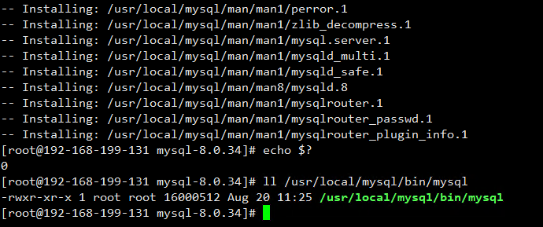
参数解释：
`cmake3` 的参数是被我极限简化的，其他走默认值，减少大家学习的心智负担。
- `WITH_BOOST=./boost/` 我们下载的是带 boost 的源码包，相对路径就是在这里
- `CMAKE_INSTALL_PREFIX=/usr/local/mysql` 编译安装后的 MySQL basedir
- `WITH_DEBUG=1` 可 Debug 的版本
- `FORCE_INSOURCE_BUILD=1` 没研究，可能不是必须的
# MySQL 初始化
`# 创建配置文件目录 & 数据目录
mkdir -p /mysql/8.0.34/data  #你可以改这里
# 创建用户 & 组
groupadd mysql
useradd -g mysql mysql
# 创建配置文件
vi /etc/my.cnf
# 把以下内容覆盖到 my.cnf
[mysqld]
user=mysql
innodb_file_per_table=1
server_id=100
basedir=/usr/local/mysql
datadir=/mysql/8.0.34/data  #你可以改这里
log-error=/mysql/8.0.34/data/error.log  #你可以改这里
# 初始化数据目录
/usr/local/mysql/bin/mysqld --initialize-insecure
`
# 安装 VSCode 插件
## 6.1 本地插件安装
在 VSCode 应用商店搜索并安装以下插件：**Chinese**、**Remote**（红框所示部分，下面两个是 Remote-SSH 的依赖，自动带出来的）。
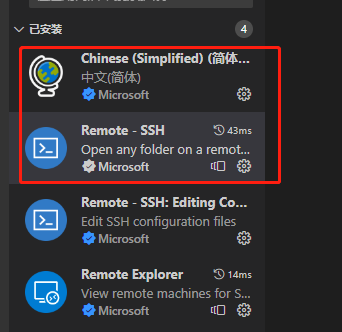
接着我们就可以通过 SSH 工具登录到 CentOS 了。
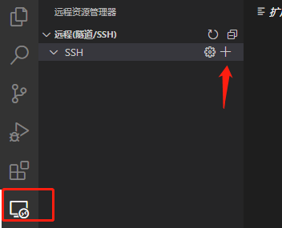
输入远程命令。
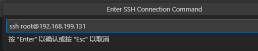
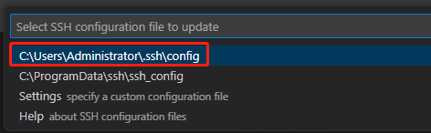
点击连接，选择 Linux，选择继续并输入密码。
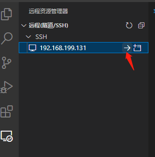
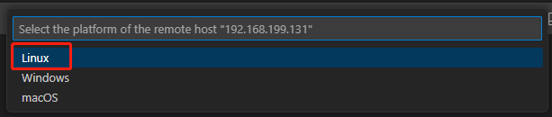
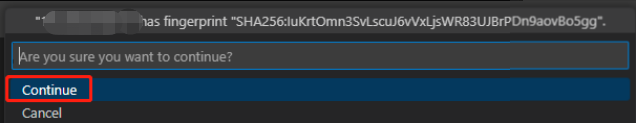
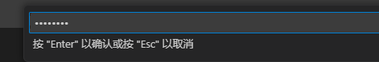
打开文件夹，两种方法任选。
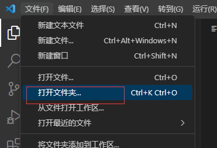
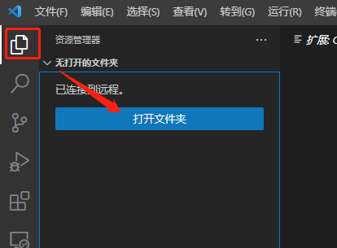
输入文件夹路径，可以正常显示路径下文件。
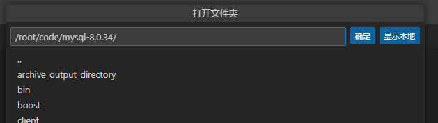
## 6.2 远程插件安装
- C/C++（gdb 插件调试时使用）
装完后，左侧会如图显示：分上下两栏。上栏是你本地 Windows 上装的 VSCode 插件；下栏是你远端 CentOS7 上装的 VSCode 插件。
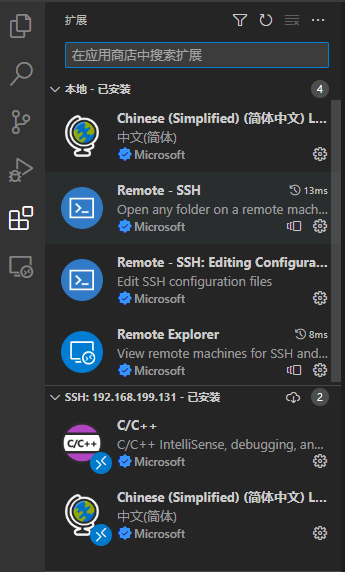
*远端的那个简体中文好像是 SSH 过去时自动安装的，雨我无瓜*
# 调试
## 7.1 配置 VSCode 插件
`cd /root/code/mysql-8.0.34
mkdir .vscode
cd .vscode
vi launch.json
`
内容如下：
`{
"version": "0.2.0",
"configurations": [
{
"name": "(gdb) 启动",
"type": "cppdbg",
"request": "launch",
"program": "/usr/local/mysql/bin/mysqld",
"args": [],
"stopAtEntry": false,
"cwd": "${fileDirname}",
"environment": [],
"externalConsole": false,
"MIMode": "gdb",
"setupCommands": [
{
"description": "为 gdb 启用整齐打印",
"text": "-enable-pretty-printing",
"ignoreFailures": true
},
{
"description": "将反汇编风格设置为 Intel",
"text": "-gdb-set disassembly-flavor intel",
"ignoreFailures": true
}
]
}
]
}
`
## 7.2 启动 gdb
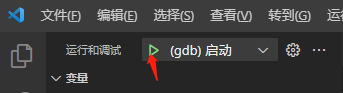
## 7.3 CentOS 上登录连接 MySQL
`/usr/local/mysql/bin/mysql  # 无密码登录 MySQL
`
## 7.4 VSCode 打断点
连接 MySQL 成功之后，在 MySQL 源码中打个断点，先打开 `sql/sql_parse.cc` 文件：
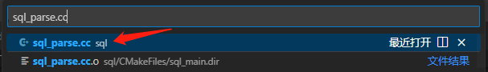
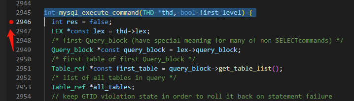
## 7.5 查看断点效果
先在 CentOS 上的 MySQL 终端上执行一条 SQL。
`SELECT host, user FROM mysql.user;
`
程序在断点处暂停之后，就可以查看一系列运行时信息了，查看断点所在函数的局部变量。
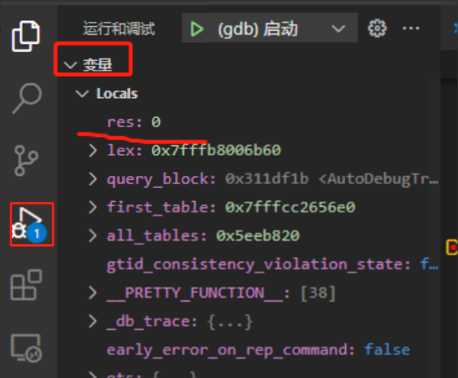
查看断点处的调用栈。
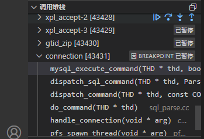
也可以在**调试控制台**中，用命令行执行更多 gdb 命令。
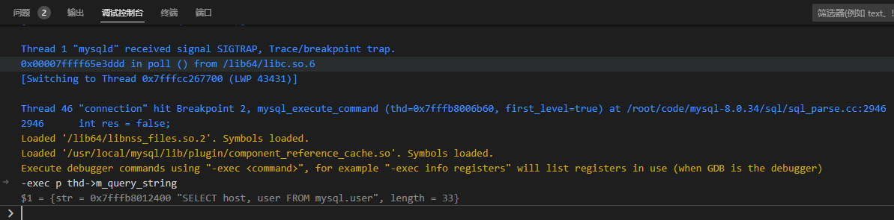
基于 VSCode 的调试，需要在命令之前加上 `-exec`，上图中命令 `p thd->m_query_string` 前面就加上了 `-exec` （VSCode 有提示）。
# 总结
本文借鉴了操盛春老师的方法[《MySQL 调试环境搭建：VSCode + Docker》](https://www.oschina.net/action/GoToLink?url=https%3A%2F%2Fmp.weixin.qq.com%2Fs%3F__biz%3DMzg3NTc3NjM4Nw%3D%3D%26mid%3D2247485385%26idx%3D1%26sn%3D4f500a751122dd8daf8e71d73b86d79c%26scene%3D21%26token%3D1243658115%26lang%3Dzh_CN%23wechat_redirect)，并做了相应调整，以适应 Windows 用户并简化 Debug 环境的配置流程，从而使受众更广。通过将 Docker 改为 VMware，我们可以利用 VMware 的快照功能，在任何步骤中都可以创建快照，如果出现错误并且无法找到原因，可以快速回滚到之前的状态，这极大地提高了入门效率。