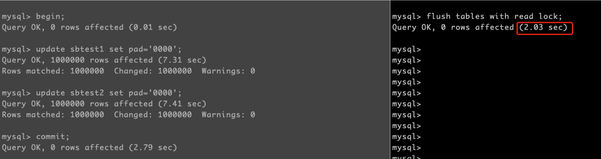

# 技术分享 | Xtrabackup 不备份 binlog 怎么保证一致性？

**原文链接**: https://opensource.actionsky.com/20210908-xtrabackup/
**分类**: 技术干货
**发布时间**: 2021-09-08T00:23:45-08:00

---

作者：胡呈清
爱可生 DBA 团队成员，擅长故障分析、性能优化，个人博客：https://www.jianshu.com/u/a95ec11f67a8，欢迎讨论。
本文来源：原创投稿
*爱可生开源社区出品，原创内容未经授权不得随意使用，转载请联系小编并注明来源。
#### 公司大佬出的考核题中有个有意思的问题：
已知：MySQL 的内部两阶段提交，是为了解决 binlog 和 redo log 的一致性（在 crash recovery 的过程中, 如果发现某个事务的 redo log 已经完成 prepare 阶段, 但未完成 commit，那么会验证该事务是否在 binlog 中，如存在，则进行提交，否则进行回滚）。
又已知：Xtrabackup 在恢复备份后，会进行类似于 crash recovery 的动作(将备份的 redo log 的内容回放到数据中, 并对事务进行提交/回滚)，那么 Xtrabackup 为什么不需要备份 binlog 文件？
想了一下好像不是能一句话说清楚的，我来尝试解答下。
## 答：
备份时全局锁阶段做的操作：
`2020-08-17T09:58:36.167905+08:00         2116 Query     FLUSH TABLES WITH READ LOCK
2020-08-17T09:58:36.490928+08:00         2116 Query     SHOW VARIABLES
2020-08-17T09:58:36.498670+08:00         2116 Query     SHOW SLAVE STATUS
2020-08-17T09:58:36.499435+08:00         2116 Query     SHOW MASTER STATUS
2020-08-17T09:58:36.499747+08:00         2116 Query     SHOW VARIABLES
2020-08-17T09:58:36.503341+08:00         2116 Query     FLUSH NO_WRITE_TO_BINLOG ENGINE LOGS
2020-08-17T09:58:36.704273+08:00         2116 Query     UNLOCK TABLES
`
这里最主要是要保证两点：
- 
非事务数据之间一致性；
- 
数据和 binlog 位点的一致性。
其中 FLUSH NO_WRITE_TO_BINLOG ENGINE LOGS，是防止 innodb_flush_log_at_trx_commit 不等于 1 ，redo log没有刷到磁盘。而 SHOW MASTER STATUS 则是为了获取 binlog 位点。
关键在：xtrabackup 只需要保证“数据和 binlog 位点的一致”，而不是“数据和 binlog 的一致”。
crash recovery 过程要保证“数据和binlog的一致”，因为 crash 后不能出现事务重做提交而 binlog 没记录的情况，这样会导致从库丢失数据。那备份需要考虑的是什么？有两点：
- 
备份恢复后，再基于 binlog 做精确恢复时，&#8211;start-position 的位置是正确的，不会重放、漏掉事物；
- 
备份恢复后，作为从库向主库复制数据时，复制起始位置是正确的，不会重放、漏掉事物。
其实这两点都一样，就是要保证备份时 “数据和 binlog 位点的一致”。xtrabackup 是怎么实现的呢？
首先我们得知道事务二阶段提交过程中的3个队列 flush、sync、commit 都有排他锁，一个大事务 commit 可能需要几秒钟，那么此时执行 FTWRL 是会被阻塞的，commit 结束后才能取得全局锁，取得全局锁后，执行 commit 会被阻塞：

这保证了 xtrabackup 备份的 redo log 中只有两种事务：已经完成提交的，和还没开始提交的（未执行 commit 的事务可能被后台线程刷盘），不会出现 prepare 状态的事务。另外还有一个知识点：GTID 的生成和写 binlog 缓存是在二阶段提交的 binlog flush 阶段做的。结合起来则说明：FTWRL 后 执行 show master status 获取 binlog 位点，只有完成提交的事务才会在其中，所以这保证了 binlog 位点和 binlog 的一致。
所以在 xtrabackup 的恢复过程，不需要处理 prepare 状态的事务，也就不需要再验证该事务是否在 binlog 中了。