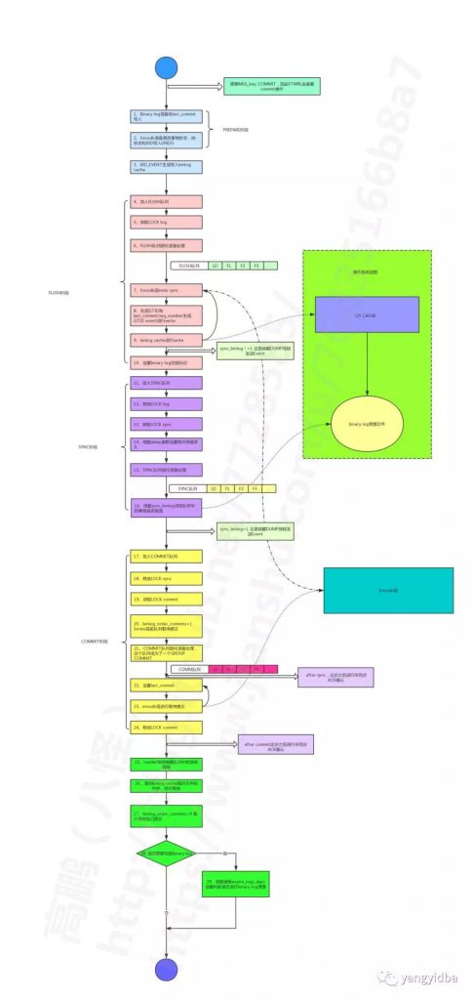
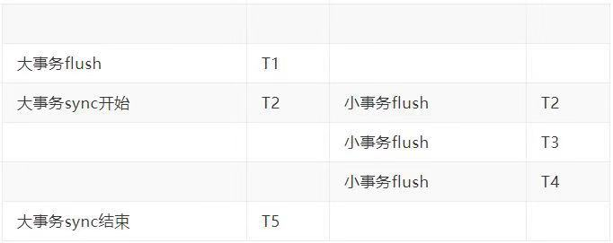
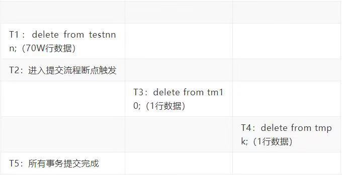

# 技术分享 | binlog 异常暴涨分析

**原文链接**: https://opensource.actionsky.com/20190822-mysql/
**分类**: MySQL 新特性
**发布时间**: 2019-08-22T00:44:23-08:00

---

本文转载自：yangyidba
作者：高鹏 
文章末尾有他著作的《深入理解MySQL主从原理 32讲》，深入透彻理解MySQL主从，GTID相关技术知识。
**背景**
这是一个朋友遇到的问题，他的现象大概如下（MySQL5.6）：- 某个binlog实际大小3g左右，实际设置大小应该是1g
- 其中包含一个大事务，但是最后一个事务是小事务
- 查看大事务的XID_EVENT（&#8217;commit&#8217;）时间和最后一个小事务XID_EVENT（&#8217;commit&#8217;）时间差值近15分钟
下面是他提供的依据：
- `mysqlbinlog -vv mysqlbinlog_file > mysqlbinlog_res.log`
- `grep -n -B 1 "COMMIT" mysqlbinlog_res.log > file.log`
- `tar zcf file.log.tar.gz file.log`
- `通过结果可以看到大事务提交完成是binlog文件的行号是 392578997 ，往前推一个事务，`
- `提交完成后的行号是 42614752 ，`
- `期间相差3.2亿行，就是说这个事务总共写了3.2亿行的binlog`
- `大事务提交的时间是12:54:12，Xid = 4103492840 ，结束的pos值是 2915555141`
- `最后一个事务的提交时间13:08:43，Xid = 4104544654 ，结束的pos值是 2915740337`
**问题**- 为什么最后事务是小事务而不是最大的那个事务，为什么大事务束后没有切换binlog呢？
- 为什么最后一个小事务和大事务提交时间相差了15分钟之多呢？
实际上这些问题的原因我都在我的《深入理解MySQL主从原理 32讲》中说明了，有兴趣可以关注一下文末的课程。好了下面我们来实际分析一下。
**分析**
### 一、提交流程图
这张图是《深入理解MySQL主从原理 32讲》中第15节的截取如下，当然这个图是基于MySQL 5.7.22 画的：
											
好了有了这张图我们继续分析。
### 二、为什么大事务会包含在一个binlog里面
如图中第10步我们可以看到在flush队列的事务Event都写到binlog（不是fsync）后才会进行binlog切换的标记，言外之意就是不管有多大的事务那么都要等到写完binlog后才进行切换标记的设置。因此大事务总是在一个binlog里面。
### 三、为什么最后事务是小事务而不是最大的那个事务
事实上在第10步中我们只是设置了切换标记而已，实际的切换会等到本事务所在的commit队列都提交完成后才会进行binlog的切换，具体就是参考第28步。在这个期间会有2个原因导致大事务并不是binlog的最后一个事务：- 对于flush队列而言，大事务可能包含在队列中的某个位置，队列后面可能包含小事务。
- 对于sync队列而言，大事务的提交会在sync阶段耗费很多时间，如果我们假设为30秒，那么在这30秒内其他新的事务是可以进入新的flush队列的，也能够进行写binlog（不是fsync）的操作。
因此线上有压力的库，binlog的最后一个事务通常不是大事务。
### 四、为什么最后一个小事务和大事务之间XID_EVENT（commit）时间相差了15分钟之多
首先这个问题有两种可能：
> 对于自动事务提交，那么XIDEVENT会是命令发起的时间，因此更容易出现这种情况，后面会使用这种情况进行证明。对于显示开启事务‘begin commit’，那么XIDEVENT会是commit命令发起的时间，但是如果fsync时间足够久那么也会出现这种问题。这种情况不容易测试，因为需要足够大的数据，人为测试很耗时。下面就是这种情况出现的原因。
关于以上两种情况的这种差别我已经在我的《深入理解MySQL主从原理 32讲》中第12讲、第14讲说明了原因。这里我们就假定大事务的提交在sync阶段花费了大约15分钟，那么如下：
											
如果T5和T2之间相差15分钟左右，那么这期间进来的这些小事务依然保留在本binlog里面（因为还没切换29步才切换），那么就有可能看到小事务和大事务之间XID_EVENT（commit）时间相差很大了。实际上在5.7中上面两种情况都很可能都会生成同样的last commit，因为这个时候由于大事务fsync的堵塞第22步更改last commit的操作是不能进行的。
### 五、在5.7.22中测试
整个测试过程必须卡准大事务进行提交这个时间点，我的参数设置如下：- max_binlog_size：1048576，设置较小的binlog大小方便测试。
- binlog_group_commit_sync_delay：1000000，将本参数设置为1秒，用于拖长整个提交流程便于测试，但是实际上大事务的fsync操作可能会更加耗时。
- binlog_transaction_dependency_tracking：COMMITORDER，这是默认的配置，为了更好的证明我们前面生成同样的last commit的结论，避免writeset的干扰。
并且我在我的debug环境中设置了断点MYSQLBINLOG::ordered_commit，用于更好的测试，否则自动提交事务的情况下非常难确认事务到底什么时候进行提交的。最后我们不使用通过‘begin commit’显示的开启事务，因为这样XIDEVENT的时间是commit命令发起的时间，也就不太容易重现案例中的这种XIDEVENT大事务和小事务时间相差很大现象。但是实际上如果事务足够大也是可以的，因为在大事务如案例中有几亿的数据那么这个事务的sync过程会非常缓慢，但是我的测试环境没有那么多的数据，为了让测试效果更加明显因此使用自动提交，这样所有的Event都是命令发起的时间。首先我做了一张较大的表有70W的数据，然后删除整个表的数据，显然这个事务的binlog会大于1M。下面这个表格就是操作流程：
											
只要T4-T1的时间足够长那么就可能出现案例中的情况。如下是我的binlog的截图，可以看到binlog.000017为3.5M左右：
											
下面是我解析binlog.000017的最后部分内容，我们可以发现最后两个事务均是小事务，大事务并不是最后一个事务如下：- `### DELETE FROM `testmts`.`testnnn``
- `### WHERE`
- `### @1=10 /* INT meta=0 nullable=1 is_null=0 */`
- `### DELETE FROM `testmts`.`testnnn``
- `### WHERE`
- `### @1=10 /* INT meta=0 nullable=1 is_null=0 */`
- `### DELETE FROM `testmts`.`testnnn``
- `### WHERE`
- `### @1=10 /* INT meta=0 nullable=1 is_null=0 */`
- `### DELETE FROM `testmts`.`testnnn``
- `### WHERE`
- `### @1=10 /* INT meta=0 nullable=1 is_null=0 */`
- `### DELETE FROM `testmts`.`testnnn``
- `### WHERE`
- `### @1=10 /* INT meta=0 nullable=1 is_null=0 */`
- `### DELETE FROM `testmts`.`testnnn``
- `### WHERE`
- `### @1=10 /* INT meta=0 nullable=1 is_null=0 */`
- `### DELETE FROM `testmts`.`testnnn``
- `### WHERE`
- `### @1=10 /* INT meta=0 nullable=1 is_null=0 */`
- `### DELETE FROM `testmts`.`testnnn``
- `### WHERE`
- `### @1=10 /* INT meta=0 nullable=1 is_null=0 */`
- `# at 3626617`
- `#190804 22:56:10 server id 413340 end_log_pos 3626648 CRC32 0xfc5b79e7 Xid = 143`
- `COMMIT/*!*/;`
- `# at 3626648`
- `#190804 23:02:26 server id 413340 end_log_pos 3626713 CRC32 0xa2399157 GTID last_committed=0 sequence_number=2 rbr_only=yes`
- `/*!50718 SET TRANSACTION ISOLATION LEVEL READ COMMITTED*//*!*/;`
- `SET @@SESSION.GTID_NEXT= 'cb7ea36e-670f-11e9-b483-5254008138e4:191'/*!*/;`
- `# at 3626713`
- `#190804 23:02:26 server id 413340 end_log_pos 3626788 CRC32 0x555fb49d Query thread_id=4 exec_time=0 error_code=0`
- `SET TIMESTAMP=1564930946/*!*/;`
- `BEGIN`
- `/*!*/;`
- `# at 3626788`
- `#190804 23:02:26 server id 413340 end_log_pos 3626838 CRC32 0xec0a4316 Table_map: `testmts`.`tm10` mapped to number 149`
- `# at 3626838`
- `#190804 23:02:26 server id 413340 end_log_pos 3626878 CRC32 0x61c79d68 Delete_rows: table id 149 flags: STMT_END_F`
- `### DELETE FROM `testmts`.`tm10``
- `### WHERE`
- `### @1=10 /* INT meta=0 nullable=1 is_null=0 */`
- `# at 3626878`
- `#190804 23:02:26 server id 413340 end_log_pos 3626909 CRC32 0x2a9cd136 Xid = 154`
- `COMMIT/*!*/;`
- `# at 3626909`
- `#190804 23:02:26 server id 413340 end_log_pos 3626974 CRC32 0x06b081ec GTID last_committed=0 sequence_number=3 rbr_only=yes`
- `/*!50718 SET TRANSACTION ISOLATION LEVEL READ COMMITTED*//*!*/;`
- `SET @@SESSION.GTID_NEXT= 'cb7ea36e-670f-11e9-b483-5254008138e4:192'/*!*/;`
- `# at 3`
仔细观察你会发现 23:02:26和22:56:10之间相差了6分钟之多。然后我们来看看他们的last commit如下：- `[root@mysqltest2 log]# cat -n log.log|grep last`
- `11 #190804 22:56:10 server id 413340 end_log_pos 299 CRC32 0x47602f13`
- `GTID last_committed=0 sequence_number=1 rbr_only=yes`
- `2167349 #190804 23:02:26 server id 413340 end_log_pos 3626713 CRC32 0xa2399157`
- `GTID last_committed=0 sequence_number=2 rbr_only=yes`
- `2167368 #190804 23:02:26 server id 413340 end_log_pos 3626974 CRC32 0x06b081ec`
- `GTID last_committed=0 sequence_number=3 rbr_only=yes`
我们发现如我们所述，它们的last commit是一致的。到这里我们全部的结论都得到证明。
### 六、注意
最后需要提醒一下，MySQL不要有过大的事务，我觉得大事务最大的危害在于会堵塞整个数据库其他事务的提交，这个在我的《深入理解MySQL主从原理 32讲》中已经多次提到，这里就不在赘述了。
最后推荐高鹏的专栏《深入理解MySQL主从原理 32讲》，想要透彻了解学习MySQL 主从原理的朋友不容错过。
											
**社区近期动态**
**No.1**
**Mycat 问题免费诊断**
**诊断范围支持：**
Mycat 的故障诊断、源码分析、性能优化
**服务支持渠道：**
- 技术交流群，进群后可提问QQ群（669663113）
- 社区通道，邮件&电话osc@actionsky.com
- 现场拜访，线下实地，1天免费拜访
**关注“爱可生开源社区”公众号，回复关键字“Mycat”，获取活动详情。**
**No.2**
**原创技术内容 征稿**
**征稿内容：**- 格式：.md/.doc/.txt
- 主题：MySQL、分布式中间件DBLE、数据传输组件DTLE相关
- 要求：原创且未发布过
- 奖励：作者署名；200元京东E卡+社区周边
**投稿方式：**- 邮箱：osc@actionsky.com
- 格式：[投稿]姓名+文章标题
- 以**附件**形式发送，正文需注明**姓名、手机号、微信号**，以便小编及时联系