# 技术分享 | mysqlbackup 可以远程备份吗？

**原文链接**: https://opensource.actionsky.com/20210423-mysql/
**分类**: MySQL 新特性
**发布时间**: 2021-04-23T00:31:42-08:00

---

作者：秦广飞爱可生 DBA 团队成员，负责项目日常问题处理及公司平台问题排查，对数据库有兴趣，对技术有想法。一入 IT 深似海，从此节操是路人。本文来源：原创投稿*爱可生开源社区出品，原创内容未经授权不得随意使用，转载请联系小编并注明来源。
> **本文目录**背景介绍测试环境备份命令测试场景- 1. A 服务器本地备份 MySQL A
- 2. A 服务器远程备份 MySQL B
测试结果总结
## 背景介绍
最近在我司客户现场遇到一个有趣的现象，关于使用 mysqlbackup 工具，远程备份其他服务器上的实例，跟大家分享一下。
mysqlbackup 支持远程备份吗？答案自然是不支持的。
那这篇文章？且往下看。
## 测试环境
两台服务器，我们假设就叫 A 和 B，各装有一个 MySQL 实例，端口都是 3306。
为了接下来的测试，我们在 A 实例上创建备份用户 user_A@&#8217;%&#8217;，密码 password_A，测试库 a1、a2、a3。
同样，我们在 B 实例上创建备份用户 user_B@&#8217;%&#8217;，密码 password_B，测试库 b1、b2、b3。
对了，备份工具保持跟客户现场一致：MySQL Enterprise Backup version 4.0.0。
好了，我的测试环境如下：
| 主机名 | 主机 IP | 实例 | 版本 | 端口 | 用户 | 密码 | 测试库 | 备份工具 | 版本 |
| --- | --- | --- | --- | --- | --- | --- | --- | --- | --- |
| qin_2 | 10.186.64.13 | MySQL A | 5.7.25 | 3306 | user_A@&#8217;%&#8217; | password_A | a1 a2 a3 | mysqlbackup | 4.0.0 |
| qin_4 | 10.186.64.16 | MySQL B | 5.7.25 | 3306 | user_B@&#8217;%&#8217; | password_B | b1 b2 b3 | mysqlbackup | 4.0.0 |
## 
## 备份命令
我们知道 mysqlbackup 属于物理备份工具。备份的是数据文件，因此也只能本地备份拷贝文件，这就表明了物理备份不能远程备份。
但我们可以使用 &#8211;host 选项指定服务器 IP。
由于本次测试，不是为了具体研究 mysqlbackup 备份参数的影响，因此，使用最简单的备份命令如下：
`shell> mysqlbackup --defaults-file=/opt/mysql/etc/3306/my.cnf --user=user_A --password=password_A --host=10.186.64.13 --backup-dir=/data/backup01 backup`
## 测试场景
#### 1. A 服务器本地备份 MySQL A
**测试过程：**
MySQL 运行时备份
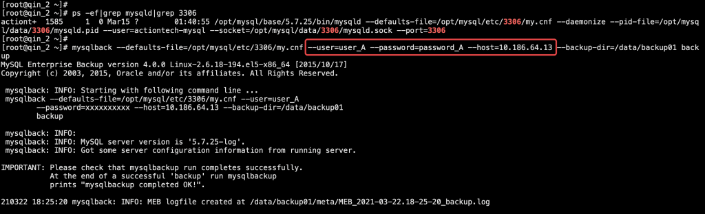											
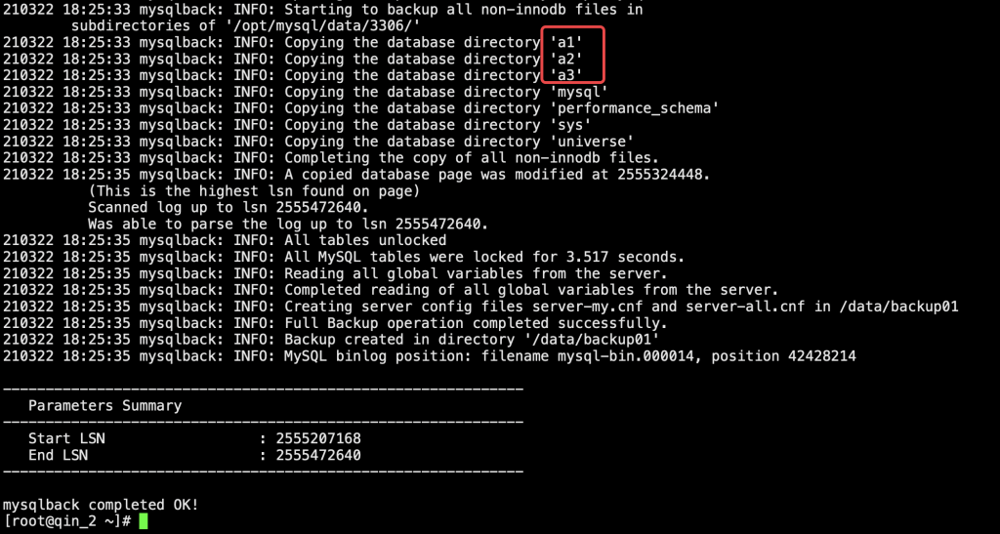											
MySQL 停止时备份
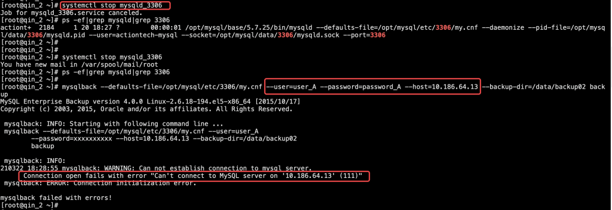											
使用错误的密码备份
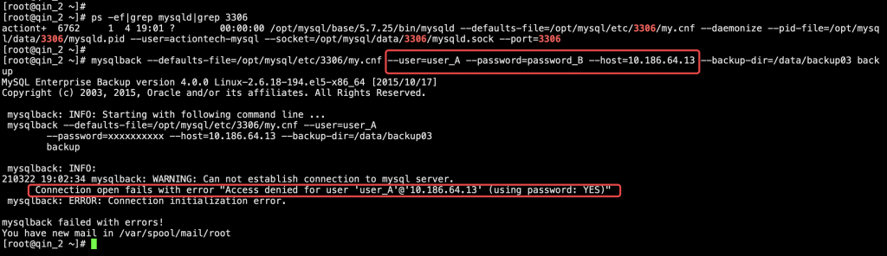											
**测试小结：**
- mysqlbackup 可以在 MySQL 运行时，进行热备，且当 MySQL 停止运行时，不能备份。
- 当使用错误的用户密码时，mysqlbackup 也不能备份成功。
#### 2. A 服务器远程备份 MySQL B
**测试过程：**
当 MySQL B 运行时（MySQL A 运行），在 A 服务器上备份 MySQL B
											
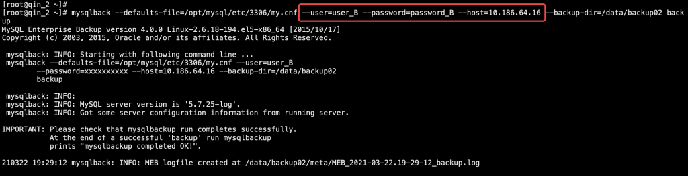											
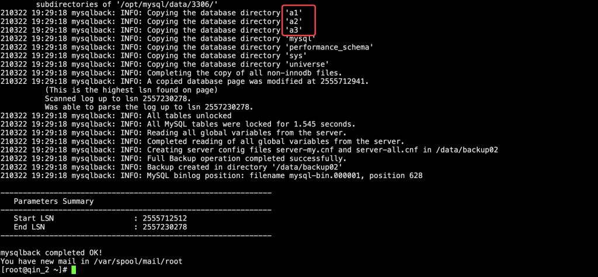											
当 MySQL B 运行时（MySQL A 停止），在 A 服务器上备份 MySQL B
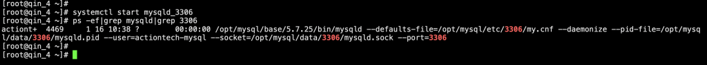											
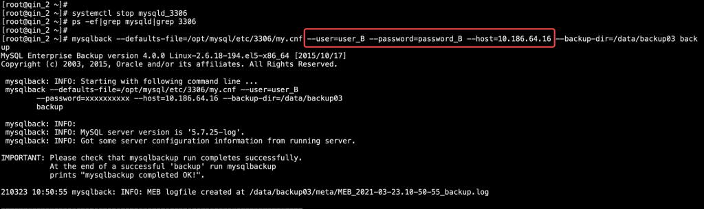											
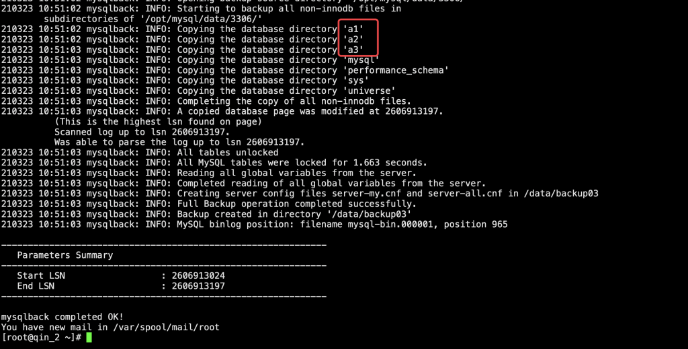											
当 MySQL B 停止时，在 A 服务器上备份 MySQL B
											
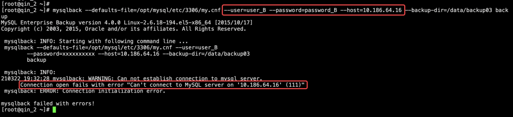											
**测试小结：**
- 当 MySQL B 实例运行时，无论 MySQL A 是否运行，远程备份都能成功，但备份的其实是 MySQL A 的库（a1、a2、a3）。
- 当 MySQL B 实例停止时，无论 MySQL A 是否运行，远程备份都会失败。
**测试结果：**
从上面测试场景的结果来看，mysqlbackup 工具在使用 &#8211;host 选项指定远程服务器备份时，如果指定了正确的用户名和密码，且远程服务器上的 MySQL 实例正常运行，备份是可以成功的，但实际上备份的还是本地的 MySQL 实例，且不论本地 MySQL 实例是否在运行中。
是不是很神奇，因为我们已经测试过了，本地备份时，如果 MySQL 实例停止运行，是不能备份成功的，但是现在远程竟然都可以了。
实际上，由于客户环境，所有实例的用户、密码、端口都一致，甚至库名也一致，所以现场很具有迷惑性。
那么，我们看下官方文档，关于这个版本的 &#8211;host 是怎么解释的：
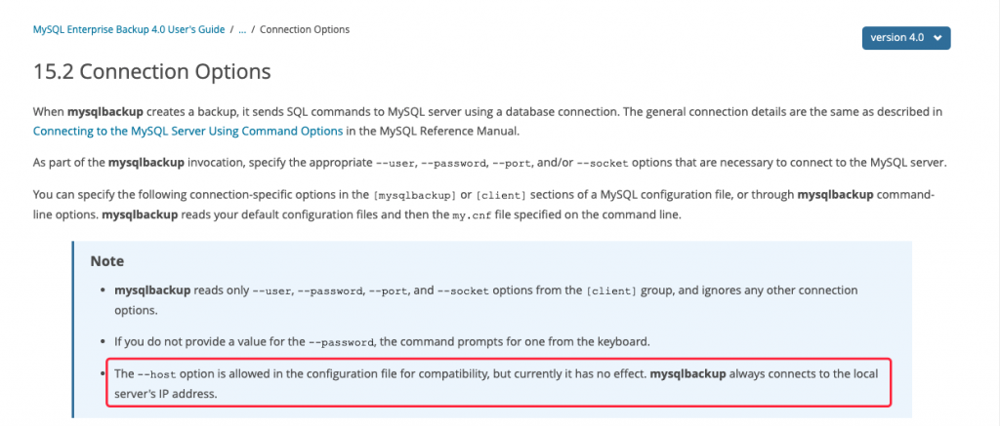											
官方文档介绍，&#8211;host 是为了兼容性，才可以配置在备份选项中，实际上并没有作用，mysqlbackup 还是会使用本地的 host 连接数据库，但测试下来，发现好像并不是这样，因为 mysqlbackup 通过了远程服务器上 MySQL 的连接验证。
接下来，我替换一下 mysqlbackup 版本，使用 mysqlbackup 4.1.4 测试看看：
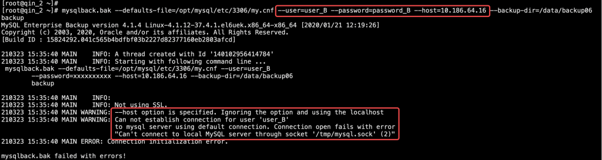											
从图中可以看出，mysqlbackup 4.1.4 已经提示不能使用 &#8211;host 指定的 IP，替换为使用 localhost 方式连接数据库，且默认使用 /tmp/mysql.sock。
这样的话，使用 mysqlbackup 4.0 往上的版本，就只能使用 socket 方式连接数据库了，即备份用户必须是 localhost。
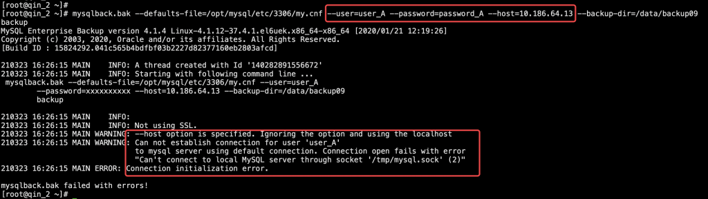											
## 总结
mysqlbackup 工具不能通过远程方式备份实例，且 4.1 版本之后，只能使用 localhost 用户通过 socket 方式连接数据库。
本文测试发现的，mysqlbackup 4.0 通过 &#8211;host 选项连接远程实例备份本地数据库，只是特例。
> **更正说明**
截图中出现的 mysqlback 命令，是失误写错啦，应该是：mysqlbackup。
**文章推荐：**
[技术分享 | MariaDB 10.1.9 迁移到 MySQL 5.7.25](https://opensource.actionsky.com/20200608-mysql/)