# 技术分享 | observer 资源水位介绍

**原文链接**: https://opensource.actionsky.com/20230411-observer/
**分类**: 技术干货
**发布时间**: 2023-04-10T23:31:12-08:00

---

作者：郭斌斌
爱可生 DBA 团队成员，负责项目日常问题处理及公司平台问题排查。
本文来源：原创投稿
*爱可生开源社区出品，原创内容未经授权不得随意使用，转载请联系小编并注明来源。
OceanBase 集群界面会展示 Observer 的资源水位，今天简单了解一下资源水位的数值代表的含义以及关联参数
现有 test_1 集群，只有一个sys租户
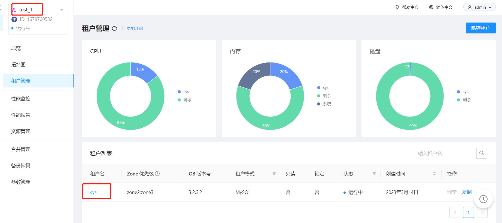
Sys租户的资源配置:   Cpu：2.5-5    Memory： 3G-3G   Unit：1
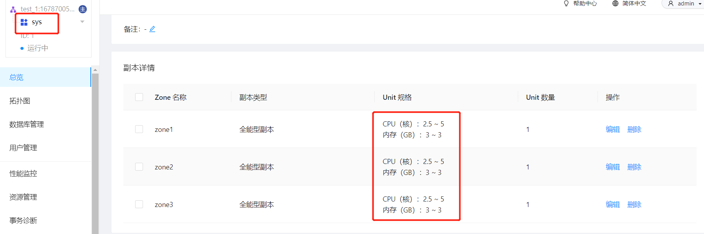
集群的资源水位信息
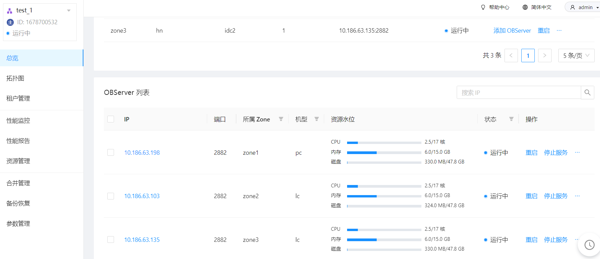
以10.186.63.198为例，浅看一下cpu、内存、磁盘的含义以及相关联参数
**cpu：2.5 / 17 核**
2.5  代表 observer 上已经分配给租户的 cpu 核数，该数值是 租户的 Min CPU
17  代表当前的observer可用的cpu数，通常observer会预留一部分cpu给操作系统，由参数cpu_reserved进行控制
#### 验证：
当前sys租户的 min cpu为 2.5，并且当前集群只有一个sys租户，因此资源水位cpu显示的是 2.5
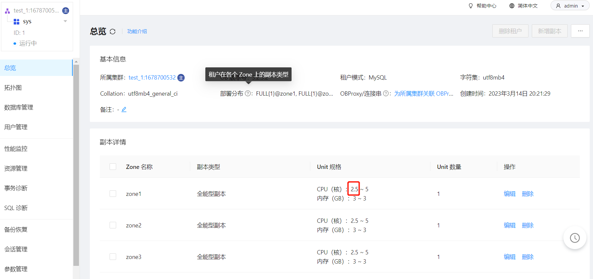
10.186.63.198的服务器cpu  19个核心
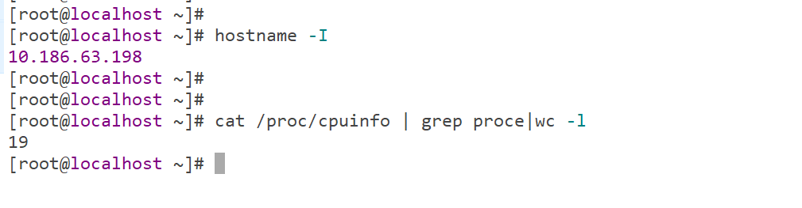
集群的 cpu_reserved
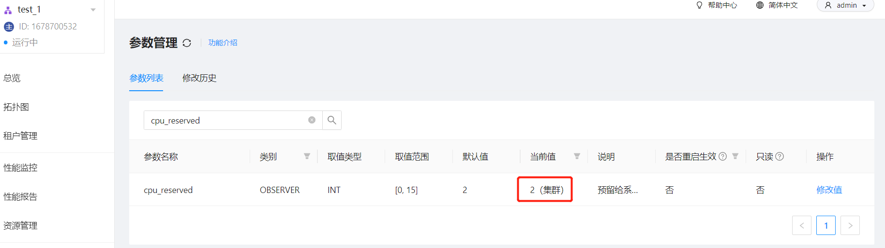
因此除去操作系统使用cpu，当前 observer的cpu最多可用17核
**内存：6.0/15.0GB**
6.0GB 代表observer已经分配出去的内存，该部分内存为租户内存 + 系统内部内存（所有租户共享内存），系统内部内存由 system_memory控制大小，租户内存由资源单元控制
15GB 代表当前observer可用的内存总量，通常会预留一部分内存给操作系统使用，由 memory_limit /  memory_limit_percentage控制。
### 验证：
系统内部内存大小
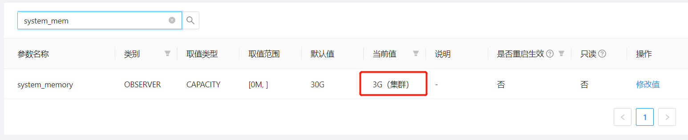
租户内存
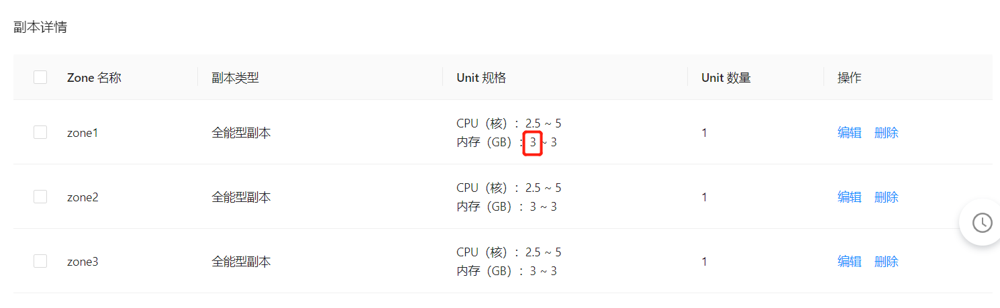
系统内部内存 + 租户内存=6G
Memory_limit配置为15G，observer的可用总内存 15G
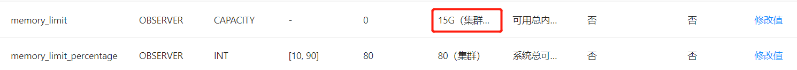
**存储：330.0 MB/47.8 GB**
330M  代表当前observer已使用磁盘空间大小
47.8G  代表当前observer磁盘空间总大小
#### 验证：
登录sys租户查看 observer 10.186.63.198存储使用情况，当前存储使用330M
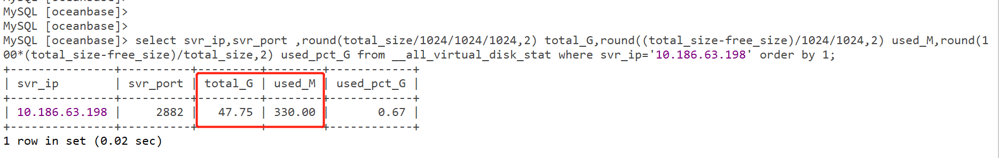
登录服务器查看磁盘空间可以看到 OceanBase初始化后的数据文件总大小48G
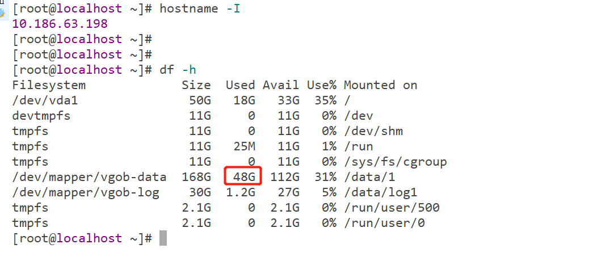
资源水位展示的可用磁盘总大小，来自于SQL统计，不是通过系统命令获取