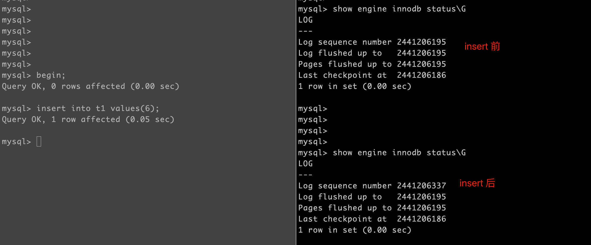
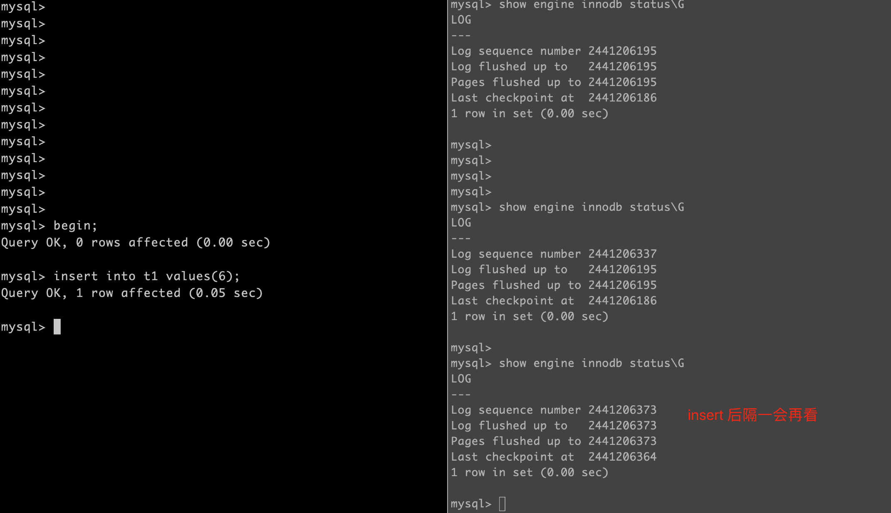

# 技术分享 | show engine innodb status中Pages flushed up to 的含义

**原文链接**: https://opensource.actionsky.com/20210922-checkpoint/
**分类**: 技术干货
**发布时间**: 2021-09-21T23:46:28-08:00

---

作者：胡呈清
爱可生 DBA 团队成员，擅长故障分析、性能优化，个人博客：https://www.jianshu.com/u/a95ec11f67a8，欢迎讨论。
本文来源：原创投稿
*爱可生开源社区出品，原创内容未经授权不得随意使用，转载请联系小编并注明来源。
有一个很久前就存在的疑惑：
在没有写入的情况下，show engine innodb status 中的 Pages flushed up to 为什么不等于 Last checkpoint point？它表示什么？
今天在写一篇文章时，想通过一个测试，从这几个 LSN 的变化来验证一个说法，结果重新勾起了这个问题，在一番“研究”后（其实就是google了一通，当然还是需要一些测试验证），终于弄明白了其中含义。
主要还是借鉴了一篇文章：http://blog.itpub.net/30221425/viewspace-2154670/，因为有大量的源码分析，而我看不懂源码，所以花了不少时间才理解其中原理，并且通过测试验证了其准确性，然后整理成了一个让像我这样不懂代码的人更方便阅读的文档。
今天在写一篇文章时，想通过一个测试，从这几个 LSN 的变化来验证一个说法，结果重新勾起了这个问题，这次我决定彻底弄明白到底是怎么一回事。
主要还是借鉴了一篇文章：http://blog.itpub.net/30221425/viewspace-2154670/，因为有大量的源码分析，而我也看不懂源码，所以花了不少时间才理解其中原理，并且通过测试验证了其准确性，然后整理成了一个更方便让像我这样不懂代码的人理解的文档。
### LSN
show engine innodb status 的输出中，有一部分是 LSN 的状态：
`mysql> pager grep -A 5 LOG                                      
PAGER set to 'grep -A 5 LOG'
mysql> show engine innodb status\G
LOG
---
Log sequence number 2471197058
Log flushed up to   2471197058
Pages flushed up to 2471197058
Last checkpoint at  2471197049
1 row in set (0.00 sec)
`
Log sequence number：所有修改数据的操作都会产生 redo log，这是系统当前 redo log 序列号（后面简称 LSN）的最大值；
Log flushed up to：当前已经刷盘的 redo log 的序列号；
Pages flushed up to：讨论的重点；
Last checkpoint at：最后一次 checkpoint 的位置。
Pages flushed up to 到底表示什么？最常见的说法就是脏页刷新到磁盘的 LSN，但 Last checkpoint at 也表示在此之前的数据页已经刷盘，而且通常我们看到的 Pages flushed up to 总是比 Last checkpoint at 大 ，所以这个说法肯定是错误的。
根据参考文章中的源码分析，Pages flushed up to 的取值逻辑是：
Pages flushed up to 取的是所有 buffer pool instance 中的 flush list 中最大 oldest modification lsn 页中的带有最小的 oldest modification lsn 的值（这里可能有点难以理解，我们可以简化理解为取 flush list 中最大的 oldest modification lsn）；
如果取到的 oldest modification lsn 为0，意味着没有脏页，那么我们就取 log_sys->lsn 的值，即 show engineinnodb status 显示的 Log sequence number。
### LSN 更新的逻辑
取 Pages flushed up to 的目的是什么？因为是取的 flush list 中脏页的最大 LSN，接下来做 checkpoint 时，可以用作这次刷脏的一个结束位置。
在一个正常运行的 MySQL 中，系统 LSN 随着 SQL 的执行（修改数据的SQL）不断增大（实时的），Pages flushed up to 值也会按某个频率获取更新，所以 Pages flushed up to 一般会落后于系统 LSN。然后 InnoDB master thread 每秒和每十秒做 checkpoint 时（还有其他的机制触发 checkpoint，这里不考虑并不影响理解），在将脏页刷盘后会将 Last checkpoint at 的值更新成 Pages flushed up to，由于 Pages flushed up to 在不断更新，所以我们观察到的 Last checkpoint at 一般会小于 Pages flushed up to。
**在没数据写入的情况下，为什么 Last checkpoint point 不等于 Pages flushed up to？**
是因为做 checkpoint 时同时 redo 日志会写 MLOG_CHECKPOINT，而 MLOG_CHECKPOINT 占用9个字节，所以系统 LSN 会加9，而由于脏页都被刷盘了，flush list 为空，获取 Pages flushed up to 时会直接取系统 LSN 值，所以也会比 Last checkpoint point 大 9。
获取 Pages flushed up to 和 checkpoint 不是一个原子操作，它是在 checkpoint 前就获取了，指的是下一次 checkpoint 结束的位置。
### 测试验证
我们手工开启一个事务写入一行数据（不提交），会发现如下图所示：
- 
Log sequence number 增加了，因为系统 LSN 是实时产生的；
- 
Log flushed up to 没变，说明 redo log 还没刷盘（也可能观察到这个值增加并且和 Log sequence number 一致，因为 InnoDB 后台线程每秒会刷 redo log，未提交事务的 redo log 可能提前刷盘）；
- 
Pages flushed up to 没变，因为这个值不是实时产生的，只要我们手速够快，在执行完 insert 后立刻查看 LSN，就可以看到这个值不变；
- 
Last checkpoint point 没变，同样的只要手速够快，在 checkpoint 前查看到的值就不会变。

我们隔几秒钟后再查看 LSN，会发现：所有值都变了，并且前 3个值一样，Last checkpoint point 比它们的值小 9。这是因为InnoDB Master Thread 每秒、每十秒都会做 checkpoint，所有脏页都刷盘后，flush list 为空，符合我们前面所说的原理：

在持续写入的情况下，是可以观察到 Last checkpoint point 等于 Pages flushed up to 的（checkpoint 后还没有获取新的 Pages flushed up to）：
