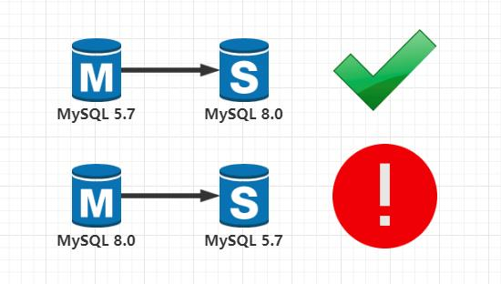

# 技术分享 | 从 MySQL 8.0 复制到 MySQL 5.7

**原文链接**: https://opensource.actionsky.com/20190906-mysql/
**分类**: MySQL 新特性
**发布时间**: 2019-09-05T23:50:08-08:00

---

> 作者：Vinicius Grippa
翻译：管长龙
本文中，我们将讨论如何设置从 MySQL 8.0 到 MySQL 5.7 的复制。在某些情况下，使用此配置可能会有所帮助。例如，在 MySQL 升级的情况下，将使用较新版本的 MySQL 主服务器作为回滚计划用于较旧版本的从服务器会很有用。另一个，则是在升级主主（master master）复制的情况。MySQL 复制仅在连续主版本之间支持，并且仅从主低到从高之间支持。**master 5.7 &#8211; > slave 8.0 **支持**master 8.0 &#8211; > slave 5.7 **不支持
											
本文中，我将介绍如何克服这个问题并初始化，以便在此方案中设置复制功能。如果使用 MySQL 8 的新功能，我还会显示一些可以暂停复制的错误。- `slave > select @@version;`
- `+---------------+`
- `| @@version     |`
- `+---------------+`
- `| 5.7.17-log |`
- `+---------------+`
- `1 row in set (0.00 sec)`
- 
- `master > select @@version;`
- `+-----------+`
- `| @@version |`
- `+-----------+`
- `| 8.0.12    |`
- `+-----------+`
- `1 row in set (0.00 sec)`
首先，在执行 `CHANGE MASTER` 命令之前，需要修改主服务器上的排序规则。否则复制将遇到此错误：- `slave > show slave status\G`
- `Last_Errno: 22`
- `Last_Error: Error 'Character set '#255' is not a compiled character set and is not specified in the '/opt/percona_server/5.7.17/share/charsets/Index.xml' file' on query. Default database: 'mysql8_1'. Query: 'create database mysql8_1'`
这是因为 MySQL 8 上的默认 character_set 和排序规则发生了变化。根据文档：- `character_set_server  和  character_set_database  系统变量的默认值  已从 latin1更改为 utf8mb4。`
- `collation_server 和  collation_database 系统变量的默认值已经从  latin1_swedish_ci  更改为 utf8mb4_0900_ai_ci。`
让我们在 MySQL 8 上将排序规则和字符集更改为 utf8（可以使用两个版本中存在的任何选项）：- `# master my.cnf`
- `[client]`
- `default-character-set=utf8`
- 
- `[mysqld]`
- `character-set-server=utf8`
- `collation-server=utf8_unicode_ci`
重启 MySQL 8 才能生效。接下来，在重启之后，您必须使用 `mysql_native_password` 创建复制用户 。这是因为 MySQL 8 将默认的 `Authentication Plugin` 更改为 `maching_sha2_password`，MySQL 5.7 不支持。如果您尝试使用 `caching_sha2_password` 插件执行 `CHANGE MASTER` 命令 ，您将收到以下错误消息：- `Last_IO_Errno: 2059`
- `Last_IO_Error: error connecting to master 'root@127.0.0.1:19025' - retry-time: 60 retries: 1`
最后，我们可以像往常一样继续构建复制：- `master > show master status\G`
- `*************************** 1. row ***************************`
- `File: mysql-bin.000007`
- `Position: 155`
- `Binlog_Do_DB:`
- `Binlog_Ignore_DB:`
- `Executed_Gtid_Set:`
- `1 row in set (0.00 sec)`
- 
- `slave > CHANGE MASTER TO MASTER_HOST='127.0.0.1',`
- `MASTER_USER='replica_user',`
- `MASTER_PASSWORD='repli$cat',`
- `MASTER_PORT=19025,`
- `MASTER_LOG_FILE='mysql-bin.000007',`
- `MASTER_LOG_POS=155; start slave;`
- `Query OK, 0 rows affected, 2 warnings (0.01 sec)`
- `Query OK, 0 rows affected (0.00 sec)`
- 
- `# This procedure works with GTIDs too`
- `slave > CHANGE MASTER TO MASTER_HOST='127.0.0.1',`
- `MASTER_USER='replica_user',`
- `MASTER_PASSWORD='repli$cat',`
- `MASTER_PORT=19025,`
- `MASTER_AUTO_POSITION = 1 ; start slave;`
检查复制状态：- `master > show slave status\G`
- `*************************** 1. row ***************************`
- `Slave_IO_State: Waiting for master to send event`
- `Master_Host: 127.0.0.1`
- `Master_User: replica_user`
- `Master_Port: 19025`
- `Connect_Retry: 60`
- `Master_Log_File: mysql-bin.000007`
- `Read_Master_Log_Pos: 155`
- `Relay_Log_File: mysql-relay.000002`
- `Relay_Log_Pos: 321`
- `Relay_Master_Log_File: mysql-bin.000007`
- `Slave_IO_Running: Yes`
- `Slave_SQL_Running: Yes`
- `Replicate_Do_DB:`
- `Replicate_Ignore_DB:`
- `Replicate_Do_Table:`
- `Replicate_Ignore_Table:`
- `Replicate_Wild_Do_Table:`
- `Replicate_Wild_Ignore_Table:`
- `Last_Errno: 0`
- `Last_Error:`
- `Skip_Counter: 0`
- `Exec_Master_Log_Pos: 155`
- `Relay_Log_Space: 524`
- `Until_Condition: None`
- `Until_Log_File:`
- `Until_Log_Pos: 0`
- `Master_SSL_Allowed: No`
- `Master_SSL_CA_File:`
- `Master_SSL_CA_Path:`
- `Master_SSL_Cert:`
- `Master_SSL_Cipher:`
- `Master_SSL_Key:`
- `Seconds_Behind_Master: 0`
- `Master_SSL_Verify_Server_Cert: No`
- `Last_IO_Errno: 0`
- `Last_IO_Error:`
- `Last_SQL_Errno: 0`
- `Last_SQL_Error:`
- `Replicate_Ignore_Server_Ids:`
- `Master_Server_Id: 100`
- `Master_UUID: 00019025-1111-1111-1111-111111111111`
- `Master_Info_File: /home/vinicius.grippa/sandboxes/rsandbox_5_7_17/master/data/master.info`
- `SQL_Delay: 0`
- `SQL_Remaining_Delay: NULL`
- `Slave_SQL_Running_State: Slave has read all relay log; waiting for more updates`
- `Master_Retry_Count: 86400`
- `Master_Bind:`
- `Last_IO_Error_Timestamp:`
- `Last_SQL_Error_Timestamp:`
- `Master_SSL_Crl:`
- `Master_SSL_Crlpath:`
- `Retrieved_Gtid_Set:`
- `Executed_Gtid_Set:`
- `Auto_Position: 0`
- `Replicate_Rewrite_DB:`
- `Channel_Name:`
- `Master_TLS_Version:`
- `1 row in set (0.01 sec)`
执行快速测试以检查复制是否正常工作：- `master > create database vinnie;`
- `Query OK, 1 row affected (0.06 sec)`
- 
- `slave > show databases like 'vinnie';`
- `+-------------------+`
- `| Database (vinnie) |`
- `+-------------------+`
- `| vinnie |`
- `+-------------------+`
- `1 row in set (0.00 sec)`
**注意事项**任何尝试使用 MySQL 8 中的新功能（如 rule，不可见索引或 caching_sha2_password）的尝试都将使复制停止并显示错误：- `master > alter user replica_user identified with caching_sha2_password by 'sekret';`
- `Query OK, 0 rows affected (0.01 sec)`
- 
- `slave > show slave status\G`
- `       Last_SQL_Errno: 1396`
- `       Last_SQL_Error: Error 'Operation ALTER USER failed for 'replica_user'@'%'' on query. Default database: ''. Query: 'ALTER USER 'replica_user'@'%' IDENTIFIED WITH 'caching_sha2_password' AS '$A$005$H    MEDi\"gQ`
- `                wR{/I/VjlgBIUB08h1jIk4fBzV8kU1J2RTqeqMq8Q2aox0''`
**总结**可以从 MySQL 8 复制到 MySQL 5.7。在某些情况下（特别是升级），这可能会有所帮助，但不建议在异构拓扑结构中使用，因为在某些情况下它会容易出错和不兼容。
原文链接：https://www.percona.com/blog/2018/04/10/migrating-database-charsets-to-utf8mb4/
**社区近期动态**
**No.1**
**Mycat 问题免费诊断**
诊断范围支持：
Mycat 的故障诊断、源码分析、性能优化
服务支持渠道：
- 技术交流群，进群后可提问
QQ群（669663113）
- 社区通道，邮件&电话
osc@actionsky.com
- 现场拜访，线下实地，1天免费拜访
关注“爱可生开源社区”公众号，回复关键字“Mycat”，获取活动详情。
**No.2**
**社区技术内容征稿**
征稿内容：
- 格式：.md/.doc/.txt
- 主题：MySQL、分布式中间件DBLE、数据传输组件DTLE相关技术内容
- 要求：原创且未发布过
- 奖励：作者署名；200元京东E卡+社区周边
投稿方式：
- 邮箱：osc@actionsky.com
- 格式：[投稿]姓名+文章标题
- 以附件形式发送，正文需注明姓名、手机号、微信号，以便小编及时联系