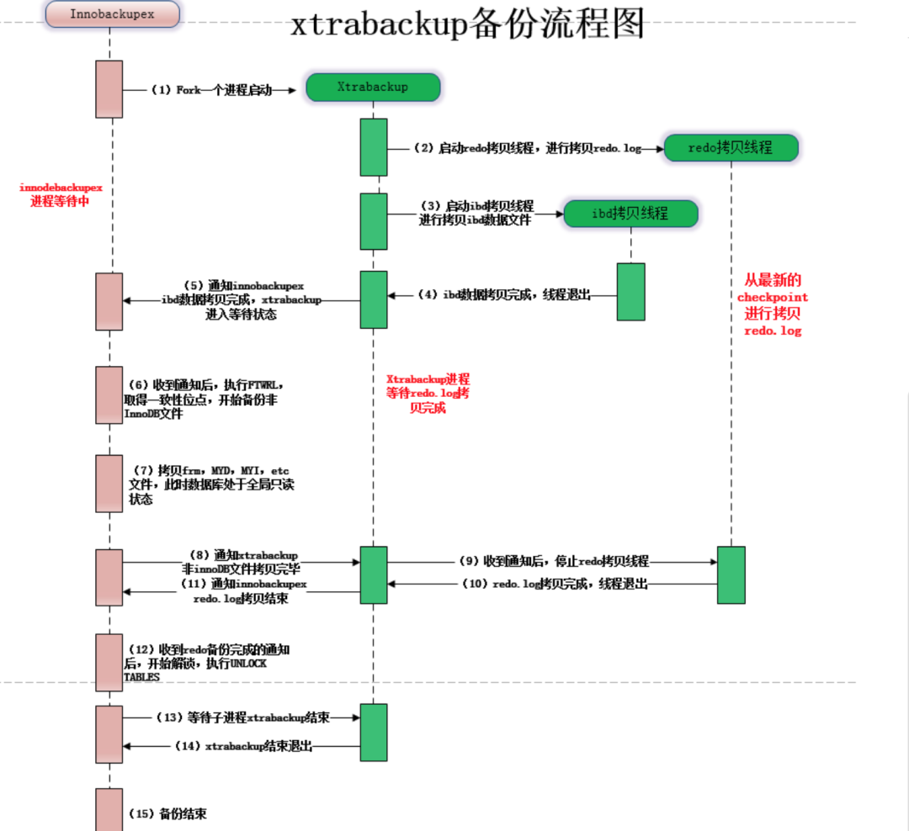
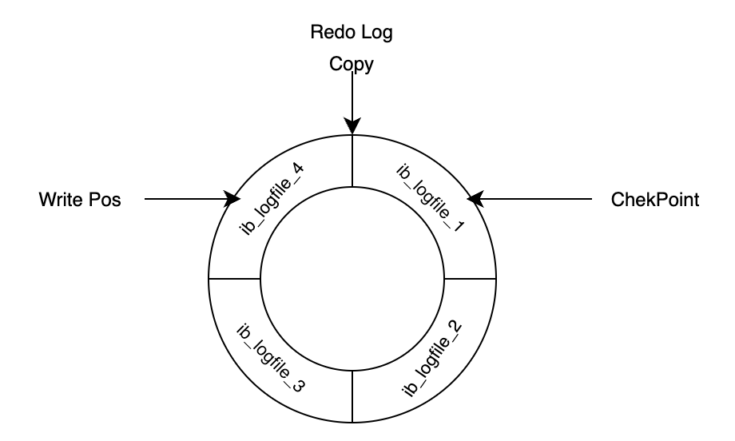
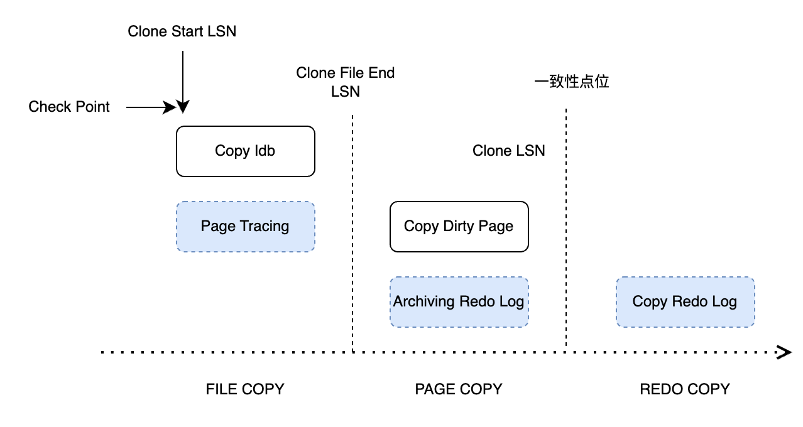
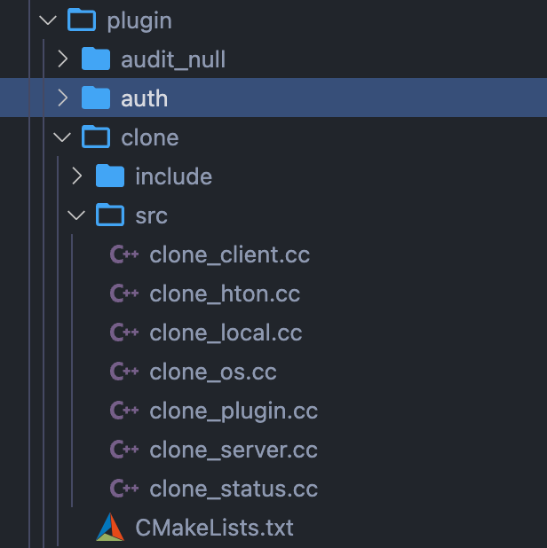
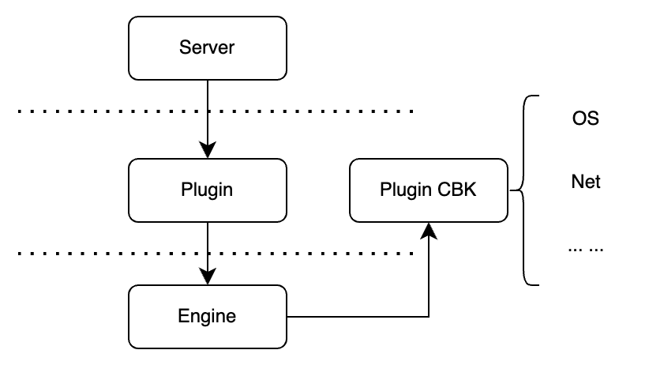

# 技术分享 | 从实现原理来看为什么 Clone 插件比 Xtrabackup 更好用？

**原文链接**: https://opensource.actionsky.com/%e6%8a%80%e6%9c%af%e5%88%86%e4%ba%ab-%e4%bb%8e%e5%ae%9e%e7%8e%b0%e5%8e%9f%e7%90%86%e6%9d%a5%e7%9c%8b%e4%b8%ba%e4%bb%80%e4%b9%88-clone-%e6%8f%92%e4%bb%b6%e6%af%94-xtrabackup-%e6%9b%b4%e5%a5%bd/
**分类**: 技术干货
**发布时间**: 2024-08-13T00:55:10-08:00

---

本文主要初步的介绍 Clone Plugin 的原理以及和 Xtrabackup 的异同，以及整体实现的框架。
> 作者：戴骏贤(小光) 前网易游戏 计费组-资深数据库系统工程师，现天翼云数据库运维专家。
爱可生开源社区出品，原创内容未经授权不得随意使用，转载请联系小编并注明来源。
本文约 2600 字，预计阅读需要 9 分钟。
从 MySQL 8.0.17 版本开始，官方实现了 Clone 的功能，允许用户通过简单的 SQL 命令把远端或本地的数据库实例拷贝到其他实例后，快速拉起一个新的实例。
该功能由一些列的 WL 组成 :
- **Clone local replica(WL#9209)** ：实现了数据本地 Clone。
- **Clone remote replica(WL#9210)** ：在本地 Clone 的基础上，实现了远程 Clone。将数据保存到远程的一个目录中，解决跨节点部署 MySQL 的问题。
- **Clone Remote provisioning(WL#11636)** ：将数据直接拷贝到需要重新初始化的 MySQL 实例中。此外这个 WL 还增加了预检查的功能。
- **Clone Replication Coordinates(WL#9211)** ：完成了获取和保存 Clone 点位的功能，方便 Clone 实例正常的加入到集群中。
- **Support cloning encrypted database (WL#9682)** ：最后一个 `worklog` 解决了数据加密情况下的数据拷贝问题。
本文主要初步的介绍 Clone Plugin 的原理以及和 Xtrabackup 的异同，以及整体实现的框架。
## Xtrabackup 备份的不足
**在 Xtrabackup 备份的过程中，可能遇到的最大的问题在于拷贝 Redo Log 的速度跟不上线上生产 Redo Log 的速度。**
因为 Redo Log 是会循环利用的，当 CK 过后旧的 Redo Log 可能会被新的 Redo Log 覆盖，而此时如果 Xtrabackup 没有完成旧的 Redo Log 的拷贝，那么没法保证备份过程中的数据一致性。


## Clone 实现的基本原理
那么在 Clone Plugin 中如何去解决这个问题? 从 **WL#9209** 中可以看到官方整体的设计思路。在完成 Clone 的过程中将过程分为了 5 步:
- **INIT**: The clone object is initialized identified by a locator.
- **FILE COPY**: The state changes from INIT to &#8220;FILE COPY&#8221; when snapshot_copy interface is called. Before making the state change we start &#8220;Page Tracking&#8221; at lsn &#8220;CLONE START LSN&#8221;. In this state we copy all database files and send to the caller.
- **PAGE COPY**: The state changes from &#8220;FILE COPY&#8221; to &#8220;PAGE COPY&#8221; after all files are copied and sent. Before making the state change we start &#8220;Redo Archiving&#8221; at lsn &#8220;CLONE FILE END LSN&#8221; and stop &#8220;Page Tracking&#8221;. In this state, all modified pages as identified by Page IDs between &#8220;CLONE START LSN&#8221; and &#8220;CLONE FILE END LSN&#8221; are read from &#8220;buffer pool&#8221; and sent. We would sort the pages by space ID, page ID to avoid random read(donor) and random write(recipient) as much as possible.
- **REDO COPY**: The state changes from &#8220;PAGE COPY&#8221; to &#8220;REDO COPY&#8221; after all modified pages are sent. Before making the state change we stop &#8220;Redo Archiving&#8221; at lsn &#8220;CLONE LSN&#8221;. This is the LSN of the cloned database. We would also need to capture the replication coordinates at this point in future. It should be the replication coordinate of the last committed transaction up to the &#8220;CLONE LSN&#8221;. We send the redo logs from archived files in this state from &#8220;CLONE FILE END LSN&#8221; to &#8220;CLONE LSN&#8221; before moving to &#8220;Done&#8221; state.
- **Done**: The clone object is kept in this state till destroyed by snapshot_end() call.
这中间最重要的便是 :
- **FILE COPY** ：跟 Xtrabackup一样，会物理的拷贝所有的 InnoDB 表空间文件，同时会启动一个 Page Tracking 进程监控从 CLONE START LSN 开始监控所有 InnoDB PAGE 的改动。
- **PAGE COPY** ：PAGE COPY 是在 Xtrabackup 中没有的一个阶段。主要完成 2 个工作：
在完成数据库库文件拷贝之后，会开启 Redo Archiving，同时停止 Page Tracking 进程（PS 开始前会做一次 checkpoint）。Redo Archiving 会从指定的 LSN 位置开始拷贝 Redo Log。
- 将 Page Tracking 记录的脏页发送到指定位置，为了保持高效，会基于 spaceid 和 page id 进行排序，尽可能确保磁盘读写的顺序性。
- **Redo Copy** ：这个阶段，会加锁获取 Binlog 文件及当前偏移位置和 gtid_executed 信息并停止 Redo Archiving 进程。之后将所有归档的 Redo Log 日志文件发往目标端。

## 代码结构和调用逻辑
整体实现上分为了三个部分:
### SQL/Server 层 :
- sql/sql_lex.h
- sql/sql_yacc.yy
增加了对 Clone 语法的支持。
- sql_admin.cc
增加了客户端处理 SQL(clone instance) 和服务端处理 COM_XXX 命令。
- clone_handler.cc
增加调用 Plugin 的具体实现响应 SQL 层处理。
### Plugin 插件层
- clone_plugin.cc : plugin interface
- clone_local.cc : 具体的 Clone 操作。
- clone_os.cc : 系统层面具体的一些操作函数，包括 OS [sendfile/read/write]。
- clone_hton.cc : 与存储引擎层的接口。
- clone_client.cc 和 clone_server.cc : Clone 的客户端和服务端。
- clone_status.cc : Clone 的时候的整体任务的进度和状态。会有一个 Clone_Task_Manager 去记录状态信息。
- clone_plugin.cc : Clone 插件的入口以及初始化和系统变量等内容。

### InnoDB 引擎层
- Clone: storage/innobase/clone
clone0clone.cc : clone task and runtime operation
- clone0snapshot.cc : snapshot management
- clone0copy.cc : copy specific methods
- clone0apply.cc : apply specific methods
- clone0desc.cc : serialized data descriptor
- Archiver: storage/innobase/arch : Page tracing 相关的内容。
arch0arch.cc
- arch0page.cc
- arch0log.cc
本地 Clone 的函数调用栈：
`Clone_Handle::process_chunk(Clone_Task*, unsigned int, unsigned int, Ha_clone_cbk*) (/mysql-8.0.33/storage/innobase/clone/clone0copy.cc:1440)
Clone_Handle::copy(unsigned int, Ha_clone_cbk*) (/mysql-8.0.33/storage/innobase/clone/clone0copy.cc:1379)
innodb_clone_copy(handlerton*, THD*, unsigned char const*, unsigned int, unsigned int, Ha_clone_cbk*) (/mysql-8.0.33/storage/innobase/clone/clone0api.cc:561)
hton_clone_copy(THD*, std::__1::vector<myclone::Locator, std::__1::allocator<myclone::Locator>>&, std::__1::vector<unsigned int, std::__1::allocator<unsigned int>>&, Ha_clone_cbk*) (/mysql-8.0.33/plugin/clone/src/clone_hton.cc:152)
myclone::Local::clone_exec() (/mysql-8.0.33/plugin/clone/src/clone_local.cc:172)
myclone::Local::clone() (/mysql-8.0.33/plugin/clone/src/clone_local.cc:73)
plugin_clone_local(THD*, char const*) (/mysql-8.0.33/plugin/clone/src/clone_plugin.cc:456)
Clone_handler::clone_local(THD*, char const*) (/mysql-8.0.33/sql/clone_handler.cc:135)
Sql_cmd_clone::execute(THD*) (/mysql-8.0.33/sql/sql_admin.cc:2017)
mysql_execute_command(THD*, bool) (/mysql-8.0.33/sql/sql_parse.cc:4714)
dispatch_sql_command(THD*, Parser_state*) (/mysql-8.0.33/sql/sql_parse.cc:5363)
dispatch_command(THD*, COM_DATA const*, enum_server_command) (/mysql-8.0.33/sql/sql_parse.cc:2050)
do_command(THD*) (/mysql-8.0.33/sql/sql_parse.cc:1439)
handle_connection(void*) (/mysql-8.0.33/sql/conn_handler/connection_handler_per_thread.cc:302)
pfs_spawn_thread(void*) (/mysql-8.0.33/storage/perfschema/pfs.cc:3042)
_pthread_start (@_pthread_start:40)
`

## Page Archiving 系统
Page Archiving 是之前 Xtrabackup 中没有的部分，因此在这里特别介绍下整体实现的过程。
为了减少在 Clone 过程中的 Redo Log 的拷贝量，Clone 插件中使用了对 Dirty Page 进行跟踪和收集的方法，在拷贝表空间的过程中追踪 Dirty Page，并在 File Copy 结束的阶段将 Dirty Page 打包发送到目标端。
Page Tracking 脏页监控的方式可以有两种实现方案：
- mtr 提交的时候收集。
- 在 purge 进程刷脏的时候收集。
> 为了不阻塞 MySQL 事务的提交，当前 Clone 插件选择的是方案 2。
Purge 进程刷脏的入口是 `buf\_flush\_page` 函数。
`buf0flu.cc
if (flush) {
/* We are committed to flushing by the time we get here */
mutex_enter(&buf_pool->flush_state_mutex);
....
arch_page_sys->track_page(bpage, buf_pool->track_page_lsn, frame_lsn,
false);
}
`
在将脏页刷回到磁盘的时候，会将需要追踪的脏页加入 `arch\_page\_sys` 中。如果在加入脏页的过程中 block 满了，需要开辟新的空间，会阻塞刷脏的进程。
`/** Check and add page ID to archived data.
Check for duplicate page.
@param[in]      bpage           page to track
@param[in]      track_lsn       LSN when tracking started
@param[in]      frame_lsn       current LSN of the page
@param[in]      force           if true, add page ID without check */
void Arch_Page_Sys::track_page(buf_page_t *bpage, lsn_t track_lsn,
lsn_t frame_lsn, bool force) {
Arch_Block *cur_blk;
uint count = 0;
... ...
/* We need to track this page. */
arch_oper_mutex_enter();
while (true) {
if (m_state != ARCH_STATE_ACTIVE) {
break;
}
... ...
cur_blk = m_data.get_block(&m_write_pos, ARCH_DATA_BLOCK);
if (cur_blk->get_state() == ARCH_BLOCK_ACTIVE) {
if (cur_blk->add_page(bpage, &m_write_pos)) {
/* page added successfully. */
break;
}
/* Current block is full. Move to next block. */
cur_blk->end_write();
m_write_pos.set_next();
/* Writing to a new file so move to the next reset block. */
if (m_write_pos.m_block_num % ARCH_PAGE_FILE_DATA_CAPACITY == 0) {
Arch_Block *reset_block =
m_data.get_block(&m_reset_pos, ARCH_RESET_BLOCK);
reset_block->end_write();
m_reset_pos.set_next();
}
os_event_set(page_archiver_thread_event);
++count;
continue;
} else if (cur_blk->get_state() == ARCH_BLOCK_INIT ||
cur_blk->get_state() == ARCH_BLOCK_FLUSHED) {
ut_ad(m_write_pos.m_offset == ARCH_PAGE_BLK_HEADER_LENGTH);
cur_blk->begin_write(m_write_pos);
if (!cur_blk->add_page(bpage, &m_write_pos)) {
/* Should always succeed. */
ut_d(ut_error);
}
/* page added successfully. */
break;
} else {
bool success;
... ...
/* Might release operation mutex temporarily. Need to
loop again verifying the state. */
success = wait_flush_archiver(cbk);
count = success ? 0 : 2;
continue;
}
}
arch_oper_mutex_exit();
}
`
脏页收集的整体入口在 `Page\_Arch\_Client\_Ctx::start` 和 `Arch\_Page\_Sys::start`。
这里需要注意的是，在开启 Page Archiving 之前需要强制一次 checkpoint，因此如果系统处于比较高的负载（比如 IO Wait 很高）可能会导致系统卡顿。
`int Page_Arch_Client_Ctx::start(bool recovery, uint64_t *start_id) {
... ...
/* Start archiving. */
err = arch_page_sys->start(&m_group, &m_last_reset_lsn, &m_start_pos,
m_is_durable, reset, recovery);
... ...
}
int Arch_Page_Sys::start(Arch_Group **group, lsn_t *start_lsn,
Arch_Page_Pos *start_pos, bool is_durable,
bool restart, bool recovery) {
... ...
log_sys_lsn = (recovery ? m_last_lsn : log_get_lsn(*log_sys));
/* Enable/Reset buffer pool page tracking. */
set_tracking_buf_pool(log_sys_lsn); //  page_id
... ...
auto err = start_page_archiver_background();  sp_id, page_id
... ...
if (!recovery) {
/* Request checkpoint */
log_request_checkpoint(*log_sys, true);  checkpoint
}
}
`
脏页的归档由 `page\_archiver\_thread` 线程进行：
`/** Archiver background thread */
void page_archiver_thread() {
bool page_wait = false;
... ... 
while (true) {
/* Archive in memory data blocks to disk. */
auto page_abort = arch_page_sys->archive(&page_wait);
if (page_abort) {
ib::info(ER_IB_MSG_14) << "Exiting Page Archiver";
break;
}
if (page_wait) {
/* Nothing to archive. Wait until next trigger. */
os_event_wait(page_archiver_thread_event);
os_event_reset(page_archiver_thread_event);
}
}
}
bool Arch_Page_Sys::archive(bool *wait) {
... ...
db_err = flush_blocks(wait);
if (db_err != DB_SUCCESS) {
is_abort = true;
}
... ...
return (is_abort);
}
dberr_t Arch_Page_Sys::flush_blocks(bool *wait) {
... ...
err = flush_inactive_blocks(cur_pos, end_pos);
... ...
}
dberr_t Arch_Page_Sys::flush_inactive_blocks(Arch_Page_Pos &cur_pos,
Arch_Page_Pos end_pos) {
/* Write all blocks that are ready for flushing. */
while (cur_pos.m_block_num < end_pos.m_block_num) {
cur_blk = m_data.get_block(&cur_pos, ARCH_DATA_BLOCK);
err = cur_blk->flush(m_current_group, ARCH_FLUSH_NORMAL);
if (err != DB_SUCCESS) {
break;
}
... ...
}
return (err);
}
`
在最后会调用 `Arch\_Block` 去归档脏页。这里当把脏页归档的时候也需要使用 doublewrite buffer。
```
/** Flush this block to the file group.
@param[in]      file_group      current archive group
@param[in]      type            flush type
@return error code. */
dberr_t Arch_Block::flush(Arch_Group *file_group, Arch_Blk_Flush_Type type) {
... ...
switch (m_type) {
case ARCH_RESET_BLOCK:
err = file_group->write_file_header(m_data, m_size);
break;
case ARCH_DATA_BLOCK: {
bool is_partial_flush = (type == ARCH_FLUSH_PARTIAL);
/* Callback responsible for setting up file's header starting at offset 0.
This header is left empty within this flush operation. */
auto get_empty_file_header_cbk = [](uint64_t, byte *) {
return DB_SUCCESS;
};
/* We allow partial flush to happen even if there were no pages added
since the last partial flush as the block's header might contain some
useful info required during recovery. */
err = file_group->write_to_file(nullptr, m_data, m_size, is_partial_flush,
true, get_empty_file_header_cbk);
break;
}
default:
ut_d(ut_error);
}
return (err);
}
dberr_t Arch_Group::write_to_file(Arch_File_Ctx *from_file, byte *from_buffer,
uint length, bool partial_write,
bool do_persist,
Get_file_header_callback get_header) {
... ...
if (do_persist) {
Arch_Page_Dblwr_Offset dblwr_offset =
(partial_write ? ARCH_PAGE_DBLWR_PARTIAL_FLUSH_PAGE
: ARCH_PAGE_DBLWR_FULL_FLUSH_PAGE);
/** Write to the doublewrite buffer before writing archived data to a file.
The source is either a file context or buffer. Caller must ensure that data
is in single file in source file context. **/
Arch_Group::write_to_doublewrite_file(from_file, from_buffer, write_size,
dblwr_offset);
}
... ...
return (DB_SUCCESS);
}
```
## 总结
- Clone 功能相对于使用 Xtrabackup 拉起一个 Slave，更加的方便。
- Clone 功能相对于 Xtrabackup，拷贝的 Redo Log 日志量更少，也更不容易遇到失败的问题（`arch\_log\_sys` 会控制日志写入以避免未归档的日志被覆盖）。
- 从源码的分析来看，启动 Clone 的时候会强制做一次 CK，在 Redo Log Archiving 的时候会控制日志写入量，因此从原理上看，如果处于高负载的主库做 Clone 操作，可能会对系统有影响。
### 参考
- 《MySQL · 引擎特性 · 初探 Clone Plugin》 [http://mysql.taobao.org/monthly/2019/09/02/](http://mysql.taobao.org/monthly/2019/09/02/)
- 《MySQL:插件回调的方式》[https://greatsql.cn/blog-74-1158.html](https://greatsql.cn/blog-74-1158.html)
- 《MySQL · 引擎特性 · clone_plugin》 [http://mysql.taobao.org/monthly/2019/08/05/](http://mysql.taobao.org/monthly/2019/08/05/)
- 《实战 MySQL 8.0.17 Clone Plugin》[https://opensource.actionsky.com/20190726-mysql/](https://opensource.actionsky.com/20190726-mysql/)
- 《全网最完整的 MySQL Clone Plugin 实现原理解析》 [https://zhuanlan.zhihu.com/p/433606318](https://zhuanlan.zhihu.com/p/433606318)
- 《MySQL/InnoDB数据克隆插件(clone plugin)实现剖析》 [https://sq.sf.163.com/blog/article/364933037836570624](https://sq.sf.163.com/blog/article/364933037836570624)
- 《MySQL 8 新特性之Clone Plugin》 [https://www.cnblogs.com/ivictor/p/13818440.html](https://www.cnblogs.com/ivictor/p/13818440.html)