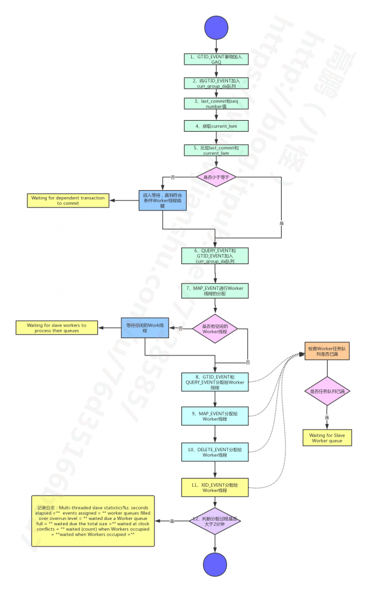
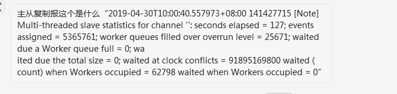
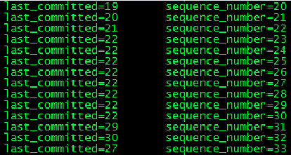

# 技术分享 | 从库 MTS 多线程并行回放（一）

**原文链接**: https://opensource.actionsky.com/20200219-mts/
**分类**: 技术干货
**发布时间**: 2020-02-19T02:11:42-08:00

---

> **作者：********高****鹏**
文章末尾有他著作的《深入理解 MySQL 主从原理 32 讲》，深入透彻理解 MySQL 主从，GTID 相关技术知识。
**本节包含分发调用流程请参考链接：**
**https://www.jianshu.com/p/8706d7422d89**
### 一、综述
### 与单 SQL 线程的回放不同，MTS 包含多个工作线程，原有的 SQL 线程蜕变为协调线程。SQL 协调线程同时还承担了检查点的工作。我们知道并行回放的方式有两种，包含 LOGICAL_CLOCK 和 DATABASE，体现在判定哪些事物能够并行回放的规则不同。实际上源码对应两个不同的类：
- Mts_submode_logical_clock
- Mts_submode_database
这里只准备讨论基于 LOGICAL_CLOCK 的并发方式，而不会讨论老的基于 DATABASE 的方式，下面是我设置的参数：
- slave_parallel_type：LOGICAL_CLOCK
- slave_parallel_workers ：4
注意 slave_parallel_workers 设置的是工作线程的个数，且不包协调线程，因此如果不想使用 MTS 应该将这个参数设置为 0，然后 ‘stop slave;start slave’ 才能生效。因为工作线程在启动的时候已经初始化完毕了。
因为我们知道在 5.7 中即便不开启 GTID 也包含的匿名的 GTID Event，它携带了 last commit 和 seq number，因此即便关闭 GTID 也可以使用 MTS，但是不建议后面第 26 节可以找到原因。
在前面我们讨论了 MySQL 层事务提交的流程和基于 WRITESET 的并行复制方式，我们总共提到了三种生成 last commit 和 seq number 的方式：
- ORDER_COMMIT
- WRITESET
- WRITESET_SESSION
它们控制的是生成 last commit 和 seq number 的规则。而从库只要将参数 slave_parallel_type 设置为 LOGICAL_CLOCK，其能否并行的依据就是 last commit 和 seq number。我们下面的描述还是以一个正常的 ‘Delete’ 语句删除一行数据的 Event 来描述，那么这个事物 Event 的顺序如下：
											
同时在此之前我们先来明确一下 MySQL 中持久化 MTS 信息的三个场所，因为和传统的单 SQL 线程的主从不同，MTS 需要存储更多的信息。注意我们只讨论 master_info_repository 和 relay_log_info_repository 为 TABLE 的情况，如下：
- slave_master_info 表：由 IO 线程进行更新，超过 sync_master_info 设置更新，单位 Event 个数。
- relay_log_info_repository 表：由 SQL 协调线程执行检查点的时候进行更新。
- slave_worker_info 表：由工作线程每次提交事务的时候更新。
更加详细的解释参考第 25 节，同时会解释为什么只考虑 master_info_repository 和 relay_log_info_repository 为 TABLE 的原因。
### 二、协调线程的分发机制
协调线程在 Event 的分发中主要完成下面两个工作：- 判定事务是否可以并行回放。
- 判定事务由哪一个工作线程进行回放。
和单 SQL 线程执行的流程不同，主要体现在函数 apply_event_and_update_pos 下面，对于单线程而言会完成 Event 的应用，而对用 MTS 而言就是只会完成 Event 的分发，具体的应用将会由工作线程完成。这里说一下简化的流程，具体函数调用参考笔记。下面是一张流程图：
											
### 三、步骤解析
下面对每一步进行解析如下：
（1）如果是 GTID_LOG_EVENT 代表事物开始，将本事物加入到 GAQ 队列中（下一节会详细描述 GAQ）。可参考函数 Log_event::get_slave_worker。
（2）将 GTID_LOG_EVENT 加入到 curr_group_da 队列中暂存。可参考函数 Log_event::get_slave_worker。
（3）获取 GTID_LOG_EVENT 中的 last commit 和 seq number 值。可参考函数 Mts_submode_logical_clock::schedule_next_event。
（4）获取 current_lwm 值，这个值代表的是所有在 GAQ 队列上还没有提交完成事务中最早的那个事务的前一个已经提交事务的 seq number，可能后面的事务已经提交完成了，听起来可能比较拗口但很重要，如果都提交完成了那么就是取最新提交的事务的 seq number，下面的图表达的就是这个意思，这个图是源码中的。这个值的获取可参考函数Mts_submode_logical_clock::get_lwm_timestamp。- `       the last time index containg lwm`
- `               +------+`
- `               | LWM  |`
- `               |  |   |`
- `               V  V   V`
- `GAQ:x  xoooooxxxxxXXXXX...X`
- `             ^   ^`
- `             |   | LWM+1（LWM代表的是检查点指向的位置）`
- `             |`
- `             + new current_lwm（这里就是current_lwm）`
- 
- `      <---- logical (commit) time ----`
- 
- `here `x' stands for committed, `X' for committed and discarded from`
- `the running range of the queue, `o' for not committed.`
我们可以先不看 LWM 部分，对于检查点的 LWM 后面在讨论。seq number 从右向左递增，在 GAQ 中实际上有三种值：- X：已经做了检查点，在 GAQ 中出队的事物。
- x：已经提交完成的事物。
- o：没有提交完成的事物。
我们可以看到我们需要获取的 current_lwm 并不是最新一次提交事物的 seq number 的值，而是最早未提交事物的前一个已经提交事物的 seq number。这一点很重要，因为理解后就会知道大事务是如何影响 MTS 的并行回放的，同时中间的 5 个 ‘o’ 实际上就是所谓的 ‘gap’，关于 ‘gap’ 下一节还会详细描述。
（5）将 GTID_LOG_EVENT 中的 last commit 和当前 current_lwm 进行比较。可以参考函数 Mts_submode_logical_clock::schedule_next_event。下面是大概的规则：
- 如果 last commit 小于等于 current_lwm 表示可以进行并行回放，继续。
- 如果 last commit 大于 current_lwm 则表示不能进行并行回放。这个时候协调线程就需要等待了，直到小于等于的条件成立。成立后协调线程会被工作线程唤醒。等待期间状态被置为 “Waiting for dependent transaction to commit”。
源码处也比较简单如下：
- `    longlong lwm_estimate= estimate_lwm_timestamp();`
- `//这个值 只有在 出现 下面等待的时候 才会设置 min_waited_timestamp ，`
- `//设置了min_waited_timestamp才会更新lwm_estimate`
- `    if (!clock_leq(last_committed, lwm_estimate) &&`
- `//  @return   true  when a "<=" b,false otherwise  last_committed<=lwm_estimate`
- `        rli->gaq->assigned_group_index != rli->gaq->entry)`
- `    {`
- `      if (wait_for_last_committed_trx(rli, last_committed, lwm_estimate))`
- `//等待上一次 组提交的完成 Waiting for dependent transaction to commit`
（6）如果是 QUERY_EVENT 则加入到 curr_group_da 队列中暂存。
（7）如果是 MAP_EVENT 进行工作线程的分配。参考函数 Mts_submode_logical_clock::get_least_occupied_worker，分配工作线程如下：
- 如果有空闲的工作线程则分配完成，继续。
- 如果没有空闲的工作线程则等待空闲的工作线程。这种情况下状态会置为 “Waiting for slave workers to process their queues”。
下面是分配的标准，其实也很简单：- `  for (Slave_worker **it= rli->workers.begin(); it != rli->workers.end(); ++it)`
- `  {`
- `    Slave_worker *w_i= *it;`
- `    if (w_i->jobs.len == 0)`
- `//任务队列为0表示本Worker线程空闲可以分配`
- `      return w_i;`
- `  }`
- `  return 0;`
（8）将 GTID_LOG_EVENT 和 QUERY_EVENT 分配给工作线程。可参考 append_item_to_jobs 函数。
前面工作线程已经分配了，这里就可以开始将 Event 分配给这个工作线程了。分配的时候需要检查工作线程的任务队列是否已满，如果满了需要等待，状态置为 “Waiting for Slave Worker queue”。因为分配的单位是 Event，对于一个事务而言可能包含很多 Event，如果工作线程应用的速度赶不上协调线程入队的速度，可能导致任务队列的积压，因此任务队列被占满是可能的。任务队列的大小为 16384 如下：- `mts_slave_worker_queue_len_max= 16384;`
下面是入队的部分代码：- `  while (worker->running_status == Slave_worker::RUNNING && !thd->killed &&`
- `         (ret= en_queue(&worker->jobs, job_item)) == -1)`
- `//如果已经满了`
- `  {`
- `    thd->ENTER_COND(&worker->jobs_cond, &worker->jobs_lock,`
- `                    &stage_slave_waiting_worker_queue, &old_stage);`
- `//标记等待状态`
- `    worker->jobs.overfill= TRUE;`
- `    worker->jobs.waited_overfill++;`
- `    rli->mts_wq_overfill_cnt++; //标记队列满的次数`
- `    mysql_cond_wait(&worker->jobs_cond, &worker->jobs_lock);`
- `//等待唤醒`
- `    mysql_mutex_unlock(&worker->jobs_lock);`
- `    thd->EXIT_COND(&old_stage);`
- `    mysql_mutex_lock(&worker->jobs_lock);`
- `  }`
（9）MAP_EVENT 分配给工作线程，同上。
（10）DELETE_EVENT 分配给工作线程，同上。
（11）XID_EVENT 分配给工作线程，但是这里还需要额外的处理，主要处理一些和检查点相关的信息，这里关注一点如下：- `ptr_group->checkpoint_log_name= my_strdup(key_memory_log_event,`
- `rli->get_group_master_log_name(), MYF(MY_WME));`
- `ptr_group->checkpoint_log_pos= rli->get_group_master_log_pos();`
- `ptr_group->checkpoint_relay_log_name=my_strdup(key_memory_log_event,`
- `rli->get_group_relay_log_name(), MYF(MY_WME));`
- `ptr_group->checkpoint_relay_log_pos= rli->get_group_relay_log_pos();`
- `ptr_group->ts= common_header->when.tv_sec + (time_t) exec_time;`
- `//Seconds_behind_master related .checkpoint`
- `//的时候会将这个值再次传递 mts_checkpoint_routine()`
- `ptr_group->checkpoint_seqno= rli->checkpoint_seqno;`
- `//获取seqno 这个值会在chkpt后减去偏移量`
如果检查点处于这个事务上，那么这些信息会出现在表 slave_worker_info 中，并且会出现在 show slave status 中。也就是说，show slave status 中很多信息是来自 MTS 的检查点。下一节将详细描述检查点。
（12）如果上面 Event 的分配过程大于 2 分钟（120 秒），可能会出现一个日志如下：
											
这个截图也是一个朋友问的问题。实际上这个日志可以算一个警告。实际上对应的源码为：
- `sql_print_information("Multi-threaded slave statistics%s: "`
- `                "seconds elapsed = %lu; "`
- `                "events assigned = %llu; "`
- `                "worker queues filled over overrun level = %lu; "`
- `                "waited due a Worker queue full = %lu; "`
- `                "waited due the total size = %lu; "`
- `                "waited at clock conflicts = %llu "`
- `                "waited (count) when Workers occupied = %lu "`
- `                "waited when Workers occupied = %llu",`
- `                rli->get_for_channel_str(),`
- `                static_cast<unsignedlong>`
- `                (my_now - rli->mts_last_online_stat),`
- `//消耗总时间 单位秒`
- `                rli->mts_events_assigned,`
- `//总的event分配的个数`
- `                rli->mts_wq_overrun_cnt,`
- `// worker线程分配队列大于 90%的次数 当前硬编码  14746`
- `                rli->mts_wq_overfill_cnt,`
- `//由于work 分配队列已满造成的等待次数 当前硬编码 16384`
- `                rli->wq_size_waits_cnt,`
- `//大Event的个数 一般不会存在`
- `                rli->mts_total_wait_overlap,`
- `//由于上一组并行有大事物没有提交导致不能分配worker线程的等待时间 单位纳秒`
- `                rli->mts_wq_no_underrun_cnt,`
- `//work线程由于没有空闲的而等待的次数`
- `                rli->mts_total_wait_worker_avail);`
- `//work线程由于没有空闲的而等待的时间   单位纳秒`
因为经常看到朋友问这里详细说明一下它们的含义，从前面的分析中我们一共看到三个等待点：
- “Waiting for dependent transaction to commit”
由于协调线程判定本事务由于 last commit 大于 current_lwm 因此不能并行回放，协调线程处于等待，大事务会加剧这种情况。
- “Waiting for slave workers to process their queues”由于没有空闲的工作线程，协调线程会等待。这种情况说明理论上的并行度是理想的，但是可能是参数 slave_parallel_workers 设置不够。当然设置工作线程的个数应该和服务器的配置和负载相结合考虑，因为第 29 节我们会看到线程是 CPU 调度最小的单位。
- “Waiting for Slave Worker queue”
由于工作线程的任务队列已满，协调线程会等待。这种情况前面说过是由于一个事务包含了过多的 Event 并且工作线程应用 Event 的速度赶不上协调线程分配 Event 的速度，导致了积压并且超过了 16384 个 Event。
另外实际上还有一种等待如下：“Waiting for Slave Workers to free pending events”：由所谓的 ‘big event’ 造成的，什么是 ‘big event’ 呢，源码中描述为：event size is greater than slave_pending_jobs_size_max but less than slave_max_allowed_packet。我个人认为出现的可能性不大，因此没做过多考虑。可以在函数 append_item_to_jobs 中找到答案。
我们下面对应日志中的输出进行详细解释，如下：
											
我们可以看到这个日志还是记录很全的，基本覆盖了前面我们讨论的全部可能性。那么我们再看看案例中的日志，waited at clock conflicts=91895169800 大约 91 秒。120 秒钟大约 91 秒都因为不能并行回放而造成的等待，很明显应该考虑是否有大事物的存在。
### 四、并行回放判定的列子
下面是我主库使用 WRITESET 方式生成的一段 binary log 片段，我们主要观察 lastcommit 和 seq number，通过分析来熟悉这种过程。
											
我们根据刚才说的并行判断规则，即：- 如果 last commit 小于等于 current_lwm 表示可以进行并行回放，继续。
- 如果 last commit 大于 current_lwm 则表示不能进行并行回放，需要等待。
**具体解析如下：**
（last commit：22 seq number：23）这个事务会在（last commit：21 seq number：22）事务执行完成后执行因为（last commit：22<= seq number：22），后面的事务直到（last_commit：22 seq number：30），实际上都可以并行执行，我们先假设他们都执行完成了。我们继续观察随后的三个事务如下：- last_committed：29 sequence_number：31
- last_committed：30 sequence_number：32
- last_committed：27 sequence_number：33
我们注意到到这是基于 WRITESET 的并行复制下明显的特征。last commit 可能比上一个事务更小，这就是我们前面说的根据 Writeset 的历史 MAP 信息计算出来的。因此还是根据上面的规则它们三个是可以并行执行的。因为很明显：
- last_committed：29 <= current_lwm：30
- last_committed：30 <= current_lwm：30
- last_committed：27 <= current_lwm：30
但是如果（last commit：22 seq number：30）这个事务之前有一个大事务没有执行完成的话，那么 current_lwm 的取值将不会是 30。比如（last commit：22 seq number：27）这个事务是大事务那么 current_lwm 将会标记为 26，上面的三个事务将会被堵塞，并且分配（last commit：29 seq number：31）的时候就已经堵塞了，原因如下：- last_committed：29 > current_lwm：26
- last_committed：30 > current_lwm：26
- last_committed：27 > current_lwm：26
我们再考虑一下基于 WRITESET 的并行复制下（last commit：27 seq number：33）这个事务，因为在我们并行规则下 last commit 越小获得并发的可能性越高。因此基于 WRITESET 的并行复制确实提高了从库回放的并行度，但正如[第 16 节《基于 WRITESET 的并行复制方式》](https://opensource.actionsky.com/20190902-mysql/)所讲主库会有一定的开销。
第 19 节结束。
最后推荐高鹏的专栏《深入理解 MySQL 主从原理 32 讲》，想要透彻了解学习 MySQL 主从原理的朋友不容错过。
作者微信：gp_22389860
