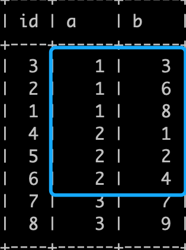

# 技术分享 | 优化案例

**原文链接**: https://opensource.actionsky.com/20201126-mysql/
**分类**: MySQL 新特性
**发布时间**: 2020-11-26T00:37:27-08:00

---

作者：杨奇龙
网名“北在南方”，目前任职于杭州有赞科技 DBA，主要负责数据库架构设计和运维平台开发工作，擅长数据库性能调优、故障诊断。
本文来源：原创投稿
*爱可生开源社区出品，原创内容未经授权不得随意使用，转载请联系小编并注明来源。
**前言**
在数据库表结构变更发布之前，我们会和开发沟通索引设计是否合理，发现部分开发同学对于索引设计还是有一些知识盲区。本文把常见的案例记录下来，做个分析，抛砖引玉。
**区分度和过滤性**
先看一段和开发同学日常 sql review 的对话：
											
上面的对话其实在工作中比较常见（同时也说明我们培训没有到位 T_T），这样的想法会导致开发忽略选择性比较低的字段，sql 的执行计划使用 using where 匹配更多的数据行，结果执行耗时比较，性能就不理想。
大部分开发会了解这样的《开发规范》：**创建索引要选择区分度高的字段**。他们会认为**区分度低的字段**不适合创建索引或者不适合添加到组合索引里面。但是这样的操作会导致很多慢查。举例来说：- 
`select  * from  tab where a=1 and b=2;`
场景 1 
符合 a=1 的记录数有 10w 条记录 ，b=2 有 1000 条记录。
如果只是创建 **idx_a(a)**，sql 请求通过索引 **idx_a** 访问 10w 条件记录，然后还要逐一匹配 10w 条记录中的 status，找到符合 b=2 的记录。这个动作会导致慢查。
如果创建组合索引 **idx_ab(a,b)**，sql 请求通过索引 **idx_ab** 可以直接定位到 1000 条记录，无需额外的过滤。这样减少访问 9900 条记录的时间，提升查询速度。
场景 2 
符合 a=1 的有 100 条记录，status=2 有 10 条记录。
其实场景 2 因为数据量比较少，直接访问 100 条记录和定位到 10 条记录的时间消耗相差不大，量变不足以引发质变，可以忽略了。
**Tips：**
1. 创建索引的目的是通过索引尽可能找到匹配 where 条件的行，减少不必要的回表，提高查询效率；
2. 需要辩证地看待区分度比较低的字段在组合索引中的作用。在组合索引的情况下，我们不能只是单纯地看字段的区分度，而是要看符合条件的记录数是多少。符合条件的记录越少，性能越好。
**索引的有序性**
在优化业务 sql 的过程中，经常发现开发将 order by 的字段添加到组合索引里面，但是依然有 **file sort** 产生，导致慢查。这是为什么呢？
**索引本身是有序的**，之所以产生 file sort 说明组合索引中存在字段在索引中存储的顺序和order by 字段的顺序不一致，不是严格正相关导致 MySQL 根据结果重新排序。
order by 语句利用索引的有序性是有比较高要求的，**组合索引中 order by 之前的字段必须是等值查询，不能是 in、between、<、> 等范围查询**，explain 的 type 是 range 的 sql 都会导致 order by 不能正常利用索引的有序性。
动手实践一下，初始化一张表 x- 
- 
`create table x(id int not null auto_increment primary key, a int ,b int,key idx(a,b));``insert into x(a,b) values(1,8),(1,6),(1,3),(2,1),(2,2),(2,4),(3,7),(3,9);`
**索引中存储的 (a,b) 顺序如下**
- 
- 
- 
- 
- 
- 
- 
- 
- 
- 
- 
- 
- 
`mysql>  select * from x order  by a, b; ``+----+------+------+``| id | a    | b    |``+----+------+------+``|  3 |    1 |    3 |``|  2 |    1 |    6 |``|  1 |    1 |    8 |``|  4 |    2 |    1 |``|  5 |    2 |    2 |``|  6 |    2 |    4 |``|  7 |    3 |    7 |``|  8 |    3 |    9 |``+----+------+------+``8 rows in set (0.00 sec)`对于组合索引 (a,b) 在 where 条件中 a=2使用等值查询，explain 的 extra 字段中提示 using index ，并无额外的排序。
- 
- 
- 
- 
- 
- 
- 
- 
- 
- 
- 
- 
- 
- 
- 
- 
- 
- 
- 
- 
- 
- 
- 
- 
`mysql> select * from x where a=2 order  by b;``+----+------+------+``| id | a    | b    |``+----+------+------+``|  4 |    2 |    1 |``|  5 |    2 |    2 |``|  6 |    2 |    4 |``+----+------+------+``3 rows in set (0.00 sec)``
``mysql> desc select * from x where a=2 order  by b \G``*************************** 1. row ***************************``           id: 1``  select_type: SIMPLE``        table: x``   partitions: NULL``         type: ref``possible_keys: idx``          key: idx``      key_len: 5``          ref: const``         rows: 3``     filtered: 100.00``        Extra: Using index``1 row in set, 1 warning (0.00 sec)`对于组合索引 (a,b) 在 where 条件中 a 使用范围查询，执行计划中出现 **using filesort** 排序。说明 order by b 并未利用索引的有序性，进行了额外的排序。
- 
- 
- 
- 
- 
- 
- 
- 
- 
- 
- 
- 
- 
- 
- 
- 
- 
- 
- 
- 
- 
- 
- 
- 
- 
- 
`mysql> select * from x where a>=1 and a<3 order  by b;``+----+------+------+``| id | a    | b    |``+----+------+------+``|  4 |    2 |    1 |``|  5 |    2 |    2 |``|  3 |    1 |    3 |``|  6 |    2 |    4 |``|  2 |    1 |    6 |``|  1 |    1 |    8 |``+----+------+------+``6 rows in set (0.00 sec)``
``mysql> desc select * from x where a>=1 and a<3 order  by b \G``*************************** 1. row ***************************``           id: 1``  select_type: SIMPLE``        table: x``   partitions: NULL``         type: range``possible_keys: idx``          key: idx``      key_len: 5``          ref: NULL``         rows: 6``     filtered: 100.00``        Extra: Using where; Using index; Using filesort``1 row in set, 1 warning (0.01 sec)`数据 a b 在索引中的顺序和实际访问的结果顺序不一致，需要额外的排序就产生了 file sort 。
(a,b) 字段在索引中存储的顺序如下图，明显和上面的查询条件的结果顺序不一致，就导致 sql 执行计划出现额外的排序，数据量比较大的情况（比如 5000 以上）下就出现慢查。
											
相关推荐：
[再说 order by 优化](https://mp.weixin.qq.com/s?__biz=MzI4NjExMDA4NQ==&mid=2648451556&idx=1&sn=ad0de1386b3b642ea17652753b0c7c7e&scene=21#wechat_redirect)