# 技术分享 | 关于 exec_time 的深入研究

**原文链接**: https://opensource.actionsky.com/210513-mysql/
**分类**: MySQL 新特性
**发布时间**: 2021-05-13T01:09:55-08:00

---

作者：赵黎明
爱可生 MySQL DBA 团队成员，熟悉 Oracle、MySQL 等数据库，擅长数据库性能问题诊断、事务与锁问题的分析等，负责处理客户 MySQL 及我司自研 DMP 平台日常运维中的问题，对开源数据库相关技术非常感兴趣。
本文来源：原创投稿
* 爱可生开源社区出品，原创内容未经授权不得随意使用，转载请联系小编并注明来源。
`    <section style="margin: 0px; padding: 8px 0px; max-width: 100%; font-family: -apple-system, BlinkMacSystemFont, "Helvetica Neue", "PingFang SC", "Hiragino Sans GB", "Microsoft YaHei UI", "Microsoft YaHei", Arial, sans-serif; letter-spacing: 0.544px; font-size: 16px; color: black; line-height: normal; overflow-wrap: break-word !important;">背景</section><section style="margin: 0px; padding: 8px 0px; max-width: 100%; font-family: -apple-system, BlinkMacSystemFont, "Helvetica Neue", "PingFang SC", "Hiragino Sans GB", "Microsoft YaHei UI", "Microsoft YaHei", Arial, sans-serif; letter-spacing: 0.544px; font-size: 16px; color: black; line-height: normal; overflow-wrap: break-word !important;">什么是 exec_time</section><section style="margin: 0px; padding: 8px 0px; max-width: 100%; font-family: -apple-system, BlinkMacSystemFont, "Helvetica Neue", "PingFang SC", "Hiragino Sans GB", "Microsoft YaHei UI", "Microsoft YaHei", Arial, sans-serif; letter-spacing: 0.544px; font-size: 16px; color: black; line-height: normal; overflow-wrap: break-word !important;">环境准备</section><ul style="margin: 8px 0px; padding: 0px 0px 0px 25px; max-width: 100%; font-family: -apple-system, BlinkMacSystemFont, "Helvetica Neue", "PingFang SC", "Hiragino Sans GB", "Microsoft YaHei UI", "Microsoft YaHei", Arial, sans-serif; font-size: 15.3px; letter-spacing: 0.544px; text-align: justify; color: black; overflow-wrap: break-word !important;"><li style="margin: 0px; padding: 0px; max-width: 100%; font-size: 12px; overflow-wrap: break-word !important;"><section style="margin: 5px 0px; padding: 0px; max-width: 100%; line-height: 26px; color: rgb(1, 1, 1); overflow-wrap: break-word !important;"><section style="margin: 0px; padding: 8px 0px; max-width: 100%; font-size: 16px; color: black; line-height: normal; text-align: left; overflow-wrap: break-word !important;">测试 1（binlog_format=row）</section></section></li><li style="margin: 0px; padding: 0px; max-width: 100%; font-size: 12px; overflow-wrap: break-word !important;"><section style="margin: 5px 0px; padding: 0px; max-width: 100%; line-height: 26px; color: rgb(1, 1, 1); overflow-wrap: break-word !important;"><section style="margin: 0px; padding: 8px 0px; max-width: 100%; font-size: 16px; color: black; line-height: normal; text-align: left; overflow-wrap: break-word !important;">结论 1</section></section></li><li style="margin: 0px; padding: 0px; max-width: 100%; font-size: 12px; overflow-wrap: break-word !important;"><section style="margin: 5px 0px; padding: 0px; max-width: 100%; line-height: 26px; color: rgb(1, 1, 1); overflow-wrap: break-word !important;"><section style="margin: 0px; padding: 8px 0px; max-width: 100%; font-size: 16px; color: black; line-height: normal; text-align: left; overflow-wrap: break-word !important;">注意事项 1</section></section></li><li style="margin: 0px; padding: 0px; max-width: 100%; font-size: 12px; overflow-wrap: break-word !important;"><section style="margin: 5px 0px; padding: 0px; max-width: 100%; line-height: 26px; color: rgb(1, 1, 1); overflow-wrap: break-word !important;"><section style="margin: 0px; padding: 8px 0px; max-width: 100%; font-size: 16px; color: black; line-height: normal; text-align: left; overflow-wrap: break-word !important;">测试 2（binlog_format=statement）</section></section></li><li style="margin: 0px; padding: 0px; max-width: 100%; font-size: 12px; overflow-wrap: break-word !important;"><section style="margin: 5px 0px; padding: 0px; max-width: 100%; line-height: 26px; color: rgb(1, 1, 1); overflow-wrap: break-word !important;"><section style="margin: 0px; padding: 8px 0px; max-width: 100%; font-size: 16px; color: black; line-height: normal; text-align: left; overflow-wrap: break-word !important;">结论 2</section></section></li><li style="margin: 0px; padding: 0px; max-width: 100%; font-size: 12px; overflow-wrap: break-word !important;"><section style="margin: 5px 0px; padding: 0px; max-width: 100%; line-height: 26px; color: rgb(1, 1, 1); overflow-wrap: break-word !important;"><section style="margin: 0px; padding: 8px 0px; max-width: 100%; font-size: 16px; color: black; line-height: normal; text-align: left; overflow-wrap: break-word !important;">注意事项 2</section></section></li></ul><section style="margin: 0px; padding: 8px 0px; max-width: 100%; font-family: -apple-system, BlinkMacSystemFont, "Helvetica Neue", "PingFang SC", "Hiragino Sans GB", "Microsoft YaHei UI", "Microsoft YaHei", Arial, sans-serif; letter-spacing: 0.544px; font-size: 16px; color: black; line-height: normal; overflow-wrap: break-word !important;">原理分析</section><section style="margin: 0px; padding: 8px 0px; max-width: 100%; font-family: -apple-system, BlinkMacSystemFont, "Helvetica Neue", "PingFang SC", "Hiragino Sans GB", "Microsoft YaHei UI", "Microsoft YaHei", Arial, sans-serif; letter-spacing: 0.544px; font-size: 16px; color: black; line-height: normal; overflow-wrap: break-word !important;">故障案例</section><section style="margin: 0px; padding: 8px 0px; max-width: 100%; font-family: -apple-system, BlinkMacSystemFont, "Helvetica Neue", "PingFang SC", "Hiragino Sans GB", "Microsoft YaHei UI", "Microsoft YaHei", Arial, sans-serif; letter-spacing: 0.544px; font-size: 16px; color: black; line-height: normal; overflow-wrap: break-word !important;">故障模拟</section><ul style="margin: 8px 0px; padding: 0px 0px 0px 25px; max-width: 100%; font-family: -apple-system, BlinkMacSystemFont, "Helvetica Neue", "PingFang SC", "Hiragino Sans GB", "Microsoft YaHei UI", "Microsoft YaHei", Arial, sans-serif; font-size: 15.3px; letter-spacing: 0.544px; text-align: justify; color: black; overflow-wrap: break-word !important;"><li style="margin: 0px; padding: 0px; max-width: 100%; font-size: 12px; overflow-wrap: break-word !important;"><section style="margin: 5px 0px; padding: 0px; max-width: 100%; line-height: 26px; color: rgb(1, 1, 1); overflow-wrap: break-word !important;"><section style="margin: 0px; padding: 8px 0px; max-width: 100%; font-size: 16px; color: black; line-height: normal; text-align: left; overflow-wrap: break-word !important;">测试 1：模拟磁盘 IO 瓶颈的场景</section></section></li><li style="margin: 0px; padding: 0px; max-width: 100%; font-size: 12px; overflow-wrap: break-word !important;"><section style="margin: 5px 0px; padding: 0px; max-width: 100%; line-height: 26px; color: rgb(1, 1, 1); overflow-wrap: break-word !important;"><section style="margin: 0px; padding: 8px 0px; max-width: 100%; font-size: 16px; color: black; line-height: normal; text-align: left; overflow-wrap: break-word !important;">测试 2：模拟 CPU 瓶颈的场景</section></section></li><li style="margin: 0px; padding: 0px; max-width: 100%; font-size: 12px; overflow-wrap: break-word !important;"><section style="margin: 5px 0px; padding: 0px; max-width: 100%; line-height: 26px; color: rgb(1, 1, 1); overflow-wrap: break-word !important;"><section style="margin: 0px; padding: 8px 0px; max-width: 100%; font-size: 16px; color: black; line-height: normal; text-align: left; overflow-wrap: break-word !important;">测试 3：模拟网络延迟的场景</section></section></li></ul><section style="margin: 0px; padding: 8px 0px; max-width: 100%; font-family: -apple-system, BlinkMacSystemFont, "Helvetica Neue", "PingFang SC", "Hiragino Sans GB", "Microsoft YaHei UI", "Microsoft YaHei", Arial, sans-serif; letter-spacing: 0.544px; font-size: 16px; color: black; line-height: normal; overflow-wrap: break-word !important;">总结</section><section style="margin: 0px; padding: 8px 0px; max-width: 100%; font-family: -apple-system, BlinkMacSystemFont, "Helvetica Neue", "PingFang SC", "Hiragino Sans GB", "Microsoft YaHei UI", "Microsoft YaHei", Arial, sans-serif; letter-spacing: 0.544px; font-size: 16px; color: black; line-height: normal; overflow-wrap: break-word !important;">参考文档</section><h2 data-tool="mdnice编辑器" style="margin-top: 25px; margin-bottom: 5px; padding: 0px; font-weight: bold; font-size: 22px; max-width: 100%; color: rgb(51, 51, 51); font-family: -apple-system, BlinkMacSystemFont, "Helvetica Neue", "PingFang SC", "Hiragino Sans GB", "Microsoft YaHei UI", "Microsoft YaHei", Arial, sans-serif; letter-spacing: 0.544px; overflow-wrap: break-word !important;">背景<br style="margin: 0px; padding: 0px; max-width: 100%; overflow-wrap: break-word !important;"></h2><p data-tool="mdnice编辑器" style="margin-bottom: 0px; padding: 8px 0px; max-width: 100%; clear: both; min-height: 1em; color: rgb(51, 51, 51); font-family: -apple-system, BlinkMacSystemFont, "Helvetica Neue", "PingFang SC", "Hiragino Sans GB", "Microsoft YaHei UI", "Microsoft YaHei", Arial, sans-serif; font-size: 17px; letter-spacing: 0.544px; line-height: 26px; overflow-wrap: break-word !important;">最近在处理某客户的 MySQL 数据库主从延迟问题时，发现了一个与 exec_time 有关的奇怪现象，于是抽空做了一些测试，借此文分享一些心得。</p><section style="margin: 25px 0px 5px; padding: 8px 0px; max-width: 100%; color: rgb(51, 51, 51); font-family: -apple-system, BlinkMacSystemFont, "Helvetica Neue", "PingFang SC", "Hiragino Sans GB", "Microsoft YaHei UI", "Microsoft YaHei", Arial, sans-serif; font-size: 17px; letter-spacing: 0.544px; line-height: 26px; overflow-wrap: break-word !important;">什么是 exec_time<br style="margin: 0px; padding: 0px; max-width: 100%; overflow-wrap: break-word !important;"></section><p data-tool="mdnice编辑器" style="margin-bottom: 0px; padding: 8px 0px; max-width: 100%; clear: both; min-height: 1em; color: rgb(51, 51, 51); font-family: -apple-system, BlinkMacSystemFont, "Helvetica Neue", "PingFang SC", "Hiragino Sans GB", "Microsoft YaHei UI", "Microsoft YaHei", Arial, sans-serif; font-size: 17px; letter-spacing: 0.544px; line-height: 26px; overflow-wrap: break-word !important;">此处的 exec_time 是指 binlog 中记录的值，顾名思义，它是一个执行时间，那它是关于什么的呢？单个语句，整个事务，或是其他？我们先来做几个测试。</p><section style="margin: 25px 0px 5px; padding: 8px 0px; max-width: 100%; color: rgb(51, 51, 51); font-family: -apple-system, BlinkMacSystemFont, "Helvetica Neue", "PingFang SC", "Hiragino Sans GB", "Microsoft YaHei UI", "Microsoft YaHei", Arial, sans-serif; font-size: 17px; letter-spacing: 0.544px; line-height: 26px; overflow-wrap: break-word !important;">环境准备<br style="margin: 0px; padding: 0px; max-width: 100%; overflow-wrap: break-word !important;"></section><ul data-tool="mdnice编辑器" style="margin: 8px 0px; padding: 0px 0px 0px 25px; max-width: 100%; color: rgb(51, 51, 51); font-family: -apple-system, BlinkMacSystemFont, "Helvetica Neue", "PingFang SC", "Hiragino Sans GB", "Microsoft YaHei UI", "Microsoft YaHei", Arial, sans-serif; font-size: 17px; letter-spacing: 0.544px; text-align: justify; overflow-wrap: break-word !important;"><li style="margin: 0px; padding: 0px; max-width: 100%; font-size: 14px; overflow-wrap: break-word !important;"><section style="margin: 5px 0px; padding: 0px; max-width: 100%; line-height: 26px; color: rgb(1, 1, 1); text-align: left; overflow-wrap: break-word !important;">环境信息</section></li></ul><section data-tool="mdnice编辑器" style="margin: 0px; padding: 0px; max-width: 100%; color: rgb(51, 51, 51); font-family: -apple-system, BlinkMacSystemFont, "Helvetica Neue", "PingFang SC", "Hiragino Sans GB", "Microsoft YaHei UI", "Microsoft YaHei", Arial, sans-serif; font-size: 17px; letter-spacing: 0.544px; text-align: justify; overflow-x: auto; overflow-wrap: break-word !important;"><table style="margin: 0px 0px 10px; padding: 0px; width: 677px; max-width: 100%; overflow-wrap: break-word !important;"><thead style="margin: 0px; padding: 0px; max-width: 100%; overflow-wrap: break-word !important;"><tr style="margin: 0px; padding: 0px; max-width: 100%; border-width: 1px 0px 0px; border-right-style: initial; border-bottom-style: initial; border-left-style: initial; border-right-color: initial; border-bottom-color: initial; border-left-color: initial; border-top-style: solid; border-top-color: rgb(204, 204, 204); overflow-wrap: break-word !important;"><th style="margin: 0px; padding: 5px 10px; word-break: break-all; hyphens: auto; border-top: 1px solid rgb(204, 204, 204); border-right: 1px solid rgb(204, 204, 204); border-left: 1px solid rgb(204, 204, 204); border-bottom-style: solid; border-bottom-color: rgb(204, 204, 204); border-image: initial; background: rgb(240, 240, 240); max-width: 100%; min-width: 85px; overflow-wrap: break-word !important;">角色</th><th style="margin: 0px; padding: 5px 10px; word-break: break-all; hyphens: auto; border-top: 1px solid rgb(204, 204, 204); border-right: 1px solid rgb(204, 204, 204); border-left: 1px solid rgb(204, 204, 204); border-bottom-style: solid; border-bottom-color: rgb(204, 204, 204); border-image: initial; background: rgb(240, 240, 240); max-width: 100%; min-width: 85px; overflow-wrap: break-word !important;">主机/IP</th><th style="margin: 0px; padding: 5px 10px; word-break: break-all; hyphens: auto; border-top: 1px solid rgb(204, 204, 204); border-right: 1px solid rgb(204, 204, 204); border-left: 1px solid rgb(204, 204, 204); border-bottom-style: solid; border-bottom-color: rgb(204, 204, 204); border-image: initial; background: rgb(240, 240, 240); max-width: 100%; min-width: 85px; overflow-wrap: break-word !important;">数据库版本</th></tr></thead><tbody style="margin: 0px; padding: 0px; max-width: 100%; border-width: 0px; border-style: initial; border-color: initial; overflow-wrap: break-word !important;"><tr style="margin: 0px; padding: 0px; max-width: 100%; border-width: 1px 0px 0px; border-right-style: initial; border-bottom-style: initial; border-left-style: initial; border-right-color: initial; border-bottom-color: initial; border-left-color: initial; border-top-style: solid; border-top-color: rgb(204, 204, 204); overflow-wrap: break-word !important;"><td style="margin: 0px; padding: 5px 10px; word-break: break-all; hyphens: auto; border: 1px solid rgb(204, 204, 204); max-width: 100%; min-width: 85px; overflow-wrap: break-word !important;">主库</td><td style="margin: 0px; padding: 5px 10px; word-break: break-all; hyphens: auto; border: 1px solid rgb(204, 204, 204); max-width: 100%; min-width: 85px; overflow-wrap: break-word !important;">10.186.60.62</td><td style="margin: 0px; padding: 5px 10px; word-break: break-all; hyphens: auto; border: 1px solid rgb(204, 204, 204); max-width: 100%; min-width: 85px; overflow-wrap: break-word !important;">MySQL 5.7.32</td></tr><tr style="margin: 0px; padding: 0px; max-width: 100%; border-top: 1px solid rgb(204, 204, 204); border-right: 0px; border-left: 0px; background-color: rgb(248, 248, 248); overflow-wrap: break-word !important;"><td style="margin: 0px; padding: 5px 10px; word-break: break-all; hyphens: auto; border: 1px solid rgb(204, 204, 204); max-width: 100%; min-width: 85px; overflow-wrap: break-word !important;">从库</td><td style="margin: 0px; padding: 5px 10px; word-break: break-all; hyphens: auto; border: 1px solid rgb(204, 204, 204); max-width: 100%; min-width: 85px; overflow-wrap: break-word !important;">10.186.60.68</td><td style="margin: 0px; padding: 5px 10px; word-break: break-all; hyphens: auto; border: 1px solid rgb(204, 204, 204); max-width: 100%; min-width: 85px; overflow-wrap: break-word !important;">MySQL 5.7.32</td></tr></tbody></table></section><ul data-tool="mdnice编辑器" style="margin: 8px 0px; padding: 0px 0px 0px 25px; max-width: 100%; color: rgb(51, 51, 51); font-family: -apple-system, BlinkMacSystemFont, "Helvetica Neue", "PingFang SC", "Hiragino Sans GB", "Microsoft YaHei UI", "Microsoft YaHei", Arial, sans-serif; font-size: 17px; letter-spacing: 0.544px; text-align: justify; overflow-wrap: break-word !important;"><li style="margin: 0px; padding: 0px; max-width: 100%; font-size: 14px; overflow-wrap: break-word !important;"><section style="margin: 5px 0px; padding: 0px; max-width: 100%; line-height: 26px; color: rgb(1, 1, 1); text-align: left; overflow-wrap: break-word !important;">测试表</section></li></ul><pre data-tool="mdnice编辑器" style="margin-top: 10px; margin-bottom: 10px; padding: 0px; max-width: 100%; font-size: 17px; letter-spacing: 0.544px; text-align: justify; background-color: rgb(255, 255, 255); border-radius: 5px; box-shadow: rgba(0, 0, 0, 0.55) 0px 2px 10px;"><code>zlm@10.186.60.62 [zlm]> show create table tG
*************************** 1. row ***************************
Table: t
Create Table: CREATE TABLE `t` (
`id` int(11) NOT NULL AUTO_INCREMENT,
PRIMARY KEY (`id`)
) ENGINE=InnoDB DEFAULT CHARSET=utf8
1 row in set (0.00 sec)
zlm@10.186.60.62 [zlm]> select * from t;
Empty set (0.01 sec)</code></pre><h4 data-tool="mdnice编辑器" style="margin-top: 30px; padding: 0px; font-weight: bold; font-size: 18px; max-width: 100%; color: rgb(51, 51, 51); font-family: -apple-system, BlinkMacSystemFont, "Helvetica Neue", "PingFang SC", "Hiragino Sans GB", "Microsoft YaHei UI", "Microsoft YaHei", Arial, sans-serif; letter-spacing: 0.544px; overflow-wrap: break-word !important;">测试 1（binlog_format=row）</h4><p data-tool="mdnice编辑器" style="margin-bottom: 0px; padding: 8px 0px; max-width: 100%; clear: both; min-height: 1em; color: rgb(51, 51, 51); font-family: -apple-system, BlinkMacSystemFont, "Helvetica Neue", "PingFang SC", "Hiragino Sans GB", "Microsoft YaHei UI", "Microsoft YaHei", Arial, sans-serif; font-size: 17px; letter-spacing: 0.544px; line-height: 26px; overflow-wrap: break-word !important;">提交一个事务，其中包含 2 个 insert 语句（GTID=xxxx:1）</p><pre data-tool="mdnice编辑器" style="margin-top: 10px; margin-bottom: 10px; padding: 0px; max-width: 100%; font-size: 17px; letter-spacing: 0.544px; text-align: justify; background-color: rgb(255, 255, 255); border-radius: 5px; box-shadow: rgba(0, 0, 0, 0.55) 0px 2px 10px;"><code>zlm@10.186.60.62 [zlm]> select @@binlog_format;
+-----------------+
| @@binlog_format |
+-----------------+
| ROW |
+-----------------+
1 row in set (0.00 sec)
zlm@10.186.60.62 [zlm]> begin;insert into t values(sleep(5));insert
into t values(sleep(10));commit;
Query OK, 0 rows affected (0.00 sec)
Query OK, 1 row affected (5.04 sec)
Query OK, 1 row affected (10.00 sec)
Query OK, 0 rows affected (0.00 sec)
zlm@10.186.60.62 [zlm]>
</code></pre><ul data-tool="mdnice编辑器" style="margin: 8px 0px; padding: 0px 0px 0px 25px; max-width: 100%; color: rgb(51, 51, 51); font-family: -apple-system, BlinkMacSystemFont, "Helvetica Neue", "PingFang SC", "Hiragino Sans GB", "Microsoft YaHei UI", "Microsoft YaHei", Arial, sans-serif; font-size: 17px; letter-spacing: 0.544px; text-align: justify; overflow-wrap: break-word !important;"><li style="margin: 0px; padding: 0px; max-width: 100%; font-size: 14px; overflow-wrap: break-word !important;"><section style="margin: 5px 0px; padding: 0px; max-width: 100%; line-height: 26px; color: rgb(1, 1, 1); text-align: left; overflow-wrap: break-word !important;">主库 binlog</section></li></ul>     
                                         
                                         
<p data-tool="mdnice编辑器" style="margin-bottom: 0px; padding: 8px 0px; max-width: 100%; clear: both; min-height: 1em; color: rgb(51, 51, 51); font-family: -apple-system, BlinkMacSystemFont, "Helvetica Neue", "PingFang SC", "Hiragino Sans GB", "Microsoft YaHei UI", "Microsoft YaHei", Arial, sans-serif; font-size: 17px; letter-spacing: 0.544px; line-height: 26px; overflow-wrap: break-word !important;">主库 exec_time 记录了 6s，略大于第一个 insert 语句的 5.04s，整个事务执行了 16s（15:57:00 开始，15:57:16 结束）。主库上的这个 exec_time 显然不能代表整个事务执行时间了，那从库上呢？</p><ul data-tool="mdnice编辑器" style="margin: 8px 0px; padding: 0px 0px 0px 25px; max-width: 100%; color: rgb(51, 51, 51); font-family: -apple-system, BlinkMacSystemFont, "Helvetica Neue", "PingFang SC", "Hiragino Sans GB", "Microsoft YaHei UI", "Microsoft YaHei", Arial, sans-serif; font-size: 17px; letter-spacing: 0.544px; text-align: justify; overflow-wrap: break-word !important;"><li style="margin: 0px; padding: 0px; max-width: 100%; font-size: 14px; overflow-wrap: break-word !important;"><section style="margin: 5px 0px; padding: 0px; max-width: 100%; line-height: 26px; color: rgb(1, 1, 1); text-align: left; overflow-wrap: break-word !important;">从库 binlog</section></li></ul>        
                                         
<p data-tool="mdnice编辑器" style="margin-bottom: 0px; padding: 8px 0px; max-width: 100%; clear: both; min-height: 1em; color: rgb(51, 51, 51); font-family: -apple-system, BlinkMacSystemFont, "Helvetica Neue", "PingFang SC", "Hiragino Sans GB", "Microsoft YaHei UI", "Microsoft YaHei", Arial, sans-serif; font-size: 17px; letter-spacing: 0.544px; line-height: 26px; overflow-wrap: break-word !important;">从库 exec_time 记录了 16s，与主库整个事务执行耗时“正好”相同，那我们能否用这个值来判断一个事务执行多久呢？</p><ul data-tool="mdnice编辑器" style="margin: 8px 0px; padding: 0px 0px 0px 25px; max-width: 100%; color: rgb(51, 51, 51); font-family: -apple-system, BlinkMacSystemFont, "Helvetica Neue", "PingFang SC", "Hiragino Sans GB", "Microsoft YaHei UI", "Microsoft YaHei", Arial, sans-serif; font-size: 17px; letter-spacing: 0.544px; text-align: justify; overflow-wrap: break-word !important;"><li style="margin: 0px; padding: 0px; max-width: 100%; font-size: 14px; overflow-wrap: break-word !important;"><section style="margin: 5px 0px; padding: 0px; max-width: 100%; line-height: 26px; color: rgb(1, 1, 1); text-align: left; overflow-wrap: break-word !important;">换一个写法，加 2 个 select 语句来延长事务提交时间（GTID=xxxx:2）</section></li></ul><pre data-tool="mdnice编辑器" style="margin-top: 10px; margin-bottom: 10px; padding: 0px; max-width: 100%; font-size: 17px; letter-spacing: 0.544px; text-align: justify; background-color: rgb(255, 255, 255); border-radius: 5px; box-shadow: rgba(0, 0, 0, 0.55) 0px 2px 10px;"><code>-- 这里模拟一个1064语法错误，让第2个select消耗的时间不被记录到事务中
zlm@10.186.60.62 [zlm]> begin;insert into t values(null);select
sleep(10);insert into t values(null);select sleep(5));commit;
Query OK, 0 rows affected (0.00 sec)
Query OK, 1 row affected (0.03 sec)
+-----------+
| sleep(10) |
+-----------+
| 0 |
+-----------+
1 row in set (10.01 sec)
Query OK, 1 row affected (0.00 sec)
ERROR 1064 (42000): You have an error in your SQL syntax; check the manual that corresponds to your MySQL server version for the right syntax to use near ')' at line 1
Query OK, 0 rows affected (0.00 sec)
-- 事务中的第2个select语句执行失败并不影响整个事务的提交
zlm@10.186.60.62 [zlm]> select * from t;
+----+
| id |
+----+
| 1 |
| 2 |
| 3 |
| 4 |
+----+
4 rows in set (0.00 sec)
</code></pre><ul data-tool="mdnice编辑器" style="margin: 8px 0px; padding: 0px 0px 0px 25px; max-width: 100%; color: rgb(51, 51, 51); font-family: -apple-system, BlinkMacSystemFont, "Helvetica Neue", "PingFang SC", "Hiragino Sans GB", "Microsoft YaHei UI", "Microsoft YaHei", Arial, sans-serif; font-size: 17px; letter-spacing: 0.544px; text-align: justify; overflow-wrap: break-word !important;"><li style="margin: 0px; padding: 0px; max-width: 100%; font-size: 14px; overflow-wrap: break-word !important;"><section style="margin: 5px 0px; padding: 0px; max-width: 100%; line-height: 26px; color: rgb(1, 1, 1); text-align: left; overflow-wrap: break-word !important;">主库 binlog</section></li></ul>      
                                         
                                           
<p data-tool="mdnice编辑器" style="margin-bottom: 0px; padding: 8px 0px; max-width: 100%; clear: both; min-height: 1em; color: rgb(51, 51, 51); font-family: -apple-system, BlinkMacSystemFont, "Helvetica Neue", "PingFang SC", "Hiragino Sans GB", "Microsoft YaHei UI", "Microsoft YaHei", Arial, sans-serif; font-size: 17px; letter-spacing: 0.544px; line-height: 26px; overflow-wrap: break-word !important;">由于第一个 insert 语句中没有延时函数，执行了 0.03s，exec_time 记录了 0s（与第一个 SQL 时间近似相等），而 select sleep()；不是事务 SQL，不会被记录到 binlog 中（select 放到 insert 前面执行，结果也是如此，感兴趣的朋友可以自行测试一下）。整个事务执行时间为 10s（16:05:51 开始，16:06:01 结束），其中包含了 2 个 insert 语句和第一个 select 语句总的执行时间。</p><ul data-tool="mdnice编辑器" style="margin: 8px 0px; padding: 0px 0px 0px 25px; max-width: 100%; color: rgb(51, 51, 51); font-family: -apple-system, BlinkMacSystemFont, "Helvetica Neue", "PingFang SC", "Hiragino Sans GB", "Microsoft YaHei UI", "Microsoft YaHei", Arial, sans-serif; font-size: 17px; letter-spacing: 0.544px; text-align: justify; overflow-wrap: break-word !important;"><li style="margin: 0px; padding: 0px; max-width: 100%; font-size: 14px; overflow-wrap: break-word !important;"><section style="margin: 5px 0px; padding: 0px; max-width: 100%; line-height: 26px; color: rgb(1, 1, 1); text-align: left; overflow-wrap: break-word !important;">从库 binlog</section></li></ul>       
                                         
这次从库 binlog 中记录的 exec_time 少了 5s，为什么？因为主库执行整个事务耗时为 10s，第二个 select 消耗的 5s 并没有执行。这样看来，似乎从库 binlog 中 exec_time 记录的就是主库对应事务的执行时间？<br></p><h4 data-tool="mdnice编辑器" style="margin-top: 30px; padding: 0px; font-weight: bold; font-size: 18px; max-width: 100%; color: rgb(51, 51, 51); font-family: -apple-system, BlinkMacSystemFont, "Helvetica Neue", "PingFang SC", "Hiragino Sans GB", "Microsoft YaHei UI", "Microsoft YaHei", Arial, sans-serif; letter-spacing: 0.544px; overflow-wrap: break-word !important;">结论 1</h4><ul data-tool="mdnice编辑器" style="margin: 8px 0px; padding: 0px 0px 0px 25px; max-width: 100%; color: rgb(51, 51, 51); font-family: -apple-system, BlinkMacSystemFont, "Helvetica Neue", "PingFang SC", "Hiragino Sans GB", "Microsoft YaHei UI", "Microsoft YaHei", Arial, sans-serif; font-size: 17px; letter-spacing: 0.544px; text-align: justify; overflow-wrap: break-word !important;"><li style="margin: 0px; padding: 0px; max-width: 100%; font-size: 14px; overflow-wrap: break-word !important;"><section style="margin: 5px 0px; padding: 0px; max-width: 100%; line-height: 26px; color: rgb(1, 1, 1); overflow-wrap: break-word !important;"><p style="margin-bottom: 0px; padding: 8px 0px; max-width: 100%; clear: both; min-height: 1em; line-height: 26px; color: black; text-align: left; overflow-wrap: break-word !important;">binlog_format=row 的情况下，对于同一个事务，exec_time 只记录一次。</p></section></li><li style="margin: 0px; padding: 0px; max-width: 100%; font-size: 14px; overflow-wrap: break-word !important;"><section style="margin: 5px 0px; padding: 0px; max-width: 100%; line-height: 26px; color: rgb(1, 1, 1); overflow-wrap: break-word !important;"><p style="margin-bottom: 0px; padding: 8px 0px; max-width: 100%; clear: both; min-height: 1em; line-height: 26px; color: black; text-align: left; overflow-wrap: break-word !important;">主库 binlog 中的 exec_time 近似等于事务中第一个语句的执行时间（第一个 insert 执行了 5.04s，记录的是 6s；第二个 insert 执行了 0.03s，记录的是 0s，但不包括select）。</p></section></li><li style="margin: 0px; padding: 0px; max-width: 100%; font-size: 14px; overflow-wrap: break-word !important;"><section style="margin: 5px 0px; padding: 0px; max-width: 100%; line-height: 26px; color: rgb(1, 1, 1); overflow-wrap: break-word !important;"><p style="margin-bottom: 0px; padding: 8px 0px; max-width: 100%; clear: both; min-height: 1em; line-height: 26px; color: black; text-align: left; overflow-wrap: break-word !important;">从库 binlog 中的 exec_time 近似等于整个事务的执行时间（事务 2 的第二个 select 的 5s 没有被记录到事务中）。</p></section></li></ul><h4 data-tool="mdnice编辑器" style="margin-top: 30px; padding: 0px; font-weight: bold; font-size: 18px; max-width: 100%; color: rgb(51, 51, 51); font-family: -apple-system, BlinkMacSystemFont, "Helvetica Neue", "PingFang SC", "Hiragino Sans GB", "Microsoft YaHei UI", "Microsoft YaHei", Arial, sans-serif; letter-spacing: 0.544px; overflow-wrap: break-word !important;">注意事项 1</h4><ul data-tool="mdnice编辑器" style="margin: 8px 0px; padding: 0px 0px 0px 25px; max-width: 100%; color: rgb(51, 51, 51); font-family: -apple-system, BlinkMacSystemFont, "Helvetica Neue", "PingFang SC", "Hiragino Sans GB", "Microsoft YaHei UI", "Microsoft YaHei", Arial, sans-serif; font-size: 17px; letter-spacing: 0.544px; text-align: justify; overflow-wrap: break-word !important;"><li style="margin: 0px; padding: 0px; max-width: 100%; font-size: 14px; overflow-wrap: break-word !important;"><section style="margin: 5px 0px; padding: 0px; max-width: 100%; line-height: 26px; color: rgb(1, 1, 1); text-align: left; overflow-wrap: break-word !important;">如果要在 binlog 中记录完整 SQL，在 row 模式下，需要主库设置参数 binlog_rows_query_log_events=1，建议开启该参数，有助于在故障排查时能快速找到相关业务 SQL，从而能定位到具体的功能模块，做进一步的故障分析。</section></li></ul><h4 data-tool="mdnice编辑器" style="margin-top: 30px; padding: 0px; font-weight: bold; font-size: 18px; max-width: 100%; color: rgb(51, 51, 51); font-family: -apple-system, BlinkMacSystemFont, "Helvetica Neue", "PingFang SC", "Hiragino Sans GB", "Microsoft YaHei UI", "Microsoft YaHei", Arial, sans-serif; letter-spacing: 0.544px; overflow-wrap: break-word !important;">测试 2（binlog_format=statement）</h4>
`
```
- 提交一个事务，其中包含2个insert语句（insert语句位置互换，GTID=xxxx:3）
zlm@10.186.60.62 [zlm]> set @@session.binlog_format=statement;
Query OK, 0 rows affected (0.00 sec)
zlm@10.186.60.62 [zlm]> select @@session.binlog_format;
+-------------------------+
| @@session.binlog_format |
+-------------------------+
| STATEMENT |
+-------------------------+
1 row in set (0.00 sec)
zlm@10.186.60.62 [zlm]> begin;insert into t values(sleep(10));insert into t values(sleep(5));commit;
Query OK, 0 rows affected (0.00 sec)
Query OK, 1 row affected, 1 warning (10.01 sec)
Query OK, 1 row affected, 1 warning (5.01 sec)
Query OK, 0 rows affected (0.00 sec)
zlm@10.186.60.62 [zlm]>
```
- 
主库 binlog
```
                                         
<p data-tool="mdnice编辑器" style="margin-bottom: 0px; padding: 8px 0px; max-width: 100%; clear: both; min-height: 1em; color: rgb(51, 51, 51); font-family: -apple-system, BlinkMacSystemFont, "Helvetica Neue", "PingFang SC", "Hiragino Sans GB", "Microsoft YaHei UI", "Microsoft YaHei", Arial, sans-serif; font-size: 17px; letter-spacing: 0.544px; line-height: 26px; overflow-wrap: break-word !important;">交换 insert 顺序以后，begin 语句的 exec_time 与第一个 insert 语句的执行时间一致，为 10s。整个事务执行了 15s（16:27:53 开始，16:28:08 结束）。exect_time 被记录了 3 次，分别为 10s、10s、5s。</p><ul data-tool="mdnice编辑器" style="margin: 8px 0px; padding: 0px 0px 0px 25px; max-width: 100%; color: rgb(51, 51, 51); font-family: -apple-system, BlinkMacSystemFont, "Helvetica Neue", "PingFang SC", "Hiragino Sans GB", "Microsoft YaHei UI", "Microsoft YaHei", Arial, sans-serif; font-size: 17px; letter-spacing: 0.544px; text-align: justify; overflow-wrap: break-word !important;"><li style="margin: 0px; padding: 0px; max-width: 100%; font-size: 14px; overflow-wrap: break-word !important;"><section style="margin: 5px 0px; padding: 0px; max-width: 100%; line-height: 26px; color: rgb(1, 1, 1); text-align: left; overflow-wrap: break-word !important;">从库 binlog</section></li></ul>     
                                         
                                           
<p data-tool="mdnice编辑器" style="margin-bottom: 0px; padding: 8px 0px; max-width: 100%; clear: both; min-height: 1em; color: rgb(51, 51, 51); font-family: -apple-system, BlinkMacSystemFont, "Helvetica Neue", "PingFang SC", "Hiragino Sans GB", "Microsoft YaHei UI", "Microsoft YaHei", Arial, sans-serif; font-size: 17px; letter-spacing: 0.544px; line-height: 26px; overflow-wrap: break-word !important;">从库没有修改 binlog_format，仍然是 row 格式，其中的 exec_time 记录了 25s。整个事务执行时间为 15s（16:27:53 开始，16:28:08 结束），exec_time 记录的值比事务执行时间多了 10s，似乎是把 begin 的 10s 又算了一次？</p>
```
- 
换一个写法，加 2 个 select 语句来延长事务提交时间（select语句位置互换，GTID=xxxx:4）
```
zlm@10.186.60.62 [zlm]> begin;insert into t values(null);select sleep(5);insert into t values(null);select sleep(10);commit;
Query OK, 0 rows affected (0.00 sec)
Query OK, 1 row affected (0.02 sec)
+----------+
| sleep(5) |
+----------+
| 0 |
+----------+
1 row in set (5.00 sec)
Query OK, 1 row affected (0.00 sec)
+-----------+
| sleep(10) |
+-----------+
| 0 |
+-----------+
1 row in set (10.00 sec)
Query OK, 0 rows affected (0.00 sec)
```
- 
主库 binlog
```
                                         
<ul data-tool="mdnice编辑器" style="margin: 8px 0px; padding: 0px 0px 0px 25px; max-width: 100%; color: rgb(51, 51, 51); font-family: -apple-system, BlinkMacSystemFont, "Helvetica Neue", "PingFang SC", "Hiragino Sans GB", "Microsoft YaHei UI", "Microsoft YaHei", Arial, sans-serif; font-size: 17px; letter-spacing: 0.544px; text-align: justify; overflow-wrap: break-word !important;"><li style="margin: 0px; padding: 0px; max-width: 100%; font-size: 14px; overflow-wrap: break-word !important;"><section style="margin: 5px 0px; padding: 0px; max-width: 100%; line-height: 26px; color: rgb(1, 1, 1); text-align: left; overflow-wrap: break-word !important;">从库 binlog</section></li></ul>      
                                         
<h4 data-tool="mdnice编辑器" style="margin-top: 30px; padding: 0px; font-weight: bold; font-size: 18px; max-width: 100%; color: rgb(51, 51, 51); font-family: -apple-system, BlinkMacSystemFont, "Helvetica Neue", "PingFang SC", "Hiragino Sans GB", "Microsoft YaHei UI", "Microsoft YaHei", Arial, sans-serif; letter-spacing: 0.544px; overflow-wrap: break-word !important;">结论 2</h4><ul data-tool="mdnice编辑器" style="margin: 8px 0px; padding: 0px 0px 0px 25px; max-width: 100%; color: rgb(51, 51, 51); font-family: -apple-system, BlinkMacSystemFont, "Helvetica Neue", "PingFang SC", "Hiragino Sans GB", "Microsoft YaHei UI", "Microsoft YaHei", Arial, sans-serif; font-size: 17px; letter-spacing: 0.544px; text-align: justify; overflow-wrap: break-word !important;"><li style="margin: 0px; padding: 0px; max-width: 100%; font-size: 14px; overflow-wrap: break-word !important;"><section style="margin: 5px 0px; padding: 0px; max-width: 100%; line-height: 26px; color: rgb(1, 1, 1); overflow-wrap: break-word !important;"><p style="margin-bottom: 0px; padding: 8px 0px; max-width: 100%; clear: both; min-height: 1em; line-height: 26px; color: black; text-align: left; overflow-wrap: break-word !important;">binlog_format=statement 时，事务中的每个 DML 语句都会记录一个 exec_time（select 语句除外）</p></section></li><li style="margin: 0px; padding: 0px; max-width: 100%; font-size: 14px; overflow-wrap: break-word !important;"><section style="margin: 5px 0px; padding: 0px; max-width: 100%; line-height: 26px; color: rgb(1, 1, 1); overflow-wrap: break-word !important;"><p style="margin-bottom: 0px; padding: 8px 0px; max-width: 100%; clear: both; min-height: 1em; line-height: 26px; color: black; text-align: left; overflow-wrap: break-word !important;">主库 binlog 中的 exec_time 近似等于事务中第一个语句的执行时间（与测试 1 结论一致）</p></section></li><li style="margin: 0px; padding: 0px; max-width: 100%; font-size: 14px; overflow-wrap: break-word !important;"><section style="margin: 5px 0px; padding: 0px; max-width: 100%; line-height: 26px; color: rgb(1, 1, 1); overflow-wrap: break-word !important;"><p style="margin-bottom: 0px; padding: 8px 0px; max-width: 100%; clear: both; min-height: 1em; line-height: 26px; color: black; text-align: left; overflow-wrap: break-word !important;">从库 binlog 中的 exec_time 近似等于整个事务的执行时间（与测试 1 结论一致）</p></section></li></ul><h4 data-tool="mdnice编辑器" style="margin-top: 30px; padding: 0px; font-weight: bold; font-size: 18px; max-width: 100%; color: rgb(51, 51, 51); font-family: -apple-system, BlinkMacSystemFont, "Helvetica Neue", "PingFang SC", "Hiragino Sans GB", "Microsoft YaHei UI", "Microsoft YaHei", Arial, sans-serif; letter-spacing: 0.544px; overflow-wrap: break-word !important;">注意事项 2</h4><ul data-tool="mdnice编辑器" style="margin: 8px 0px; padding: 0px 0px 0px 25px; max-width: 100%; color: rgb(51, 51, 51); font-family: -apple-system, BlinkMacSystemFont, "Helvetica Neue", "PingFang SC", "Hiragino Sans GB", "Microsoft YaHei UI", "Microsoft YaHei", Arial, sans-serif; font-size: 17px; letter-spacing: 0.544px; text-align: justify; overflow-wrap: break-word !important;"><li style="margin: 0px; padding: 0px; max-width: 100%; font-size: 14px; overflow-wrap: break-word !important;"><section style="margin: 5px 0px; padding: 0px; max-width: 100%; line-height: 26px; color: rgb(1, 1, 1); text-align: left; overflow-wrap: break-word !important;">RC 隔离级别下不允许使用 statement 格式的 binlog，否则会报错</section></li></ul>     
                                          
<h2 data-tool="mdnice编辑器" style="margin-top: 25px; margin-bottom: 5px; padding: 0px; font-weight: bold; font-size: 22px; max-width: 100%; color: rgb(51, 51, 51); font-family: -apple-system, BlinkMacSystemFont, "Helvetica Neue", "PingFang SC", "Hiragino Sans GB", "Microsoft YaHei UI", "Microsoft YaHei", Arial, sans-serif; letter-spacing: 0.544px; overflow-wrap: break-word !important;">原理分析<br style="margin: 0px; padding: 0px; max-width: 100%; overflow-wrap: break-word !important;"></h2><ul data-tool="mdnice编辑器" style="margin: 8px 0px; padding: 0px 0px 0px 25px; max-width: 100%; color: rgb(51, 51, 51); font-family: -apple-system, BlinkMacSystemFont, "Helvetica Neue", "PingFang SC", "Hiragino Sans GB", "Microsoft YaHei UI", "Microsoft YaHei", Arial, sans-serif; font-size: 17px; letter-spacing: 0.544px; text-align: justify; overflow-wrap: break-word !important;"><li style="margin: 0px; padding: 0px; max-width: 100%; font-size: 14px; overflow-wrap: break-word !important;"><section style="margin: 5px 0px; padding: 0px; max-width: 100%; line-height: 26px; color: rgb(1, 1, 1); overflow-wrap: break-word !important;"><p style="margin-bottom: 0px; padding: 8px 0px; max-width: 100%; clear: both; min-height: 1em; line-height: 26px; color: black; text-align: left; overflow-wrap: break-word !important;">binlog 中 exec_time 的值表示事务开始执行的时间戳到事务执行结束的时间戳之间的差值(unixtime)，如果事务中只有一个 SQL 语句（在跑批的情况下，一个事务通常包含多个 SQL），可近似看作一个事务在主库上的执行时间，单位为秒。</p></section></li><li style="margin: 0px; padding: 0px; max-width: 100%; font-size: 14px; overflow-wrap: break-word !important;"><section style="margin: 5px 0px; padding: 0px; max-width: 100%; line-height: 26px; color: rgb(1, 1, 1); overflow-wrap: break-word !important;"><p style="margin-bottom: 0px; padding: 8px 0px; max-width: 100%; clear: both; min-height: 1em; line-height: 26px; color: black; text-align: left; overflow-wrap: break-word !important;">事务一旦在主库上提交后，就会在 binlog 中写入事务结束时间戳，随后将其传递到从库并形成 relay log，此时 relay log 中记录的事务起始时间戳与主库 binlog 中的值是一致的。</p></section></li><li style="margin: 0px; padding: 0px; max-width: 100%; font-size: 14px; overflow-wrap: break-word !important;"><section style="margin: 5px 0px; padding: 0px; max-width: 100%; line-height: 26px; color: rgb(1, 1, 1); overflow-wrap: break-word !important;"><p style="margin-bottom: 0px; padding: 8px 0px; max-width: 100%; clear: both; min-height: 1em; line-height: 26px; color: black; text-align: left; overflow-wrap: break-word !important;">从库要追上主库的事务，就需要去不停地回放接收到的 relay log，并生成自己的 binlog，但要注意的是，由从库自己生成的 binlog 中记录的事务起始时间戳仍然与主库的一致，而结束时间戳是在事务回放完成后才记录的，因此这个 exec_time 在从库上就不能视为从库执行 SQL 消耗的时间，而一定是大于这个值的（除了主库执行的 时间，还要考虑主库 binlog 落盘的时间、网络传输 binlog 的时间、从库读取 relay log 的时间等，然后才是从库自己的执行时间）。</p></section></li></ul><h2 data-tool="mdnice编辑器" style="margin-top: 25px; padding: 0px; font-weight: bold; font-size: 22px; max-width: 100%; color: rgb(51, 51, 51); font-family: -apple-system, BlinkMacSystemFont, "Helvetica Neue", "PingFang SC", "Hiragino Sans GB", "Microsoft YaHei UI", "Microsoft YaHei", Arial, sans-serif; letter-spacing: 0.544px; overflow-wrap: break-word !important;">故障案例</h2><p data-tool="mdnice编辑器" style="margin-bottom: 0px; padding: 8px 0px; max-width: 100%; clear: both; min-height: 1em; color: rgb(51, 51, 51); font-family: -apple-system, BlinkMacSystemFont, "Helvetica Neue", "PingFang SC", "Hiragino Sans GB", "Microsoft YaHei UI", "Microsoft YaHei", Arial, sans-serif; font-size: 17px; letter-spacing: 0.544px; line-height: 26px; overflow-wrap: break-word !important;">经过之前的测试，我们已经对 exec_time 有了进一步的认识，下面回到文章开头提到的那个奇怪的现象，先来看下故障当时抓到的现场截图，某实例在凌晨 5 点的时候，出现主从延迟超过 1000 多秒的告警。</p>     
                                         
<p data-tool="mdnice编辑器" style="margin-bottom: 0px; padding: 8px 0px; max-width: 100%; clear: both; min-height: 1em; color: rgb(51, 51, 51); font-family: -apple-system, BlinkMacSystemFont, "Helvetica Neue", "PingFang SC", "Hiragino Sans GB", "Microsoft YaHei UI", "Microsoft YaHei", Arial, sans-serif; font-size: 17px; letter-spacing: 0.544px; line-height: 26px; overflow-wrap: break-word !important;">基于之前的测试，我们可能会认为，从库上每个事务执行了 1000 多秒，难道是故障时刻有某个大事务或是在没有主键/唯一键上的表上做操作导致？</p><p data-tool="mdnice编辑器" style="margin-bottom: 0px; padding: 8px 0px; max-width: 100%; clear: both; min-height: 1em; color: rgb(51, 51, 51); font-family: -apple-system, BlinkMacSystemFont, "Helvetica Neue", "PingFang SC", "Hiragino Sans GB", "Microsoft YaHei UI", "Microsoft YaHei", Arial, sans-serif; font-size: 17px; letter-spacing: 0.544px; line-height: 26px; overflow-wrap: break-word !important;">解析多个 binlog 后，发现从 5 点开始，exec_time 的值出现了线性递增的现象，直至增长到了 1000 多秒触发了主从延迟的告警。</p>       
                                         
<p>其实，exec_time 并不能简单视为从库执行事务消耗的时间，还要考虑其他因素（CPU、磁盘、网络等），但这个指标能在一定程度上用于判断主从延迟，它基本与实时的 Seconds_Behind_Master 的值所匹配。<br></p><h2 data-tool="mdnice编辑器" style="margin-top: 25px; padding: 0px; font-weight: bold; font-size: 22px; max-width: 100%; color: rgb(51, 51, 51); font-family: -apple-system, BlinkMacSystemFont, "Helvetica Neue", "PingFang SC", "Hiragino Sans GB", "Microsoft YaHei UI", "Microsoft YaHei", Arial, sans-serif; letter-spacing: 0.544px; overflow-wrap: break-word !important;">故障模拟</h2><ul data-tool="mdnice编辑器" style="margin: 8px 0px; padding: 0px 0px 0px 25px; max-width: 100%; color: rgb(51, 51, 51); font-family: -apple-system, BlinkMacSystemFont, "Helvetica Neue", "PingFang SC", "Hiragino Sans GB", "Microsoft YaHei UI", "Microsoft YaHei", Arial, sans-serif; font-size: 17px; letter-spacing: 0.544px; text-align: justify; overflow-wrap: break-word !important;"><li style="margin: 0px; padding: 0px; max-width: 100%; font-size: 14px; overflow-wrap: break-word !important;"><section style="margin: 5px 0px; padding: 0px; max-width: 100%; line-height: 26px; color: rgb(1, 1, 1); text-align: left; overflow-wrap: break-word !important;">此处使用 stress 工具来实现，它是一款 linux 工具，主要用于模拟系统负载较高的场景（CPU、磁盘、内存等）。</section></li></ul><pre data-tool="mdnice编辑器" style="margin-top: 10px; margin-bottom: 10px; padding: 0px; max-width: 100%; font-size: 17px; letter-spacing: 0.544px; text-align: justify; background-color: rgb(255, 255, 255); border-radius: 5px; box-shadow: rgba(0, 0, 0, 0.55) 0px 2px 10px;"><code>-- 查看帮助信息
03:35 PM dmp2 (master) ~# stress --help
`stress' imposes certain types of compute stress on your system
Usage: stress [OPTION [ARG]] ...
-?, --help show this help statement
--version show version statement
-v, --verbose be verbose
-q, --quiet be quiet
-n, --dry-run show what would have been done
-t, --timeout N timeout after N seconds
--backoff N wait factor of N microseconds before work starts
-c, --cpu N spawn N workers spinning on sqrt()
-i, --io N spawn N workers spinning on sync()
-m, --vm N spawn N workers spinning on malloc()/free()
--vm-bytes B malloc B bytes per vm worker (default is 256MB)
--vm-stride B touch a byte every B bytes (default is 4096)
--vm-hang N sleep N secs before free (default none, 0 is inf)
--vm-keep redirty memory instead of freeing and reallocating
-d, --hdd N spawn N workers spinning on write()/unlink()
--hdd-bytes B write B bytes per hdd worker (default is 1GB)
Example: stress --cpu 8 --io 4 --vm 2 --vm-bytes 128M --timeout 10s
Note: Numbers may be suffixed with s,m,h,d,y (time) or B,K,M,G (size).</code></pre><h4 data-tool="mdnice编辑器" style="margin-top: 30px; padding: 0px; font-weight: bold; font-size: 18px; max-width: 100%; color: rgb(51, 51, 51); font-family: -apple-system, BlinkMacSystemFont, "Helvetica Neue", "PingFang SC", "Hiragino Sans GB", "Microsoft YaHei UI", "Microsoft YaHei", Arial, sans-serif; letter-spacing: 0.544px; overflow-wrap: break-word !important;">测试 1：模拟磁盘 IO 瓶颈的场景</h4><p data-tool="mdnice编辑器" style="margin-bottom: 0px; padding: 8px 0px; max-width: 100%; clear: both; min-height: 1em; color: rgb(51, 51, 51); font-family: -apple-system, BlinkMacSystemFont, "Helvetica Neue", "PingFang SC", "Hiragino Sans GB", "Microsoft YaHei UI", "Microsoft YaHei", Arial, sans-serif; font-size: 17px; letter-spacing: 0.544px; line-height: 26px; overflow-wrap: break-word !important;">用 sysbench 给主库施加点压力（使用 oltp_read_write.lua 脚本，每个事务仅含一条简单 DML）。</p>       
                                          
<ul data-tool="mdnice编辑器" style="margin: 8px 0px; padding: 0px 0px 0px 25px; max-width: 100%; color: rgb(51, 51, 51); font-family: -apple-system, BlinkMacSystemFont, "Helvetica Neue", "PingFang SC", "Hiragino Sans GB", "Microsoft YaHei UI", "Microsoft YaHei", Arial, sans-serif; font-size: 17px; letter-spacing: 0.544px; text-align: justify; overflow-wrap: break-word !important;"><li style="margin: 0px; padding: 0px; max-width: 100%; font-size: 14px; overflow-wrap: break-word !important;"><section style="margin: 5px 0px; padding: 0px; max-width: 100%; line-height: 26px; color: rgb(1, 1, 1); text-align: left; overflow-wrap: break-word !important;">从库开启了基于 LOGICAL_CLOCK 的并行复制（8 个 worker 线程）。</section></li></ul>        
                                          
<p>观察一会儿，从库复制延迟始终为 0，在正常情况下，开启并行复制时基本不会有延迟。<br></p>     
                                         
<ul data-tool="mdnice编辑器" style="margin: 8px 0px; padding: 0px 0px 0px 25px; max-width: 100%; color: rgb(51, 51, 51); font-family: -apple-system, BlinkMacSystemFont, "Helvetica Neue", "PingFang SC", "Hiragino Sans GB", "Microsoft YaHei UI", "Microsoft YaHei", Arial, sans-serif; font-size: 17px; letter-spacing: 0.544px; text-align: justify; overflow-wrap: break-word !important;"><li style="margin: 0px; padding: 0px; max-width: 100%; font-size: 14px; overflow-wrap: break-word !important;"><section style="margin: 5px 0px; padding: 0px; max-width: 100%; line-height: 26px; color: rgb(1, 1, 1); text-align: left; overflow-wrap: break-word !important;">用 iostat 观察磁盘 IO 状态，此时已经有一定的压力了，使用率 50% 左右，await 达到 4-5ms 左右。</section></li></ul>      
                                         
<ul data-tool="mdnice编辑器" style="margin: 8px 0px; padding: 0px 0px 0px 25px; max-width: 100%; color: rgb(51, 51, 51); font-family: -apple-system, BlinkMacSystemFont, "Helvetica Neue", "PingFang SC", "Hiragino Sans GB", "Microsoft YaHei UI", "Microsoft YaHei", Arial, sans-serif; font-size: 17px; letter-spacing: 0.544px; text-align: justify; overflow-wrap: break-word !important;"><li style="margin: 0px; padding: 0px; max-width: 100%; font-size: 14px; overflow-wrap: break-word !important;"><section style="margin: 5px 0px; padding: 0px; max-width: 100%; line-height: 26px; color: rgb(1, 1, 1); text-align: left; overflow-wrap: break-word !important;">运行 stress，开始给磁盘增加压力。</section></li></ul>       
                                           
<ul data-tool="mdnice编辑器" style="margin: 8px 0px; padding: 0px 0px 0px 25px; max-width: 100%; color: rgb(51, 51, 51); font-family: -apple-system, BlinkMacSystemFont, "Helvetica Neue", "PingFang SC", "Hiragino Sans GB", "Microsoft YaHei UI", "Microsoft YaHei", Arial, sans-serif; font-size: 17px; letter-spacing: 0.544px; text-align: justify; overflow-wrap: break-word !important;"><li style="margin: 0px; padding: 0px; max-width: 100%; font-size: 14px; overflow-wrap: break-word !important;"><section style="margin: 5px 0px; padding: 0px; max-width: 100%; line-height: 26px; color: rgb(1, 1, 1); text-align: left; overflow-wrap: break-word !important;">磁盘 IO 负载瞬间就达到了瓶颈，使用率 100%，await 达到 350ms+。</section></li></ul>     
                                         
<ul data-tool="mdnice编辑器" style="margin: 8px 0px; padding: 0px 0px 0px 25px; max-width: 100%; color: rgb(51, 51, 51); font-family: -apple-system, BlinkMacSystemFont, "Helvetica Neue", "PingFang SC", "Hiragino Sans GB", "Microsoft YaHei UI", "Microsoft YaHei", Arial, sans-serif; font-size: 17px; letter-spacing: 0.544px; text-align: justify; overflow-wrap: break-word !important;"><li style="margin: 0px; padding: 0px; max-width: 100%; font-size: 14px; overflow-wrap: break-word !important;"><section style="margin: 5px 0px; padding: 0px; max-width: 100%; line-height: 26px; color: rgb(1, 1, 1); text-align: left; overflow-wrap: break-word !important;">虽然已经开启了并行复制，仍无法避免地开始出现延迟（从库落后主库 6 秒）。</section></li></ul>      
                                         
<ul data-tool="mdnice编辑器" style="margin: 8px 0px; padding: 0px 0px 0px 25px; max-width: 100%; color: rgb(51, 51, 51); font-family: -apple-system, BlinkMacSystemFont, "Helvetica Neue", "PingFang SC", "Hiragino Sans GB", "Microsoft YaHei UI", "Microsoft YaHei", Arial, sans-serif; font-size: 17px; letter-spacing: 0.544px; text-align: justify; overflow-wrap: break-word !important;"><li style="margin: 0px; padding: 0px; max-width: 100%; font-size: 14px; overflow-wrap: break-word !important;"><section style="margin: 5px 0px; padding: 0px; max-width: 100%; line-height: 26px; color: rgb(1, 1, 1); text-align: left; overflow-wrap: break-word !important;">解析从库 binlog 文件，观察到 exec_time 从 0 开始递增了。</section></li></ul>        
                                          
<ul data-tool="mdnice编辑器" style="margin: 8px 0px; padding: 0px 0px 0px 25px; max-width: 100%; color: rgb(51, 51, 51); font-family: -apple-system, BlinkMacSystemFont, "Helvetica Neue", "PingFang SC", "Hiragino Sans GB", "Microsoft YaHei UI", "Microsoft YaHei", Arial, sans-serif; font-size: 17px; letter-spacing: 0.544px; text-align: justify; overflow-wrap: break-word !important;"><li style="margin: 0px; padding: 0px; max-width: 100%; font-size: 14px; overflow-wrap: break-word !important;"><section style="margin: 5px 0px; padding: 0px; max-width: 100%; line-height: 26px; color: rgb(1, 1, 1); text-align: left; overflow-wrap: break-word !important;">查看主从延迟监控图，最高峰的时候达到了 8s 的延迟，之后开始回落是因为 stress 把磁盘写满了，它的进程自己挂了。</section></li></ul>       
                                          
                                          
<ul data-tool="mdnice编辑器" style="margin: 8px 0px; padding: 0px 0px 0px 25px; max-width: 100%; color: rgb(51, 51, 51); font-family: -apple-system, BlinkMacSystemFont, "Helvetica Neue", "PingFang SC", "Hiragino Sans GB", "Microsoft YaHei UI", "Microsoft YaHei", Arial, sans-serif; font-size: 17px; letter-spacing: 0.544px; text-align: justify; overflow-wrap: break-word !important;">
```
- 
磁盘监控信息显示，在 15:36 的时候达到 iops 最高峰值 6.9k。
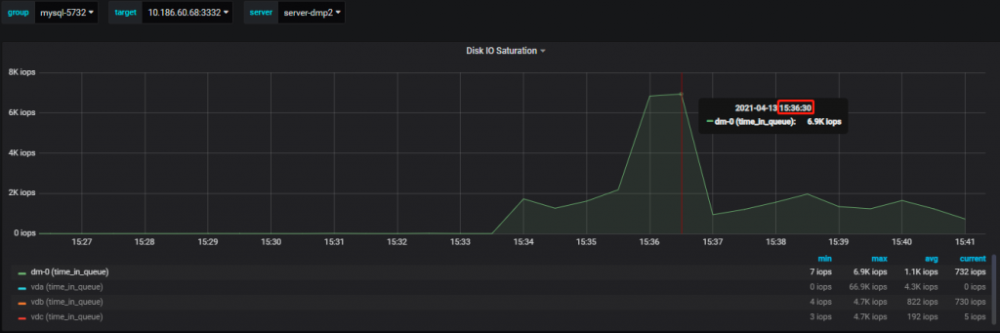
- 
直接在 binog 中过滤 exec_time=8，可以找到对应的值，能与 Seconds_Behind_Master 匹配上。
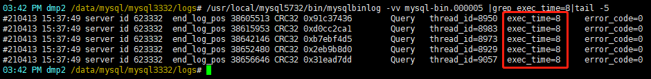
#### 测试 2：模拟 CPU 瓶颈的场景
- 
stress 加 4 个 CPU 负载
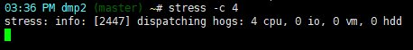
- 
此时磁盘使用率是正常的
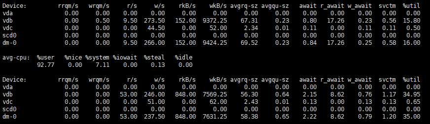
- 
CPU 的负载上去了，us% 达到 90%+ 的，load 达到 11 左右。
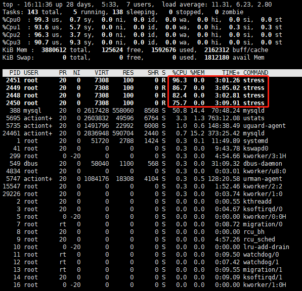
- 
CPU 负载升高后，从库逐渐开始出现延迟
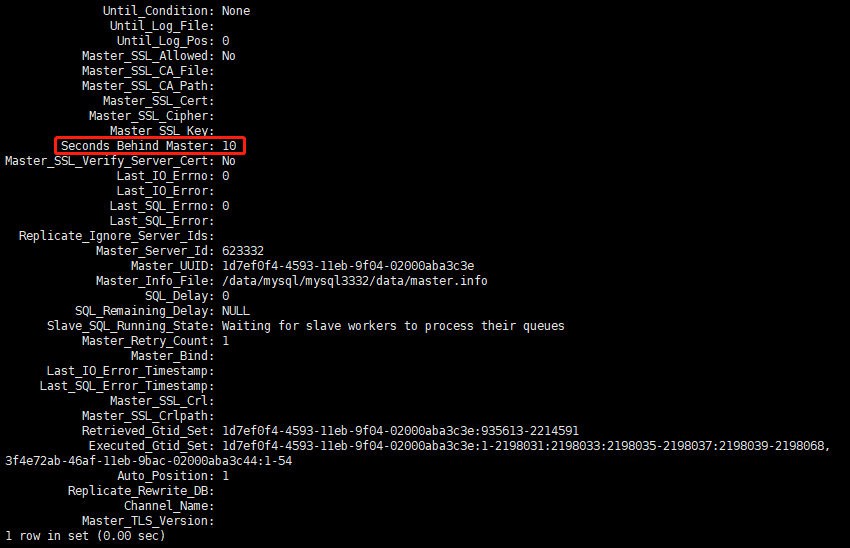
- 
从主从延迟监控图上看得更直观一些，延迟是从 16:08 开始的。
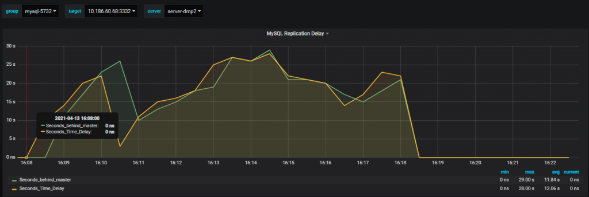
- 
binlog 中记录的时间戳也是从 16:08 开始，从库回放事务时开始出现堆积的现象。
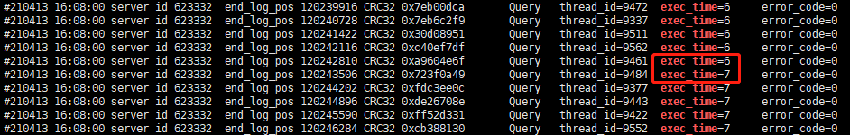
- 
CPU 使用率和 CPU 负载监控图比较直观
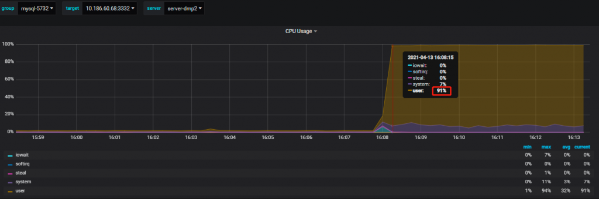
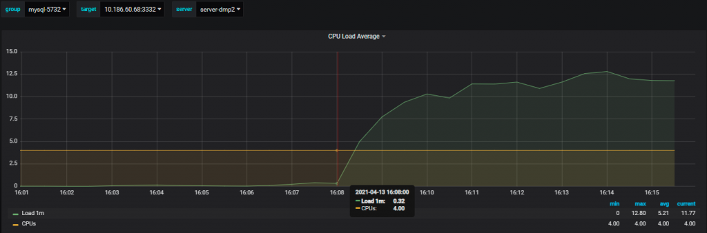
- 
停止 stress 前再观察一下 Senconds_Behind_Master，已经落后主库 17 秒了，并且这个值会越来越大。
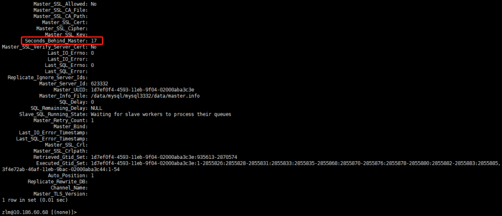
在从库 binlog 中过滤 exec_time=17，也能够匹配到 Senconds_Behind_Master 的值。
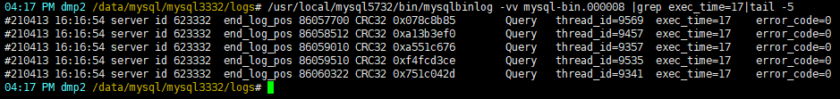
#### 测试 3：模拟网络延迟的场景
- 
网络相关故障可以使用 tc 工具来实现，将从库网卡设置延迟 500ms。
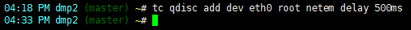
- 
从库很快地开始出现延迟。
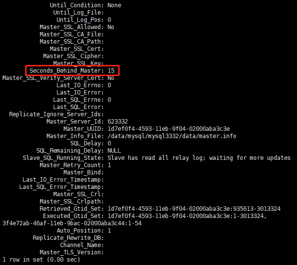
- 
同样地，事务回放出现堆积的现象。
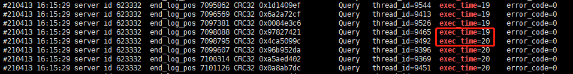
- 
等待一段时间，观察到主从延迟已经超过 7 分钟。
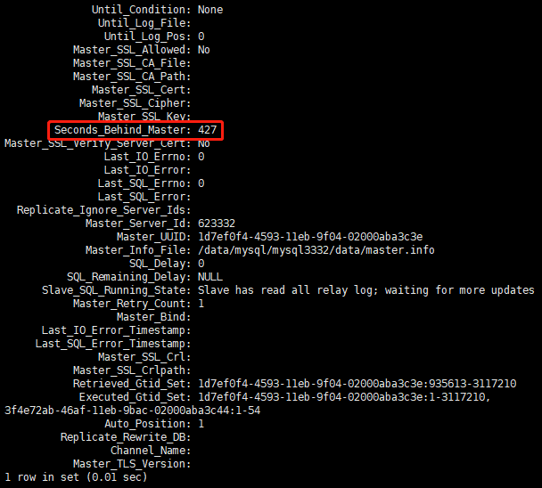
- 
解析从库 binlog，过滤 exec_time=427，与 Seconds_Behind_Master 匹配。
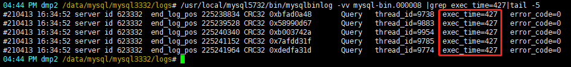
- 
停止 tc 工具，恢复网络延迟。
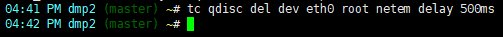
- 
在 16:42 停掉 tc 后，从库上的网络流量突增，开始正常回放事务，直至追平主库。
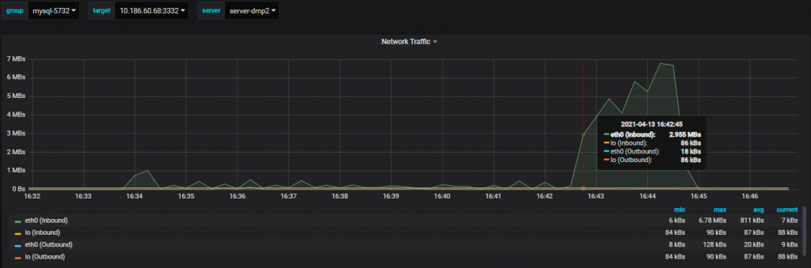
## 总结
- 
从库 binlog 的 exec_time 在一定程度上可以反映事务执行的快慢（row/statement），但并不一定完全与主库事务执行时间一致。
- 
如果出现主库 exec_time=0，而从库 exec_time 一直在递增，此时很可能已经出现了主从延迟，可以从服务器的资源负载方面着手排查，大概率是 CPU、磁盘、网络等出现瓶颈所致。
- 
以上测试场景都是基于没有人为地去修改 timestamp 的情况，否则 exec_time 就没有参考意义了。
参考文档
> 
https://www.percona.com/blog/2011/01/31/what-is-exec_time-in-binary-logs/
https://mp.weixin.qq.com/s/TAf4yCC1g_xrvEq2BHJINQ
**文章推荐：**
[技术分享 | MySQL 主从复制中创建复制用户的时机探讨](https://opensource.actionsky.com/20210318-mysql/)
[技术分享 | binlog 实用解析工具 my2sql](https://opensource.actionsky.com/20210105-my2sql/)
<
p style=&#8221;margin-bottom: 0px; padding: 8px 10px; max-width: 100%; overflow-wrap: break-word; clear: both; min-height: 1em; color: black; font-family: Optima-Regular, Optima, PingFangSC-light, PingFangTC-light, &#8220;PingFang SC&#8221;, Cambria, Cochin, Georgia, Times, &#8220;Times New Roman&#8221;, serif; font-size: 16px; letter-spacing: 0px; word-break: break-word; line-height: normal;&#8221;>[技术分享 | 如何优雅地在 Windows 上从 MySQL 5.6 升级到 5.7](https://opensource.actionsky.com/20200715-mysql/)