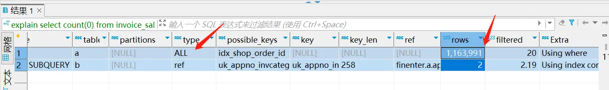
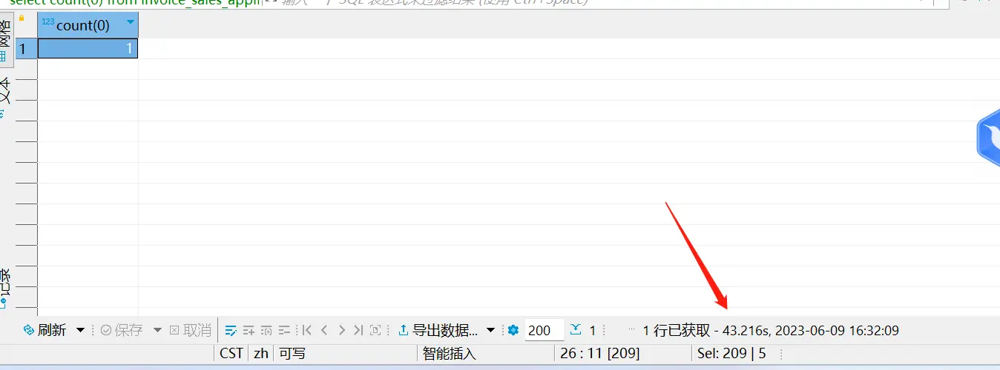
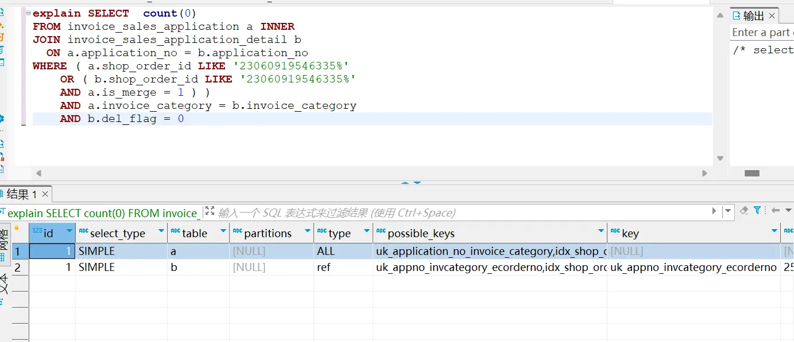
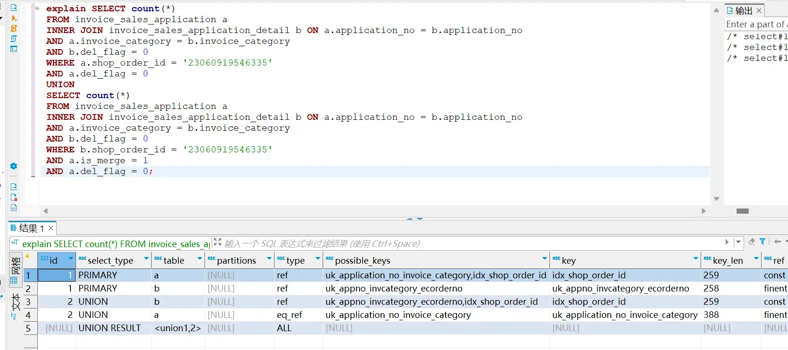
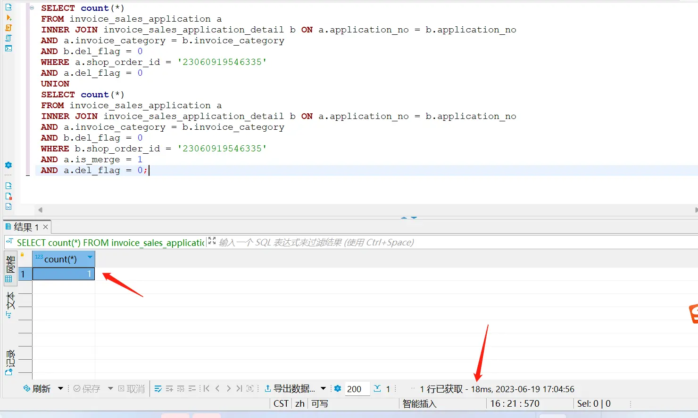

# 技术分享 | 又是一条慢 SQL 改写，拿捏！

**原文链接**: https://opensource.actionsky.com/%e6%8a%80%e6%9c%af%e5%88%86%e4%ba%ab-%e5%8f%88%e6%98%af%e4%b8%80%e6%9d%a1%e6%85%a2-sql-%e6%94%b9%e5%86%99%ef%bc%8c%e6%8b%bf%e6%8d%8f%ef%bc%81/
**分类**: 技术干货
**发布时间**: 2023-07-12T01:27:26-08:00

---

作者分享了一条慢 SQL 分析和优化的过程，总结出切实有效的优化手段。
> 作者：马文斌
MySQL 爱好者。
本文来源：原创投稿
- 爱可生开源社区出品，原创内容未经授权不得随意使用，转载请联系小编并注明来源。
# 背景
开发同学丢了一条 SQL 过来。“马哥，看看这个 SQL 能否优化，业务那边反馈很慢！”看了下执行计划+表结构，索引都没问题。那到底是怎么回事呢？咱们一起来瞧瞧。
# 分析原 SQL
`explain SELECT
count(0)
FROM
invoice_sales_application a
WHERE
(
shop_order_id LIKE '23060919546335%'
OR (
EXISTS (
SELECT
1
FROM
invoice_sales_application_detail b
WHERE
a.application_no = b.application_no
AND a.invoice_category = b.invoice_category
AND b.del_flag = 0
AND b.shop_order_id LIKE '23060919546335%'
)
AND a.is_merge = 1
)
)
`
先来看看这个 SQL 是什么意思：
在 `invoice_sales_application` 表中，`shop_order_id` 以 `'23060919546335%'`开头，或者存在一个相关的 `invoice_sales_application_detail` 表中的记录，该记录的 `application_no` 和 `invoice_category` 与 `invoice_sales_application` 表中的相同，并且 `shop_order_id` 以 `'23060919546335%'` 开头，同时 `invoice_sales_application` 表中的 `is_merge` 字段为 `1`。
执行计划：**all+ref**，其中 `a` 表要扫描 116w 行的数据。

执行需要 43s，且有一个全表扫描。

# 优化操作
## EXISTS 转化成 JOIN 的方式
这里是把 `EXISTS` 改写成 `INNER JOIN` 通过索引关键关联，应该会有不错的效果，试试看。
`SELECT  count(0)
FROM invoice_sales_application a INNER
JOIN invoice_sales_application_detail b
ON a.application_no = b.application_no
WHERE ( a.shop_order_id LIKE '23060919546335%'
OR ( b.shop_order_id LIKE '23060919546335%'
AND a.is_merge = 1 ) )
AND a.invoice_category = b.invoice_category
AND b.del_flag = 0
`
 

这里虽然转化了 `INNER JOIN` 的方式，执行计划还是 **all+ref** ，因为用了 `OR` 导致 `a` 表没有用上索引，还是用的全表扫描。没关系，咱们再次进行转化。
## OR 改成 UNION
` SELECT count(*)
FROM invoice_sales_application a
INNER JOIN invoice_sales_application_detail b ON a.application_no = b.application_no
AND a.invoice_category = b.invoice_category
AND b.del_flag = 0
WHERE a.shop_order_id = '23060919546335'
AND a.del_flag = 0
UNION
SELECT count(*)
FROM invoice_sales_application a
INNER JOIN invoice_sales_application_detail b ON a.application_no = b.application_no
AND a.invoice_category = b.invoice_category
AND b.del_flag = 0
WHERE b.shop_order_id = '23060919546335'
AND a.is_merge = 1
AND a.del_flag = 0;
`
在看看执行计划，**eq_ref+ref+ref+ref**。说明已经优化的很好了，起码没有全表扫描。

最后看看结果。

这样 SQL 执行很快了，查询时间从 42s 降到 18ms，快了几个数量级。
# 小结
1、当 SQL 的主架构中含有 `EXISTS` 的时候，可以改成 `INNER JOIN` 的方式，先看看效果。
2、当条件中有 `OR` 的时候，可以改成 `UNION` 试试。