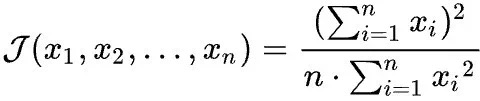

# 技术分享 | 回顾 MySQL 的 MTS

**原文链接**: https://opensource.actionsky.com/20200611-mysql/
**分类**: MySQL 新特性
**发布时间**: 2020-06-10T23:22:54-08:00

---

作者：洪斌
爱可生南区负责人兼技术服务总监，MySQL  ACE，擅长数据库架构规划、故障诊断、性能优化分析，实践经验丰富，帮助各行业客户解决 MySQL 技术问题，为金融、运营商、互联网等行业客户提供 MySQL 整体解决方案。
本文来源：转载自公众号-玩转MySQL
*爱可生开源社区出品，原创内容未经授权不得随意使用，转载请联系小编并注明来源。
MySQL 并行回放在一路改进，从 5.6 的 schema 并行，到 5.7 的 group commit，再到 8.0 的 write set。
**MTS based on schema**
这种方式不用多说，涉及不同 schema 的 DML 操作，在 slave 端可以按 schema 粒度并行回放，弱点也很明显，如果实例中的 schema 较少，并行回放效果并不理想。
其优化方式也比较简单 slave_parallel_workers 小于等于 master 的 schema 数量。
**LOGICAL_CLOCK**
MySQL 5.7 增加了基于 group commit 的并行回放策略，使得 slave 可以接近 master 同样并发回放事务，master 并发越高，slave 并行回放效果越明显。
在 binlog 中每个事务会有多出两个标签
**sequence_number：**随每个事务递增的自增 ID，每次新的 binlog 会从 1 开始
**last_committed：**当前事务所依赖的上次事务的 sequence_number，每次新的 binlog 会从 0 开始
last_committed 相同值的事务代表同时提交的，可以并行回放。
- `#180105 20:08:33 ... last_committed=7201 sequence_number=7203`
- `#180105 20:08:33 ... last_committed=7203 sequence_number=7204`
- `#180105 20:08:33 ... last_committed=7203 sequence_number=7205`
- `#180105 20:08:33 ... last_committed=7203 sequence_number=7206`
- `#180105 20:08:33 ... last_committed=7205 sequence_number=7207`
1. 7203 事务依赖 7201
2. 7204、7205、7206 事务依赖 7203，可以并行提交
3. 7207 事务依赖 7205，由于 7205 依赖 7203，那么在 7205 执行完后，7207 可以和 7206 并行执行
优化方式通过调整 master group commit size 和 slave 的并行 work 线程数，提升并行效率。
master group commit size 和并发压力，以及下面两个参数相关：
binlog_group_commit_sync_delay 表示 binlog 提交事务前等待多少微秒
binlog_group_commit_sync_no_delay_count 表示同步队列最大允许的事务数，当等待提交的线程达到多少时, 就不在等待
在 master 低并发的负载下，并行回放效果就不好了，如果想要提高并行度，需要增加 binlog_group_commit_sync_delay，积累较多的分组大小，副作用是拉低 master 吞吐量。
**Write set**
MySQL 8.0.1 & 5.7.22 在 group commit 基础上进一步改善了并行复制效率，增加了新的跟踪事务依赖关系的机制。相对于基于事务 commit timestamp，即使 master 低并发场景下也能使 slave 根据事务依赖关系并行重放，充分利用硬件资源，不需要像 MySQL 5.7 增加 binlog_group_commit_sync_delay 延迟的方式，增加可并行的事务，降低复制延迟。
**在 master 上满足以下条件：**1. binlog_format=row
2. 开启 transaction_write_set_extraction=XXHASH64
3. 更新表必须有主键，如果更新事务包含外键，则退回 commit_order 方式
4. binlog_transaction_dependency_tracking = [COMMIT_ORDER | WRITESET | WRITESET_SESSION]
slave 上开启 slave_parallel_workers
**COMMIT_ORDER 基于 commit timestamp**不同会话在相同时间执行可以并行回放
**WRITESET 变更不同行的操作都可以并行**- 无主键 退回 commit_order 模式
- `hongbin@MBP ~/w/s/msb_8_0_3> mysqlbinlog data/MBP-bin.000013 |grep last_ |sed -e 's/server id.*last/[...] last/' -e 's/.rbr_only.*/ [...]/'`
- `#180105 21:19:31 [...] last_committed=0    sequence_number=1 [...] create table t1 (id);`
- `#180105 21:19:50 [...] last_committed=1    sequence_number=2 [...] insert t1 value(1);`
- `#180105 21:19:52 [...] last_committed=2    sequence_number=3 [...] insert t1 value(2);`
- `#180105 21:19:54 [...] last_committed=3    sequence_number=4 [...] insert t1 value(3);`
- 有主键 单个会话也可以并行
- `#180105 21:23:58 [...] last_committed=4    sequence_number=5 [...] create table t2 (id INT UNSIGNED NOT NULL AUTO_INCREMENT PRIMARY KEY, str VARCHAR(80) NOT NULL UNIQUE);`
- `#180105 21:24:19 [...] last_committed=5    sequence_number=6 [...] session1: insert t2(str) value('a');`
- `#180105 21:24:21 [...] last_committed=5    sequence_number=7 [...] session1: insert t2(str) value('b');`
- `#180105 21:24:25 [...] last_committed=5    sequence_number=8 [...] session1: insert t2(str) value('c');`
**WRITESET_SESSION 相同会话不会被重新排序，不同会话可并行**
在相同会话中执行
- `#180106 13:15:26 [...] last_committed=0    sequence_number=1 [...] session1：insert t2(str) value('h');`
- `#180106 13:15:31 [...] last_committed=1    sequence_number=2 [...] session1：insert t2(str) value('l');`
在不同会话中执行
- `#180106 13:17:08 [...] last_committed=1    sequence_number=3 [...] session1: insert t2(str) value('q');`
- `#180106 13:17:09 [...] last_committed=1    sequence_number=4 [...] session2: insert t2(str) value('w');`
**如何观测并行回放**
如何评估 slave_parallel_workers 设置多少合适？如果设置小了，任务会有积压，如果设置大了，多余的线程是空闲的。
计算机领域有这么个公式专门来研究系统资源分配公平性。
											
出自论文《A Quantitative Measure Of Fairness And Discrimination For Resource Allocation In Shared Computer Systems》引用数 4000+。
这个公式称为 jain&#8217;s index 计算一系统共享资源分配公平性的指数，指数值在 0<j<1 之间，越接近 1 表示资源分配更公平。
借用此公式是不是可以来计算回放线程任务分配的公平性，如果 slave_parallel_workers 设置过大，反应任务分配公平性较差。找到合适的 slave_parallel_workers。
这里需要启用 performance_schema 的 transaction 级的 instrument，搜集线程事务提交信息。
- `call sys.ps_setup_enable_consumer('events_transactions%');`
- `call sys.ps_setup_enable_instrument('transaction');`
将公式转换为 SQL 语句如下- `select ROUND(POWER(SUM(trx_summary.COUNT_STAR), 2) /`
- `(@@GLOBAL.slave_parallel_workers * SUM(POWER(trx_summary.COUNT_STAR, 2))), 2) AS replica_jain_index`
- `from performance_schema.events_transactions_summary_by_thread_by_event_name as trx_summary join performance_schema.replication_applier_status_by_worker as applier`
- `on trx_summary.THREAD_ID = applier.THREAD_ID`
在 slave 上观测，如果该指数值越接近 0 说明当前 applier 线程越空闲率高，如果该指数值越接近 1 说明当前 applier 线程空闲率越低。动手试试吧！
**参考：**
**https://www.percona.com/blog/2016/02/10/estimating-potential-for-mysql-5-7-parallel-replication/**
**https://www.slideshare.net/JeanFranoisGagn/fosdem-2018-premysql-day-mysql-parallel-replication**
**https://jfg-mysql.blogspot.hk/2017/02/metric-for-tuning-parallel-replication-mysql-5-7.html**
**https://jfg-mysql.blogspot.com/2018/01/write-set-in-mysql-5-7-group-replication.html?m=1**
**http://mysqlhighavailability.com/improving-the-parallel-applier-with-writeset-based-dependency-tracking/**