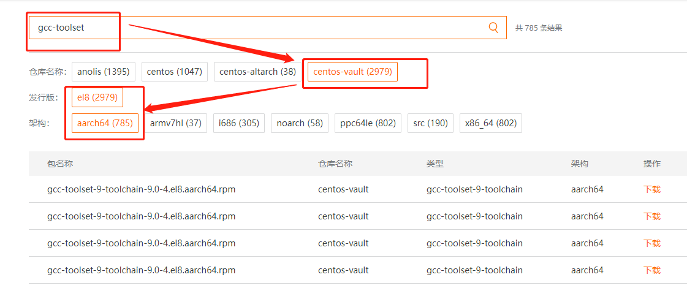

# 技术分享 | 国产麒麟 arm 上编译安装 xtrabackup8

**原文链接**: https://opensource.actionsky.com/20220718-xtrabackup8/
**分类**: 技术干货
**发布时间**: 2022-07-18T21:21:55-08:00

---

作者：王向
爱可生 DBA 团队成员，负责公司 DMP 产品的运维和客户 MySQL 问题的处理。擅长数据库故障处理。对数据库技术和 python 有着浓厚的兴趣。
本文来源：原创投稿
*爱可生开源社区出品，原创内容未经授权不得随意使用，转载请联系小编并注明来源。
#### 需求背景
由于官方上游还没有提供 arm 架构可用的二进制通用安装包，所以我们只能选择进行编译安装或者 rpm 包安装。
这里选择了更复杂费时的编译安装，对于为什么选用编译安装大概有以下原因：
- 调整分发更容易一些
- 同一台机器装多个版本共存
下面我就进入操作环节吧。
#### 环境准备
我这里的机器环境信息如下：
- 系统：kylin v10
- 架构： aarch64
- 内核：4.19.90-17.5
本文内所有步骤都基于该环境
[root@wx-test ~]# uname -a 
Linux wx-test 4.19.90-17.5.ky10.aarch64 #1 SMP Fri Aug 7 13:35:33 CST 2020 aarch64 aarch64 aarch64 GNU/Linux 
[root@wx-test ~]# cat /etc/os-release 
NAME="Kylin Linux Advanced Server" 
VERSION="V10 (Tercel)" 
ID="kylin" 
VERSION_ID="V10" 
PRETTY_NAME="Kylin Linux Advanced Server V10 (Tercel)" 
ANSI_COLOR="0;31"
#### 前期准备
- 下载 xtrabackup 源码包，门牌号：Download Percona XtraBackup 8.0
[root@wx-test ~]# ll 
总用量 291168 
-rw-rw-r-- 1 dba dba 298154792 6月 27 14:18 percona-xtrabackup-8.0.27-19.tar.gz # 
顺手把解压缩也做了 
[root@wx-test ~]$ tar xf percona-xtrabackup-8.0.27-19.tar.gz 
# 顺手在创建一个目录来存储已编译的文件 
[root@wx-test ~]$ cd percona-xtrabackup-8.0.27-19 
[root@wx-test percona-xtrabackup-8.0.27-19]$ pwd 
/home/dba/percona-xtrabackup-8.0.27-19 
[root@wx-test percona-xtrabackup-8.0.27-19]$ mkdir build 
[root@wx-test percona-xtrabackup-8.0.27-19]$ cd build
> 无法连接外网还需要准备以下步骤。
下载 boost ，门牌号：https://www.boost.org/users/history/version_1_73_0.html
#### 安装依赖包
[root@wx-test percona-xtrabackup-8.0.27-19]$ yum install openssl-devel libaio libaio-devel automake autoconf \ bison libtool ncurses-devel libgcrypt-devel libev-devel libcurl-devel zlib-devel \vim-common libcurl-devel libudev-devel
#### 安装编译环境
sudo yum -y install cmake
重点来了，编译`xtrabackup8`需要`gcc 版本 >= 5.3`，万万不可以使用 yum 直接装个 gcc 就开始去编译会浪费大把时间。
这里提供一个快速安装高版本 gcc 的方式。
1.搜索当前源内是否存在以下包
yum search gcc-toolset
2.安装`gcc`和`scl`
yum -y install kylin-release scl-utils scl-utils-build 
yum -y install gcc-toolset-11-gcc 
yum -y install gcc-toolset-11-gcc-c++
注意：如果你的源里没有`gcc-toolset`。那你需要安装一个 yum 源进来比如`阿里的 Centos8`。如果你连 yum 源也装不了你就直接把 rpm 包给下载下来。
门牌号：https://developer.aliyun.com/packageSearch?word=gcc-toolset

再或者你时间够多想玩点刺激的也可以考虑手工编译一个gcc出来。
3.使用 scl 开启咱的高版本 gcc
source /opt/rh/gcc-toolset-11/enable 
source scl_source enable gcc-toolset-11
# 检查一下版本 
[root@wx-test ~]# gcc -v 
Using built-in specs. 
COLLECT_GCC=gcc 
COLLECT_LTO_WRAPPER=/opt/rh/gcc-toolset-11/root/usr/libexec/gcc/aarch64-redhat- linux/11/lto-wrapper 
Target: aarch64-redhat-linux 
Configured with: ../configure --enable-bootstrap --enable- languages=c,c++,fortran,lto --prefix=/opt/rh/gcc-toolset-11/root/usr -- mandir=/opt/rh/gcc-toolset-11/root/usr/share/man --infodir=/opt/rh/gcc-toolset- 11/root/usr/share/info --with-bugurl=http://bugzilla.redhat.com/bugzilla -- enable-shared --enable-threads=posix --enable-checking=release --enable-multilib --with-system-zlib --enable-__cxa_atexit --disable-libunwind-exceptions -- enable-gnu-unique-object --enable-linker-build-id --with-gcc-major-version-only --with-linker-hash-style=gnu --enable-plugin --enable-initfini-array --with- isl=/builddir/build/BUILD/gcc-11.2.1-20210728/obj-aarch64-redhat-linux/isl- install --enable-gnu-indirect-function --build=aarch64-redhat-linux Thread model: posix 
Supported LTO compression algorithms: zlib zstd 
gcc version 11.2.1 20210728 (Red Hat 11.2.1-1) (GCC)
#### 开始编译
1.运行`cmake`
# 可以联外网使用： 
[root@wx-test build]$ cmake3 -DDOWNLOAD_BOOST=ON -DWITH_BOOST=./ \ -DBUILD_CONFIG=xtrabackup_release -DWITH_MAN_PAGES=OFF .. 
# 不可以连接外网：记得我们刚才准备的boost吧 
[root@wx-test build]$ tar xf boost_1_73_0.tar.bz2 
[root@wx-test build]$ cmake3 -DWITH_BOOST=./boost_1_73_0 -DDOWNLOAD_BOOST=OFF \ -DBUILD_CONFIG=xtrabackup_release -DWITH_MAN_PAGES=OFF .. 
...省略....
-- CMAKE_CXX_FLAGS_DEBUG: -DSAFE_MUTEX -DENABLED_DEBUG_SYNC -g 
-- CMAKE_CXX_FLAGS_RELWITHDEBINFO: -ffunction-sections -fdata-sections -O2 -g - DNDEBUG 
-- CMAKE_CXX_FLAGS_RELEASE: -ffunction-sections -fdata-sections -O3 -DNDEBUG 
-- CMAKE_CXX_FLAGS_MINSIZEREL: -ffunction-sections -fdata-sections -Os -DNDEBUG 
-- CMAKE_C_LINK_FLAGS: 
-- CMAKE_CXX_LINK_FLAGS: 
-- CMAKE_EXE_LINKER_FLAGS 
-- CMAKE_MODULE_LINKER_FLAGS 
-- CMAKE_SHARED_LINKER_FLAGS 
-- Configuring done 
-- Generating done 
-- Build files have been written to: /home/dba/percona-xtrabackup-8.0.27- 19/build
> 注意：这一步出错率较高，一般因为环境不同所需依赖也可能出现差异化。根据失败提示去安装缺失依赖即可。
2.执行make
# -j指定的是CPU核数 
[root@wx-test build]$ make -j22 
...省略....
In function ‘char* strncpy(char*, const char*, size_t)’, inlined from ‘void xb_set_plugin_dir()’ at /home/dba/percona-xtrabackup- 8.0.27-19/storage/innobase/xtrabackup/src/xtrabackup.cc:7728:12: /usr/include/bits/string_fortified.h:106:34: warning: ‘char* __builtin_strncpy(char*, const char*, long unsigned int)’ specified bound 512 equals destination size [-Wstringop-truncation] 106 | return __builtin___strncpy_chk (__dest, __src, __len, __bos (__dest)); | ~~~~~~~~~~~~~~~~~~~~~~~~^~~~~~~~~~~~~~~~~~~~~~~~~~~~~~~~~~~~~~ 
[100%] Linking CXX executable ../../../../runtime_output_directory/xtrabackup 
[100%] Built target xtrabackup
> 注意：这一步虽然出错率不高，但问题千奇百怪。大家遇山开山，遇水架桥。也可以留言进行讨论
3.执行make install
[root@wx-test build]$ make install...省略.... -- Installing: /usr/local/xtrabackup/man/man1/mysqlpump.1-- Installing: /usr/local/xtrabackup/man/man1/mysqlrouter.1 -- Installing: /usr/local/xtrabackup/man/man1/mysqlrouter_keyring.1 -- Installing: /usr/local/xtrabackup/man/man1/mysqlrouter_passwd.1 -- Installing: /usr/local/xtrabackup/man/man1/mysqlrouter_plugin_info.1 -- Installing: /usr/local/xtrabackup/man/man1/mysqlshow.1 -- Installing: /usr/local/xtrabackup/man/man1/mysqlslap.1 -- Installing: /usr/local/xtrabackup/man/man1/perror.1 -- Installing: /usr/local/xtrabackup/man/man1/zlib_decompress.1 -- Installing: /usr/local/xtrabackup/man/man8/mysqld.8 -- Up-to-date: /usr/local/xtrabackup/man/man8/mysqld.8
[root@wx-test build]$ /usr/local/xtrabackup/bin/xtrabackup --version /usr/local/xtrabackup/bin/xtrabackup version 8.0.27-19 based on MySQL server 8.0.27 Linux (aarch64) (revision id: 50dbc8dadda)
## END