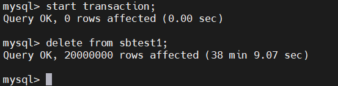
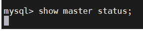
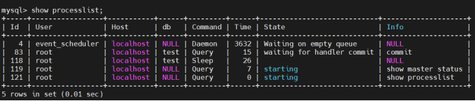

# 技术分享 | 大事务阻塞 show master status

**原文链接**: https://opensource.actionsky.com/20220718-commit/
**分类**: 技术干货
**发布时间**: 2022-07-17T22:54:54-08:00

---

作者：王福祥
爱可生 DBA 团队成员，负责客户的数据库故障处理以及调优。擅长故障排查及性能优化。对数据库相关技术有浓厚的兴趣，喜欢分析各种逻辑。
本文来源：原创投稿
*爱可生开源社区出品，原创内容未经授权不得随意使用，转载请联系小编并注明来源。
MySQL 主从复制功能可以搭建从库来为 MySQL 创建一套在线的备份系统，但是自身不能独立实现切换；需要借助第三方高可用工具。然而当自身有大事务在运行时会阻塞一些 show 语句；例如“show master status”，造成误判。
#### 场景模拟
1、构造两千万行数据，以事务的形式删除

2、新建会话执行 show master status ，在 sql 语句运行期间执行成功。在 commit 期间被阻塞。

3、show master status 处于 starting 状态，也就是语句开始执行的第一个阶段，启动阶段，准备资源。

4、查看 stack 信息，show master status 是在获取 lock_log 锁时被阻塞
#6  0x0000000000ee8278 in MYSQL_BIN_LOG::get_currrent_log (this=0x1e839c0 <mysql_bin_log>, linfo=0x7f3ea82e62d0, need_lock_log=<optimized out>) at /export/home/pb2/build/sb_0-32013917-1545390211.74/mysql-5.7.25/sql/binlog.cc:5514......#6  0x0000000000eef824 in MYSQL_BIN_LOG::change_stage (this=<optimized out>, thd=<optimized out>, stage=<optimized out>, queue=<optimized out>, leave_mutex=<optimized out>, enter_metux=0x1e839c8 <mysql_bin_log+8>) at /export/home/pb2/build/sb_0-32013917-1545390211.74/mysql-5.7.25/sql/binlog.cc:9170
5、最终因事务过大，最终 show master status 超时，导致了故障切换。
其原因为 commit 与 show master status 之间的阻塞等待现象，接下来分析一下原因。
#### 原因分析：commit
commit 流程分为以下几个阶段（以5.7.25为例），为原子性操作，一次性写入。
1、prepare 阶段主要作用为刷 redo 、undo ；此时 binlog 只涉及到一些准备动作。参照 binlog_prepare 函数。
static int binlog_prepare(handlerton *hton, THD *thd, bool all){  DBUG_ENTER("binlog_prepare");  if (!all)  {    thd->get_transaction()->store_commit_parent(mysql_bin_log.      m_dependency_tracker.get_max_committed_timestamp());  }
2、flush 阶段主要作用为持久化 redo ；获取 lock_log 锁阻塞其他组事务写入，以及生成 flush 队列（第一个事务为 leader ，随后为 follower ）以及写入 binlog ，此时是内存写但不刷盘，参照 process_flush_stage_queue 函数
intMYSQL_BIN_LOG::process_flush_stage_queue(my_off_t *total_bytes_var,                                         bool *rotate_var,                                         THD **out_queue_var){  DBUG_ENTER("MYSQL_BIN_LOG::process_flush_stage_queue");  #ifndef DBUG_OFF  // number of flushes per group.  int no_flushes= 0;  #endif  DBUG_ASSERT(total_bytes_var && rotate_var && out_queue_var);  my_off_t total_bytes= 0;  int flush_error= 1;  mysql_mutex_assert_owner(&LOCK_log);
3、sync 阶段作用为释放 lock_log 锁，获取 lock_sync 锁阻塞其他事务组刷盘，并根据 sync_binlog 决定刷盘策略。
if (change_stage(thd, Stage_manager::SYNC_STAGE, wait_queue, &LOCK_log, &LOCK_sync))  {    DBUG_PRINT("return", ("Thread ID: %u, commit_error: %d",                          thd->thread_id(), thd->commit_error));    DBUG_RETURN(finish_commit(thd));  }
4、commit 阶段释放 lock_sync 锁，获取 lock_commit 锁并等待 follower 事务提交，提交后释放该锁以及清空 binlog 缓存以及判断是否刷新并归档 binlog
#### 原因分析：show master status
show master status 其作用为从最后一份 binlog 文件中获取 Executed_Gtid 信息以及该 binlog 所执行的gtid信息。其函数入口为：https://github.com/mysql/mysql-server/blob/mysql-5.7.25/sql/rpl_master.cc 624行并获取 lock_log 锁：
int MYSQL_BIN_LOG::get_current_log(LOG_INFO* linfo, bool need_lock_log/*true*/){  if (need_lock_log)    mysql_mutex_lock(&LOCK_log);  int ret = raw_get_current_log(linfo);  if (need_lock_log)    mysql_mutex_unlock(&LOCK_log);  return ret;}
#### 结论
案例中的例子是单个大事务，因此不涉及组提交的 sync 阶段，从 commit（flush 阶段）以及 show master status 的步骤中可以看出，两步操作之间的阻塞原因为 lock_log 锁的争用引起的，该锁的性质为 lock_log 日志锁，而并非MDL以及引擎层锁，如果事务越大，flush 阶段写入 binlog 期间以及持有锁的时间就会越长；从而阻塞其他事务提交以及 binlog 的 show 操作，因此对应的解决方案为：
1、大事务会造成io暴涨、主从延时以及事务阻塞等问题，在 MGR 环境中甚至会造成复制中断，mysql 需要避免大事务。
2、binlog 是持续在变化的文件，show master status 语句可改为 select @@global.gtid_executed ；来获取 GTID 信息。