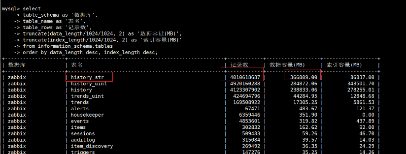
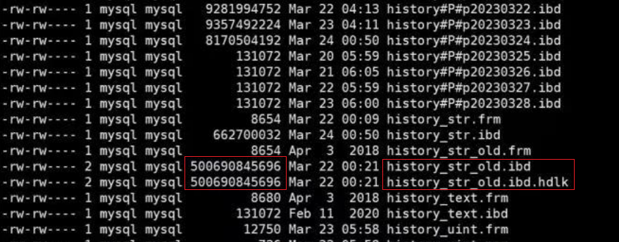
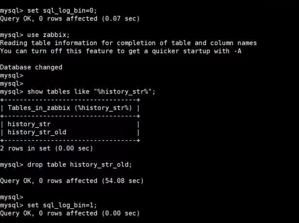
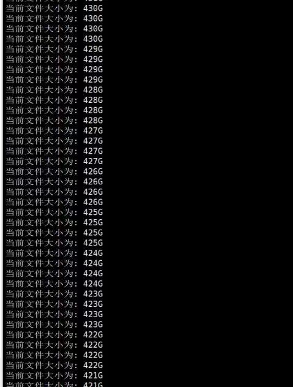

# 技术分享 | 如何优雅的删除 Zabbix 的 history 相关历史大表

**原文链接**: https://opensource.actionsky.com/20230423-mysql/
**分类**: MySQL 新特性
**发布时间**: 2023-04-22T22:07:45-08:00

---

作者：徐文梁
爱可生DBA成员，一个执着于技术的数据库工程师，主要负责数据库日常运维工作。擅长MySQL,redis，其他常见数据库也有涉猎，喜欢垂钓，看书，看风景，结交新朋友。
本文来源：原创投稿
*爱可生开源社区出品，原创内容未经授权不得随意使用，转载请联系小编并注明来源。
#### 问题背景:
前段时间，客户反馈 Zabbix 实例的 history_str 表数据量很大，导致磁盘空间使用率较高，想要清理该表，咨询是否有好的建议。想着正好最近学习了相关的知识点，正好可以检验一下学习成果，经过实践的检验，最终考试合格，客户也比较满意，于是便有了此文。

#### 问题沟通:
通过实际查看环境及与客户沟通，得出以下信息:
1.现场是双向主从复制架构，未设置从库read_only只读。
2.history_str表的ibd数据文件超460G。
3.history_str表的存量数据可以直接清理。
4.现场实例所在的服务器是虚拟机，配置较低。
因此，综合考虑后建议客户新建相同表结构的表然后对原表进行drop操作，但是表数据量比较大，需要考虑以下风险:
1.drop大表可能会导致实例hang住，影响数据库正常使用。
2.drop大表操作导致主从延时。
3.删除大文件造成磁盘io压力较大。

#### 最终方案:
在考虑以上的基础上，最终给出如下方案:
1.在主库执行如下命令建立相同表结构表并进行rename操作:
create table history_str_new like history_str;
rename table history_str to history_str_old, history_str_new to
history_str;
2.在主库和从库执行以下操作，建立硬链接文件:
ln history_str_old.ibd history_str_old.ibd.hdlk

3.完成第二步后，建议间隔一两天再进行操作，让history_str_old表数据从innodb buffer pool中冷却，然后业务低峰期在主从库分别执行如下操作，建议先操作从库,从库验证没问题后再在主库操作:
set sql log bin=0;       //临时关闭写操作记录binlog
drop table history_str_old;//执行drop操作
set sql log bin=l;       //恢复写操作记录binlog

4.删除history_old.ibd.hdlk文件，释放空间，可以通过linux的truncate命令实现，参考脚本如下:
#!/bin/bash
##############################################################################
##           第一个参数为需要执行操作的文件的文件名称                      ##
##           第二个参数为每次执行操作的缩减值，单位为MB                    ##
##           第三个参数为每次执行后的睡眠时间，单位为S                     ##
##########################################################################
fileSize=`du $1|awk -F" " '{print $1}'`
fileName=$1
chunk=$2
sleepTime=$3
chunkSize=$(( chunk * 1024 ))
rotateTime=$(( fileSize / chunkSize ))
declare -a currentSize
echo $rotateTime
function truncate_action()
{
for (( i=0; i<=${rotateTime}; i++ ))
do
if [ $i -eq 0 ];then
echo "开始进行truncate操作，操作文件名为:"$fileName
fi
if [ $i -eq ${rotateTime} ];then
echo "执行truncate操作结束！！！"
fi
truncate -s -${chunk}M $fileName
currentSize=`du -sh $fileName|awk -F" " '{print $1}'`
echo "当前文件大小为: "$currentSize
sleep $sleepTime
done
}
truncate_action
示例:sh truncateFile.sh history_str_old.ibd.hdlk 256 1，表示删除history_str_old.ibd.hdlk文件，每次截断大小为256M，然后sleep间隔为1s。

5.到此，静静等待就行了。无聊的话也可以思考一下人生。
#### 小知识:
前面解决了如何操作的问题，但是作为一个称职的DBA，不光要知道如何做，还得知道为什么这么做，不然的话，敲回车键容易，后悔却很难，干货来了，一起了解一下吧。下次遇到类似问题就不慌了。
tips1：
MySQL删除表的流程:
1.持有buffer pool mutex。
2.持有buffer pool中的flush list mutex。
3.扫描flush list列表，如果脏页属于drop掉的table，则直接将其从flush list列表中移除。如果开启了AHI,还会遍历LRU,删除innodb表的自适应散列索引项，如果mysql版本在5.5.23之前，则直接删除，对于5.5.23及以后版本，如果占用cpu和mutex时间过长，则释放cpu资源，flush list mutex和buffer pool mutex一段时间，并进行context switch。一段时间后重新持有buffer pool mutex,flush list mutex。
4.释放flush list mutex。
5.释放buffer pool mutex。
tips2:
对于linux系统，一个磁盘上的文件可以由多个文件系统的文件引用，且这多个文件完全相同，并指向同一个磁盘上的文件，当删除其中任一一个文件时，并不会删除真实的文件，而是将其被引用的数目减1，只有当被引用数目为0时，才会真正删除文件。
tips3:
大表drop或者truncate相关的一些bug:
这两个指出drop table 会做两次 LRU 扫描：一次是从 LRU list 中删除表的数据页，一次是删除表的 AHI 条目。
https://bugs.mysql.com/bug.php?id=51325
https://bugs.mysql.com/bug.php?id=64284
对于分区表，删除多个分区时，删除每个分区都会扫描LRU两次。
https://bugs.mysql.com/bug.php?id=61188
truncate table 会扫描 LRU 来删除 AHI，导致性能下降；8.0 已修复，方法是将 truncate 映射成 drop table + create table
https://bugs.mysql.com/bug.php?id=68184
drop table 扫描 LRU 删除 AHI 导致信号量等待，造成长时间的阻塞
https://bugs.mysql.com/bug.php?id=91977
8.0依旧修复了 truncate table 的问题，但是对于一些查询产生的磁盘临时表（innodb 表），在临时表被删除时，还是会有同样的问题。这个bug在8.0.23中得到修复。
https://bugs.mysql.com/bug.php?id=98869