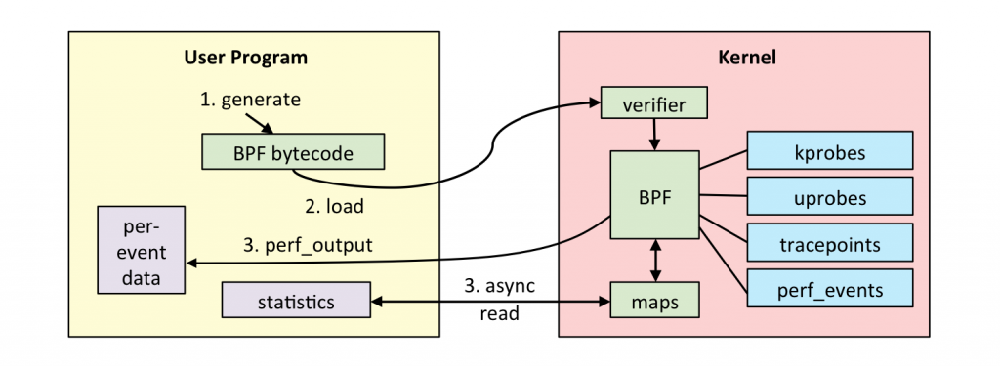
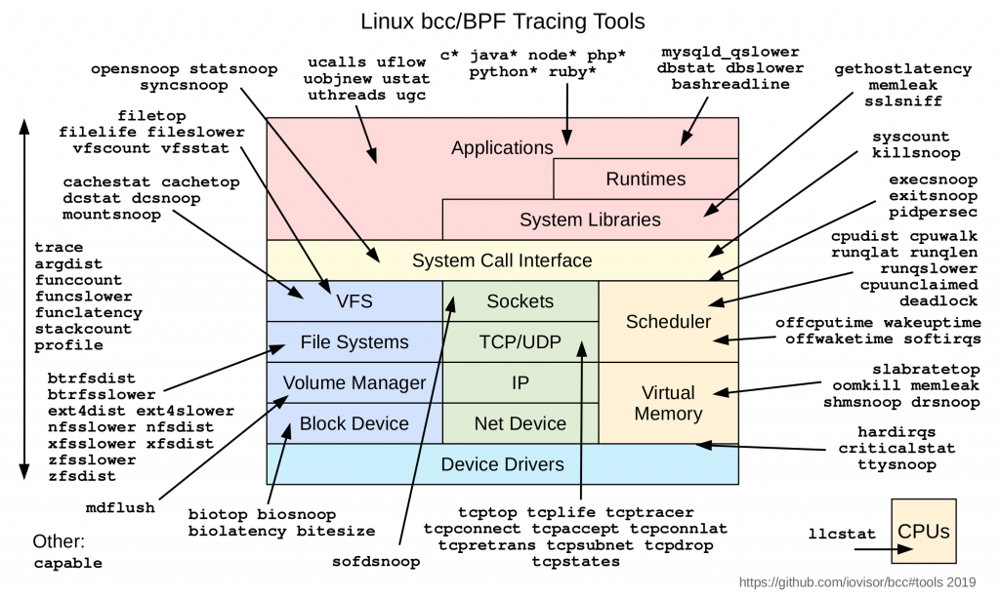

# 技术分享 | 如何使用 bcc 工具观测 MySQL 延迟

**原文链接**: https://opensource.actionsky.com/20200324-mysql/
**分类**: MySQL 新特性
**发布时间**: 2020-03-24T01:33:19-08:00

---

作者：刘安
爱可生测试团队成员，主要负责 TXLE 开源项目相关测试任务，擅长 Python 自动化测试开发，最近醉心于 Linux 性能分析优化的相关知识。
本文来源：原创投稿
*爱可生开源社区出品，原创内容未经授权不得随意使用，转载请联系小编并注明来源。
最近在极客时间上学习《Linux 性能优化实战》，接触到了基于 eBPF 的 BCC 软件包。今天来分享一下 bcc 软件包中用来观测 MySQL 的几个工具。
**1. 什么是 BPF 和 eBPF**
- BPF = Berkeley Packet Filter
https://en.wikipedia.org/wiki/BerkeleyPacketFilter
- BPF 是类 Unix 系统上数据链路层的一种原始接口，提供原始链路层封包的收发
- BPF 支持过滤数据包——用户态的进程可以提供一个过滤程序来声明它想收到哪些数据包
- 从 3.18 版本开始，Linux 内核提供了一种扩展的 BPF 虚拟机，被称为“extended BPF“，简称为 eBPF。它能够被用于非网络相关的功能，比如附在不同的 tracepoints 上，从而获取当前内核运行的许多信息
实际上 tcpdump 使用的 libpcap 就是基于 BPF 的。而接下来我们要介绍的基于 eBPF 的 bcc 软件包可以简单的理解为过滤内核运行信息的 &#8220;tcpdump&#8221;。
以下是一张 BPF 的工作流程图：
											
**2. 什么是 bcc**
- Bcc 的开源项目：https://github.com/iovisor/bcc
- eBPF 虚拟机使用的是类似于汇编语言的指令，对于程序编写来说直接使用难度非常大。bcc 提供了一个名为 bcc 的 python 库，简化了 eBPF 应用的开发过程
- Bcc 收集了大量现成的 eBPF 程序可以直接拿来使用，可以通过以下工具分布图感受一下
											
**3. 安装 bcc**
- `# Ubuntu`
- `sudo apt-key adv --keyserver keyserver.ubuntu.com --recv-keys 4052245BD4284CDD`
- `echo "deb https://repo.iovisor.org/apt/$(lsb_release -cs) $(lsb_release -cs) main" | sudo tee /etc/apt/sources.list.d/iovisor.list`
- `sudo apt-get update`
- `sudo apt-get install bcc-tools libbcc-examples linux-headers-$(uname -r)`
- `export PATH=$PATH:/usr/share/bcc/tools`
- 
- `# CentOS`
- `yum install bcc-tools`
- `export PATH=$PATH:/usr/share/bcc/tools`
以 CentOS 7.7 的系统为例，安装后的工具集如下：- `[root@liuan tools]# ls`
- `argdist       btrfsslower   dbslower             ext4dist     gethostlatency  killsnoop       nfsslower    perlflow     pythonflow   rubystat     solisten    tclobjnew   tcpstates  vfsstat`
- `bashreadline  cachestat     dbstat               ext4slower   hardirqs        lib             nodegc       perlstat     pythongc     runqlat      sslsniff    tclstat     tcpsubnet  wakeuptime`
- `biolatency    cachetop      dcsnoop              filelife     javacalls       llcstat         nodestat     phpcalls     pythonstat   runqlen      stackcount  tcpaccept   tcptop     xfsdist`
- `biosnoop      capable       dcstat               fileslower   javaflow        mdflush         offcputime   phpflow      reset-trace  runqslower   statsnoop   tcpconnect  tcptracer  xfsslower`
- `biotop        cobjnew       deadlock_detector    filetop      javagc          memleak         offwaketime  phpstat      rubycalls    shmsnoop     syncsnoop   tcpconnlat  tplist`
- `bitesize      cpudist       deadlock_detector.c  funccount    javaobjnew      mountsnoop      oomkill      pidpersec    rubyflow     slabratetop  syscount    tcpdrop     trace`
- `bpflist       cpuunclaimed  doc                  funclatency  javastat        mysqld_qslower  opensnoop    profile      rubygc       sofdsnoop    tclcalls    tcplife     ttysnoop`
- `btrfsdist     criticalstat  execsnoop            funcslower   javathreads     nfsdist         perlcalls    pythoncalls  rubyobjnew   softirqs     tclflow     tcpretrans  vfscount`
**4. 使用 bcc 工具观测 MySQL：**
**1）dbstat**功能：将 MySQL/PostgreSQL 的查询延迟汇总为直方图
语法：
- `dbstat [-h] [-v] [-p [PID [PID ...]]] [-m THRESHOLD] [-u] [-i INTERVAL]`
- `              {mysql,postgres}`
选项：
- `{mysql,postgres}                           # 观测哪种数据库`
- `-h, --help                                 # 显示帮助然后退出`
- `-v, --verbose                              # 显示BPF程序`
- `-p [PID [PID ...]], --pid [PID [PID ...]]  # 要观测的进程号，空格分隔`
- `-m THRESHOLD, --threshold THRESHOLD        # 只统计查询延迟比此阈值高的`
- `-u, --microseconds                         # 以微秒为时间单位来显示延迟(默认单位：毫秒)`
- `-i INTERVAL, --interval INTERVAL           # 打印摘要的时间间隔(单位：秒)`
示例：
- `# 使用 sysbench 在被观测数据库上执行 select`
- `[root@liuan tools]# dbstat mysql -p `pidof mysqld` -u`
- `Tracing database queries for pids 3350 slower than 0 ms...`
- `^C[14:42:26]`
- `     query latency (us)  : count     distribution`
- `         0 -> 1          : 0        |                                        |`
- `         2 -> 3          : 0        |                                        |`
- `         4 -> 7          : 0        |                                        |`
- `         8 -> 15         : 0        |                                        |`
- `        16 -> 31         : 0        |                                        |`
- `        32 -> 63         : 0        |                                        |`
- `        64 -> 127        : 0        |                                        |`
- `       128 -> 255        : 0        |                                        |`
- `       256 -> 511        : 0        |                                        |`
- `       512 -> 1023       : 491612   |****************************************|`
- `      1024 -> 2047       : 46152    |****                                    |`
- `      2048 -> 4095       : 261      |                                        |`
- `      4096 -> 8191       : 1        |                                        |`
- `      8192 -> 16383      : 3        |                                        |`
**2）dbslower**
功能：跟踪 MySQL/PostgreSQL 的查询时间高于阈值
语法：
- `dbslower [-h] [-v] [-p [PID [PID ...]]] [-x PATH] [-m THRESHOLD]`
- `                 {mysql,postgres}`
参数：
- ` {mysql,postgres}                           # 观测哪种数据库`
- ` -h, --help                                 # 显示帮助然后退出`
- ` -v, --verbose                              # 显示BPF程序`
- ` -p [PID [PID ...]], --pid [PID [PID ...]]  # 要观测的进程号，空格分隔`
- ` -m THRESHOLD, --threshold THRESHOLD        # 只统计查询延迟比此阈值高的`
- ` -x PATH, --exe PATH                        # 数据库二进制文件的位置`
示例：
- ` # 使用sysbench在被观测数据库上执行update_index`
- ` [root@liuan tools]# dbslower mysql -p `pidof mysqld` -m 2`
- ` Tracing database queries for pids 3350 slower than 2 ms...`
- ` TIME(s)        PID          MS QUERY`
- ` 1.765087       3350      2.996 UPDATE sbtest1 SET k=k+1 WHERE id=963`
- ` 3.187147       3350      2.069 UPDATE sbtest1 SET k=k+1 WHERE id=628`
- ` 5.945987       3350      2.171 UPDATE sbtest1 SET k=k+1 WHERE id=325`
- ` 7.771761       3350      3.853 UPDATE sbtest1 SET k=k+1 WHERE id=595`
**5. 使用限制**
- bcc 基于 eBPF 开发（需要 Linux 3.15 及更高版本）。bcc 使用的大部分内容都需要 Linux 4.1 及更高版本。
- &#8220;bcc.usdt.USDTException: failed to enable probe &#8216;query__start&#8217;; a possible cause can be that the probe requires a pid to enable&#8221; 需要 MySQL 具备 Dtrace tracepoint。
**dbslower man page：**https://github.com/iovisor/bcc/blob/master/man/man8/mysqld_qslower.8#L17-L18