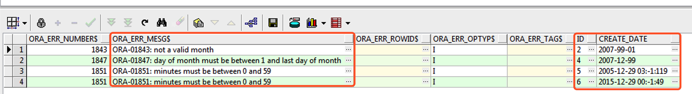

# 技术分享 | 如何校验 MySQL&#038;Oracle 时间字段合规性

**原文链接**: https://opensource.actionsky.com/%e6%8a%80%e6%9c%af%e5%88%86%e4%ba%ab-%e5%a6%82%e4%bd%95%e6%a0%a1%e9%aa%8c-mysqloracle-%e6%97%b6%e9%97%b4%e5%ad%97%e6%ae%b5%e5%90%88%e8%a7%84%e6%80%a7/
**分类**: MySQL 新特性
**发布时间**: 2023-06-26T00:53:20-08:00

---

> 
作者：余振兴
爱可生 DBA 团队成员，热衷技术分享、编写技术文档。
本文来源：原创投稿
- 爱可生开源社区出品，原创内容未经授权不得随意使用，转载请联系小编并注明来源。
# 背景信息
> 
在数据迁移或者数据库低版本升级到高版本过程中，经常会遇到一些由于低版本数据库参数设置过于宽松，导致插入的时间数据不符合规范的情况而触发报错，每次报错再发现处理起来较为麻烦，是否有提前发现这类不规范数据的方法，以下基于 Oracle 和 MySQL 各提供一种可行性方案作为参考。
# Oracle 时间数据校验方法
## 2.1 创建测试表并插⼊测试数据
`CREATE TABLE T1(ID NUMBER,CREATE_DATE VARCHAR2(20));
INSERT INTO T1 SELECT 1, '2007-01-01' FROM DUAL;
INSERT INTO T1 SELECT 2, '2007-99-01' FROM DUAL;            -- 异常数据
INSERT INTO T1 SELECT 3, '2007-12-31' FROM DUAL;
INSERT INTO T1 SELECT 4, '2007-12-99' FROM DUAL;            -- 异常数据
INSERT INTO T1 SELECT 5, '2005-12-29 03:-1:119' FROM DUAL;  -- 异常数据
INSERT INTO T1 SELECT 6, '2015-12-29 00:-1:49' FROM DUAL;   -- 异常数据
`
## 2.2 创建对该表的错误日志记录
- 
Oracle 可以调用 `DBMS_ERRLOG.CREATE_ERROR_LOG` 包对 SQL 的错误进行记录，用来记录下异常数据的情况，十分好用。
- 
参数含义如下
`T1` 为表名
- `T1_ERROR` 为对该表操作的错误记录临时表
- `DEMO` 为该表的所属用户
`EXEC DBMS_ERRLOG.CREATE_ERROR_LOG('T1','T1_ERROR','DEMO');
`
## 2.3 创建并插入数据到临时表，验证时间数据有效性
```
-- 创建临时表做数据校验
CREATE TABLE T1_TMP(ID NUMBER,CREATE_DATE DATE);
-- 插入数据到临时表验证时间数据有效性（增加LOG ERRORS将错误信息输出到错误日志表）
INSERT INTO T1_TMP 
SELECT ID, TO_DATE(CREATE_DATE, 'YYYY-MM-DD HH24:MI:SS')
FROM T1 
LOG ERRORS INTO T1_ERROR REJECT LIMIT UNLIMITED;
```
## 2.4 校验错误记录
```
SELECT * FROM DEMO.T1_ERROR;
```

其中 ID 列为该表的主键，可用来快速定位异常数据行。
# MySQL 数据库的方法
## 3.1 创建测试表模拟低版本不规范数据
`-- 创建测试表
SQL> CREATE TABLE T_ORDER(
ID BIGINT AUTO_INCREMENT PRIMARY KEY,
ORDER_NAME VARCHAR(64),
ORDER_TIME DATETIME);
-- 设置不严谨的SQL_MODE允许插入不规范的时间数据
SQL> SET SQL_MODE='STRICT_TRANS_TABLES,ALLOW_INVALID_DATES';
SQL> INSERT INTO T_ORDER(ORDER_NAME,ORDER_TIME) VALUES 
('MySQL','2022-01-01'),
('Oracle','2022-02-30'),
('Redis','9999-00-04'),
('MongoDB','0000-03-00');
-- 数据示例
SQL> SELECT * FROM T_ORDER;
+----+------------+---------------------+
| ID | ORDER_NAME | ORDER_TIME          |
+----+------------+---------------------+
|  1 | MySQL      | 2022-01-01 00:00:00 |
|  2 | Oracle     | 2022-02-30 00:00:00 |
|  3 | Redis      | 9999-00-04 00:00:00 |
|  4 | MongoDB    | 0000-03-00 00:00:00 |
+----+------------+---------------------+
`
### 3.2 创建临时表进行数据规范性验证
```
-- 创建临时表，只包含主键ID和需要校验的时间字段
SQL> CREATE TABLE T_ORDER_CHECK(
ID BIGINT AUTO_INCREMENT PRIMARY KEY,
ORDER_TIME DATETIME);
-- 设置SQL_MODE为5.7或8.0高版本默认值
SQL> SET SQL_MODE='ONLY_FULL_GROUP_BY,STRICT_TRANS_TABLES,NO_ZERO_IN_DATE,NO_ZERO_DATE,ERROR_FOR_DIVISION_BY_ZERO,NO_AUTO_CREATE_USER,NO_ENGINE_SUBSTITUTION';
-- 使用INSERT IGNORE语法插入数据到临时CHECK表，忽略插入过程中的错误
SQL> INSERT IGNORE INTO T_ORDER_CHECK(ID,ORDER_TIME) SELECT ID,ORDER_TIME FROM T_ORDER;
```
### 3.3 数据比对
> 
将临时表与正式表做关联查询，比对出不一致的数据即可。
`SQL> SELECT 
T.ID,
T.ORDER_TIME AS ORDER_TIME,
TC.ORDER_TIME AS ORDER_TIME_TMP
FROM T_ORDER T INNER JOIN T_ORDER_CHECK TC 
ON T.ID=TC.ID
WHERE T.ORDER_TIME<>TC.ORDER_TIME;
+----+---------------------+---------------------+
| ID | ORDER_TIME          | ORDER_TIME_TMP      |
+----+---------------------+---------------------+
|  2 | 2022-02-30 00:00:00 | 0000-00-00 00:00:00 |
|  3 | 9999-00-04 00:00:00 | 0000-00-00 00:00:00 |
|  4 | 0000-03-00 00:00:00 | 0000-00-00 00:00:00 |
+----+---------------------+---------------------+
`
# 一个取巧的小方法
> 
对时间字段用正则表达式匹配，对有严谨性要求的情况还是得用以上方式，正则匹配烧脑。
```
-- Oracle 数据库
SELECT * FROM  T1 WHERE NOT REGEXP_LIKE(CREATE_DATE,'^((?:19|20)\d\d)-(0[1-9]|1[012])-(0[1-9]|[12][0-9]|3[01])$');
ID CREATE_DATE
---------- --------------------
2 2007-99-01
4 2007-12-99
5 2005-12-29 03:-1:119
6 2015-12-29 00:-1:49
-- MySQL 数据库
-- 略，匹配规则还在调试中
```