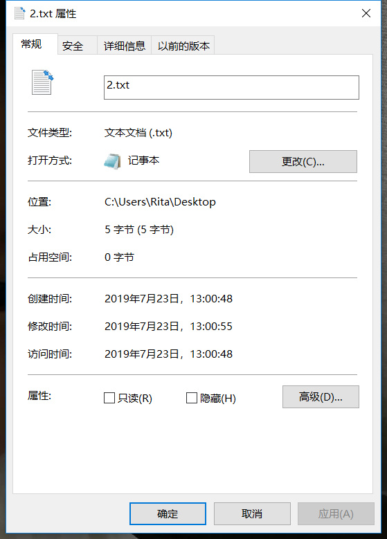

# 技术分享 | 如何验证 xtrabackup 原理图中文件顺序的正确性

**原文链接**: https://opensource.actionsky.com/20190801-mysql/
**分类**: MySQL 新特性
**发布时间**: 2019-08-01T00:46:33-08:00

---

**背景**
有时候我们需要获取文件的创建时间。
例如：我在研究 《xtrabackup 原理图》的时候，想通过观察确认 xtrabackup_log 是最早创建 并且是 最晚保存的文件。我们就需要知道 xtrabackup_logfile 这个文件的**创建时间戳**和**修改时间戳**。
											
**复习：Linux关于文件的三个时间戳**
Linux 的文件系统保存有三个时间戳，利用 stat 指令查看文件信息可以获取。他们分别是 ATime、MTime 和 CTime
- `[root@192-168-199-198 backups]# stat 2.txt `
- `  File: ‘2.txt’`
- `  Size: 16            Blocks: 8          IO Block: 4096   regular file`
- `Device: 821h/2081d    Inode: 15          Links: 1`
- `Access: (0644/-rw-r--r--)  Uid: (    0/    root)   Gid: (    0/    root)`
- `Access: 2019-07-23 12:12:14.276981038 +0800`
- `Modify: 2019-07-23 12:12:41.415980158 +0800`
- `Change: 2019-07-23 12:12:41.415980158 +0800`
- ` Birth: -`
- ATime ——文件的最近访问时间
只要读取文件，ATime 就会更新，对应的是 stat 命令获取的 Access 的值。
- `[root@192-168-199-198 backups]# cat 2.txt   #<-- 读取文件`
- `121231233123123`
- `[root@192-168-199-198 backups]# stat 2.txt`
- `  File: ‘2.txt’`
- `  Size: 16            Blocks: 8          IO Block: 4096   regular file`
- `Device: 821h/2081d    Inode: 15          Links: 1`
- `Access: (0644/-rw-r--r--)  Uid: (    0/    root)   Gid: (    0/    root)`
- `Access: 2019-07-23 12:22:09.644961733 +0800    #<-- 时间变化了`
- `Modify: 2019-07-23 12:12:41.415980158 +0800`
- `Change: 2019-07-23 12:12:41.415980158 +0800`
- ` Birth: -`
- MTime ——文件的内容最近修改的时间
当文件进行被写的时候，MTime 就会更新，对应的是 stat 命令获取的 Modify 的值。- `[root@192-168-199-198 backups]# echo hello_world > 2.txt    #<-- 修改文件内容`
- `[root@192-168-199-198 backups]# stat 2.txt`
- `  File: ‘2.txt’`
- `  Size: 12            Blocks: 8          IO Block: 4096   regular file`
- `Device: 821h/2081d    Inode: 15          Links: 1`
- `Access: (0644/-rw-r--r--)  Uid: (    0/    root)   Gid: (    0/    root)`
- `Access: 2019-07-23 12:22:09.644961733 +0800`
- `Modify: 2019-07-23 12:26:23.466953503 +0800    #<-- 时间变化了`
- `Change: 2019-07-23 12:26:23.466953503 +0800`
- ` Birth: -`
> 这里不要用vi修改文件内容，因为用vi修改文件内容有可能会引起Inode变更，也就是你观察的文件并不是之前的文件了！这个和vi的原理有关。
- CTime ——文件属性最近修改的时间
当文件的目录被修改，或者文件的所有者，权限等被修改时，CTime 也就会更新，对应的是 stat 命令获取的 Change 的值。- `[root@192-168-199-198 backups]# chmod 777 2.txt   #<-- 修改文件属性`
- `[root@192-168-199-198 backups]# stat 2.txt`
- `  File: ‘2.txt’`
- `  Size: 12            Blocks: 8          IO Block: 4096   regular file`
- `Device: 821h/2081d    Inode: 15          Links: 1`
- `Access: (0777/-rwxrwxrwx)  Uid: (    0/    root)   Gid: (    0/    root)`
- `Access: 2019-07-23 12:22:09.644961733 +0800`
- `Modify: 2019-07-23 12:26:23.466953503 +0800`
- `Change: 2019-07-23 12:30:35.830945320 +0800   #<-- 时间变化了`
- ` Birth: -`
**Linux 无法获取文件创建时间？**现在我们知道了Linux有三种时间，ATime、MTime 和 CTime，那么很好奇为什么没有 CRTime (创建时间) 呢？
											
对比 Windows 系统 (上图)，Windows 的 NTFS 文件系统里存在三个时间戳，其中就包含了“创建时间”，但在 Linux 的设计哲学上没有文件“创建时间”这么一说，所以早期版本的ext文件系统不支持文件“创建时间”。但从 ext4 版本开始，文件创建时间存储在ext4文件系统的inode中，所以** ext4 文件系统使用特殊方法也是可以获取文件的创建时间的。****也说明了，是否能获取文件的创建时间，和文件系统是否支持有关。**
**Linux 上获取文件创建时间的步骤**
CentOS7 Linux系统自带一个工具，叫做 debugfs，他可以查出 ext4 文件系统上的文件的创建时间。man debugfs 发现工具的描述是 “ext2/ext3/ext4 file system debugger”，所以他是不支持 xfs 文件系统的。> 常用的 xfs 文件系统是否支持获取文件创建时间，还有如何获取，这个暂时不清楚，需读者查阅官方文档
1. 获取文件的 inode 号
方法一：- `[root@192-168-199-198 backups]# stat /backups/2.txt`
- `  File: ‘/backups/2.txt’`
- `  Size: 30            Blocks: 8          IO Block: 4096   regular file`
- `Device: 821h/2081d    Inode: 14    #<--- 这个      Links: 1`
- `Access: (0644/-rw-r--r--)  Uid: (    0/    root)   Gid: (    0/    root)`
- `Access: 2019-07-23 12:49:11.462909146 +0800`
- `Modify: 2019-07-23 12:49:11.462909146 +0800`
- `Change: 2019-07-23 13:08:20.138871900 +0800`
- ` Birth: -`
方法二：- `[root@192-168-199-198 backups]# ls -i /backups/2.txt`
- `14 /backups/2.txt`
这里，我们获取的 inode 编号是 14。
2. 查找文件所在磁盘路径
- `[root@192-168-199-198 backups]# df -h`
- `Filesystem               Size  Used Avail Use% Mounted on`
- `/dev/mapper/centos-root   46G   23G   24G  49% /`
- `devtmpfs                 3.8G     0  3.8G   0% /dev`
- `tmpfs                    3.9G  8.0K  3.9G   1% /dev/shm`
- `tmpfs                    3.9G   12M  3.8G   1% /run`
- `tmpfs                    3.9G     0  3.9G   0% /sys/fs/cgroup`
- `/dev/sdb1                100G   77G   24G  77% /data2`
- `/dev/sdc1                 50G   53M   47G   1% /backups   #<--- 可以看出文件在这里面`
- `/dev/sda1               1014M  142M  873M  14% /boot`
- `tmpfs                    781M     0  781M   0% /run/user/0`
磁盘路径为 /dev/sdc1
3. 使用debugfs 查看文件创建时间
- `[root@192-168-199-198 backups]# debugfs -R 'stat <14>' /dev/sdc1`
- `debugfs 1.42.9 (28-Dec-2013)`
- `Inode: 14   Type: regular    Mode:  0644   Flags: 0x80000`
- `Generation: 737271740    Version: 0x00000000:00000001`
- `User:     0   Group:     0   Size: 30`
- `File ACL: 0    Directory ACL: 0`
- `Links: 1   Blockcount: 8`
- `Fragment:  Address: 0    Number: 0    Size: 0`
- ` ctime: 0x5d369644:211c1170 -- Tue Jul 23 13:08:20 2019`
- ` atime: 0x5d3691c7:6e5dbb68 -- Tue Jul 23 12:49:11 2019`
- ` mtime: 0x5d3691c7:6e5dbb68 -- Tue Jul 23 12:49:11 2019`
- `crtime: 0x5d3691c7:6e5dbb68 -- Tue Jul 23 12:49:11 2019`
- `Size of extra inode fields: 28`
- `EXTENTS:`
- `(0):35337`
**获取文件创建时间的脚本**
鉴于获取文件创建时间步骤操作有点麻烦 (虽然只有三步 ：) )
我这里提供了一个脚本
vi statx
- `#!/bin/sh`
- 
- `[ $# -ne 1 ] && echo "Usage:     $0 {FILENAME}" && exit 1`
- 
- `INODE=`ls -i $1 |awk '{print $1}'``
- `FILENAME=$1`
- 
- `#如果传入参数带/，则获取这个传入参数的目录路径并进入目录`
- ` `echo $FILENAME |grep / 1> /dev/null`  &&  { FPWD=${FILENAME%/*};FPWD=${FPWD:=/};cd ${FPWD};FPWD=`pwd`; }  || FPWD=`pwd``
- 
- 
- 
- `array=(`echo ${FPWD} | sed 's@/@ @g'`)`
- `array_length=${#array[@]}`
- 
- `for ((i=${array_length};i>=0;i--))`
- `do`
- `  unset array[$i]`
- `  SUBPWD=`echo " "${array[@]} | sed 's@ @/@g'``
- `  DISK=`df -h |grep ${SUBPWD}$ |awk '{print $1}'``
- `  [[ -n $DISK ]] && break`
- `done`
- 
- 
- 
- `#不是ext4就退出`
- `[[ "`mount |grep ${DISK} |awk '{print $5}'`" != "ext4" ]] && { echo ${DISK} is not mount on type ext4! Only ext4 file system support!;exit 2; }`
- 
- `debugfs -R "stat <${INODE}>" ${DISK}`
**使用：**
- `chmod +x statx`
- `mv statx /usr/sbin/statx`
- 
- `[root@192-168-199-198 backups]# statx 2.txt`
- `debugfs 1.42.9 (28-Dec-2013)`
- `Inode: 14   Type: regular    Mode:  0644   Flags: 0x80000`
- `Generation: 737271740    Version: 0x00000000:00000001`
- `User:     0   Group:     0   Size: 30`
- `File ACL: 0    Directory ACL: 0`
- `Links: 1   Blockcount: 8`
- `Fragment:  Address: 0    Number: 0    Size: 0`
- ` ctime: 0x5d369644:211c1170 -- Tue Jul 23 13:08:20 2019`
- ` atime: 0x5d36bb8f:56eb1e70 -- Tue Jul 23 15:47:27 2019`
- ` mtime: 0x5d3691c7:6e5dbb68 -- Tue Jul 23 12:49:11 2019`
- `crtime: 0x5d3691c7:6e5dbb68 -- Tue Jul 23 12:49:11 2019`
- `Size of extra inode fields: 28`
- `EXTENTS:`
- `(0):35337`
> ！！！请谨慎在生产环境使用，shell脚本没有做太多的异常处理，不支持管道，不支持目录也没有经过大量的测试
**实战**我们回过头来，用这个方法，确认《xtrabackup 原理图》是否准确。
我们需要验证的是:
**xtrabackup_log **是最早创建 并且是 最晚保存的文件
1. 创建备份- `DATE=`date "+%Y%m%d%H%M%S"``
- `xtrabackup -uroot -proot \`
- ` -S /tmp/mysql3306.sock \`
- ` --backup \`
- ` --target-dir=/backups/$DATE`
2. 查找所有备份文件的crtime
- `cd /backups/$DATE`
- `>/tmp/1.txt`
- `>/tmp/2.txt`
- `find . -type f >/tmp/1.txt`
- 
- `for i in `cat /tmp/1.txt``
- `do`
- `  { echo -n $i" ";statx $i 2>/dev/null |grep crtime |awk '{print $7}'; } >>/tmp/2.txt`
- `done`
- 
- `cat /tmp/2.txt |sort -k2 |less`
- `###以下为输出###`
- `./ibdata1 23:32:59`
- `./xtrabackup_logfile 23:32:59 #<---可以看出这个文件是最早创建的`
- `./mysql/engine_cost.ibd 23:33:00`
- `./mysql/gtid_executed.ibd 23:33:00`
- `./mysql/help_category.ibd 23:33:00`
- `./mysql/help_keyword.ibd 23:33:00`
- `./mysql/help_relation.ibd 23:33:00`
- `./mysql/help_topic.ibd 23:33:00`
- `./mysql/innodb_index_stats.ibd 23:33:00`
- `./mysql/innodb_table_stats.ibd 23:33:00`
- `./mysql/plugin.ibd 23:33:00`
- `./mysql/server_cost.ibd 23:33:00`
- `./mysql/servers.ibd 23:33:00`
- `./mysql/slave_master_info.ibd 23:33:00`
- `./mysql/slave_relay_log_info.ibd 23:33:00`
- `./mysql/slave_worker_info.ibd 23:33:00`
- `./mysql/time_zone.ibd 23:33:00`
- `./mysql/time_zone_leap_second.ibd 23:33:00`
- `...`
- `./zabbix/trigger_tag.frm 23:33:09`
- `./zabbix/users.frm 23:33:09`
- `./zabbix/users_groups.frm 23:33:09`
- `./zabbix/usrgrp.frm 23:33:09`
- `./zabbix/valuemaps.frm 23:33:09`
- `./zabbix/widget_field.frm 23:33:09`
- `./zabbix/widget.frm 23:33:09`
3. 查找所有备份文件的mtime
- `>/tmp/1.txt`
- `>/tmp/2.txt`
- `find . -type f >/tmp/1.txt`
- 
- `for i in `cat /tmp/1.txt``
- `do`
- `  { echo -n $i" ";statx $i 2>/dev/null |grep mtime |awk '{print $7}'; } >>/tmp/2.txt`
- `done`
- 
- `cat /tmp/2.txt |sort -k2 |less`
- `###以下为输出###`
- `./ibdata1 23:33:00`
- `./mysql/engine_cost.ibd 23:33:00`
- `./mysql/gtid_executed.ibd 23:33:00`
- `./mysql/help_category.ibd 23:33:00`
- `./mysql/help_keyword.ibd 23:33:00`
- `./mysql/help_relation.ibd 23:33:00`
- `./mysql/help_topic.ibd 23:33:00`
- `./mysql/innodb_index_stats.ibd 23:33:00`
- `./mysql/innodb_table_stats.ibd 23:33:00`
- `./mysql/plugin.ibd 23:33:00`
- `...`
- `./xtrabackup_logfile 23:33:09 #<---可以看出这个文件是最后修改和保存的`
- `./zabbix/acknowledges.frm 23:33:09`
- `./zabbix/actions.frm 23:33:09`
- `...`
- `./zabbix/users_groups.frm 23:33:09`
- `./zabbix/usrgrp.frm 23:33:09`
- `./zabbix/valuemaps.frm 23:33:09`
- `./zabbix/widget_field.frm 23:33:09`
- `./zabbix/widget.frm 23:33:09`
最后，我们通过文件的创建时间和修改时间，实战地验证了《xtrabackup 原理图》的第一和第七步顺序的正确性。
**近期社区动态**
