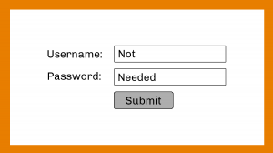

# 技术分享 | 安全地无密码登录 MySQL

**原文链接**: https://opensource.actionsky.com/20191108-mysql/
**分类**: MySQL 新特性
**发布时间**: 2019-11-08T01:20:50-08:00

---

**作者：****丹尼尔·古斯曼布尔戈斯**
原文：https://www.percona.com/blog/2019/11/01/use-mysql-without-a-password/
											
有人说最好的密码就是你不用记忆的。auth_socket 插件和 MariaDB 的 unix_socket 让这种想法在 MySQL 上变成可能。
- **auth_socket：https://dev.mysql.com/doc/refman/8.0/en/socket-pluggable-authentication.html**
- **unix_socket：https://mariadb.com/kb/en/library/authentication-plugin-unix-socket/**
这两个插件虽然不是新发布，但在 MariaDB 10.4 上 unix_socket 已经默认安装，并且是身份验证方法之一。
**插件的安装和使用**如上所述，这不是新功能，即使使用 Debian 团队维护的 .deb 安装包安装 MySQL，也会创建 root 用户，以便使用套接字身份验证，对于 MySQL 和 MariaDB 都是如此：- `root@app:~# apt-cache show mysql-server-5.7 | grep -i maintainers`
- `Original-Maintainer: Debian MySQL Maintainers <pkg-mysql-maint@lists.alioth.debian.org>`
- `Original-Maintainer: Debian MySQL Maintainers <<ahref="mailto:pkg-mysql-maint@lists.alioth.debian.org">pkg-mysql-maint@lists.alioth.debian.org</a>>`
安装后，root 用户验证过程如下：- `root@app:~# whoami`
- `root`
- `root@app:~# mysql`
- `Welcome to the MySQL monitor.  Commands end with ; or \g.`
- `Your MySQL connection id is 4`
- `Server version: 5.7.27-0ubuntu0.16.04.1 (Ubuntu)`
- 
- `Copyright (c) 2000, 2019, Oracle and/or its affiliates. All rights reserved.`
- `Oracle is a registered trademark of Oracle Corporation and/or its`
- `affiliates. Other names may be trademarks of their respective`
- `owners.`
- 
- `Type 'help;' or '\h' for help. Type '\c' to clear the current input statement.`
- 
- `mysql> select user, host, plugin, authentication_string from mysql.user where user = 'root';`
- `+------+-----------+-------------+-----------------------+`
- `| user | host      | plugin | authentication_string |`
- `+------+-----------+-------------+-----------------------+`
- `| root | localhost | auth_socket |                       |`
- `+------+-----------+-------------+-----------------------+`
- `1 row in set (0.01 sec)`
与 MariaDB 相同：- `10.0.38-MariaDB-0ubuntu0.16.04.1 Ubuntu 16.04`
- 
- `MariaDB [(none)]> show grants;`
- `+------------------------------------------------------------------------------------------------+`
- `| Grants for root@localhost                                                                      |`
- `+------------------------------------------------------------------------------------------------+`
- `| GRANT ALL PRIVILEGES ON *.* TO 'root'@'localhost' IDENTIFIED VIA unix_socket WITH GRANT OPTION |`
- `| GRANT PROXY ON ''@'%' TO 'root'@'localhost' WITH GRANT OPTION                                  |`
- `+------------------------------------------------------------------------------------------------+`
- `2 rows in set (0.00 sec)`
对于 Percona Server，来自官方 Percona Repo 的 .deb 软件包还将 root 用户身份验证设置为 auth_socket。这是适用于 MySQL 8.0.16-7 和 Ubuntu 16.04 的 Percona Server 的示例：
- `root@app:~# whoami`
- `root`
- `root@app:~# mysql`
- `Welcome to the MySQL monitor.  Commands end with ; or \g.`
- `Your MySQL connection id is 9`
- `Server version: 8.0.16-7 Percona Server (GPL), Release '7', Revision '613e312'`
- 
- `Copyright (c) 2009-2019 Percona LLC and/or its affiliates`
- `Copyright (c) 2000, 2019, Oracle and/or its affiliates. All rights reserved.`
- `Oracle is a registered trademark of Oracle Corporation and/or its`
- `affiliates. Other names may be trademarks of their respective`
- `owners.`
- 
- `Type 'help;' or '\h' for help. Type '\c' to clear the current input statement.`
- 
- `mysql> select user, host, plugin, authentication_string from mysql.user where user ='root';`
- `+------+-----------+-------------+-----------------------+`
- `| user | host      | plugin | authentication_string |`
- `+------+-----------+-------------+-----------------------+`
- `| root | localhost | auth_socket |                       |`
- `+------+-----------+-------------+-----------------------+`
- `1 row in set (0.00 sec)`
那么，为何如此神奇？该插件使用 SO_PEERCRED 套接字选项，来检查 Linux 用户是否与 MySQL 用户匹配，以获取有关运行客户端程序的用户信息。因此该插件只能在支持 SO_PEERCRED 选项的系统上使用，例如：Linux。SO_PEERCRED 套接字选项允许检索连接到套接字的进程 uid。然后，他可以获取与 uid 关联的用户名。- `vagrant@mysql1:~$ whoami`
- `vagrant`
- `vagrant@mysql1:~$ mysql`
- `ERROR 1698 (28000): Access denied for user 'vagrant'@'localhost'`
由于 MySQL 不存在 &#8216;vagrant&#8217; 用户，因此访问被拒绝。让我们创建用户再次尝试：- `MariaDB [(none)]> GRANT ALL PRIVILEGES ON *.* TO 'vagrant'@'localhost' IDENTIFIED VIA unix_socket;`
- `Query OK, 0 rows affected (0.00 sec)`
- 
- `vagrant@mysql1:~$ mysql`
- `Welcome to the MariaDB monitor.  Commands end with ; or \g.`
- `Your MariaDB connection id is 45`
- `Server version: 10.0.38-MariaDB-0ubuntu0.16.04.1 Ubuntu 16.04`
- `Copyright (c) 2000, 2018, Oracle, MariaDB Corporation Ab and others.`
- `Type 'help;' or '\h' for help. Type '\c' to clear the current input statement.`
- 
- `MariaDB [(none)]> show grants;`
- `+---------------------------------------------------------------------------------+`
- `| Grants for vagrant@localhost                                                    |`
- `+---------------------------------------------------------------------------------+`
- `| GRANT ALL PRIVILEGES ON *.* TO 'vagrant'@'localhost' IDENTIFIED VIA unix_socket |`
- `+---------------------------------------------------------------------------------+`
- `1 row in set (0.00 sec)`
**成功！！**
现在，让我们在 CentOS 7 上安装的 Percona Server 版本 MySQL 8 上再试一试：- `mysql> show variables like '%version%comment';`
- `+-----------------+---------------------------------------------------+`
- `| Variable_name   | Value                                   |`
- `+-----------------+---------------------------------------------------+`
- `| version_comment | Percona Server (GPL), Release 7, Revision 613e312 |`
- `+-----------------+---------------------------------------------------+`
- `1 row in set (0.01 sec)`
- 
- `mysql> CREATE USER 'percona'@'localhost' IDENTIFIED WITH auth_socket;`
- `ERROR 1524 (HY000): Plugin 'auth_socket' is not loaded`
失败了，原因是插件未加载：- `mysql> pager grep socket`
- `PAGER set to 'grep socket'`
- `mysql> show plugins;`
- `47 rows in set (0.00 sec)`
让我们在运行时添加插件：- `mysql> nopager`
- `PAGER set to stdout`
- `mysql> INSTALL PLUGIN auth_socket SONAME 'auth_socket.so';`
- `Query OK, 0 rows affected (0.00 sec)`
- 
- `mysql> pager grep socket; show plugins;`
- `PAGER set to 'grep socket'`
- `| auth_socket  | ACTIVE | AUTHENTICATION | auth_socket.so | GPL |`
- `48 rows in set (0.00 sec)`
现在我们有了所需的一切。让我们再试一次：- `mysql> CREATE USER 'percona'@'localhost' IDENTIFIED WITH auth_socket;`
- `Query OK, 0 rows affected (0.01 sec)`
- `mysql> GRANT ALL PRIVILEGES ON *.* TO 'percona'@'localhost';`
- `Query OK, 0 rows affected (0.01 sec)`
现在我们可以以操作系统用户 &#8220;percona&#8221; 的身份登录。- `[percona@ip-192-168-1-111 ~]$ whoami`
- `percona`
- `[percona@ip-192-168-1-111 ~]$ mysql -upercona`
- `Welcome to the MySQL monitor.  Commands end with ; or \g.`
- `Your MySQL connection id is 19`
- `Server version: 8.0.16-7 Percona Server (GPL), Release 7, Revision 613e312`
- `Type 'help;' or '\h' for help. Type '\c' to clear the current input statement.`
- 
- `mysql> select user, host, plugin, authentication_string from mysql.user where user ='percona';`
- `+---------+-----------+-------------+-----------------------+`
- `| user    | host   | plugin   | authentication_string |`
- `+---------+-----------+-------------+-----------------------+`
- `| percona | localhost | auth_socket |                       |`
- `+---------+-----------+-------------+-----------------------+`
- `1 row in set (0.00 sec)`
**再次成功！**
问题：我可以尝试以其他的系统用户的身份使用 percona 登录吗？- `[percona@ip-192-168-1-111 ~]$ logout`
- `[root@ip-192-168-1-111 ~]# mysql -upercona`
- `ERROR 1698 (28000): Access denied for user 'percona'@'localhost'`
**不，你不能！**
**结论**
MySQL 在多个方面都足够灵活，其中之一就是身份验证方法。正如我们在这篇文章中所看到的，依靠系统用户可以在没有密码的情况下进行访问。这在几种情况下很有用，但仅提及一种情况：从 RDS / Aurora 迁移到常规 MySQL 并使用 IAM 数据库身份验证保持访问而无需使用密码。
**社区近期动态**
**No.1**
**Mycat 问题免费诊断**
诊断范围支持：
Mycat 的故障诊断、源码分析、性能优化
服务支持渠道：
技术交流群，进群后可提问
QQ群（669663113）
社区通道，邮件&电话
osc@actionsky.com
现场拜访，线下实地，1天免费拜访
关注“爱可生开源社区”公众号，回复关键字“Mycat”，获取活动详情。
**No.2**
**社区技术内容征稿**
征稿内容：
格式：.md/.doc/.txt
主题：MySQL、分布式中间件DBLE、数据传输组件DTLE相关技术内容
要求：原创且未发布过
奖励：作者署名；200元京东E卡+社区周边
投稿方式：
邮箱：osc@actionsky.com
格式：[投稿]姓名+文章标题
以附件形式发送，正文需注明姓名、手机号、微信号，以便小编及时联系