# 技术分享 | 实测在 after_sync 中使用 gh-ost是如何丢数据的

**原文链接**: https://opensource.actionsky.com/20211111-aftersync/
**分类**: 技术干货
**发布时间**: 2021-11-10T22:37:22-08:00

---

作者：赵黎明
爱可生 MySQL DBA 团队成员，熟悉 Oracle、MySQL 等数据库，擅长数据库性能问题诊断、事务与锁问题的分析等，负责处理客户 MySQL 及我司自研 DMP 平台日常运维中的问题，对开源数据库相关技术非常感兴趣。
本文来源：原创投稿
*爱可生开源社区出品，原创内容未经授权不得随意使用，转载请联系小编并注明来源。
## 背景
最近，IMG 的姜老师发布了一篇关于使用 gh-ost 会丢数据的文章（gh-ost 翻车！使用后导致数据丢失！），大致结论就是：在 MySQL AFTER_SYNC的 场景下，使用 gh-ost 进行表结构变更（包括最新 GA 的1.1.2版本在内），可能会导致数据丢失，还引起大家在微信群内展开了一些讨论。得知这个消息，还是觉得有些意外的，毕竟对于大部分 DBA 来说，gh-ost 属于比较常用的 DDL 工具，会用其替代 pt-osc 或 MySQL 自带的 online ddl 。出于好奇，去 gh-ost 的 Gtihub 主页上看了下，还真有相关的 issue ，并且已经有人提交了 fix 的 PR （目前该 fix 尚未得到官方回应）
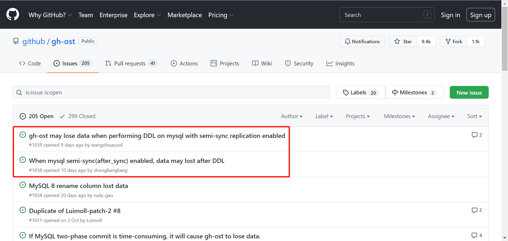
根据文中提到的复现方法，我们来测试下，看看数据是不是真的会丢，会丢失到什么程度呢
## 环境准备
#### 下载最新 GA 的源码包(v1.1.2)
`git clone https://github.com/github/gh-ost.git
`
#### 编译安装 gh-ost
安装很简单，官方提供了编译脚本，只需执行 master 目录下的 build.sh 即可，执行后会自动在 /tmp 下生成 gh-ost-release 目录，包括可执行二进制文件、二进制 tar 包、以及一个 gh-ostxxxxxx 的文件夹
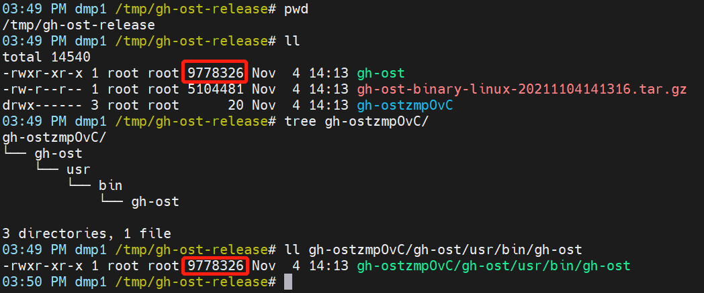
#### 搭建 MySQL 5.7 主从环境(1主1从)
搭建过程略&#8230;
确认从库复制线程正常
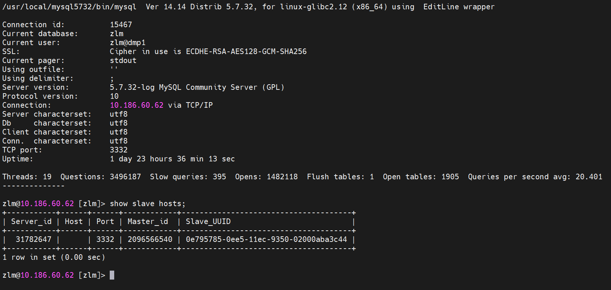
确认半同步状态正常
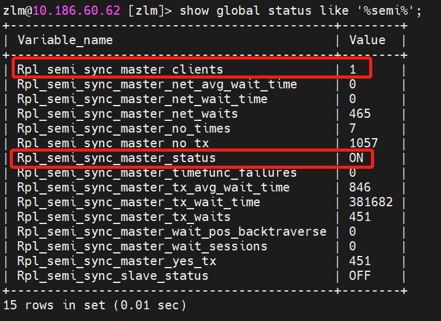
确认已配置AFTER_SYNC模式的半同步
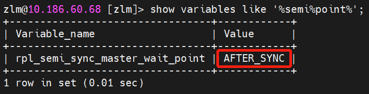
## 开始验证
1、修改 gh-ost 源码文件./gh-ost-master/go/logic/migarator.go ，在 addDMLEventsListener 函数前增加一个等待时间，此处修改为 sleep 60s
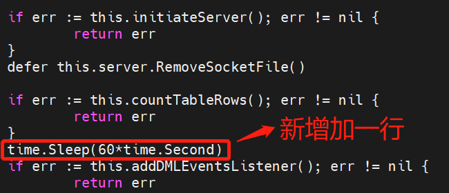
2、在主库上配置半同步超时参数（注意，此处设置为一个大于 60s 的值，比如120000，即120s），为什么要设置大于 60s 呢？后面会解释
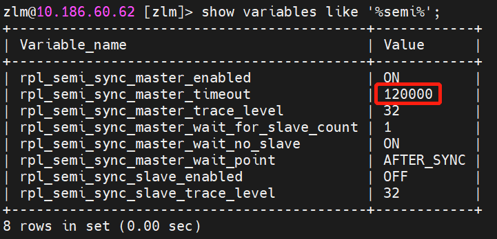
3、创建测试表并插入 1 条数据
`zlm@10.186.60.62 [zlm]> show create table t\G
*************************** 1. row ***************************
Table: t
Create Table: CREATE TABLE `t` (
`id` int(11) NOT NULL,
`name` varchar(10) NOT NULL,
PRIMARY KEY (`id`)
) ENGINE=InnoDB DEFAULT CHARSET=utf8mb4
1 row in set (0.00 sec)
zlm@10.186.60.62 [zlm]> insert into t(id,name) values(1,'a');
Query OK, 1 row affected (0.05 sec)
zlm@10.186.60.62 [zlm]> select * from t;
+----+------+
| id | name |
+----+------+
|  1 | a    |
+----+------+
1 row in set (0.00 sec)
`
4、运行 gh-ost ，对测试表执行 DDL ，这里选择一个最简单的“alter table t engine=innodb;”进行测试
`/tmp/gh-ost-release# ./gh-ost --execute --initially-drop-ghost-table --ok-to-drop-table --debug --allow-on-master --host=127.0.0.1 --port=3332 --user=zlm --password
`
命令执行后，会创建_t_gho、_t_ghc的中间表，随后进入 Listening 状态
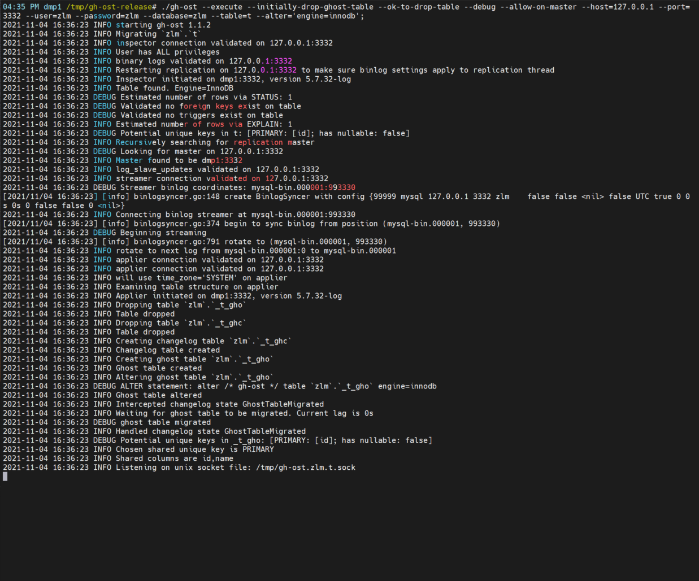
用 watch 命令可以实时观察这 2 张表的变化
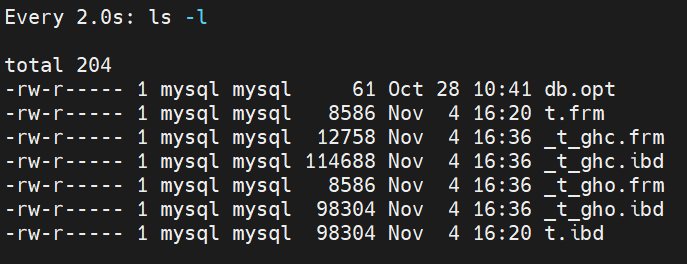
5、将从库上的 IO 线程停止（模拟半同步从库与主库通信异常）
`zlm@10.186.60.68 [zlm]> stop slave io_thread;
`
6、主库执行 insert 语句（插入一条包含更大主键值的记录，如：id=2）
SQL 执行后会处于一直等待的状态，就像在等待事务锁释放一样
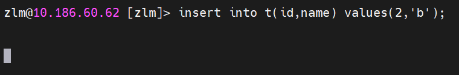
实际上，它是在等待从库的 ACK ，之前配置的半同步超时时间是 120s ，只有超过这个时间，主库才会降级为异步复制，并进行事务提交（innodb 引擎层）
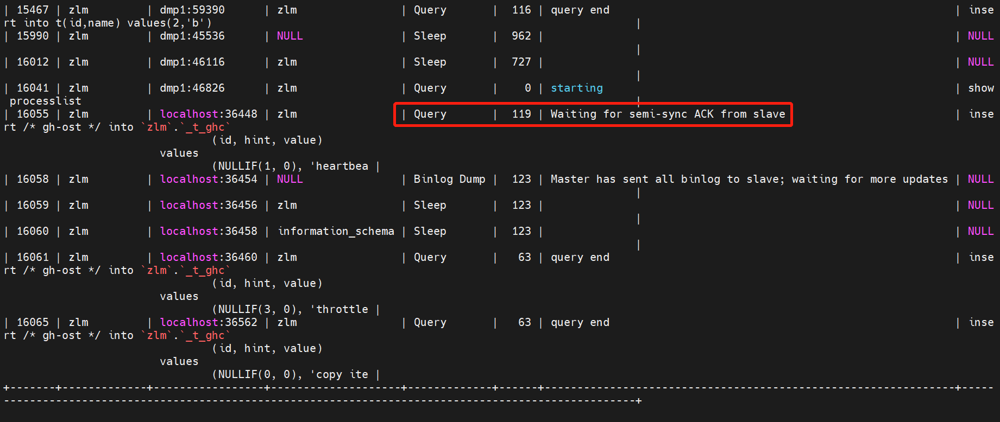
下一秒，事务提交完毕后，对表的 DDL 变更也完成了，将原 t 表 rename 为_t_del表，将_t_gho表 rename 为新t表
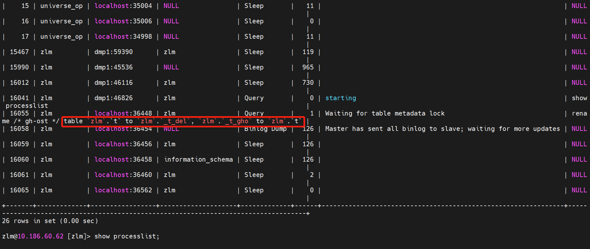
由于 gh-ost 命令配置了 &#8211;ok-to-drop-table ，DDL 完成后会将_t_del直接删除（生产环境建议保留），最终仅剩下变更后的新 t 表
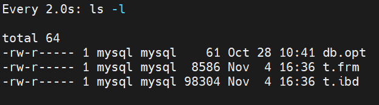
7、观察测试表数据变化
可以看到，这个事务最后是提交完成的，执行了1分56秒多，大致等于之前配置的半同步超时时间 120s ，但在完成 DDL 变更后，发现t表中并没有 id=2 的记录，即数据已经丢失了，测试结果符合预期
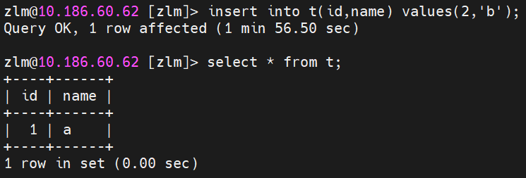
## 原理分析
之前在源码中配置了 sleep 60s ，从打印的日志中可以看到，在 gh-ost 命令执行1分钟后，即 16:37:23 开始进行了数据迁移（将原表数据写入影子表_t_gho），在获取原表数据时的取值范围是[1]..[1]，id=2的新值（最大值）没有被获取到，为什么呢？
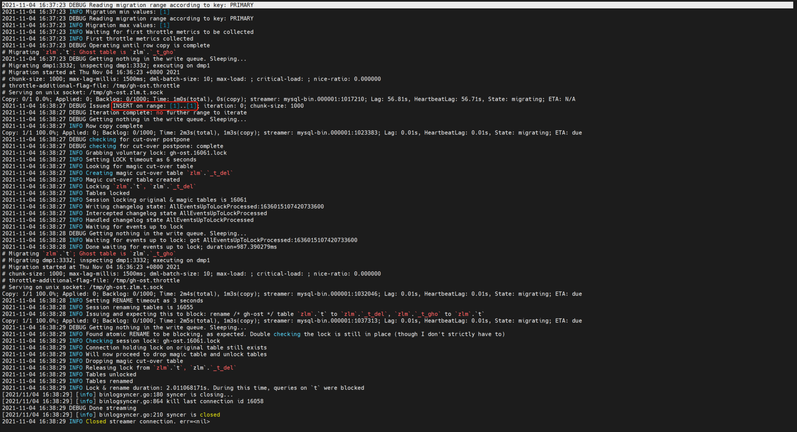
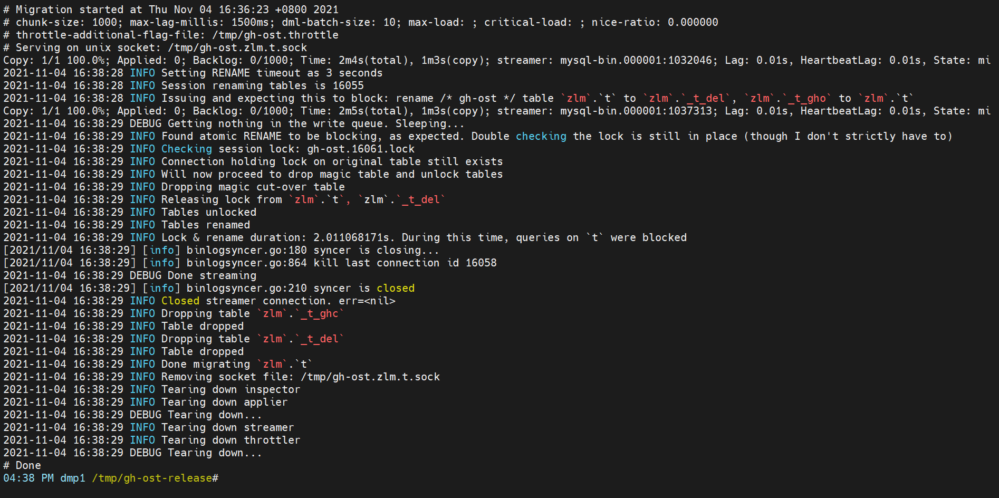
主库上配置了 autocommit=1 ，当事务语句执行后会自动进入提交流程（two-phase commit），解析 binlog 可以观察到事务写入 binlog 的具体时间，状态是 COMMIT 的，且包含 Xid ，而此时的 redo log 中，该事务仍然没有被“封口”，不能返回 ok 给客户端
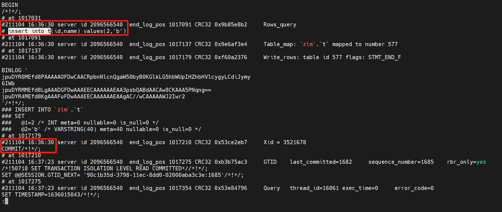
由于主库配置的半同步超时时间大于gh-ost获取原表首尾记录临界值的开始时间（120s > 60s），gh-ost在读取Range时，主库事务还未真正提交（after_sync增强半同步要求至少有一个从库返回ACK后，才能进行引擎层提交，这是保证MySQL 5.7 Lossless semi-sync replicaiton的基础），gh-ost无法读取到这个新插入id=2的事务，最终导致这条记录丢失，如果这个新插入的事务包含N条记录，那么这N条记录都会一起丢失。
为何是60s？主要是为了便于观察和计算，日志上正好相差1分钟，当然也可以设置成30s，然后把半同步超时时间设置为40s、50s、60s等，经过多轮测试，只要这个时间小于半同步超时的时间，这个场景基本可以稳定复现，就不进行扩展了，感兴趣的小伙伴可以自行测试；相反地，当这个时间大于半同步超时的时间，则不会丢失数据，因为gh-ost在获取Range值时，事务在引擎层已经提交完毕
## 如何修复
Github 上已有人提供了修复方案，逻辑就是在 gh-ost 获取边界值 Range 的时候，加上一个共享读锁，并且加上了一个重试机制，示例如下：
修改./gh-ost-master/go/sql/builder.go 文件
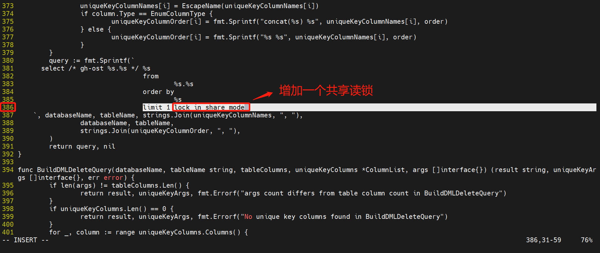
修改./gh-ost-master/go/logic/migrator.go 文件
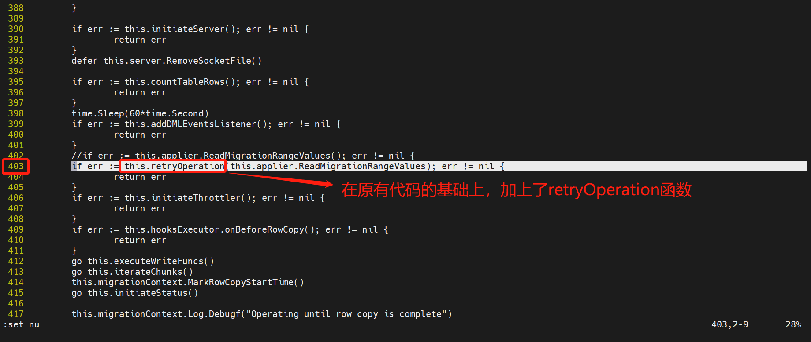
重新编译 gh-ost 后再次验证，同样是采用之前的配置，事务执行了1分53秒多，这次数据并没有丢失，看来修复方案有效
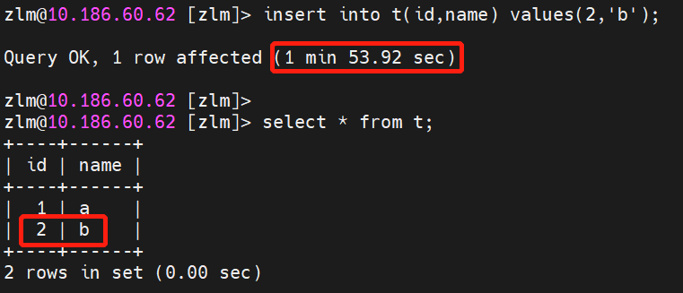
再来看下 gh-ost 打印的日志，在调整 Range 值得获取方式后，即使是 after_sync 模式下，也能使 Range 读取到正确的值，确保最终的数据一致性
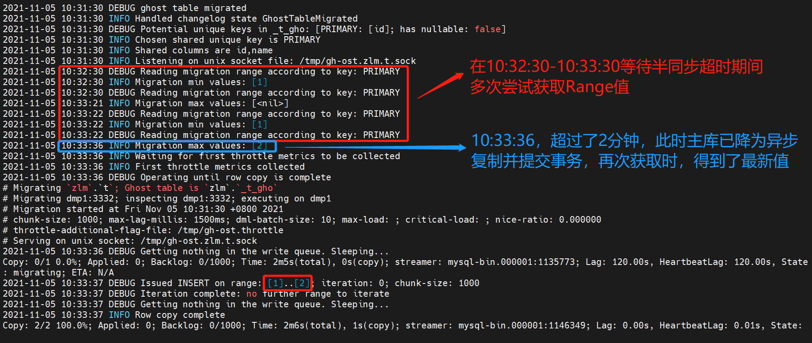
## 注意事项
- 
rpl_semi_sync_master_timeout 只需在主库修改即可
- 
需设置 rpl_semi_sync_master_wait_no_slave=on ，如果为 off ，即使停止从库 IO 线程，也不会出现等待 ACK 超时的现象，主库会直接降级，就无法观察到数据丢失了，之前没注意这个参数，以为是代码改错了，走了些弯路
- 
如果有多个从库，要考虑 rpl_semi_sync_master_wait_for_slave_count 的值对 ACK 的影响
总结
本文对使用 gh-ost 丢数据这一现象进行了测试，证明确有其事，不过要稳定复现需要满足一定条件，如：
- 
使用 MySQL 5.7 及以上版本，并开启了 AFTER_SYNC 的半同步复制
- 
半同步主库获取从库 ACK 超时并降级的时间晚于 gh-ost 获取 Range 值的时间
- 
事务中包含 insert ，并且插入的值涉及到 according key 最大值的统计
最后通过修改源码的方式，测试了 fix 方案的可行性，鉴于 AFTER_SYNC 是目前普遍存在的应用场景，而 gh-ost 又是一款非常好用的工具，以上条件其实还是比较容易满足的，不知道的人会踩坑，因此，希望官方可以尽快采纳 fix 方案，并将其合并到后续 GA 版本中。