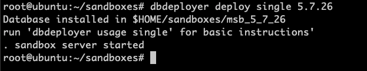
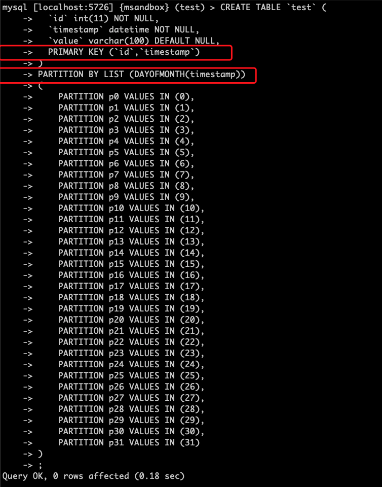
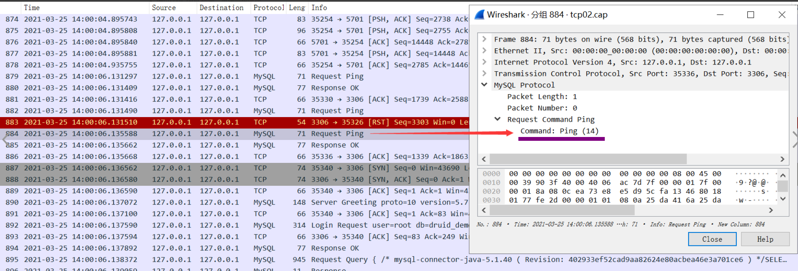
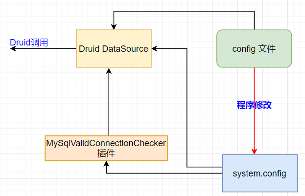

# 技术分享 | 探究 Druid 连接池探活方式的实现

**原文链接**: https://opensource.actionsky.com/20210531-mysql/
**分类**: MySQL 新特性
**发布时间**: 2021-05-31T00:56:01-08:00

---

作者：刘开洋
爱可生交付服务团队北京 DBA，对数据库及周边技术有浓厚的学习兴趣，喜欢看书，追求技术。
本文来源：原创投稿
*爱可生开源社区出品，原创内容未经授权不得随意使用，转载请联系小编并注明来源。
最近有研究到 Druid 的问题，在进行探活检测时无法正常输出 select x，解决问题后就跑来跟大家分享下 Druid 探活机制的实现。
## 一、Druid 是什么？Druid 对连接的探活又是怎么实现的呢？
Druid 是阿里巴巴开源的一款 JDBC 组件，是一款数据库连接池，对MySQL的适配性和功能很强大，包括监控数据库访问性能、 数据库密码加密、SQL执行日志、以及拓展监控的实现等等，应用到MySQL还是很香的。
通过对官方源码(详见参考)进行一些简单分析了解到，使用 Druid 在对连接进行探活时，涉及到以下两个参数的调整：
| 参数 | 说明 |
| --- | --- |
| druid.validationQuery = select 1 | 用来检测连接是否有效的sql，要求是一个查询语句，常用select &#8216;x&#8217;。如果validationQuery为null，testOnBorrow、testOnReturn、testWhileIdle都不会起作用。 |
| druid.mysql.usePingMethod = false | 关闭 mysql com_ping 探活机制，需启用 validationQuery = select x，开启 validationQuery 探活机制 |
对其他参数的说明参考配置属性列表：https://github.com/alibaba/druid/wiki/DruidDataSource%E9%85%8D%E7%BD%AE%E5%B1%9E%E6%80%A7%E5%88%97%E8%A1%A8

在源码中得到的信息是 Druid 依次初始化加载 initValidConnectionChecker(); 和 validationQueryCheck(); 在 ValidConnectionChecker 中 默认 com_ping 是开启的，就选用了 com_ping 作为默认探活，下面我们来分别观测一下 com_ping 和 validationquery 的输出。
我们接着往下读看看这两个参数的功能具体是怎么实现的。
## 二、验证
在测试中来敲定这两种探活机制参数的作用吧。这里使用的版本是 Druid 1.2.5
## 1、com_ping方式需要通过抓包方式验证
通过 tcpdump 抓包得到在 Druid 连接中网络包的传输，之后使用 wireshark 进行分析查看 Druid 发送到 MySQL 的 Request 包。

在MySQL Protocol 的 Request Command Ping 中得到 Ping (14)。
## 2、validationquery 方式通过使用 MySQL general log 来验证
`public MySqlValidConnectionChecker(){
try {
clazz = Utils.loadClass("com.mysql.jdbc.MySQLConnection");
if (clazz == null) {
clazz = Utils.loadClass("com.mysql.cj.jdbc.ConnectionImpl");
}
if (clazz != null) {
ping = clazz.getMethod("pingInternal", boolean.class, int.class);
}
if (ping != null) {
usePingMethod = true;
}
} catch (Exception e) {
LOG.warn("Cannot resolve com.mysql.jdbc.Connection.ping method.  Will use 'SELECT 1' instead.", e);
}
//注意这里是从系统变量中获取的 System.getProperties()。
configFromProperties(System.getProperties());
}
@Override
public void configFromProperties(Properties properties) {
//从系统变量中获取的，所以应该是在项目的启动脚本中添加 usePingMethod=false
String property = properties.getProperty("druid.mysql.usePingMethod");
if ("true".equals(property)) {
setUsePingMethod(true);
} else if ("false".equals(property)) {
setUsePingMethod(false);
}
}
public boolean isValidConnection(Connection conn, String validateQuery, int validationQueryTimeout) throws Exception {
if (conn.isClosed()) {
return false;
}
if (usePingMethod) {
if (conn instanceof DruidPooledConnection) {
conn = ((DruidPooledConnection) conn).getConnection();
}
if (conn instanceof ConnectionProxy) {
conn = ((ConnectionProxy) conn).getRawObject();
}
// 当前的 conn 是否是 com.mysql.jdbc.MySQLConnection(or com.mysql.cj.jdbc.ConnectionImpl)
if (clazz.isAssignableFrom(conn.getClass())) {
if (validationQueryTimeout 
validationQueryTimeout = DEFAULT_VALIDATION_QUERY_TIMEOUT;
}
try {
// 使用反射调用MySQLConnection.pingInternal 方法，检查连接有效性，并且会刷新连接的空闲时间，如果失败则会抛出异常，上层捕获
ping.invoke(conn, true, validationQueryTimeout * 1000);
} catch (InvocationTargetException e) {
Throwable cause = e.getCause();
if (cause instanceof SQLException) {
throw (SQLException) cause;
}
throw e;
}
return true;
}
}
String query = validateQuery;
// 当usePingMethod=false 或者 conn 不是 com.mysql.jdbc.MySQLConnection （or com.mysql.cj.jdbc.ConnectionImpl）会执行一下方法
if (validateQuery == null || validateQuery.isEmpty()) {
query = DEFAULT_VALIDATION_QUERY;
}
Statement stmt = null;
ResultSet rs = null;
try {
stmt = conn.createStatement();
if (validationQueryTimeout > 0) {
stmt.setQueryTimeout(validationQueryTimeout);
}
// 执行 select x 的query ，并且会刷新连接的空闲时间
//  如果失败则会抛出异常，上层捕获
rs = stmt.executeQuery(query);
return true;
} finally {
JdbcUtils.close(rs);
JdbcUtils.close(stmt);
}
}
`
druid.validationQuery = SELECT 1 启用无法直接使用validationquery，需要通过配置关闭com_ping(druid.mysql.usePingMethod = false)来实现。这个参数可以直接加在配置文件中，但是使用需要注意一点，如果配置关闭com_ping也无法使用validationquery进行探活查询，则可能是程序本身的问题。
程序代码可能存在参数值只拉取 configFromPropety 的参数信息导致(druid.mysql.usePingMethod = false)参数失效，以下是我程序修改后的连接示意图：

`// 原程序
public DruidDriverTest() {
logger = Logger.getLogger("druid_driver_test");
this.dataSource = new DruidDataSource();
// Druid 配置文件地址.
this.configPath = "./config.properties";
···
#############################################
// 修改后
public DruidDriverTest() {
logger = Logger.getLogger("druid_driver_test");
// Druid 配置文件地址.
this.configPath = "config.properties";
try (BufferedReader bufferedReader = new BufferedReader(new FileReader(configPath))) {
// 将配置文件读入到 system.config 中
System.getProperties().load(bufferedReader);
} catch (IOException e) {
e.printStackTrace();
return;
}
···
`
原程序中：Druid 默认从 config 配置文件 中拉配置参数信息到 DruidDataSource 中，而 usePingMethod 参数需要使用 MySqlValidConnectionChecker 插件加载读取到 DruidDataSource 中，但是config没有加载到System. getProperties()中，因此 Druid 不能识别 config 配置文件 中的 usePingMethod 参数。 Druid 加载  DruidDataSource 中的配置信息进行一系列行为。
修改后：建立 config配置文件加载到 system 变量中的连接，再使用 MySqlValidConnectionChecker 插件 加载到 DruidDataSource 中。
`[root@yang-02 druid_demo-master]# mvn exec:java -Dexec.mainClass="test.App"
[INFO] Scanning for projects...                                                                
[INFO] ------------------------------------------------------------------------
[INFO] Building druid-demo 1.0-SNAPSHOT
[INFO] ------------------------------------------------------------------------
[INFO] --- exec-maven-plugin:3.0.0:java (default-cli) @ druid-demo ---
[2021-04-28 17:23:06] [SEVERE] minEvictableIdleTimeMillis should be greater than 30000
[2021-04-28 17:23:06] [SEVERE] keepAliveBetweenTimeMillis should be greater than 30000
[2021-04-28 17:23:06] [INFO] start test
[2021-04-28 17:23:06] [INFO] ------------------ status --------------------
[2021-04-28 17:23:06] [INFO] initial size: 3
[2021-04-28 17:23:06] [INFO] min idle: 2
[2021-04-28 17:23:06] [INFO] max active: 20
[2021-04-28 17:23:06] [INFO] current active: 0
[2021-04-28 17:23:06] [INFO] max wait: 6000
[2021-04-28 17:23:06] [INFO] time between eviction runs millis: 2000
[2021-04-28 17:23:06] [INFO] validation query: SELECT 1
[2021-04-28 17:23:06] [INFO] keepAlive: true
[2021-04-28 17:23:06] [INFO] testWhileIdle: false
[2021-04-28 17:23:06] [INFO] testOnBorrow: false
[2021-04-28 17:23:06] [INFO] testOnReturn: false
[2021-04-28 17:23:06] [INFO] keepAliveBetweenTimeMillis: 4000
[2021-04-28 17:23:06] [INFO] MinEvictableIdleTimeMillis: 2000
[2021-04-28 17:23:06] [INFO] MaxEvictableIdleTimeMillis: 25200000
[2021-04-28 17:23:06] [INFO] RemoveAbandoned: false
[2021-04-28 17:23:06] [INFO] RemoveAbandonedTimeoutMillis: 300000
[2021-04-28 17:23:06] [INFO] RemoveAbandonedTimeout: 300
[2021-04-28 17:23:06] [INFO] LogAbandoned: false
// 通过开启MySQL general log 观测Druid下发查询的命令输出
// mysql general log output
2021-04-28T17:23:01.435944+08:00     7048 Connect   root@127.0.0.1 on druid_demo using TCP/IP
2021-04-28T17:23:01.441663+08:00     7048 Query /* mysql-connector-java-5.1.40 ( Revision: 402933ef52cad9aa82624e80acbea46e3a701ce6 )
*/SELECT  @@session.auto_increment_increment AS auto_increment_increment, @@character_set_client AS character_set_client,
@@character_set_connection AS character_set_connection, @@character_set_results AS character_set_results,
@@character_set_server AS character_set_server,@@init_connect AS init_connect, @@interactive_timeout AS interactive_timeout,
@@license AS license, @@lower_case_table_names AS lower_case_table_names, @@max_allowed_packet AS max_allowed_packet,
@@net_buffer_length AS net_buffer_length, @@net_write_timeout AS net_write_timeout, @@query_cache_size AS query_cache_size,
@@query_cache_type AS query_cache_type, @@sql_mode AS sql_mode, @@system_time_zone AS system_time_zone, @@time_zone AS time_zone,
@@tx_isolation AS tx_isolation, @@wait_timeout AS wait_timeout
2021-04-28T17:23:01.467362+08:00     7048 Query SHOW WARNINGS
2021-04-28T17:23:01.469893+08:00     7048 Query SET NAMES utf8mb4
2021-04-28T17:23:01.470325+08:00     7048 Query SET character_set_results = NULL
2021-04-28T17:23:01.470681+08:00     7048 Query SET autocommit=1
2021-04-28T17:23:01.580189+08:00     7048 Query SELECT 1
2021-04-28T17:23:01.584444+08:00     7048 Query select @@session.tx_read_only
2021-04-28T17:23:01.584964+08:00     7048 Query SELECT @@session.tx_isolation
······
2021-04-28T17:23:10.621839+08:00     7052 Quit
2021-04-28T17:23:12.623470+08:00     7051 Query SELECT 1
2021-04-28T17:23:12.624380+08:00     7053 Query SELECT 1
2021-04-28T17:23:14.625555+08:00     7053 Query SELECT 1
2021-04-28T17:23:14.626719+08:00     7051 Query SELECT 1
2021-04-28T17:23:16.627945+08:00     7051 Query SELECT 1
2021-04-28T17:23:16.628719+08:00     7053 Query SELECT 1
2021-04-28T17:23:18.629940+08:00     7053 Query SELECT 1
2021-04-28T17:23:18.630674+08:00     7051 Query SELECT 1
`
如果翻阅文章的老师们有对 Druid 探活或其他参数的研究欢迎后台留言联系小编，水平有限，敬请您的赐教。
## 参考
https://github.com/alibaba/druid/blob/1.2.5/src/main/java/com/alibaba/druid/pool/DruidDataSource.java
https://github.com/alibaba/druid/blob/1.2.5/src/main/java/com/alibaba/druid/pool/vendor/MySqlValidConnectionChecker.java
## 鸣谢：
爱可生CTO-黄炎先生 以及 爱可生研发-孙健先生，感谢两位老师对 Druid 测试提供的帮助。