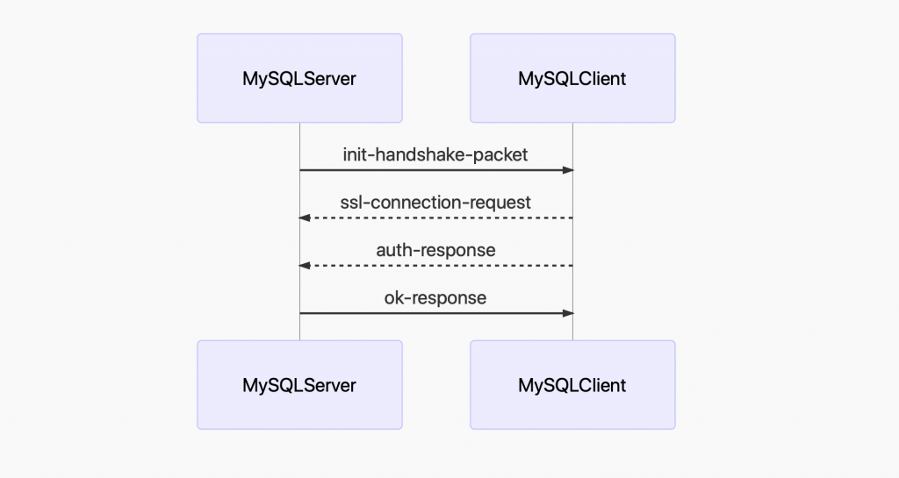

# 技术分享 | 连接数据库这个操作做了什么？

**原文链接**: https://opensource.actionsky.com/20200609-mysql/
**分类**: MySQL 新特性
**发布时间**: 2020-06-09T01:17:23-08:00

---

作者：蒋乐兴
MySQL DBA，擅长 python 和 SQL，目前维护着 github 的两个开源项目：mysqltools 、dbmc 以及独立博客：https://www.sqlpy.com。
本文来源：原创投稿
*爱可生开源社区出品，原创内容未经授权不得随意使用，转载请联系小编并注明来源。
**问题**
在 Python 语言环境下我们这样连接数据库。- `In [1]: from mysql import connector`
- 
- `In [2]: cnx = connector.connect(host="172.16.192.100",port=3306,user="appuser",password="xxxxxx")`
但是连接数据库的背后发生了什么呢？
## 答案
当我们通过驱动程序（mysql-connector-python,pymysql）连接 MySQL 服务端的时候，就是把连接参数传递给驱动程序，驱动程序再根据参数会发起到 MySQL 服务端的 TCP 连接。
当 TCP 连接建立之后驱动程序与服务端之间会按特定的格式和次序交换数据包，数据包的格式和发送次序由[MySQL 协议](https://dev.mysql.com/doc/internals/en/client-server-protocol.html)规定。
整个连接的过程中 MySQL 服务端与驱动程序之间，按如下的次序发送了这些包。
											
1. MySQL 服务端向客户端发送一个握手包，包里记录了 MySQL-Server 的版本，默认的授权插件，密码盐值（auth-data）。2. MySQL 客户端发出 ssl 连接请求包（如果有必要的话）。3. MySQL 客户端发出握手包的响应包，这个包时记录了用户名，密码加密后的串，客户端属性，等等其它信息。4. MySQL 服务端发出响应包，这个包里记录了登录是否成功，如果没有成功也会给出错误信息。
## 祼写 TCP 连接 MySQL
从上面给出的信息可以看出像 mysql-connector-python,pymysql 这类的驱动程序，并不是什么神仙、皇帝，只是一个普普通通的 TCP 客户端。那我们能不能自己一个程序来完成“连接”功能呢？还真可以这么干。- `#!/usr/bin/env python3`
- `"""`
- `"""`
- 
- `import os`
- `import ssl`
- `import sys`
- `import time`
- `import socket`
- `import struct`
- `import logging`
- `import argparse`
- 
- `from plugins import get_auth_plugin`
- 
- `logging.basicConfig(level=logging.INFO,`
- `                    format='%(asctime)s - %(name)s - %(threadName)s - %(levelname)s - %(lineno)s  - %(message)s')`
- 
- 
- `def read_str(packet, ends=None, size=None):`
- `    """`
- `    """`
- `    if ends is None and size is None:`
- `        raise ValueError("either ends not None or size not None.")`
- 
- `    if not isinstance(packet, (bytes, bytearray)):`
- `        raise ValueError('packet must be a bytes or bytearray.')`
- 
- `    if ends is not None:`
- `        index = packet.index(ends)`
- `        return packet[index + 1:], packet[0:index]`
- 
- `    if size is not None and size < len(packet):`
- `        return packet[size + 1], packet[0:size]`
- `    else:`
- `        raise ValueError('size must less than len(packet)')`
- 
- 
- `class MySQLTcpSocket(object):`
- `    """封装一个到 MySQL 数据库的 TCP 连接(同步IO)`
- `    """`
- 
- `    def __init__(self, host=None, port=3306, user=None, password=None):`
- `        self._host = host`
- `        self._port = port`
- `        self._user = user`
- `        self._password = password`
- `        self._packet_number = 0`
- 
- `        addrinfos = socket.getaddrinfo(`
- `            self._host, self._port, socket.AF_INET, socket.SOCK_STREAM, 0)`
- 
- `        for info in addrinfos:`
- `            try:`
- `                family, socket_type, proto, _, addrs = info`
- `                self._sock = socket.socket(family, socket_type, proto)`
- `                self._sock.settimeout(3)`
- `                self._sock.connect(addrs)`
- `                break`
- `            except IOError as err:`
- `                logging.exception(str(err))`
- `                if hasattr(self._sock, 'close'):`
- `                    self._sock.close()`
- `                sys.exit(1)`
- `            except Exception as err:`
- `                logging.exception(str(err))`
- `                if hasattr(self._sock, 'close'):`
- `                    self._sock.close()`
- `                sys.exit(1)`
- 
- `    @property`
- `    def packet_number(self):`
- `        """`
- `        """`
- `        if self._packet_number >= 255:`
- `            self._packet_number = 0`
- 
- `        self._packet_number = self._packet_number + 1`
- 
- `        return self._packet_number`
- 
- `    def prepare_packets(self, packet, packet_number=None):`
- `        """如果包大于 16 MB 就拆解成多个。`
- `        """`
- `        # 16 MB - 1`
- `        max_length_packet = (1 << 24) - 1`
- `        if packet_number is None:`
- `            packet_number = self.packet_number`
- 
- `        # 超过 16M 的部分按 16M 打包`
- `        packets = []`
- `        while len(packet) > max_length_packet:`
- `            pct = b'\x00\x00\x00' + struct.pack("B", packet_number)`
- `            packet_number = packet_number + 1`
- `            packets.append(pct + packet[0:max_length_packet])`
- `            packet = packet[max_length_packet:]`
- 
- `        # 没有超过 16M 的部分按实际大小打包`
- `        pakcet_len = len(packet)`
- `        pct = struct.pack("<I", pakcet_len)[0:3] + \`
- `            struct.pack("<B", packet_number) + packet`
- 
- `        packets.append(pct)`
- `        return packets`
- 
- `    def recv(self):`
- `        """从 MySQL 服务端接收一个数据包`
- `        """`
- `        rst = 4`
- `        header = b''`
- `        while rst > 0:`
- `            chunck = self._sock.recv(rst)`
- `            header = header + chunck`
- `            rst = rst - len(chunck)`
- 
- `        # 执行到这里说明状况接收完成,准备接收 payload 部分的字节`
- `        packet_length, *_ = struct.unpack("<I", header[0:3] + b'\x00')`
- `        packet = bytearray(packet_length)`
- `        pvm = memoryview(packet)`
- `        rst = packet_length`
- 
- `        while rst > 0:`
- `            chunck = self._sock.recv(rst)`
- `            chunck_len = len(chunck)`
- `            pvm[0:chunck_len] = chunck`
- `            pvm = pvm[chunck_len:]`
- `            rst = rst - chunck_len`
- 
- `        return header + packet`
- 
- `    def send(self, packet):`
- `        """发送数据包到 MySQL-Server(自动分组)`
- `        """`
- `        for pct in self.prepare_packets(packet):`
- `            self._sock.sendall(pct)`
- 
- `    def change_to_ssl_mode(self):`
- `        """切换到 SSL-Client 模式`
- `        """`
- `        context = ssl.create_default_context()`
- `        context.check_hostname = False`
- `        context.verify_mode = ssl.CERT_NONE`
- `        context.load_default_certs()`
- `        self._sock = context.wrap_socket(self._sock)`
- 
- `    def __del__(self):`
- `        if hasattr(self._sock, 'close'):`
- `            logging.info("close tcp socket object.")`
- `            self._sock.close()`
- 
- 
- `class MySQLProtocol(object):`
- `    """实现 MySQL 各种数据包的解包的打包`
- `    """`
- 
- `    def parser_init_packet(self, packet):`
- `        """解析 MySQL-Server 发来的握手包`
- `        """`
- `        payload_len, *_ = struct.unpack("<I", packet[0:3] + b'\x00')`
- `        packet_number = packet[3]`
- `        packet = packet[4:]`
- 
- `        # 解析`
- `        # protocol-version`
- `        protocal_version = packet[0]`
- `        packet = packet[1:]`
- 
- `        # 解析`
- `        # mysql-version`
- `        packet, mysql_version = read_str(packet, ends=b'\x00')`
- `        mysql_version = mysql_version.decode("utf8")`
- 
- `        #`
- `        connection_id, auth_data_1, capability_lower = struct.unpack(`
- `            "<I8sx2s", packet[0:15])`
- 
- `        packet = packet[15:]`
- 
- `        if len(packet) > 0:`
- `            charset, status_flags, capability_uper = struct.unpack(`
- `                f"<BH2s", packet[0:5])`
- `            packet = packet[5:]`
- 
- `        auth_plugin_data_length = packet[0]`
- `        auth_data_2_len = max(13, (auth_plugin_data_length - 8))`
- 
- `        # packet = packet[1:]`
- `        packet = packet[11:]`
- `        auth_data_2 = packet[0:auth_data_2_len]`
- `        if auth_data_2.endswith(b'\x00'):`
- `            auth_data_2 = auth_data_2[0:-1]`
- 
- `        packet = packet[13:]`
- `        packet, auth_plugin = read_str(packet, ends=b'\x00')`
- `        auth_plugin = auth_plugin.decode('utf8')`
- 
- `        capabilities, * \`
- `            _ = struct.unpack("<I", capability_lower + capability_uper)`
- `        res = {`
- `            'protocol': protocal_version,`
- `            'server_version_original': mysql_version,`
- `            'server_threadid': connection_id,`
- `            'charset': charset,`
- `            'server_status': status_flags,`
- `            'auth_plugin': auth_plugin,`
- `            'auth_data': auth_data_1 + auth_data_2,`
- `            'capabilities': capabilities`
- `        }`
- 
- `        return res`
- 
- `    def make_ssl_request_pakcet(self, client_flags=1813005, charset=45, max_allowed_packet=1073741824):`
- `        """打包 SSL 连接请求包`
- `        """`
- `        packet = struct.pack("IIB" + 'x' * 23, client_flags,`
- `                             max_allowed_packet, charset)`
- `        return packet`
- 
- `    def make_auth_response_packet(self, auth_data=None, plugin_name='caching_sha2_password',`
- `                                  username=None, password=None, database=None, charset=45,`
- `                                  client_flags=0, max_allowed_packet=1073741824, ssl_enabled=False,`
- `                                  auth_plugin=None, conn_attrs=None):`
- `        """`
- `        """`
- `        # 打包 client_flags,max_allowed_packet,charset`
- `        packet = struct.pack("IIB" + "x"*23, client_flags,`
- `                             max_allowed_packet, charset)`
- 
- `        # 打包 username`
- `        username_bytes = username.encode("utf8")`
- `        packet = packet + username_bytes + b'\x00'`
- 
- `        # capabilities & CLIENT_SECURE_CONNECTION == True`
- `        auth = get_auth_plugin('caching_sha2_password')(`
- `            auth_data, username, password, ssl_enabled)`
- `        auth_response = auth.auth_response()`
- `        auth_response_len = len(auth_response)`
- `        packet = packet + struct.pack("B", auth_response_len) + auth_response`
- 
- `        # capabilities & CLIENT_CONNECT_WITH_DB == False`
- `        packet = packet + b'\x00'`
- 
- `        # capabilities & CLIENT_PLUGIN_AUTH == True`
- `        packet = packet + auth_plugin.encode('utf8') + b'\x00'`
- 
- `        # capabilities & CLIENT_CONNECT_ATTRS == True`
- `        attrs_len = sum([(2 + len(name) + len(conn_attrs[name]))`
- `                         for name in conn_attrs])`
- `        packet = packet + struct.pack("B", attrs_len)`
- 
- `        for name in conn_attrs:`
- `            packet = packet + struct.pack("B", len(name)) + name.encode('utf8')`
- `            packet = packet + \`
- `                struct.pack("B", len(conn_attrs[name])) + \`
- `                conn_attrs[name].encode('utf8')`
- 
- `        #`
- `        return packet`
- 
- 
- `def main(host="sqlstudio", port=3306,`
- `         user='appuser', password='123456'):`
- 
- `    # 发起到连接 MySQL-Server 的连接`
- `    logging.info(f"发起到 {host}:{port} 的 TCP 连接 .")`
- `    sock = MySQLTcpSocket(host=host, port=port,`
- `                          user=user, password=password)`
- 
- `    # 收取 MySQL-Server 发来的握手包`
- `    init_packet = sock.recv()`
- `    logging.info("收到来自 MySQL-Server 的握手包 .")`
- 
- `    # 解析握手包`
- `    protocol = MySQLProtocol()`
- `    init_dict = protocol.parser_init_packet(init_packet)`
- `    logging.info(f"握手包解析完成")`
- 
- `    # 发送 ssl 连接请求`
- `    ssl_connection_requet_packet = protocol.make_ssl_request_pakcet()`
- `    sock.send(ssl_connection_requet_packet)`
- `    sock.change_to_ssl_mode()`
- `    logging.info("已经切换到 ssl 模式 .")`
- 
- `    # 打包客户端属性信息，由于它不是重点，我这里直接写死了 AMD Yes!`
- `    # 随便告诉 MySQL-Server 我的操作系统是 Windows-100`
- `    conn_attrs = {`
- `        "_pid": f"{os.getpid()}",`
- `        "_platform": "x86_64",`
- `        "_source_host": "AMD-Yes",`
- `        "_client_name": "pure-socket",`
- `        "_client_license": "GPL-2.0",`
- `        "_client_version": "0.0.1",`
- `        "_os": "Windows-100"`
- `    }`
- `    auth_response = protocol.make_auth_response_packet(auth_data=init_dict['auth_data'],`
- `                                                       auth_plugin='caching_sha2_password', username=user, password=password, database='',`
- `                                                       charset=45, client_flags=1813005, max_allowed_packet=1073741824, ssl_enabled=True, conn_attrs=conn_attrs)`
- `    # 发送握手的响应包`
- `    sock.send(auth_response)`
- `    logging.info("握手响应包发送完成 .")`
- 
- `    # 处理二次验证`
- `    auth_switch_packet = sock.recv()`
- 
- `    if auth_switch_packet[4] == 1:`
- `        auth_data = auth_switch_packet[5:]`
- 
- `    if len(auth_data) == 1 and auth_data[0] == 4:`
- `        auth_response = password.encode('utf8') + b'\x00'`
- `        sock._packet_number = 3`
- `        sock.send(auth_response)`
- `        logging.info("二次校验完成 .")`
- 
- `    #`
- `    packet = sock.recv()`
- `    logging.info("收到来自 MySQL-Server 的登录确认包.")`
- `    if packet[4] == 0:`
- `        logging.info(f"收到的是 OK 包、用户登录成功！")`
- `    else:`
- `        logging.info(f"登录 MySQL-Server 失败了！")`
- `        logging.info(f"{packet}")`
- 
- `    # sleep 30 秒`
- `    time.sleep(30)`
- 
- 
- `if __name__ == "__main__":`
- `    parser = argparse.ArgumentParser('mysql-login')`
- `    parser.add_argument('--host', type=str,`
- `                        default="172.16.192.100", help="mysql-server ip")`
- `    parser.add_argument('--port', type=int, default=3306,`
- `                        help="mysql-server listening port")`
- `    parser.add_argument('--user', type=str,`
- `                        default='appuser', help="mysql  user")`
- `    parser.add_argument('--password', type=str,`
- `                        default="123456", help="password of mysql user")`
- 
- `    args = parser.parse_args()`
- `    main(host=args.host, port=args.port, user=args.user, password=args.password)`
执行程序看输出。- `python3 mysql-login.py `
- `2020-05-26 15:51:20,494 - root - MainThread - INFO - 265  - 发起到 172.16.192.100:3306 的 TCP 连接 .`
- `2020-05-26 15:51:20,498 - root - MainThread - INFO - 271  - 收到来自 MySQL-Server 的握手包 .`
- `2020-05-26 15:51:20,499 - root - MainThread - INFO - 276  - 握手包解析完成`
- `2020-05-26 15:51:20,503 - root - MainThread - INFO - 282  - 已经切换到 ssl 模式 .`
- `2020-05-26 15:51:20,503 - root - MainThread - INFO - 300  - 握手响应包发送完成 .`
- `2020-05-26 15:51:20,504 - root - MainThread - INFO - 316  - 收到来自 MySQL-Server 的登录确认包.`
- `2020-05-26 15:51:20,504 - root - MainThread - INFO - 318  - 收到的是 OK 包、用户登录成功！`
在 MySQL 服务端观察连接属性。- `mysql> show processlist;                                                                         `
- `+----+---------+--------------------+------+---------+------+----------+------------------+`
- `| Id | User    | Host               | db   | Command | Time | State    | Info             |`
- `+----+---------+--------------------+------+---------+------+----------+------------------+`
- `|  7 | monitor | 127.0.0.1:45088    | NULL | Sleep   |    4 |          | NULL             |`
- `|  8 | root    | 127.0.0.1:45090    | NULL | Query   |    0 | starting | show processlist |`
- `| 12 | appuser | 172.16.192.1:55290 | NULL | Sleep   |    4 |          | NULL             |`
- `+----+---------+--------------------+------+---------+------+----------+------------------+`
- `3 rows in set (0.00 sec)`
- 
- `mysql> select * from performance_schema.session_connect_attrs where processlist_id=12;           `
- `+----------------+-----------------+-------------+------------------+`
- `| PROCESSLIST_ID | ATTR_NAME       | ATTR_VALUE  | ORDINAL_POSITION |`
- `+----------------+-----------------+-------------+------------------+`
- `|             12 | _pid            | 4885        |                0 |`
- `|             12 | _platform       | x86_64      |                1 |`
- `|             12 | _source_host    | AMD-Yes     |                2 |`
- `|             12 | _client_name    | pure-socket |                3 |`
- `|             12 | _client_license | GPL-2.0     |                4 |`
- `|             12 | _client_version | 0.0.1       |                5 |`
- `|             12 | _os             | Windows-100 |                6 |`
- `+----------------+-----------------+-------------+------------------+`
- `7 rows in set (0.01 sec)`
在不用连接驱动的情况下 300 多行代码才实现连接到 MySQL 这个操作，生活太难了！是不是祼写 TCP 就没有用了呢？如果打算自己开发读写分离中间件的话，这个还是有必要的。
## 其它
关于 MySQL 协议的更多内容可以看[MySQL 内部文档](https://dev.mysql.com/doc/internals/en/client-server-protocol.html)。上面的示例代码你也可以在[github](https://github.com/Neeky/mysql-protocol-packets)上找到。