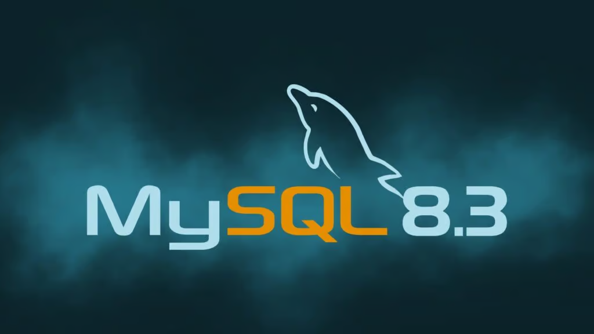

# 技术译文 | MySQL 8.3 发布，具体有哪些新增和删减？

**原文链接**: https://opensource.actionsky.com/%e6%8a%80%e6%9c%af%e8%af%91%e6%96%87-mysql-8-3-%e5%8f%91%e5%b8%83%ef%bc%8c%e5%85%b7%e4%bd%93%e6%9c%89%e5%93%aa%e4%ba%9b%e6%96%b0%e5%a2%9e%e5%92%8c%e5%88%a0%e5%87%8f%ef%bc%9f/
**分类**: MySQL 新特性
**发布时间**: 2024-01-23T21:15:37-08:00

---

MySQL 8.3 主要更新：用于标记事务分组的 GTID、JSON EXPLAIN 格式增强、一些功能删除等。

MySQL 是一款广泛使用的开源的关系型数据库管理系统，已推出其最新版本 MySQL 8.3。它带来了新功能和一些删除，有望简化数据库操作。让我们来看看有哪些变化。
# 新特性
## 带标记 GTID 的复制
MySQL 8.3 中的一个突出功能是在 MySQL 复制和组复制中引入了标记的全局事务标识符（GTID）。此增强功能允许对事务进行分组和轻松识别。
新的 GTID 格式 *&#8220;UUID:TAG:NUMBER&#8221;* 可以为链接到特定事务组的 GTID 提供唯一命名。这样，用户可以通过 GTID 比较来区分数据和管理操作，从而提高复制效率和组织性。
有鉴于此，该版本引入了设置 GTID 值所需的新权限 *&#8220;TRANSACTION_GTID_TAG&#8221;* ，允许数据库管理员控制谁可以分配 GTID，进一步细化事务管理。
## EXPLAIN 中的 JSON 格式版本控制
MySQL 8.3 引入了一个服务器系统变量 *&#8220;explain_json_format_version&#8221;* ，允许用户在 *&#8220;EXPLAIN FORMAT=JSON&#8221;* 语句中在两个版本的 JSON 输出格式之间进行选择。此功能可确保与未来版本的 MySQL 优化器更好的兼容性，从而增强长期可用性。
## 线程池插件增强功能
线程池插件现在包含 MySQL 性能架构中的附加信息。新的表和列提供了对线程池连接和状态的全面洞察，有助于更好的性能分析。
## 其他显着变化
*&#8220;binlog_transaction_dependency_tracking&#8221;* 系统变量的默认值已更改为 *&#8220;WRITESET&#8221;* ，表明该功能将逐步淘汰。
该版本还引入了 CMake 选项 *&#8220;WITH_LD&#8221;* ，允许用户指定他们选择的链接器以及 MySQL Enterprise Data Masking 和 De-Identification 的增强功能。
最后，MySQL 性能模式丰富了详细的线程池连接信息，这是性能调整的宝贵资源。
# 删除的功能特性
MySQL 8.3 还删除了一些特性和功能，强调向更高效和现代的数据库转变。
关键 C API 函数（如 `mysql_kill()`、`mysql_list_fields()`和其他函数）已被删除，建议使用替代方法来执行类似的操作。
此外，以前不推荐使用的用于清除主机名内部缓存的 *&#8220;FLUSH HOSTS&#8221;* 语句现已被删除。用户被指导使用替代方法来清除主机缓存。
各种复制和服务器选项，例如 *&#8220;–slave-rows-search-algorithms&#8221;* 和 *&#8220;–log_bin_use_v1_events&#8221;* 也已被删除，引导用户采用更高效和现代的实践。
最后，MySQL 8.3 将用于冲突检查的写入集的使用限制为基于行的日志记录，这表明二进制日志事务依赖性跟踪的改进方法。
鉴于所有这些变化，我们鼓励用户熟悉它们，以便在数据库管理任务中充分利用数据库的潜力。