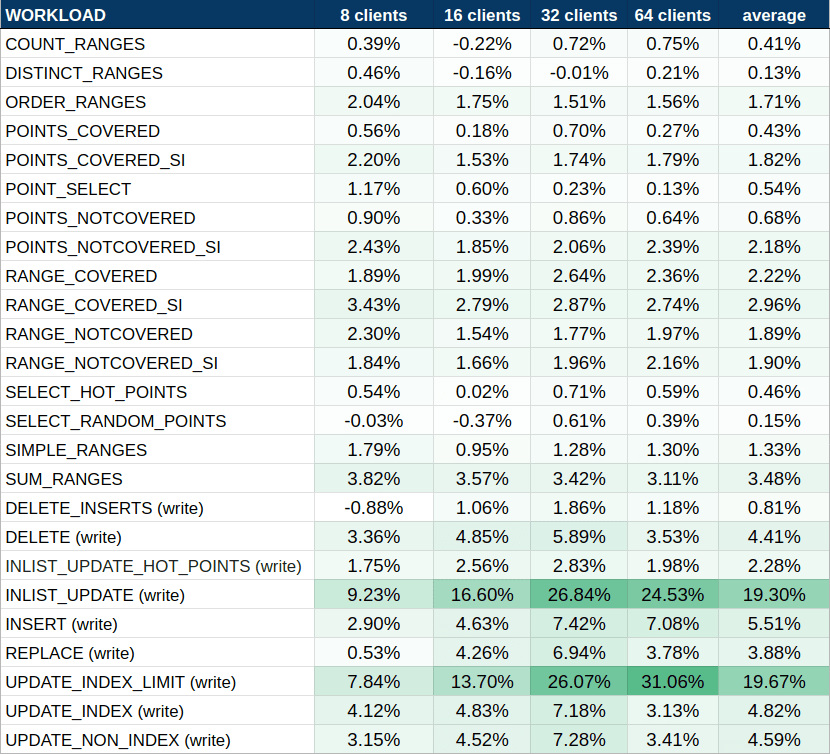
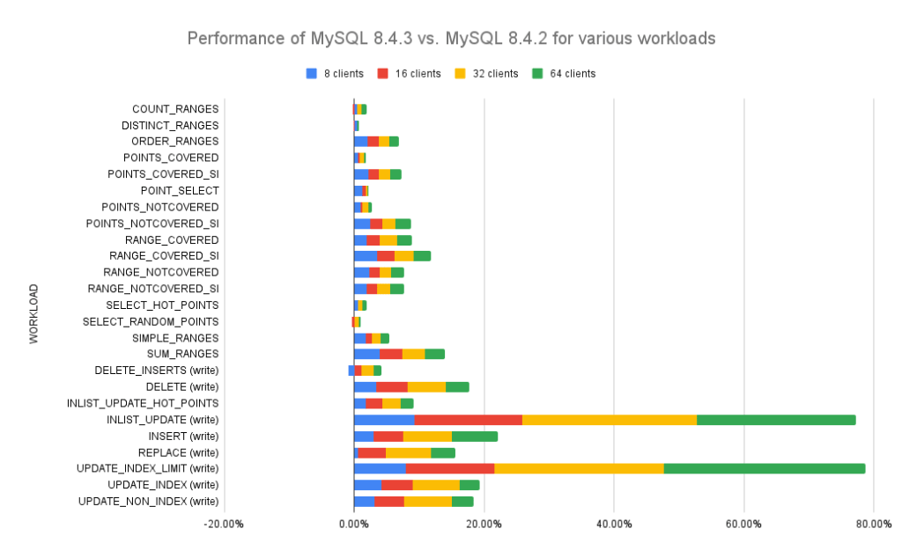

# 技术译文 | MySQL 8.4.3 和 9.1.0：显著提升性能！

**原文链接**: https://opensource.actionsky.com/%e6%8a%80%e6%9c%af%e8%af%91%e6%96%87-mysql-8-4-3-%e5%92%8c-9-1-0%ef%bc%9a%e6%98%be%e8%91%97%e6%8f%90%e5%8d%87%e6%80%a7%e8%83%bd%ef%bc%81/
**分类**: MySQL 新特性
**发布时间**: 2025-01-12T23:50:42-08:00

---

我们很高兴地报告，最新版本 8.4.3 和 9.1.0 展示了显着的性能改进！
> 作者：Przemyslaw Skibinski。
本文和封面来源：[https://www.percona.com/blog/mysql-8-4-3-and-9-1-0-major-performance-gains-revealed/，爱可生开源社区翻译。](https://www.percona.com/blog/mysql-8-4-3-and-9-1-0-major-performance-gains-revealed/，爱可生开源社区翻译。)
本文约 800 字，预计阅读需要 3 分钟。
在 Percona，我们始终优先考虑性能，而 MySQL 的最新发展趋势一直是我们关注的焦点。特别是，MySQL 8.4.x 和 9.y 版本中的性能恶化引起了我们的注意，正如 Marco Tusa 的博客文章[《Sakila 何去何从？》](https://www.percona.com/blog/sakila-where-are-you-going/) 中所提到的。
我们很高兴地报告，最新版本 8.4.3 和 9.1.0（于 2024 年 10 月发布）展示了显着的性能改进，如下表一所示。

表 1：针对不同工作负载，MySQL 8.4.3 与 MySQL 8.4.2 的每秒查询次数 (QPS) 的改进。
有关我们的测试方法、使用的 *sysbench* 压测以及硬件配置的详细信息，请参阅我们之前的博客文章： [《Percona Server for MySQL 性能改进》](https://www.percona.com/blog/percona-server-for-mysql-performance-improvements-august-2024/)
如表 1 所示，相同的结果以堆叠图的形式呈现在下面，以直观地展示改进。

出于好奇，我们深入研究了这些优化的根源，并确定了导致这些增强的三个关键变化。
## 1. Binlog 事务依赖切换
[参考 Bug](https://github.com/mysql/mysql-server/commit/cb257cbc86e)：#37008442
**binlog_transaction_dependency** 的数据结构从 `std::map` 更改为 `ankerl::unordered_dense::map`，这带来了显着的性能提升。
这一改进，提高了 INLIST_UPDATE 和 UPDATE_INDEX_LIMIT 等工作负载的效率，**平均性能提升了 19.4%，令人印象深刻！**
## 2. 使用 JOINS 优化查询执行
[参考 Bug](https://github.com/mysql/mysql-server/commit/dfecee6d080)：#35531293
在以往的 MySQL 版本中反复出现的一个问题，与使用 JOINS 的查询相比，MySQL 8.0.33 中观察到的性能下降。此优化解决了效率低下的问题，为 POINTS_COVERED_SI 和 POINTS_NOTCOVERED_SI 等工作负载的 **平均性能提升了 2.17%** 。
## 3. 改进的索引范围扫描
[参考 Bug](https://github.com/mysql/mysql-server/commit/57b6d0d3d3c)：#36775910
在以往的版本中，索引范围扫描中缺少记录缓冲区会导致不必要的速度下降。最新更新解决了此问题，使一系列工作负载（包括 ORDER_RANGES、RANGE_NOTCOVERED、RANGE_COVERED 和 SUM_RANGES）的**平均性能提升了 2.12%** 。
## 整体性能的提升
我们的测试强调了这些变化的累积影响：
- **写入性能： 9 个测试任务负载的平均性能提高约 7.25% 。**
- **读取性能： 16 个测试任务负载的平均性能提高约 1.39% 。**
比较新版本时：
- MySQL 8.4.3 现在的读取和写入速度仅比 MySQL 8.0.40 慢 1.47% 。
- MySQL 9.1.0 的读写速度仅比 MySQL 8.4.3 慢 0.68%。
## 最后
MySQL 8.4.3 和 9.1.0 中的性能改进代表着向前迈出的重要一步。这些版本展示了 MySQL 开发团队在解决社区问题方面的积极参与，包括最初由 Percona 贡献的有价值的错误报告和修复。虽然仍有进一步优化的空间以达到早期版本的峰值性能，但我们对未来的版本持乐观态度，并期待在 MySQL 社区的共同努力下不断取得进步。
