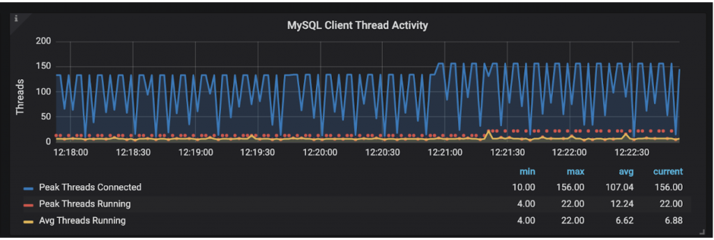

# 技术译文 | 使用 TCP Wrappers 保护 MySQL 如何导致服务中断

**原文链接**: https://opensource.actionsky.com/20200218-mysql/
**分类**: MySQL 新特性
**发布时间**: 2020-02-18T03:06:26-08:00

---

> 作者：Ananias Tsalouchidis
翻译：孟维克
原文：https://www.percona.com/blog/2020/01/07/how-securing-mysql-with-tcp-wrappers-can-cause-an-outage/
**案例**
> 保护 MySQL 总是一个挑战。有一些通用的最佳实践可用于安装加固，但是您的设置越复杂，就越有可能遇到一些难以排查的故障的问题。
我们最近在研究一个案例，当活跃线程很高，超过一个阈值（但并不总是相同）时，MySQL 开始变得不可用。
											
在此期间，有许多像下面这样的日志，mysqld 有几秒钟没有响应。- `2019-11-27T10:26:03.476282Z 7736563 [Note] Got an error writing communication packets`
- `2019-11-27T10:26:03.476305Z 7736564 [Note] Got an error writing communication packets`
**&#8220;Got an error writing communication packets&#8221;**是一个很常见的日志消息，它可能由多种原因引起。**（官方文档请参考文末链接）**
**我们是如何处理此问题并查找根本原因的**
首先要做的是远程执行一个简单的循环，以确定这是否是随机发生的，是网络问题还是与 mysqld 本身相关的问题。- `[RDBA] percona@monitoring1: ~ $ time for i in {1..100}; \`
- `do mysql -h 10.0.2.14 -Bsse "show status like '%uptime';"; \`
- `done`
- `Uptime 3540`
- `Uptime 3540`
- `Uptime 3540`
- `Uptime 3541`
- `Uptime 3541`
- `Uptime 3541`
- `Uptime 3541`
- `Uptime 3542`
- `Uptime 3542`
- `Uptime 3542`
- `Uptime 3543`
- `Uptime 3543`
- `Uptime 3543`
- `Uptime 3543`
- `Uptime 3543`
- `Uptime 3544`
- `^C`
最初想做的是确认客户报告的行为。因此，鉴于所有应用服务器都处于远程位置（因此客户端通过 TCP 链接），想确认是否有远程连接被丢弃（这是由于网络问题？还是处于任何原因导致 MySQL 无响应？）。还想验证是否存在一个场景，即 X 中的一个连接被丢弃或一定时间后连接被丢弃。确认场景通常有助于确认根本原因是什么。执行此远程连接循环的另一个原因是验证此问题是否仅在远程连接时发生还是在本地连接时也出现（稍后将测试本地连接）。
在网络层 troubleshooting，并没有发现任何问题，因此决定使用另外一个循环在本地通过 TCP 链接到 mysqld。这个测试表明 MySQL 确实不可用的（或者至少不能随机访问它）。不幸的是，当时并没有通过套接字测试本地连接。通过套接字连接完全绕过网络层。如果尝试使用套接字进行连接，会立即意识到这实际上不是 MySQL 问题，因为 MySQL 总是可用的（所以在网络级别上有些东西阻塞了连接）。下面是更多的细节。
继续进行 troubleshooting， `netstat` 显示许多连接处于 TIME_WAIT 状态。TIME_WAIT 表示源端已经关闭了连接。下面是一个在测试环境中使用 `netstat` 识别 TCP 连接的示例。
- `[RDBA] percona@db4-atsaloux: ~ $ sudo netstat -a -t`
- `Active Internet connections (servers and established)`
- `Proto Recv-Q Send-Q Local Address           Foreign Address         State`
- `tcp        0      0 0.0.0.0:sunrpc          0.0.0.0:*               LISTEN`
- `tcp        0      0 db4-atsaloux:42000      0.0.0.0:*               LISTEN`
- `tcp        0      0 localhost:domain        0.0.0.0:*               LISTEN`
- `tcp        0      0 0.0.0.0:ssh             0.0.0.0:*               LISTEN`
- `tcp        0      0 0.0.0.0:nrpe            0.0.0.0:*               LISTEN`
- `tcp        0      0 db4-atsaloux:ssh        10.0.2.10:35230         ESTABLISHED`
- `tcp        0     36 db4-atsaloux:ssh        10.0.2.10:39728         ESTABLISHED`
- `tcp        0      0 db4-atsaloux:49154      10.0.2.11:mysql         ESTABLISHED`
- `tcp6       0      0 [::]:mysql              [::]:*                  LISTEN`
- `tcp6       0      0 [::]:sunrpc             [::]:*                  LISTEN`
- `tcp6       0      0 [::]:ssh                [::]:*                  LISTEN`
- `tcp6       0      0 [::]:nrpe               [::]:*                  LISTEN`
- `tcp6       0      0 db4-atsaloux:mysql      10.0.2.10:50950         TIME_WAIT`
- `tcp6       0      0 db4-atsaloux:mysql      10.0.2.10:50964         TIME_WAIT`
- `tcp6       0      0 db4-atsaloux:mysql      10.0.2.10:50938         TIME_WAIT`
- `tcp6       0      0 db4-atsaloux:mysql      10.0.2.10:50940         TIME_WAIT`
- `tcp6       0      0 db4-atsaloux:mysql      10.0.2.10:51010         TIME_WAIT`
- `tcp6       0      0 db4-atsaloux:mysql      10.0.2.10:50994         TIME_WAIT`
- `tcp6       0      0 db4-atsaloux:mysql      10.0.2.10:50986         TIME_WAIT`
- `tcp6       0      0 db4-atsaloux:mysql      10.0.2.10:44110         ESTABLISHED`
- `tcp6       0      0 db4-atsaloux:mysql      10.0.2.10:50984         TIME_WAIT`
- `tcp6       0      0 db4-atsaloux:mysql      10.0.2.10:50978         TIME_WAIT`
- `tcp6       0      0 db4-atsaloux:mysql      10.0.2.10:51030         TIME_WAIT`
- `tcp6       0      0 db4-atsaloux:mysql      10.0.2.10:50954         TIME_WAIT`
- `tcp6       0      0 db4-atsaloux:mysql      10.0.2.10:51032         TIME_WAIT`
- `tcp6       0      0 db4-atsaloux:mysql      10.0.2.10:51042         TIME_WAIT`
- `tcp6       0      0 db4-atsaloux:mysql      10.0.2.10:50996         TIME_WAIT`
- `tcp6       0      0 db4-atsaloux:mysql      10.0.2.10:51046         TIME_WAIT`
- `tcp6       0      0 db4-atsaloux:mysql      10.0.2.10:51000         TIME_WAIT`
- `tcp6       0      0 db4-atsaloux:mysql      10.0.2.10:50942         TIME_WAIT`
- `tcp6       0      0 db4-atsaloux:mysql      10.0.2.10:51004         TIME_WAIT`
- `tcp6       0      0 db4-atsaloux:mysql      10.0.2.10:44108         ESTABLISHED`
- `tcp6       0      0 db4-atsaloux:mysql      10.0.2.10:50992         TIME_WAIT`
- `tcp6       0      0 db4-atsaloux:mysql      10.0.2.10:50988         TIME_WAIT`
这让我们认识到，可能已经耗尽了 TCP 层上的 TCP 连接，因为 TCP 会话数量增加了，这些会话一直保持打开状态，直到出现 **time_wait** 超时。我们在之前写了一篇相关 blog**（请参考文末链接 ）**。这样可以让您很好地了解什么是 &#8220;TIMEWAIT&#8221; 问题，以及可以采取哪些措施进行补救。
我们最初尝试对端口范围 `ip_local_port_range` 进行微调，并调整一些与内核相关的选项，如 `tcp_tw_reuse`，但是不幸的是，我们没有成功，仍然有相同的问题。
检查网络流量时发现，主机向 `/etc/resolv.conf` 中定义的 DNS 服务器发出了大量的请求。说到网络流量检测，由于网络基础设施不是由我们管理的，我们无法核实网络层的一些事情。我们从客户的 IT 部门确认，在网络层没有发现任何错误。我们能做的就是对进出 MySQL 的流量进行数据包检测，tcpdump 帮助识别出大量的 DNS 请求及缓慢的响应。在 DB 节点上最初用于包检测的命令是 `tcpdump dst port3306orsrc port3306`，然后使用更具体的过滤规则来排除和过滤掉无用的信息，如主服务器和从服务器之间的流量。
当时，想到的另一件事验证 mysqld 是否处于任何原因正在尝试进行 DNS 解析。这可以解释最初遇到的一个问题。检查变量 `skip_name_resolve`，我们发现它设置为 **ON**，所以 mysqld 不应该执行任何类型的 DNS 解析。- `db4-atsaloux (none)> select @@skip_name_resolve;`
- `+---------------------+`
- `| @@skip_name_resolve |`
- `+---------------------+`
- `|                   1 |`
- `+---------------------+`
- `1 row in set (0.00 sec)`
为了进一步调试 MySQL 实际做了什么，我们对 mysqld 进程进行了 strace。
**根本原因**
我们注意到 mysqld 进程过于频繁地访问 **/etc/hosts.allow** 和 **/etc/hosts.deny** 文件。- `root@db4-atsaloux:~# strace -e open,read -p$(pidof mysqld)`
- `strace: Process 693 attached`
- `# /etc/hosts.deny: list of hosts that are _not_ allowed to access the system.`
- `read(51, "# /etc/hosts.allow: list of host"..., 4096) = 464`
- `read(51, "", 4096)                      = 0`
- `# /etc/hosts.allow: list of hosts that are allowed to access the system.`
- `read(51, "# /etc/hosts.deny: list of hosts"..., 4096) = 721`
- `read(51, "", 4096)                      = 0`
- `read(51, "# /etc/hosts.allow: list of host"..., 4096) = 464`
- `read(51, "", 4096)                      = 0`
- `read(51, "# /etc/hosts.deny: list of hosts"..., 4096) = 721`
- `read(51, "", 4096)                      = 0`
- `read(51, "# /etc/hosts.allow: list of host"..., 4096) = 464`
- `read(51, "", 4096)                      = 0`
- `read(51, "# /etc/hosts.deny: list of hosts"..., 4096) = 721`
- `read(51, "", 4096)                      = 0`
- `read(51, "# /etc/hosts.allow: list of host"..., 4096) = 464`
- `read(51, "", 4096)                      = 0`
- `read(51, "# /etc/hosts.deny: list of hosts"..., 4096) = 721`
- `read(51, "", 4096)                      = 0`
- `read(51, "# /etc/hosts.allow: list of host"..., 4096) = 464`
- `read(51, "", 4096)                      = 0`
- `read(51, "# /etc/hosts.deny: list of hosts"..., 4096) = 721`
- `read(51, "", 4096)                      = 0`
- `read(51, "# /etc/hosts.allow: list of host"..., 4096) = 464`
- `read(51, "", 4096)                      = 0`
- `read(51, "# /etc/hosts.deny: list of hosts"..., 4096) = 721`
- `read(51, "", 4096)                      = 0`
- `read(51, "# /etc/hosts.allow: list of host"..., 4096) = 464`
- `read(51, "", 4096)                      = 0`
- `read(51, "# /etc/hosts.deny: list of hosts"..., 4096) = 721`
- `read(51, "", 4096)                      = 0`
- `read(51, "# /etc/hosts.allow: list of host"..., 4096) = 464`
- `read(51, "", 4096)                      = 0`
如我们所见，一些新的连接需要花费很长的时间来连接 MySQL。mysqld pid 上的 strace 显示频繁地访问 **/etc/hosts.allow** 和 **/etc/hosts.deny**。这些文件与 **tcp wrappers** 直接相关！许多系统管理员认为 TCP wrappers 是过时软件（软件开发已经停止，但是有很多替代方案），但是他们仍然被广泛使用。使用 TCP wrappers 时，必须根据 ACL 检查每个新的连接，并根据此 ACL 决定是否允许远程主机连接到服务。
在 troubleshooting 时发现 DNS 解析与 MySQL 的 `skip_name_resolve` 功能无关，也与 mysqld 本身无关，我们知道这实际上不是一个 mysqld 问题。MySQL 已经启动并能处理请求。就我个人而言，我认为这是一个“设计好的”软件的致命弱点。
继续检查我们发现有一个错误的 DNS 配置 `/etc/resolv.conf`，所以当 DNS 反应缓慢或者 DNS 没有响应，TCP wrappers 使得连接到 mysql 的连接停滞或者在等待 DNS 响应时被废弃。
**总结**
1. 如果出于任何原因您需要使用TCP wrappers，请始终注意任何 DNS 问题可能会导致停顿或者中断。
2. 使用 TCP wrappers，即使启用了 `skip_name_resolve`，也会发生解析。
- 即使您没有人为安装 TCP wrappers，也有一些操作系统，比如某些版本的 CentOS 或者 Ubuntu，默认情况下是可用的。
- 如果您要为 MySQL 设置安全规则，一定要小心。请注意并不是每个二进制文件都可以使用它们。二进制文件应该连接到 TCP wrappers 的库。
3. 如果 MySQL 服务启用了 TCP wrappers，并且您真的需要它们，您应该确保 DNS 响应快速并且安全，即使这不是很容易管理。
- 为连接到 mysqld 服务的主机添加到 `/etc/hosts` 文件，这样不会为每次连接做真实的 DNS 解析。
- 在配置 DNS 解析时，也有一些最佳时间。在我看来，您至少应该在 `/etc/resolv.conf` 中配置多个 DNS 服务器，并且应该使用一些本地服务器或最接近 Linux 服务器的服务器，并可能启用缓存。
4. 如果您遇到类似的问题，可以检查 mysqld 是否针对 TCP wrappers 构建，并在 mysqld 二进制文件上执行 `ldd`，然后检查它是否连接到了 TCP wrappers 库。如果是，并且遇到同一个问题，那么请检查系统的 DNS 配置，以及 DNS 是否执行正常。- `[RDBA] percona@db4-atsaloux: ~ $ ldd /usr/sbin/mysqld | grep libwrap`
- `libwrap.so.0 => /lib/x86_64-linux-gnu/libwrap.so.0 (0x00007fa80532c000)`
> **相关文档及博文链接：**
《Communication Errors and Aborted Connections》
https://dev.mysql.com/doc/refman/5.7/en/communication-errors.html
《Application Cannot Open Another Connection to MySQL》https://www.percona.com/blog/2014/12/08/what-happens-when-your-application-cannot-open-yet-another-connection-to-mysql/>)