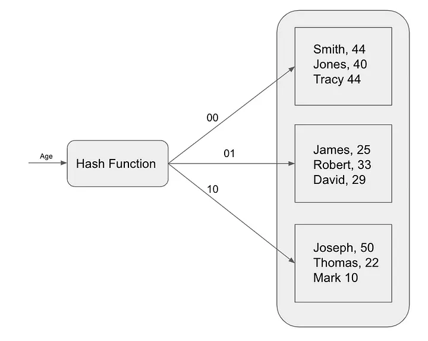
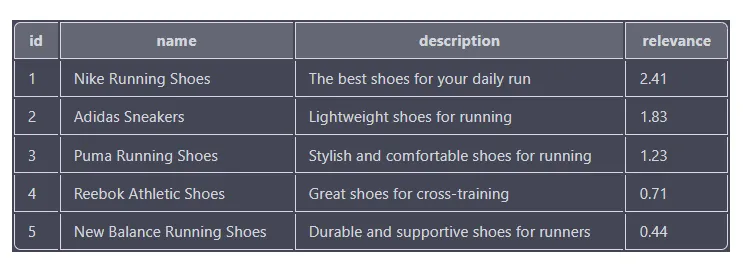
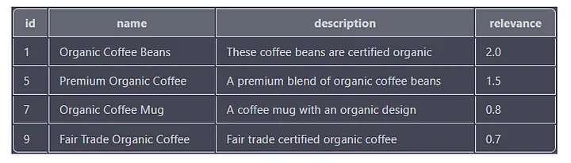

# 技术译文 | 数据库索引算法的威力：B-Tree 与 Hash 索引

**原文链接**: https://opensource.actionsky.com/%e6%8a%80%e6%9c%af%e8%af%91%e6%96%87-%e6%95%b0%e6%8d%ae%e5%ba%93%e7%b4%a2%e5%bc%95%e7%ae%97%e6%b3%95%e7%9a%84%e5%a8%81%e5%8a%9b%ef%bc%9ab-tree-%e4%b8%8e-hash-%e7%b4%a2%e5%bc%95/
**分类**: 技术干货
**发布时间**: 2024-05-07T00:06:26-08:00

---

数据库索引是优化任何数据库系统性能的关键组成部分。如果没有有效的索引，您的数据库查询可能会变得缓慢且低效，从而导致用户体验不佳并降低生产力。在这篇文章中，我们将探讨创建和使用数据库索引的一些最佳实践。
> 作者：The Java Trail
本文和封面来源：[https://medium.com/，爱可生开源社区翻译。](https://medium.com/，爱可生开源社区翻译。)
本文约 2700 字，预计阅读需要 9 分钟。
数据库中使用多种索引算法来提高查询性能。以下是一些最常用的索引算法：
# B 树（B-Tree）索引
B-Tree 索引是一种自平衡树数据结构，可保持数据排序并允许在对数时间内搜索、顺序访问、插入和删除。 B-Tree 索引结构广泛应用于数据库和文件系统中。 B-Tree 索引广泛应用于 MySQL、PostgreSQL 等关系数据库中。

 
B-Tree 索引针对范围查询进行了优化，因为它们可以有效地查找某个值范围内的所有记录。这是因为记录在索引中按排序顺序存储。利用在使用 `=`、`>`、`>=`、`<`、`<=` 或 `BETWEEN` 运算符的表达式中使用列比较。
例如，假设我们有一个具有以下表结构的产品表：
`CREATE TABLE products (
id INT PRIMARY KEY,
name VARCHAR(255),
price DECIMAL(10,2)
);
`
我们可以通过以下 SQL 语句为 `price` 字段添加一个 B-Tree 索引。
`CREATE INDEX products_price_index ON products (price);
`
# 哈希（Hash）索引
哈希索引是另一种流行的索引算法，用于加速查询。哈希索引使用哈希函数将键映射到索引位置。此索引算法**对于精确匹配查询最有用，例如根据主键值搜索特定记录**。哈希索引通常用于内存数据库，例如 Redis。
哈希索引的工作原理是根据哈希值将表中的每条记录映射到唯一的存储桶。哈希值是使用哈希函数计算的，哈希函数是一种以数据项作为输入并返回唯一整数值的数学函数。

为了在哈希索引中查找记录，数据库计算搜索键的哈希值，然后查找相应的存储桶。如果该记录在存储桶中，则数据库将返回该记录。否则，数据库执行全表扫描。
哈希索引的**查找速度非常快**，但它们**不能用于有效地查询数据范围**。这是因为哈希函数不保留表中记录之间的任何顺序。
要使用哈希索引执行查询：
- 数据库计算查询条件的哈希值。
- 在哈希表中查找对应的哈希桶。
- 然后数据库检索指向表中具有相应哈希值的行的指针。
- 使用这些指针从表中检索实际行。
假设我们有一个具有以下表结构的产品表：
`CREATE TABLE products (
id INT PRIMARY KEY,
name VARCHAR(255),
price DECIMAL(10,2)
);
`
### 问：哈希索引没有像 B-Tree 那样进行优化的情况？
在某些情况下，哈希索引可能不是最佳选择：
- 哈希索引在查找方面比树索引更快（对于使用 `=` 或 `<=>` 运算符的相等比较），但它们不能用于有效地查询数据范围。
- 查找时树索引比哈希索引慢，但它们可以用来有效查询数据范围。
**范围查询：** 哈希索引未针对范围查询进行优化，在范围查询中您需要查找某个值范围内的记录（使用 `=`、`>`、`>=`、`<`、`<=` 或 `BETWEEN` 运算符）。在这种情况下，B-Tree 索引会更合适。
**排序：** 哈希索引未针对排序进行优化，您需要根据特定列对记录进行排序。在这种情况下，B-Tree 索引或聚集索引会更合适。
**大型数据集：** 哈希索引可能会占用大量内存，因此它们可能不适合需要考虑内存使用情况的大型数据集。
我们可以使用以下命令在 `name` 列上创建哈希索引：
`CREATE INDEX products_name_hash ON products (name);
SELECT * FROM products WHERE name = 'iPhone 13 Pro';
CREATE INDEX products_name_tree ON products (name);
SELECT * FROM products WHERE name = 'iPhone 13 Pro';
`
如果我们使用哈希索引，数据库会**计算搜索键“iPhone 13 Pro”的哈希值**，然后查找对应的桶。由于哈希函数是确定性的，因此数据库总是会在同一个桶中找到记录，无论记录在表中的存储顺序如何。
如果我们使用树索引，**数据库将从树的根部开始，并将搜索键“iPhone 13 Pro”与存储在根部的键的值进行比较**。由于树是排序的，数据库将很快找到包含搜索键的记录。
### 问：为什么 B-Tree 对于 Range 查询比 Hash 索引更优化？
现在，假设我们要查找价格在 100 美元到 200 美元之间的所有产品。我们可以使用以下查询：
`SELECT * FROM products WHERE price BETWEEN 100 AND 200;
`
# 工作原理
## B-Tree
B-Tree 索引通过按排序顺序存储记录来工作。要在 B-Tree 索引中查找记录，
- 数据库从树的根部开始，并将搜索关键字与存储在根部的关键字的值进行比较。
- 如果搜索键等于根键，则数据库返回该记录。
- 否则，数据库根据比较结果确定下一步要搜索哪一个子树。
## Hash
Hash 索引的工作原理是根据哈希值将表中的每条记录映射到唯一的存储桶。哈希值是使用哈希函数计算的。哈希索引将数据随机分布在存储桶中，导致范围查询效率低下。检索一系列值（例如 100 美元到 200 美元之间的价格）需要扫描该范围内的所有存储桶，这实际上会导致全表扫描。哈希索引擅长快速精确匹配查找，但缺乏高效范围查询所需的数据排序。
## 问，为什么 B-Tree 索引在排序方面比 Hash 索引更优化？
B-Tree 树索引比哈希索引对数据进行排序更有效，因为它们按排序顺序存储记录。这允许数据库按排序顺序快速迭代记录。
Hash 索引的工作原理是根据哈希值将表中的每条记录映射到唯一的存储桶。这意味着桶中记录的顺序是随机的。要对记录进行排序，数据库需要迭代所有存储桶，然后对每个存储桶中的记录进行排序。这比使用 B-Tree 索引慢，后者按排序顺序存储记录。
我们可以使用以下命令在 `price` 列上创建 B-Tree 索引：
`CREATE INDEX products_price_index ON products (price);
`
现在，假设我们要按价格升序对产品进行排序。我们可以使用以下查询：
`SELECT * FROM products ORDER BY price ASC;
`
数据库将使用 B 树索引按排序顺序快速迭代产品。
## 哈希索引缺点：
- 哈希索引不支持范围查询或排序
- 哈希索引会消耗大量内存
- 哈希索引不适合频繁更新的数据库
# 位图（Bitmap）索引
位图索引用于具有少量不同值的列，例如布尔列或性别列。位图索引对于基数较低的列来说非常紧凑且高效。
`SELECT * FROM employees WHERE gender = 'Female';
`
位图索引对于基数较低的列非常高效，允许快速设置操作，例如并集和交集。非常适合临时报告和数据仓库。
# 全文（Full-Text）索引
全文索引用于索引大量文本数据，例如文档或网页。该索引算法将文本分解为单词或标记，并以允许高效搜索操作的方式对它们进行索引。全文索引对于涉及在文本中搜索特定单词或短语的查询最有用。全文索引通常用于 Elasticsearch 等搜索引擎。
## 电子商务全文索引的用例：
通过全文索引，电子商务应用程序可以根据用户输入的搜索查询快速搜索大型产品目录。全文索引允许基于多个单词和短语进行搜索，包括拼写错误、同义词，甚至相关概念。这使得用户更容易找到他们正在寻找的东西，即使他们不知道确切的产品名称或描述。
例如，假设一位顾客正在寻找一双新的跑鞋。他们在搜索栏中输入“跑鞋”。通过全文索引，电子商务应用程序可以快速搜索所有产品描述、名称和标签，以查找与跑鞋相关的所有产品。搜索结果将根据相关性进行排序，相关性由搜索词在产品信息中出现的频率决定。
如果没有全文索引，搜索可能只会查看产品名称，而无法考虑可能与客户相关的其他因素，例如产品描述或标签。此外，搜索可能无法处理拼写错误或相关概念，例如“慢跑鞋”或“运动鞋”。
假设我们有一个名为 `products` 的表，其中包含以下列：`id`、`name`、`description` 和 `tags`。
`CREATE FULLTEXT INDEX products_ft_index ON products(name, description, tags);
`
现在，假设一位顾客搜索“跑鞋”。我们可以使用以下查询来搜索与搜索词相关的产品：
`SELECT id, name, description, MATCH(name, description, tags) AGAINST('running shoes') as relevance
FROM products
WHERE MATCH(name, description, tags) AGAINST('running shoes' IN BOOLEAN MODE)
ORDER BY relevance DESC
`

相关性分数基于每个产品与搜索词的匹配程度，分数越高表示匹配越接近。结果根据相关性得分按降序排序，因此相关性得分最高的产品（耐克跑鞋）显示在列表顶部。
下面是另一个示例查询，用于搜索包含“organic”和“coffee”一词的产品：
`SELECT id, name, description, MATCH(name, description, tags) AGAINST('+"organic" +"coffee"') as relevance
FROM products
WHERE MATCH(name, description, tags) AGAINST('+"organic" +"coffee"' IN BOOLEAN MODE)
ORDER BY relevance DESC;
`
该查询正在搜索名称、描述或标签列中同时具有“organic”和“coffee”关键字的所有产品。每个结果的相关性得分也是根据关键字在列中出现的次数和位置来计算的。
输出将包含“id”、“name”、“description”和“relevance”列，结果按“relevance”列降序排列。

### 优点
- 全文索引对于基于文本的列非常有效
- 非常适合搜索引擎和内容管理系统
- 支持搜索结果的相关性排序
### 缺点
- 全文索引会占用大量存储空间
- 对于非常大的数据集，性能可能会下降
- 全文索引不适合数字或分类数据