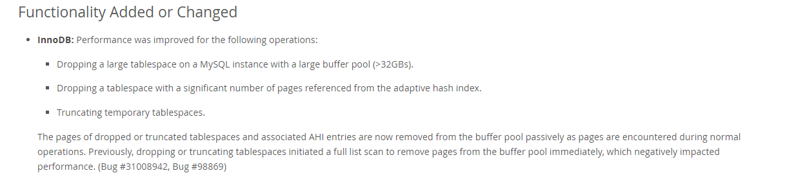

# 故障分析 | DROP 大表造成数据库假死

**原文链接**: https://opensource.actionsky.com/20221116-mysql/
**分类**: MySQL 新特性
**发布时间**: 2022-11-15T21:37:37-08:00

---

作者：岳明强
爱可生北京分公司 DBA 团队成员，人称强哥，朝阳一哥等，负责数据库管理平台的运维和 MySQL 问题处理。擅长对 MySQL 的故障定位。
本文来源：原创投稿
*爱可生开源社区出品，原创内容未经授权不得随意使用，转载请联系小编并注明来源。
客户数据库出现假死，导致探测语句下发不下去，出现切换。后来经过排查发现是一个大表drop 导致的数据库产生假死，也参考过类似的数据库假死的案例，这里将测试一下不同版本drop table的影响
#### 关于drop 大表的历史bug描述
根据https://bugs.mysql.com/bug.php?id=91977中的描述，对于大的buffer pool中的大表 drop 会占用mutex 锁，导致其它查询无法进行。提供的临时解决方案 为释放AHI(自适应哈希),预期解决版本是8.0.23。暂未从5.7的后期版本中找到解决方式
使用不同版本测试影响效果
#### 准备流程
**测试配置**
| buffer pool | 表空间占用 |
| --- | --- |
| 5.7.29 | 128G | 24G |
| 8.0.28 | 128G | 24G |
**关闭 binlog 、调整双一，使用 benchmark 导入300个库的数据**
#benchmark参数如下
db=mysql
driver=com.mysql.jdbc.Driver
conn=jdbc:mysql://10.186.17.104:5729/test?useSSL=false
user=test
password=123456
warehouses=500
loadWorkers=100
terminals=4
//To run specified transactions per terminal- runMins must equal zero
runTxnsPerTerminal=0
//To run for specified minutes- runTxnsPerTerminal must equal zero
runMins=1
//Number of total transactions per minute
limitTxnsPerMin=0
//Set to true to run in 4.x compatible mode. Set to false to use the
//entire configured database evenly.
terminalWarehouseFixed=true
//The following five values must add up to 100
//The default percentages of 45, 43, 4, 4 & 4 match the TPC-C spec
newOrderWeight=45
paymentWeight=43
orderStatusWeight=4
deliveryWeight=4
stockLevelWeight=4
// Directory name to create for collecting detailed result data.
// Comment this out to suppress.
resultDirectory=my_result_%tY-%tm-%td_%tH%tM%tS
//osCollectorScript=./misc/os_collector_linux.py
//osCollectorInterval=1
//osCollectorSSHAddr=user@dbhost
//osCollectorDevices=net_eth0 blk_sda
**导入数据后使用表空间迁移的方式保留较大表的备份，方便后续连续测试**
[root@R820-04 test]# ls -lh bmsql_*.ibd-rw-r----- 1 root root  96K Oct 19 17:49 bmsql_config.ibd-rw-r----- 1 root root  12G Oct 20 13:05 bmsql_customer.ibd-rw-r----- 1 root root 9.0M Oct 20 12:46 bmsql_district.ibd-rw-r----- 1 root root 1.9G Oct 20 13:28 bmsql_history.ibd-rw-r----- 1 root root  17M Oct 19 18:34 bmsql_item.ibd-rw-r----- 1 root root 168M Oct 20 13:32 bmsql_new_order.ibd-rw-r----- 1 root root 1.5G Oct 20 13:48 bmsql_oorder.ibd-rw-r----- 1 root root  14G Oct 20 14:44 bmsql_order_line.ibd-rw-r----- 1 root root  22G Oct 20 11:43 bmsql_stock.ibd-rw-r----- 1 root root 160K Oct 20 10:57 bmsql_warehouse.ibd   mysql [localhost:5729] {root} (test) > FLUSH TABLES bmsql_customer FOR EXPORT ;Query OK, 0 rows affected (0.01 sec)[root@R820-04 test]# cp bmsql_customer.{ibd,cfg} /data/sandboxes/mysql [localhost:5729] {root} (test) > UNLOCK TABLES;Query OK, 0 rows affected (0.00 sec)  mysql [localhost:5729] {root} (test) > FLUSH TABLES bmsql_order_line FOR EXPORT;Query OK, 0 rows affected (0.00 sec)[root@R820-04 test]# cp bmsql_order_line.{ibd,cfg} /data/sandboxes/mysql [localhost:5729] {root} (test) > UNLOCK TABLES;Query OK, 0 rows affected (0.00 sec)  mysql [localhost:5729] {root} (test) > FLUSH TABLES bmsql_stock FOR EXPORT;Query OK, 0 rows affected (0.00 sec)[root@R820-04 test]# cp bmsql_stock.{ibd,cfg} /data/sandboxes/mysql [localhost:5729] {root} (test) > UNLOCK TABLES;Query OK, 0 rows affected (0.01 sec)   [root@R820-04 sandboxes]# ls -lh bmsql_*-rw-r----- 1 root root 1.8K Oct 20 15:06 bmsql_customer.cfg-rw-r----- 1 root root  12G Oct 20 15:06 bmsql_customer.ibd-rw-r----- 1 root root  944 Oct 20 15:12 bmsql_order_line.cfg-rw-r----- 1 root root  14G Oct 20 15:12 bmsql_order_line.ibd-rw-r----- 1 root root 1.4K Oct 20 15:14 bmsql_stock.cfg-rw-r----- 1 root root  22G Oct 20 15:14 bmsql_stock.ibd
**改回 binlog 及双一参数。调整 bufferpool 到128G**
mysql [localhost:5729] {root} ((none)) > set global innodb_buffer_pool_size = 128*1024*1024*1024
Query OK, 0 rows affected (0.00 sec)
mysql [localhost:5729] {root} ((none)) >  show variables like 'innodb_buffer_pool_size';
+-------------------------+-------------+
| Variable_name           | Value       |
+-------------------------+-------------+
| innodb_buffer_pool_size | 17179869184 |
+-------------------------+-------------+
1 row in set (0.00 sec)
**数据库预热**
mysql [localhost:5729] {root} (test) > show variables like '%hash%';
+----------------------------------+-------+
| Variable_name                    | Value |
+----------------------------------+-------+
| innodb_adaptive_hash_index       | ON    |
| innodb_adaptive_hash_index_parts | 8     |
| metadata_locks_hash_instances    | 8     |
+----------------------------------+-------+
#show engine innodb status;的以下列中有AHI的使用情况  
INSERT BUFFER AND ADAPTIVE HASH INDEX
-------------------------------------
Ibuf: size 1, free list len 1373, seg size 1375, 10121 merges
merged operations:
insert 10251, delete mark 0, delete 0
discarded operations:
insert 0, delete mark 0, delete 0
Hash table size 4425293, node heap has 2 buffer(s)
Hash table size 4425293, node heap has 26 buffer(s)
Hash table size 4425293, node heap has 216 buffer(s)
Hash table size 4425293, node heap has 1 buffer(s)
Hash table size 4425293, node heap has 0 buffer(s)
Hash table size 4425293, node heap has 3 buffer(s)
Hash table size 4425293, node heap has 2374 buffer(s)
Hash table size 4425293, node heap has 1137 buffer(s)
218.70 hash searches/s, 398.15 non-hash searches/s
buffer pool的使用情况
mysql [localhost:5729] {root} (performance_schema) >  SELECT CONCAT(FORMAT(A.num * 100.0 / B.num,2),"%") BufferPoolFullPct FROM (SELECT variable_value num FROM performance_schema.global_status WHERE variable_name = 'Innodb_buffer_pool_pages_data') A, (SELECT variable_value num FROM performance_schema.global_status WHERE variable_name = 'Innodb_buffer_pool_pages_total') B;
+-------------------+
| BufferPoolFullPct |
+-------------------+
| 86.21%            |
+-------------------+
1 row in set (0.00 sec)
#### 测试结果
**5.7.29**
开启AHI，drop执行了15s ,TPS/QPS 过程中降为0
mysql [localhost:5729] {root} (test) > drop table bmsql_stock;
Query OK, 0 rows affected (15.75 sec)
[root@qiang1 sysbench]
sysbench 1.0.17 (using bundled LuaJIT 2.1.0-beta2)
Running the test with following options:
Number of threads: 5
Report intermediate results every 3 second(s)
Initializing random number generator from current time
Initializing worker threads...
Threads started!
[ 179s ] thds: 5 tps: 17.00 qps: 330.01 (r/w/o: 257.01/73.00/0.00) lat (ms,95%): 350.33 err/s: 0.00 reconn/s: 0.00
[ 180s ] thds: 5 tps: 5.00 qps: 78.99 (r/w/o: 63.99/15.00/0.00) lat (ms,95%): 272.27 err/s: 0.00 reconn/s: 0.00
[ 181s ] thds: 5 tps: 0.00 qps: 0.00 (r/w/o: 0.00/0.00/0.00) lat (ms,95%): 0.00 err/s: 0.00 reconn/s: 0.00
[ 182s ] thds: 5 tps: 0.00 qps: 0.00 (r/w/o: 0.00/0.00/0.00) lat (ms,95%): 0.00 err/s: 0.00 reconn/s: 0.00
[ 183s ] thds: 5 tps: 0.00 qps: 0.00 (r/w/o: 0.00/0.00/0.00) lat (ms,95%): 0.00 err/s: 0.00 reconn/s: 0.00
[ 184s ] thds: 5 tps: 0.00 qps: 0.00 (r/w/o: 0.00/0.00/0.00) lat (ms,95%): 0.00 err/s: 0.00 reconn/s: 0.00
[ 185s ] thds: 5 tps: 3.00 qps: 68.96 (r/w/o: 56.97/11.99/0.00) lat (ms,95%): 5312.73 err/s: 0.00 reconn/s: 0.00
[ 186s ] thds: 5 tps: 0.00 qps: 0.00 (r/w/o: 0.00/0.00/0.00) lat (ms,95%): 0.00 err/s: 0.00 reconn/s: 0.00
[ 187s ] thds: 5 tps: 0.00 qps: 0.00 (r/w/o: 0.00/0.00/0.00) lat (ms,95%): 0.00 err/s: 0.00 reconn/s: 0.00
[ 188s ] thds: 5 tps: 0.00 qps: 0.00 (r/w/o: 0.00/0.00/0.00) lat (ms,95%): 0.00 err/s: 0.00 reconn/s: 0.00
[ 189s ] thds: 5 tps: 0.00 qps: 0.00 (r/w/o: 0.00/0.00/0.00) lat (ms,95%): 0.00 err/s: 0.00 reconn/s: 0.00
[ 190s ] thds: 5 tps: 0.00 qps: 0.00 (r/w/o: 0.00/0.00/0.00) lat (ms,95%): 0.00 err/s: 0.00 reconn/s: 0.00
[ 191s ] thds: 5 tps: 0.00 qps: 0.00 (r/w/o: 0.00/0.00/0.00) lat (ms,95%): 0.00 err/s: 0.00 reconn/s: 0.00
[ 192s ] thds: 5 tps: 0.00 qps: 0.00 (r/w/o: 0.00/0.00/0.00) lat (ms,95%): 0.00 err/s: 0.00 reconn/s: 0.00
[ 193s ] thds: 5 tps: 0.00 qps: 0.00 (r/w/o: 0.00/0.00/0.00) lat (ms,95%): 0.00 err/s: 0.00 reconn/s: 0.00
[ 194s ] thds: 5 tps: 0.00 qps: 0.00 (r/w/o: 0.00/0.00/0.00) lat (ms,95%): 0.00 err/s: 0.00 reconn/s: 0.00
[ 195s ] thds: 5 tps: 0.00 qps: 0.00 (r/w/o: 0.00/0.00/0.00) lat (ms,95%): 0.00 err/s: 0.00 reconn/s: 0.00
[ 196s ] thds: 5 tps: 10.00 qps: 139.00 (r/w/o: 99.00/40.00/0.00) lat (ms,95%): 16519.10 err/s: 0.00 reconn/s: 0.00
[ 197s ] thds: 5 tps: 19.00 qps: 362.00 (r/w/o: 286.00/76.00/0.00) lat (ms,95%): 303.33 err/s: 0.00 reconn/s: 0.00
[ 198s ] thds: 5 tps: 21.00 qps: 358.00 (r/w/o: 274.00/84.00/0.00) lat (ms,95%): 442.73 err/s: 0.00 reconn/s: 0.00
[ 199s ] thds: 5 tps: 22.00 qps: 395.97 (r/w/o: 307.97/87.99/0.00) lat (ms,95%): 308.84 err/s: 0.00 reconn/s: 0.00
[ 200s ] thds: 5 tps: 16.00 qps: 303.02 (r/w/o: 237.02/66.00/0.00) lat (ms,95%): 502.20 err/s: 0.00 reconn/s: 0.00
[ 201s ] thds: 5 tps: 21.00 qps: 379.03 (r/w/o: 297.02/82.01/0.00) lat (ms,95%): 325.98 err/s: 0.00 reconn/s: 0.00
关闭AHI，时间缩短至2s，TPS/QPS 过程中降为0 
mysql [localhost:5729] {root} (test) > drop table   bmsql_stock;
Query OK, 0 rows affected (2.60 sec)
[ 47s ] thds: 5 tps: 17.00 qps: 283.99 (r/w/o: 215.99/68.00/0.00) lat (ms,95%): 502.20 err/s: 0.00 reconn/s: 0.00
[ 48s ] thds: 5 tps: 15.00 qps: 278.02 (r/w/o: 217.02/61.01/0.00) lat (ms,95%): 493.24 err/s: 0.00 reconn/s: 0.00
[ 49s ] thds: 5 tps: 14.00 qps: 275.92 (r/w/o: 214.93/60.98/0.00) lat (ms,95%): 502.20 err/s: 0.00 reconn/s: 0.00
[ 50s ] thds: 5 tps: 13.00 qps: 245.92 (r/w/o: 197.94/47.99/0.00) lat (ms,95%): 539.71 err/s: 0.00 reconn/s: 0.00
[ 51s ] thds: 5 tps: 0.00 qps: 0.00 (r/w/o: 0.00/0.00/0.00) lat (ms,95%): 0.00 err/s: 0.00 reconn/s: 0.00
[ 52s ] thds: 5 tps: 0.00 qps: 0.00 (r/w/o: 0.00/0.00/0.00) lat (ms,95%): 0.00 err/s: 0.00 reconn/s: 0.00
[ 53s ] thds: 5 tps: 17.00 qps: 280.95 (r/w/o: 210.96/69.99/0.00) lat (ms,95%): 2728.81 err/s: 0.00 reconn/s: 0.00
[ 54s ] thds: 5 tps: 17.00 qps: 312.01 (r/w/o: 246.01/66.00/0.00) lat (ms,95%): 458.96 err/s: 0.00 reconn/s: 0.00
[ 55s ] thds: 5 tps: 22.00 qps: 366.99 (r/w/o: 277.99/89.00/0.00) lat (ms,95%): 331.91 err/s: 0.00 reconn/s: 0.00
[ 56s ] thds: 5 tps: 22.00 qps: 401.00 (r/w/o: 316.00/85.00/0.00) lat (ms,95%): 411.96 err/s: 0.00 reconn/s: 0.00
**8.0.28**
开启AHI，drop执行了2min34 ,未影响TPS/QPS
mysql [localhost:8028] {root} (test) >  drop table bmsql_stock;
Query OK, 0 rows affected (2 min 34.82 sec)
[ 113s ] thds: 50 tps: 26.00 qps: 511.99 (r/w/o: 415.99/96.00/0.00) lat (ms,95%): 2728.81 err/s: 0.00 reconn/s: 0.00
[ 114s ] thds: 50 tps: 34.00 qps: 552.02 (r/w/o: 411.02/141.01/0.00) lat (ms,95%): 2279.14 err/s: 0.00 reconn/s: 0.00
[ 115s ] thds: 50 tps: 25.00 qps: 538.94 (r/w/o: 444.95/93.99/0.00) lat (ms,95%): 2320.55 err/s: 0.00 reconn/s: 0.00
[ 116s ] thds: 50 tps: 28.00 qps: 452.00 (r/w/o: 323.00/129.00/0.00) lat (ms,95%): 2449.36 err/s: 0.00 reconn/s: 0.00
[ 117s ] thds: 50 tps: 34.00 qps: 580.06 (r/w/o: 456.05/124.01/0.00) lat (ms,95%): 2985.89 err/s: 0.00 reconn/s: 0.00
[ 118s ] thds: 50 tps: 24.00 qps: 508.00 (r/w/o: 409.00/99.00/0.00) lat (ms,95%): 2539.17 err/s: 0.00 reconn/s: 0.00
[ 119s ] thds: 50 tps: 34.00 qps: 580.93 (r/w/o: 449.95/130.98/0.00) lat (ms,95%): 2585.31 err/s: 0.00 reconn/s: 0.00
[ 120s ] thds: 50 tps: 37.00 qps: 669.08 (r/w/o: 525.06/144.02/0.00) lat (ms,95%): 2539.17 err/s: 0.00 reconn/s: 0.00
[ 121s ] thds: 50 tps: 50.99 qps: 918.87 (r/w/o: 705.90/212.97/0.00) lat (ms,95%): 1938.16 err/s: 0.00 reconn/s: 0.00
[ 122s ] thds: 50 tps: 42.00 qps: 747.92 (r/w/o: 586.93/160.98/0.00) lat (ms,95%): 2585.31 err/s: 0.00 reconn/s: 0.00
[ 123s ] thds: 50 tps: 40.01 qps: 730.16 (r/w/o: 566.12/164.04/0.00) lat (ms,95%): 1803.47 err/s: 0.00 reconn/s: 0.00
[ 124s ] thds: 50 tps: 46.00 qps: 778.02 (r/w/o: 599.02/179.01/0.00) lat (ms,95%): 2120.76 err/s: 0.00 reconn/s: 0.00
[ 125s ] thds: 50 tps: 38.00 qps: 759.00 (r/w/o: 593.00/166.00/0.00) lat (ms,95%): 1648.20 err/s: 0.00 reconn/s: 0.00
[ 126s ] thds: 50 tps: 43.99 qps: 802.89 (r/w/o: 638.91/163.98/0.00) lat (ms,95%): 2009.23 err/s: 0.00 reconn/s: 0.00
[ 127s ] thds: 50 tps: 45.00 qps: 768.00 (r/w/o: 585.00/183.00/0.00) lat (ms,95%): 2120.76 err/s: 0.00 reconn/s: 0.00
[ 128s ] thds: 50 tps: 42.00 qps: 791.00 (r/w/o: 622.00/169.00/0.00) lat (ms,95%): 1869.60 err/s: 0.00 reconn/s: 0.00
[ 129s ] thds: 50 tps: 53.01 qps: 880.09 (r/w/o: 675.07/205.02/0.00) lat (ms,95%): 1903.57 err/s: 0.00 reconn/s: 0.00
[ 130s ] thds: 50 tps: 59.99 qps: 1088.90 (r/w/o: 838.92/249.98/0.00) lat (ms,95%): 1589.90 err/s: 0.00 reconn/s: 0.00
[ 131s ] thds: 50 tps: 35.88 qps: 723.51 (r/w/o: 575.02/148.49/0.00) lat (ms,95%): 1561.52 err/s: 0.00 reconn/s: 0.00
[ 132s ] thds: 50 tps: 62.20 qps: 1000.22 (r/w/o: 764.46/235.76/0.00) lat (ms,95%): 1708.63 err/s: 0.00 reconn/s: 0.00
[ 133s ] thds: 50 tps: 41.01 qps: 879.29 (r/w/o: 704.23/175.06/0.00) lat (ms,95%): 1213.57 err/s: 0.00 reconn/s: 0.00
[ 134s ] thds: 50 tps: 49.00 qps: 849.02 (r/w/o: 654.02/195.00/0.00) lat (ms,95%): 1648.20 err/s: 0.00 reconn/s: 0.00
[ 135s ] thds: 50 tps: 49.99 qps: 885.89 (r/w/o: 690.92/194.98/0.00) lat (ms,95%): 1973.38 err/s: 0.00 reconn/s: 0.00
[ 136s ] thds: 50 tps: 43.00 qps: 781.08 (r/w/o: 608.07/173.02/0.00) lat (ms,95%): 1618.78 err/s: 0.00 reconn/s: 0.00
[ 137s ] thds: 50 tps: 42.00 qps: 726.99 (r/w/o: 557.00/170.00/0.00) lat (ms,95%): 1938.16 err/s: 0.00 reconn/s: 0.00
[ 138s ] thds: 50 tps: 49.00 qps: 948.96 (r/w/o: 749.97/198.99/0.00) lat (ms,95%): 2045.74 err/s: 0.00 reconn/s: 0.00
关闭AHI，执行时间0.58s完成，不影响业务
mysql [localhost:8028] {root} (test) > drop table bmsql_stock;
Query OK, 0 rows affected (0.58 sec)
[ 35s ] thds: 10 tps: 37.01 qps: 668.19 (r/w/o: 522.15/146.04/0.00) lat (ms,95%): 331.91 err/s: 0.00 reconn/s: 0.00
[ 36s ] thds: 10 tps: 36.00 qps: 623.98 (r/w/o: 481.98/142.00/0.00) lat (ms,95%): 344.08 err/s: 0.00 reconn/s: 0.00
[ 37s ] thds: 10 tps: 35.00 qps: 659.96 (r/w/o: 513.97/145.99/0.00) lat (ms,95%): 344.08 err/s: 0.00 reconn/s: 0.00
[ 38s ] thds: 10 tps: 43.00 qps: 758.02 (r/w/o: 583.01/175.00/0.00) lat (ms,95%): 297.92 err/s: 0.00 reconn/s: 0.00
[ 39s ] thds: 10 tps: 38.00 qps: 671.96 (r/w/o: 523.97/147.99/0.00) lat (ms,95%): 434.83 err/s: 0.00 reconn/s: 0.00
[ 40s ] thds: 10 tps: 33.00 qps: 646.03 (r/w/o: 508.02/138.01/0.00) lat (ms,95%): 369.77 err/s: 0.00 reconn/s: 0.00
[ 41s ] thds: 10 tps: 45.00 qps: 742.92 (r/w/o: 569.94/172.98/0.00) lat (ms,95%): 303.33 err/s: 0.00 reconn/s: 0.00
[ 42s ] thds: 10 tps: 42.00 qps: 760.09 (r/w/o: 597.07/163.02/0.00) lat (ms,95%): 287.38 err/s: 0.00 reconn/s: 0.00
#### 打印堆栈
打印5.7.29的堆栈信息，drop table 过程中持续进行 btr_search_drop_page_hash_index ，在AHI的删除时占用了大量的时间
Thread 69 (Thread 0x7fa088139700 (LWP 397558)):
#0  0x0000000001440f3f in ha_delete_hash_node (table=0xdbce6e08, del_node=0x7fbb56a83310) at /export/home/pb2/build/sb_0-37309218-1576676677.02/mysql-5.7.29/storage/innobase/ha/ha0ha.cc:356
#1  0x0000000001441090 in ha_remove_all_nodes_to_page (table=0xdbce6e08, fold=13261624875940915631, page=0x7faae06b8000 "G\242", <incomplete sequence \332>) at /export/home/pb2/build/sb_0-37309218-1576676677.02/mysql-5.7.29/storage/innobase/ha/ha0ha.cc:434
#2  0x00000000013a7f93 in btr_search_drop_page_hash_index (block=0x7faadd2ad4d8) at /export/home/pb2/build/sb_0-37309218-1576676677.02/mysql-5.7.29/storage/innobase/btr/btr0sea.cc:1334
#3  0x00000000013a9de9 in btr_search_drop_page_hash_when_freed (page_id=..., page_size=...) at /export/home/pb2/build/sb_0-37309218-1576676677.02/mysql-5.7.29/storage/innobase/btr/btr0sea.cc:1395
#4  0x000000000142de36 in fseg_free_extent (seg_inode=<optimized out>, space=131, page_size=..., page=926336, ahi=<optimized out>, mtr=<optimized out>) at /export/home/pb2/build/sb_0-37309218-1576676677.02/mysql-5.7.29/storage/innobase/fsp/fsp0fsp.cc:3806
#5  0x0000000001431f8b in fseg_free_step (header=<optimized out>, ahi=true, mtr=0x7fa088133b70) at /export/home/pb2/build/sb_0-37309218-1576676677.02/mysql-5.7.29/storage/innobase/fsp/fsp0fsp.cc:3898
#6  0x000000000138321d in btr_free_but_not_root (block=0x7fb32312aaa8, log_mode=MTR_LOG_ALL) at /export/home/pb2/build/sb_0-37309218-1576676677.02/mysql-5.7.29/storage/innobase/btr/btr0btr.cc:1160
#7  0x000000000138354c in btr_free_if_exists (page_id=..., page_size=..., index_id=183, mtr=0x7fa0881341a0) at /export/home/pb2/build/sb_0-37309218-1576676677.02/mysql-5.7.29/storage/innobase/btr/btr0btr.cc:1208
#8  0x00000000013de54d in dict_drop_index_tree (rec=<optimized out>, pcur=<optimized out>, mtr=0x7fa0881341a0) at /export/home/pb2/build/sb_0-37309218-1576676677.02/mysql-5.7.29/storage/innobase/dict/dict0crea.cc:1168
#9  0x0000000001319b7a in row_upd_clust_step (node=0x7fa054aa4730, thr=0x7fa054aa7fc0) at /export/home/pb2/build/sb_0-37309218-1576676677.02/mysql-5.7.29/storage/innobase/row/row0upd.cc:2894
#10 0x000000000131b21f in row_upd (node=0x7fa054aa4730, thr=0x7fa054aa7fc0) at /export/home/pb2/build/sb_0-37309218-1576676677.02/mysql-5.7.29/storage/innobase/row/row0upd.cc:3054
#11 0x000000000131b513 in row_upd_step (thr=0x7fa054aa7fc0) at /export/home/pb2/build/sb_0-37309218-1576676677.02/mysql-5.7.29/storage/innobase/row/row0upd.cc:3200
#12 0x00000000012af158 in que_thr_step (thr=0x7fa054aa7fc0) at /export/home/pb2/build/sb_0-37309218-1576676677.02/mysql-5.7.29/storage/innobase/que/que0que.cc:1039
#13 que_run_threads_low (thr=0x7fa054aa7fc0) at /export/home/pb2/build/sb_0-37309218-1576676677.02/mysql-5.7.29/storage/innobase/que/que0que.cc:1119
#14 que_run_threads (thr=<optimized out>) at /export/home/pb2/build/sb_0-37309218-1576676677.02/mysql-5.7.29/storage/innobase/que/que0que.cc:1159
#15 0x00000000012af8ee in que_eval_sql (info=0x7fa054a8e218, sql=0x7fa054b9d7b0 "PROCEDURE DROP_TABLE_PROC () IS\nsys_foreign_id CHAR;\ntable_id CHAR;\nindex_id CHAR;\nforeign_id CHAR;\nspace_id INT;\nfound INT;\nDECLARE CURSOR cur_fk IS\nSELECT ID FROM SYS_FOREIGN\nWHERE FOR_NAME = :table"..., reserve_dict_mutex=0, trx=<optimized out>) at /export/home/pb2/build/sb_0-37309218-1576676677.02/mysql-5.7.29/storage/innobase/que/que0que.cc:1236
#16 0x00000000012e56a2 in row_drop_table_for_mysql (name=0x7fa088135db0 "test/bmsql_stock", trx=0x7fc1fa7f0990, drop_db=<optimized out>, nonatomic=<optimized out>, handler=<optimized out>) at /export/home/pb2/build/sb_0-37309218-1576676677.02/mysql-5.7.29/storage/innobase/row/row0mysql.cc:4715
#17 0x0000000001217672 in ha_innobase::delete_table (this=<optimized out>, name=0x7fa0881371c0 "./test/bmsql_stock") at /export/home/pb2/build/sb_0-37309218-1576676677.02/mysql-5.7.29/storage/innobase/handler/ha_innodb.cc:12597
#18 0x0000000000852278 in ha_delete_table (thd=0x7fa0540128a0, table_type=<optimized out>, path=0x7fa0881371c0 "./test/bmsql_stock", db=0x7fa05492d8e0 "test", alias=0x7fa05492d318 "bmsql_stock", generate_warning=true) at /export/home/pb2/build/sb_0-37309218-1576676677.02/mysql-5.7.29/sql/handler.cc:2601
#19 0x0000000000db5547 in mysql_rm_table_no_locks (thd=0x7fa0540128a0, tables=0x7fa05492d360, if_exists=false, drop_temporary=false, drop_view=false, dont_log_query=false) at /export/home/pb2/build/sb_0-37309218-1576676677.02/mysql-5.7.29/sql/sql_table.cc:2553
#### 修复说明：

超过32g buffer pool中 drop 大表、drop AHI 中占用大量页面的表、drop 临时表空间，
之前版本会立即的释放脏页和 AHI，这样会对性能产生很大的问题。如今的修复方式采用惰性删除的方式，对业务影响比较小
#### 结论：
drop  table 过程大概分为三部分：
1、遍历lru，驱逐属于该表的脏页
2、清理AHI中的内容
3、文件系统的删除
其中前两部分属于最耗时，也是最影响业务的。大的 buffer pool 会导致遍历时间过长，通过hash运算找到AHI对应的位置并删除， 这个时间也是比较长的，此阶段持有内部latche不释放，影响其它查询
8.0.23的修复版本主要是对应第一部分，对于脏页采用惰性删除方式，在关闭AHI的时候，是瞬间完成。当开启AHI的是，时间比历史版本的还要长，区别是不影响业务，猜测是降低锁的持有时间和粒度，使其它事务能够同时执行