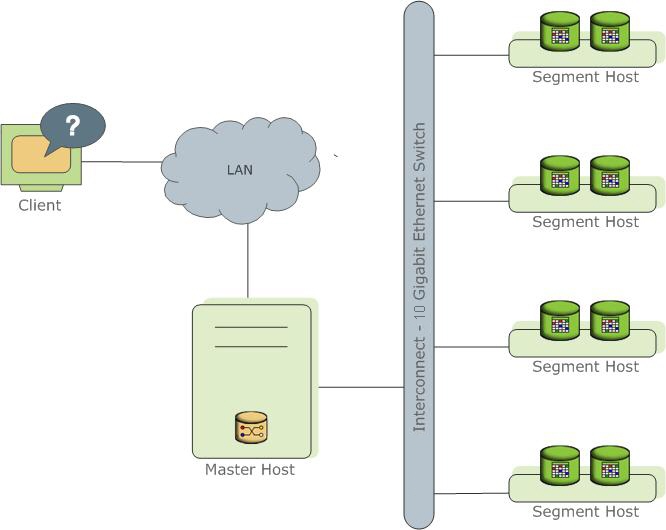

# 故障分析 | Greenplum 集群 standby 故障处理

**原文链接**: https://opensource.actionsky.com/%e6%95%85%e9%9a%9c%e5%88%86%e6%9e%90-greenplum-%e9%9b%86%e7%be%a4-standby-%e6%95%85%e9%9a%9c%e5%a4%84%e7%90%86/
**分类**: 技术干货
**发布时间**: 2022-12-05T23:44:02-08:00

---

作者：杨文
DBA，负责客户项目的需求与维护，没有擅长，会点数据库，不限于MySQL、Redis、Cassandra、GreenPlum、ClickHouse、Elastic、TDSQL等等。
本文来源：原创投稿
*爱可生开源社区出品，原创内容未经授权不得随意使用，转载请联系小编并注明来源。
#### 1、背景
客户测试环境Greenplum集群中，standby节点数据目录被误删除，导致standby节点不可用。如果此时由于其它各种原因导致master节点也不可用，则集群将无法对外提供服务，因此现需尽快恢复standby节点。
#### 2、Greenplum集群架构简单介绍

1）库由Master Severs和Segment Severs组成。
2）Master Server：
- Greenplum数据库的Master是整个Greenplum数据库系统的入口，它接受连接和SQL查询并且把工作分布到Segment实例上。
- Master是全局系统目录的所在地。存储全局系统元数据信息。
- Master会认证客户端连接、处理到来的SQL命令、在Segment之间分布工作负载、协调每一个Segment返回的结果以及把最终结果呈现给客户端程序。
3）Segment Severs：
- Greenplum数据库的Segment实例是独立的数据库，每一个都存储了数据的一部分并且执行查询处理的主要部分。
- 用户定义的表及其索引会分布在Greenplum数据库系统中可用的Segment上，每一个Segment都包含数据的不同部分。服务于Segment数据的数据库服务器进程运行在相应的Segment实例之下。用户通过Master与一个Greenplum数据库系统中的Segment交互。
- 当某个segment宕掉后，启用对应的mirror segment提供服务，保证数据不丢失。
#### 3、本地模拟客户环境：
3.1、本地Greenplum集群环境：
- 1台Master；
- 1台standby Master；
- 5台segment计算节点，每个节点4个段，每个段有镜像，一共是40个段。
3.2、模拟master standby坏掉：
[root@standby01 ~]$ su - gpadmin
[gpadmin@standby01 ~]$ rm -rf /greenplum/gpdata/master/*
[gpadmin@standby01 ~]$ exit
[root@standby01 ~]$ reboot
[root@standby01 ~]$ su - gpadmin
[gpadmin@standby01 ~]$ ps -ef |grep postgres
gpadmin 17372 17298  0 18:47 pts/0  00:00:00 grep --color=auto postgres
[gpadmin@standby01 ~]$ cd /greenplum/gpdata/master/
[gpadmin@standby01 master]$ ll
总用量 0
#### 4、故障分析及解决：
4.1、检查状态：
[gpadmin@master01 ~]$ gpstate -f
截取部分有用信息：
20220508:18:37:03:044858 gpstate:master01:gpadmin-[INFO]:-obtaining Segment details from master...
20220508:18:37:08:044858 gpstate:master01:gpadmin-[INFO]:-Standby master details
20220508:18:37:08:044858 gpstate:master01:gpadmin-[INFO]:-----------------------
20220508:18:37:08:044858 gpstate:master01:gpadmin-[INFO]:-    Standby address        = standby01 
20220508:18:37:08:044858 gpstate:master01:gpadmin-[INFO]:-    Standby data directory = /greenplum/gpdata/master/gpseg-1
20220508:18:37:08:044858 gpstate:master01:gpadmin-[INFO]:-    Standby port           = 5432
20220508:18:37:08:044858 gpstate:master01:gpadmin-[WARNING]:- Standby PID            = 0                           <<<<<<<<
20220508:18:37:08:044858 gpstate:master01:gpadmin-[WARNING]:- Standby status         = Standby process not running <<<<<<<<
20220508:18:37:08:044858 gpstate:master01:gpadmin-[INFO]:---------------------------------------------------------
20220508:18:37:08:044858 gpstate:master01:gpadmin-[INFO]:--pg_stat.replication
20220508:18:37:08:044858 gpstate:master01:gpadmin-[INFO]:---------------------------------------------------------
20220508:18:37:08:044858 gpstate:master01:gpadmin-[INFO]:-No entries found.
20220508:18:37:08:044858 gpstate:master01:gpadmin-[INFO]:---------------------------------------------------------
可以看到：Standby status = Standby process not running。
[gpadmin@master01 ~]$ psql -c "select * from gp_segment_configuration order by content asc,dbid;"
--同样，能够看到Standby节点down掉了。
[gpadmin@master01 ~]$ gpstate
截取部分有用信息：
20220508:18:42:46:045284 gpstate:master01:gpadmin-[INFO]:-Greenplum instance status summary
20220508:18:42:47:045284 gpstate:master01:gpadmin-[INFO]:----------------------------------------------------
20220508:18:42:47:045284 gpstate:master01:gpadmin-[INFO]:-   Master instance                            = Active
20220508:18:42:47:045284 gpstate:master01:gpadmin-[INFO]:-   Master standby                             = standby01 
20220508:18:42:47:045284 gpstate:master01:gpadmin-[WARNING]:-Standby master status                      = Standby host DOWN <<<<<<<<
20220508:18:42:47:045284 gpstate:master01:gpadmin-[INFO]:-   Total segment instance count from metadata = 40
20220508:18:42:47:045284 gpstate:master01:gpadmin-[INFO]:----------------------------------------------------
20220508:18:42:47:045284 gpstate:master01:gpadmin-[INFO]:-   Primary Segment Status
20220508:18:42:47:045284 gpstate:master01:gpadmin-[INFO]:----------------------------------------------------
可以看到Standby status = Standby host DOWN。
4.2、清除有故障的主机的（备库）配置信息：
[gpadmin@master01 ~]$ gpinitstandby -r
执行过程省略，但有个选项需要确认：
Do you want to continue with deleting the standby master? Yy|Nn (default=N):
> y
4.3、添加standby库：
[gpadmin@master01 ~]$ gpinitstandby -s standby01 
执行过程省略，但有个选项需要确认：
Do you want to continue with standby master initialization? Yy|Nn (default=N):
> y
4.4、确认集群状态：
[gpadmin@master01 ~]$ gpstate -f
截取部分有用信息：
20220508:18:56:33:044858 gpstate:master01:gpadmin-[INFO]:-Standby master details
20220508:18:56:33:044858 gpstate:master01:gpadmin-[INFO]:-----------------------
20220508:18:56:33:044858 gpstate:master01:gpadmin-[INFO]:-    Standby address        = standby01 
20220508:18:56:33:044858 gpstate:master01:gpadmin-[INFO]:-    Standby data directory = /greenplum/gpdata/master/gpseg-1
20220508:18:56:33:044858 gpstate:master01:gpadmin-[INFO]:-    Standby port           = 5432
20220508:18:56:33:044858 gpstate:master01:gpadmin-[INFO]:-    Standby PID            = 18067                           <<<<<<<<
20220508:18:56:33:044858 gpstate:master01:gpadmin-[INFO]:-    Standby status         = Standby host passive
20220508:18:56:33:044858 gpstate:master01:gpadmin-[INFO]:---------------------------------------------------------
20220508:18:56:33:044858 gpstate:master01:gpadmin-[INFO]:--pg_stat.replication
20220508:18:56:33:044858 gpstate:master01:gpadmin-[INFO]:---------------------------------------------------------
20220508:18:56:33:044858 gpstate:master01:gpadmin-[INFO]:--WAL Sender State：streaming
20220508:18:56:33:044858 gpstate:master01:gpadmin-[INFO]:--Sync state：sync
[gpadmin@master01 ~]$ gpstate
截取部分有用信息：
20220508:18:42:47:045284 gpstate:master01:gpadmin-[INFO]:-   Master instance                            = Active
20220508:18:42:47:045284 gpstate:master01:gpadmin-[INFO]:-   Master standby                             = standby01
20220508:18:42:47:045284 gpstate:master01:gpadmin-[INFO]:-   Standby master status                      = Standby host passive
20220508:18:42:47:045284 gpstate:master01:gpadmin-[INFO]:-   Total segment instance count from metadata = 40
[gpadmin@master01 ~]$ psql -c "select * from gp_segment_configuration order by content asc,dbid;"
只截取关键信息：
dbid | content | role | preferred_role | mode | status | port | hostname  | address   | datadir
------------------------------------------------------------------------------------------------------------------------
1 |      -1 | p    | p              | n    | u      | 5432 | master01  | master01  | /greenplum/gpdata/master/gpseg-1
43 |      -1 | m    | m              | s    | u      | 5432 | standby01 | standby01 | /greenplum/gpdata/master/gpseg-1
4.5、检测standby：
[gpadmin@standby01 ~]$ ps -ef |grep postgres
gpadmin  18067      1  0  18:56 ?      00:00:03  /usr/local/greenplum-db-6.7.0/bin/postgres -D /greenplum/gpdata/master/gpseg-1 -p 5432 -E
gpadmin  18208  18067  0  18:56 ?      00:00:00  postgres: 5432, master logger process
gpadmin  18209  18067  0  18:56 ?      00:00:00  postgres: 5432, startup process recovering 00000001000000000000000A
gpadmin  18217  18067  0  18:56 ?      00:00:00  postgres: 5432, checkpointer process
gpadmin  18218  18067  0  18:56 ?      00:00:00  postgres: 5432, writer process
gpadmin  18219  18067  0  18:56 ?      00:00:00  postgres: 5432, wal receiver process streaming 0/281E5D60
gpadmin  18586  17298  0  19:06 pts/0  00:00:00  grep --color=auto postgres
[gpadmin@standby01 master]$ pwd
/greenplum/gpdata/master
[gpadmin@standby01 master]$ ls
gpseg-1
[gpadmin@standby01 masterj$ cd gpseg-1/
[gpadmin@standby01 gpseg-1]$ ls
backup_label.old        pg_hba.conf    pg_tblspc
base                    pg_ident.conf  pg_twophase
global                  pg_log         pg_utilitymodedtmredo
gpexpand.status_detail  pg_logical     PG_VERSION
gpmetrics               pg_multixact   pg_xlog
gpperfmon               pg_notify      postgresql.auto.conf
gpsegconfig_dump        pg_replslot    postgresql.conf
gpssh.conf              pg_serial      postmaster.opts
interna1.auto.conf      pg_snapshot    spostmaster.pid
pg_clog  pg_stat        recovery.conf
pg_distributedlog       pg_stat_tmp
pg_dynshmem             pg_subtrans
可以看到standby数据恢复，并且集群状态恢复正常。
#### 5、额外补充：
如果Greenplum集群中master节点故障，处理思路：
1）先把standby提升为新master，确保集群第一时间可用，提供对外服务；
2）修复旧master，并添加到集群中成为新standby；
3）若要回切成原master-standby状态：下线新master -> 提升原master节点 -> 新增standby节点。