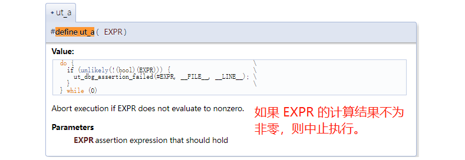
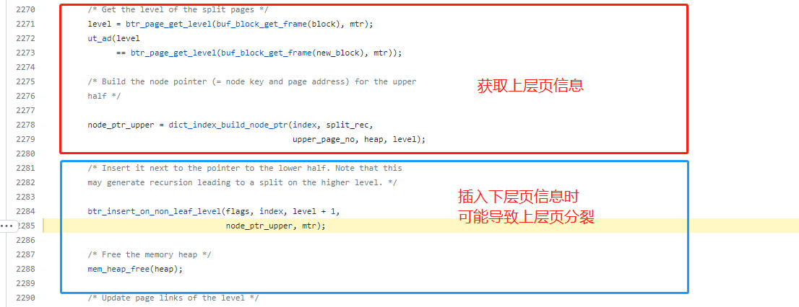

# 故障分析 | MySQL 5.7 使用临时表导致数据库 Crash

**原文链接**: https://opensource.actionsky.com/20220513-mysql/
**分类**: MySQL 新特性
**发布时间**: 2022-05-12T19:46:50-08:00

---

作者：雷文霆
爱可生华东交付服务部  DBA 成员，主要负责Mysql故障处理及相关技术支持。爱好看书，电影。座右铭，每一个不曾起舞的日子，都是对生命的辜负。
本文来源：原创投稿
*爱可生开源社区出品，原创内容未经授权不得随意使用，转载请联系小编并注明来源。
#### 目录
- 
背景信息
- 
故障分析
- 
问题复现
- 
测试日志
- 
测试结论
- 
参考链接
## 背景信息
在 MySQL5.7.30 主从读写分离环境下，从库在某天出现了 **MySQL crash**.
**系统侧:** 监控显示该从库主机的内存和CPU资源使用率在故障前后均正常，磁盘IO有2%的iowait（读写200M/s），说明故障前磁盘存在压力。
**服务侧：**slow-log 中记录了服务重启前，存在使用了临时表和文件排序的慢 SQL 语句。
Error-log 中记录了服务调用到  btr0btr.cc 文件 的 L2165 行，出现了 err == DB_SUCCESS 报错。
`0x7f2dd49d0700  InnoDB: Assertion failure in thread 139834817316608 in file btr0btr.cc line 2165
InnoDB: Failing assertion: err == DB_SUCCESS
InnoDB: We intentionally generate a memory trap.
InnoDB: Submit a detailed bug report to http://bugs.mysql.com.
`
## 故障分析
在系统侧排除了磁盘空间不足和内存不足的因素，服务侧怀疑是慢查询和BUG的原因，之后通过&#8221; btr0btr.cc&#8221;关键字查找到了一个类似的 BUG 。链接如下:
> 
https://bugs.mysql.com/bug.php?id=101154
报告的意思是，MySQL 在执行 btr_insert_on_non_leaf_level_func()函数时，写入临时表会导致带有断言的服务崩溃。
**通过查看 btr0btr.cc 文件开头的注释了解到的原因是：**
此文件的调用机制是：对b树行操作或记录所做的所有更改。
L2165 行操作内容是：在处理插入到非叶级别的内容时，会检查每个级别的可用空间(需保留2倍索引数高度的页空间)，如果在操作之前，叶分裂已经开始，就很难撤销，只能通过崩溃进行前滚。**该 BUG 只会在 MySQL5.7 出现 **
代码查询：https://github.com/mysql/mysql-server  (通过 Tags 标签选择对应版本)
代码内容：https://github.com/mysql/mysql-server/blob/mysql-5.7.30/storage/innobase/btr/btr0btr.cc#L2165
`nserts a data tuple to a tree on a non-leaf level. It is assumed
that mtr holds an x-latch on the tree. */
void
btr_insert_on_non_leaf_level_func()
---
ut_a(err == DB_SUCCESS);
---
其中ut_a()
https://dev.mysql.com/doc/dev/mysql-server/latest/ut0dbg_8h.html#ae7aed983dfe98ac872b5a9915fa778fa:
`

**检查数据库关于临时表的参数：**
> 
innodb_temp_data_file_path **ibtmp1:12M:autoextend:max:20G**
tmp_table_size **64M** 和 max_heap_table_size **64M**
注释：实际限制取二者中的较小者。会话级别的参数，对于 innodb_buffer_pool_size 不大且没有用到临时大数据量查询的情况，不建议设置的过大，可能会导致内存溢出的情况。**连接数800+，64M为推荐值**
> 
internal_tmp_disk_storage_engine **InnoDB**
注释：用于定义磁盘临时表的存储引擎。超出 InnoDB 行或列限制的磁盘内部临时表的查询会返回 Row size too large 或 Too many columns 错误。解决方法是设置 internal_tmp_disk_storage_engine 为 MYISAM ，我们的 error-log 中无相关报错。**初步排查阶段不建议修改**
> 
created_tmp_disk_tables **2987733**
created_tmp_tables **11049848**
注释：当在内存或磁盘上创建内部临时表时，服务器会增加该 `Created_tmp_tables`值。在磁盘上创建内部临时表时，服务器会增加该 `Created_tmp_disk_tables`值。如果在磁盘上创建了太多内部临时表，请考虑增加`tmp_table_size`和`max_heap_table_size`设置。**从早上10点36分到17点产生较多临时表，结合业务繁忙情况，属于正常现象**
**小结:**  通过上面的分析，结合应用架构(无法升级到 MySQL8.0 )。初步阶段是建议**先优化 SQL 语句**，减少对临时表的使用，降低再次发生的概率。
## 问题复现
上文提到的 BUG 报告中，有个使用 **MySQL Test Run** 简称MTR(MySQL官方的自动化测试框架)  的测试用例。
下文将引用此测试用例，进行复现测试。
参数解释：
**innodb_limit_optimistic_insert_debug参数可以限制每个B树页面的记录数，在 MySQL 运行过程中动态设置此参数可以导致页分裂。**
`innodb_limit_optimistic_insert_debug
限制每个 B 树页面的记录数。默认值 0 表示不施加限制。仅当使用 CMake选项编译调试支持时，需开启DEBUG选项。
# 依赖
yum install -y gcc gcc-c++ cmake ncurses ncurses-devel bison openssl openssl-devel
tar -xvf mysql-boost-5.7.30.tar.gz
--编译安装MySQL，因为需要设置innodb_limit_optimistic_insert_debug参数-------
tar -xvf mysql-boost-5.7.30.tar.gz
# 非BOOST版本的Mysql源码包，需要指定-DDOWNLOAD_BOOST=1 -DWITH_BOOST=/usr/local/boost
cd mysql-5.7.30
cmake . -DCMAKE_INSTALL_PREFIX=/tools/mysql-test5.7.30 -DMYSQL_DATADIR=/tools/mysql-test5.7.30/data -DMYSQL_UNIX_ADDR=/tools/mysql-test5.7.30/mysql5.7.30.sock -DDEFAULT_CHARSET=utf8mb4 -DDEFAULT_COLLATION=utf8mb4_general_ci -DEXTRA_CHARSETS=all -DENABLED_LOCAL_INFILE=1 -DWITH_SSL=system  -DWITH_BOOST=boost -DWITH_DEBUG=1 
make
make install
# Cmake 编译之后会在DCMAKE_INSTALL_PREFIX目录中生成mysql-test测试框架目录
/tools/mysql-test5.7.30/mysql-test/t
vim my0420.test 
cat my0420.test 
--source include/have_innodb.inc
--let $restart_parameters = "restart: --innodb_temp_data_file_path=ibtmp1:12M:autoextend:max:1G --big-tables=1"
--source include/restart_mysqld.inc
SELECT @@innodb_temp_data_file_path;
drop function if exists func1;
delimiter |;
create function func1(x int) returns int deterministic
begin
declare z1, z2 int;
set z1 = x;
set z2 = z1 + 2;
return z2;
end|
delimiter ;|
create table t1 (a int, b varchar(20));
insert into t1 values(1, 'a'), (2, 'b'), (3, 'c'), (3, 'c'), (4, 'c');
SET GLOBAL innodb_limit_optimistic_insert_debug=4;
--let $i=1
while ($i 
**将 my0420.test 第二行新增--internal_tmp_disk_storage_engine=MYISAM参数后，服务不崩溃。**
--let $restart_parameters = "restart: --innodb_temp_data_file_path=ibtmp1:12M:autoextend:max:1G **--internal_tmp_disk_storage_engine=MYISAM** --big-tables=1"
**将 my0420.test 第二行增大为---innodb_temp_data_file_path=ibtmp1:12M:autoextend:max:6G参数后，服务不崩溃。**
--let $restart_parameters = "restart: --innodb_temp_data_file_path=ibtmp1:12M:autoextend:max:6G  --big-tables=1"
`big_tables`如果启用，服务器将所有临时表存储在磁盘上而不是内存中。这可以防止需要大型临时表的操作的大多数错误，但也会减慢内存表就足够的查询。most `The table *`tbl_name`* is full` errors for`SELECT`operations，如果error-log中出现此报错，**说明select 操作使用了大的磁盘临时表**，不推荐启用。
(**小提示**，客户环境中时常会收到某张临时表 #sql_tbl_name is full的告警邮件，需要考虑是否可以优化SQL了)
## 测试日志
MTR 的执行逻辑为启动一个临时 MySQL 服务，并执行t目录中 my0420.test 文件的内容，执行结果默认会和r目录中的 result 同名文件(也叫标准执行结果文件，一般会在正确的版本中生成)进行对比，用于判断测试文件是否正确。
`在mysql-test目录下：
./mtr my0420.test  
--执行到以下语句时报错--
SET GLOBAL innodb_limit_optimistic_insert_debug=2;
[100%] main.my0420                              [ fail ]
Test ended at 2022-04-20 20:05:39
CURRENT_TEST: main.my0420
mysqltest: At line 32: query 'select * from t1 order by func1(a)' failed: 2013: Lost connection to MySQL server during query
safe_process[7080]: Child process: 7081, exit: 1
Server [mysqld.1 - pid: 7089, winpid: 7089, exit: 256] failed during test run
Server log from this test:
`
Lost connection ，MySQL 服务已停止。之后打印了 error 信息。**错误同样出现在 btr0btr.cc line 2165**
`Server log from this test:
----------SERVER LOG START-----------
2022-04-20T12:02:42.082135Z 0 [Note] /tools/mysql-test5.7.30/bin/mysqld (mysqld 5.7.30-debug-log) starting as process 7049 ...
2022-04-20T12:02:43.698812Z 0 [Note] /tools/mysql-test5.7.30/bin/mysqld: Shutdown complete
2022-04-20T12:02:45.051667Z 0 [Note] /tools/mysql-test5.7.30/bin/mysqld (mysqld 5.7.30-debug-log) starting as process 7090 ...
2022-04-20T12:02:45.262573Z 0 [Note] /tools/mysql-test5.7.30/bin/mysqld: ready for connections.
Version: '5.7.30-debug-log'  socket: '/tools/mysql-test5.7.30/mysql-test/var/tmp/mysqld.1.sock'  port: 13000  Source distribution
2022-04-20 15:05:37 0x7fc298bc4700  InnoDB: Assertion failure in thread 140473762858752 in file btr0btr.cc line 2165
InnoDB: Failing assertion: err == DB_SUCCESS
InnoDB: We intentionally generate a memory trap.
InnoDB: Submit a detailed bug report to http://bugs.mysql.com.
InnoDB: If you get repeated assertion failures or crashes, even
InnoDB: immediately after the mysqld startup, there may be
InnoDB: corruption in the InnoDB tablespace. Please refer to
InnoDB: http://dev.mysql.com/doc/refman/5.7/en/forcing-innodb-recovery.html
InnoDB: about forcing recovery.
12:05:37 UTC - mysqld got signal 6 ;
This could be because you hit a bug. It is also possible that this binary
or one of the libraries it was linked against is corrupt, improperly built,
or misconfigured. This error can also be caused by malfunctioning hardware.
Attempting to collect some information that could help diagnose the problem.
As this is a crash and something is definitely wrong, the information
collection process might fail.
key_buffer_size=1048576
read_buffer_size=131072
max_used_connections=1
max_threads=151
thread_count=1
connection_count=1
It is possible that mysqld could use up to
key_buffer_size + (read_buffer_size + sort_buffer_size)*max_threads = 61093 K  bytes of memory
Hope that's ok; if not, decrease some variables in the equation.
Trying to get some variables.
Some pointers may be invalid and cause the dump to abort.
Query (7fc234005890): select * from t1 order by func1(a)
Connection ID (thread ID): 2
Status: NOT_KILLED
`
和客户环境的区别之处:
**生产中的报错为 Query(7f3be00479d0) is an invalid pointer.** 无效指针，类似磁盘空间不足的报错.
测试中的报错为 Query (7fc234005890): select * from t1 order by func1(a).
**测试环境的堆栈信息:**
> 
https://github.com/mysql/mysql-server/blob/mysql-5.7.30/storage/innobase/btr/btr0btr.cc#L2285

（上图中文是翻译的代码注释，可能会有些偏差错误）
**检查测试日志文件 error-log**，默认会在当前目录生成var目录，其中包含 my.cnf 文件
/tools/mysql-test5.7.30/mysql-test/var/log/mysqld.1.err
`Trying to get some variables.
Some pointers may be invalid and cause the dump to abort.
Query (7fc234005890): select * from t1 order by func1(a)
Connection ID (thread ID): 2
Status: NOT_KILLED
The manual page at http://dev.mysql.com/doc/mysql/en/crashing.html contains
information that should help you find out what is causing the crash.
Writing a core file
safe_process[7089]: Child process: 7090, killed by signal: 6
`
**关于编译安装 MySQL 的补充：**
Cmake 编译之后会在 DCMAKE_INSTALL_PREFIX 目录中生成 mysql-test 测试框架目录，
不需要以下步骤（以下步骤在不需要 DEBUG 调试时使用）
1.此包是mysql-test-5.7.30-linux-glibc2.12-x86_64.tar.gz
mv mysql-5.7.30-linux-glibc2.12-x86_64/ /tools/mysql-test
2.将mysql安装包目录下的文件与mtr目录合并，mysql安装包目录下为basedir
cp -r /data/mysql/base/5.7.30 /tools/mysql-test
(插播生活日记，make命令大约需要执行1个小时，刚好18:27，又恰逢隔离，起身洗锅炸厨房了嗷)
## 测试结论
> 
此 BUG 可能会出现在 MySQL5.7 版本中
1.测试中验证了数据库参数 innodb_temp_data_file_path 增大*max_file_size*后不会发生服务崩溃，如果业务 SQL 无法进行优化时，可以增大此参数，可降低触发崩溃的概率。
2.测试中验证了数据库参数 internal_tmp_disk_storage_engine=MYISAM 时不会发生服务崩溃，默认 INNODB
如果业务无法升级到 8.0 时，可以动态调整此参数。
**我们建议的变更顺序是:**
优化 SQL 语句 -> 增大 innodb_temp_data_file_path 参数的 max_file_size 值 -> 升级到 MySQL 8.0（使用会话临时表空间） -> 修改 internal_tmp_disk_storage_engine 参数。
其中 internal_tmp_disk_storage_engine 参数，个人不是很理解，是否真的要将默认值 INNODB 更改为 MYISAM 。之后请教同事了解到，"内部临时表不会被复制，不会有并发访问，是可以考虑使用 MYISAM 的"
再次感谢嗷。
## 参考链接
> 
BUG报告:
https://bugs.mysql.com/bug.php?id=101154
https://jira.percona.com/browse/PS-7318?focusedCommentId=268045&page=com.atlassian.jira.plugin.system.issuetabpanels%3Acomment-tabpanel#comment-268045
编译安装及参数说明:
https://blog.csdn.net/iteye_621/article/details/81959655
https://baijiahao.baidu.com/s?id=1725289345179642059&wfr=spider&for=pc
https://dev.mysql.com/doc/refman/5.7/en/source-configuration-options.html#cmake-general-options
MTR 文档:
https://dev.mysql.com/doc/dev/mysql-server/latest/PAGE_MYSQLTEST_FRAMEWORK_COMPONENTS.html
数据库参数:
https://dev.mysql.com/doc/refman/5.7/en/server-status-variables.html#statvar_Created_tmp_tables
https://dev.mysql.com/doc/refman/5.7/en/server-status-variables.html#statvar_Created_tmp_disk_tables
https://dev.mysql.com/doc/refman/5.7/en/server-system-variables.html#sysvar_tmp_table_size
https://dev.mysql.com/doc/refman/5.7/en/server-system-variables.html#sysvar_max_heap_table_size
https://dev.mysql.com/doc/refman/5.7/en/server-system-variables.html#sysvar_big_tables
https://dev.mysql.com/doc/refman/5.7/en/select.html