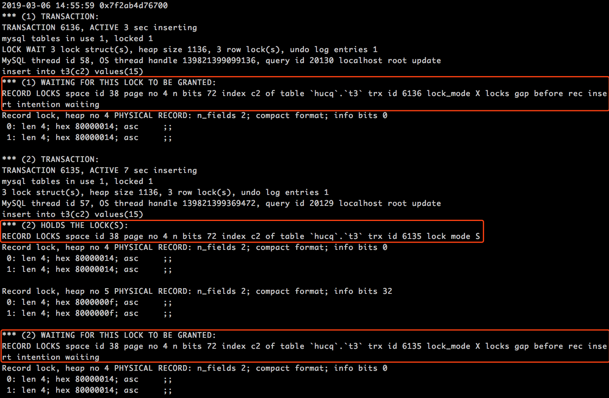

# 故障分析 | MySQL Insert 加锁与死锁分析

**原文链接**: https://opensource.actionsky.com/20190331-mysql-insert/
**分类**: MySQL 新特性
**发布时间**: 2019-03-31T18:40:29-08:00

---

我们来看这样的场景为什么会死锁？
| ssession 1 | ssession 2 | ssession 2 |
| --- | --- | --- |
| commit; |  |  |
| begin;delete from t3 where c2=15 |  |  |
|  | begin;insert into t3(c2) values(15); | begin;insert into t3(c2) values(15); |
在我们尝试回答这个问题前，一定要注意前提条件，如果你看过登博的《MySQL 加锁处理》，一定知道前提不同答案也就不同，如果还没看过建议你去看一下，链接：http://hedengcheng.com/?p=771。
那么这个问题缺少哪些前提条件？
- c2 字段建有唯一索引
- 
隔离级别为：READ-COMMITTED
其实网络上有类似的案例分析，其中丁奇老师在《MySQL实战45讲》中的第40篇《insert语句的锁为什么这么多？》中有一样的例子和分析，但是我的理解有些微差异，所以来说说我个人的看法，如果有不对的地方请大家指正。首先我会分析一下这个场景的加锁情况和死锁原因，然后对于差异的点进行展开，最后总结 insert 的加锁情况（关于 insert 的加锁行为，其实不像 delete 那样简单清晰，里面有一些需要注意的点）。
# 加锁情况与死锁原因分析
为方便大家复现，完整表结构和数据如下：
`CREATE TABLE `t3` (
`c1` int(11) NOT NULL AUTO_INCREMENT,
`c2` int(11) DEFAULT NULL,
PRIMARY KEY (`c1`),
UNIQUE KEY `c2` (`c2`)
) ENGINE=InnoDB
insert into t3 values(1,1),(15,15),(20,20);
`
在 session1 执行 commit 的瞬间，我们会看到 session2、session3 的其中一个报死锁。这个死锁是这样产生的：
- 
session1 执行 delete  会在唯一索引 c2 的 c2 = 15 这一记录上加 X lock（也就是在MySQL 内部观测到的：X Lock but bot gap）；
- 
session2 和 seesion3 在执行 insert 的时候，由于唯一约束检测发生唯一冲突，会加 S Next-Key Lock，即对 (1,15] 这个区间加锁包括间隙，并且被 seesion1 的 X Lock 阻塞，进入等待；
- 
session1 在执行 commit 后，会释放 X Lock，session2 和 session3 都获得 S Next-Key Lock；
- 4.session2 和 session3 继续执行插入操作，这个时候 INSERT INTENTION LOCK（插入意向锁）出现了，并且由于插入意向锁会被 gap 锁阻塞，所以 session2 和 session3 互相等待，造成死锁。
死锁日志如下：

## INSERT INTENTION LOCK
在之前的死锁分析第四点，如果不分析插入意向锁，也是会造成死锁的，因为插入最终还是要对记录加 X Lock 的，session2 和 session3 还是会互相阻塞互相等待。
但是插入意向锁是客观存在的，我们可以在官方手册中查到，不可忽略：
> 
Prior to inserting the row, a type of gap lock called an insert intention gap lock is set. This lock signals the intent to insert in such a way that multiple transactions inserting into the same index gap need not wait for each other if they are not inserting at the same position within the gap.
插入意向锁其实是一种特殊的 gap lock，但是它不会阻塞其他锁。假设存在值为 4 和 7 的索引记录，尝试插入值 5 和 6 的两个事务在获取插入行上的排它锁之前使用插入意向锁锁定间隙，即在（4，7）上加 gap lock，但是这两个事务不会互相冲突等待。
当插入一条记录时，会去检查当前插入位置的下一条记录上是否存在锁对象，如果下一条记录上存在锁对象，就需要判断该锁对象是否锁住了 gap。如果 gap 被锁住了，则插入意向锁与之冲突，进入等待状态（插入意向锁之间并不互斥）。总结一下这把锁的属性：
- 它不会阻塞其他任何锁；
- 
它本身仅会被 gap lock 阻塞。
在学习 MySQL 过程中，一般只有在它被阻塞的时候才能观察到，所以这也是它常常被忽略的原因吧&#8230;
## GAP LOCK
在此例中，另外一个重要的点就是 gap lock，通常情况下我们说到 gap lock 都只会联想到 REPEATABLE-READ 隔离级别利用其解决幻读。但实际上在 READ-COMMITTED 隔离级别，也会存在 gap lock ，只发生在：唯一约束检查到有唯一冲突的时候，会加 S Next-key Lock，即对记录以及与和上一条记录之间的间隙加共享锁。
通过下面这个例子就能验证：
| session 1 | session 2 |
| --- | --- |
| begin; |  |
| insert into t3(c2) values(20);ERROR 1062 (23000): Duplicate entry &#8217;20&#8217; for key &#8216;c2&#8217; |  |
|  | begin; |
|  | insert into t3(c2) values(18);block |
这里 session1 插入数据遇到唯一冲突，虽然报错，但是对 (15,20] 加的 S Next-Key Lock 并不会马上释放，所以 session2 被阻塞。另外一种情况就是本文开始的例子，当 session2 插入遇到唯一冲突但是因为被 X Lock 阻塞，并不会立刻报错 “Duplicate key”，但是依然要等待获取 S Next-Key Lock 。
有个困惑很久的疑问：出现唯一冲突需要加 S Next-Key Lock 是事实，但是加锁的意义是什么？还是说是通过 S Next-Key Lock 来实现的唯一约束检查，但是这样意味着在插入没有遇到唯一冲突的时候，这个锁会立刻释放，这不符合二阶段锁原则。这点希望能与大家一起讨论得到好的解释。
如果是在 REPEATABLE-READ，除以上所说的唯一约束冲突外，gap lock 的存在是这样的：
普通索引（非唯一索引）的S/X Lock，都带 gap 属性，会锁住记录以及前1条记录到后1条记录的左闭右开区间，比如有[4,6,8]记录，delete 6，则会锁住[4,8）整个区间。
对于 gap lock，相信 DBA 们的心情是一样一样的，所以我的建议是：
- 在绝大部分的业务场景下，都可以把 MySQL 的隔离界别设置为 READ-COMMITTED；
- 
在业务方便控制字段值唯一的情况下，尽量减少表中唯一索引的数量。
## 锁冲突矩阵
前面我们说的 GAP LOCK 其实是锁的属性，另外我们知道 InnoDB 常规锁模式有：S 和 X，即共享锁和排他锁。锁模式和锁属性是可以随意组合的，组合之后的冲突矩阵如下，这对我们分析死锁很有帮助：
| 行：待加锁；列：存在锁 | S（not gap） | S（gap） | S(next-key) | X（not gap） | X（gap） | X(next-key) | Insert Intention |
| --- | --- | --- | --- | --- | --- | --- | --- |
| X(not gap) | 冲突 |  | 冲突 | 冲突 |  | 冲突 |  |
| X(next-key) | 冲突 |  | 冲突 | 冲突 |  | 冲突 | 冲突 |
| S(not gap) |  |  |  | 冲突 |  | 冲突 |  |
| S(gap) |  |  |  |  |  |  | 冲突 |
| S(next-key) |  |  |  | 冲突 |  | 冲突 | 冲突 |
| X(gap) |  |  |  |  |  |  | 冲突 |
| insert intention |  |  |  |  |  |  |  |
## INSERT 加锁总结
无 Unique Key：X Lock but not gap
有 Unique Key：
- 唯一性约束检查发生冲突时，会加 S Lock，带 gap 属性，会锁住记录以及与前1条记录之前的间隙；
- 如果插入的位置有带 gap 属性的 S/X Lock，则插入意向锁（LOCK_INSERT_INTENTION）被阻塞，进入等待状态；
- 如果新数据顺利插入，最后对记录加 X Lock but not gap。
select、delete 加锁行为是很简单的，刚我们看了 insert 的加锁稍有点复杂，那么 update 是怎么加锁的呢？或者更复杂一点的 replace into 呢？期待与大家一起讨论。