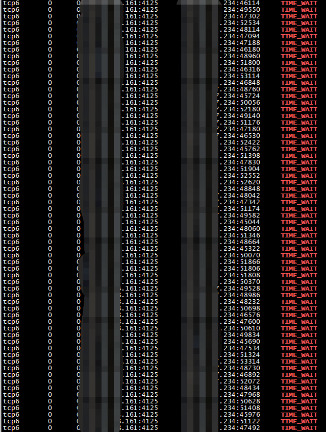
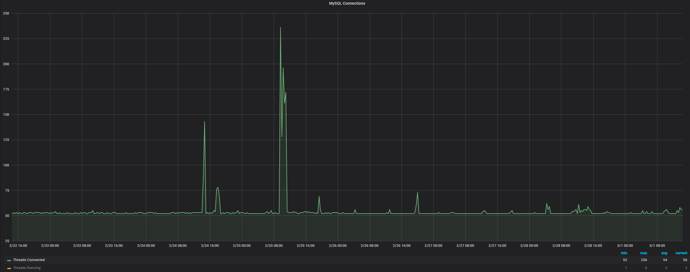
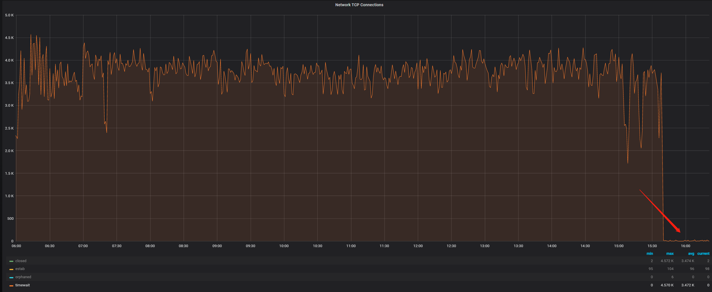
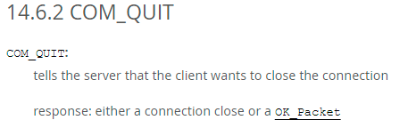

# 故障分析 | MySQL Server 端为什么有大量的 TCP TIME_WAIT ?

**原文链接**: https://opensource.actionsky.com/20220309-mysqlserver/
**分类**: MySQL 新特性
**发布时间**: 2022-03-08T22:08:59-08:00

---

作者：李鹏博
爱可生 DBA 团队成员，主要负责 MySQL 故障处理和 SQL 审核优化。对技术执着，为客户负责。
本文来源：原创投稿
*爱可生开源社区出品，原创内容未经授权不得随意使用，转载请联系小编并注明来源。
最近客户的一台 MySQL Server 告警处于 TCP TIME_WAIT 状态的连接过多，通过查看相关监控发现 TCP Connections 中处于 TIME_WAIT 状态的连接一直在 3000~4000 ，如图：

在 OS 上查看 TCP 处于 TIME_WAIT 状态的连接：

（其中161服务器是本地的 MySQL Server ，4125是数据库端口，234是远程应用服务器）
可以看到所有处于 TIME_WAIT 状态的 TCP 连接都是应用服务器234到本地161的数据库连接，此时心中有一个疑问：只有主动关闭 TCP 连接的一端才会存在 TIME_WAIT 状态，主观的想法就是大量的 TIME_WAIT 应该位于应用服务器一端，哪为何 MySQL Server 这一端有这么多处于 TIME_WAIT 状态的 TCP 连接？难道是有大量由于 wait_timeout 超时的连接，所以 MySQL Server 这一端主动关闭了连接，还是由于网络异常或客户端异常关闭，导致 MySQL Server 一端主动关闭了连接，但是通过观察 MySQL Connections 相关监控发现连接数量一直都是比较少的：

所以就不是由于大量的连接因为 wait_timeout 超时而造成的 MySQL Server 一端主动关闭了连接。
通过查看 mysqld error log 里面也没有太多关于“Aborted connection”或“Got an error reading communication packets”，所以也不是由于网络异常或客户端异常关闭导致的 MySQL Server 一端主动关闭了连接。
此时就想从系统角度入手看能不能进行相关调整，之后将 net.ipv4.tcp_tw_recycle 系统参数从0调整为了1，然后观察 TCP Connections 相关监控发现效果非常明显，TIME_WAIT 状态的 TCP 连接瞬间就降下去了：

但是查询相关资料发现tcp_tw_recycle这个参数是有坑的：https://linux.die.net/man/7/tcp

所以虽然效果很明显，但是为了稳妥起见，还是将 net.ipv4.tcp_tw_recycle 参数改回了0。
这时就只能换一个思路：通过抓包看看数据库服务器和应用服务器到底是如何通信的，由于没有权限登录应用服务器，就只能在161数据库服务器上通过 tcpdump 单向抓包并使用 Wireshark 工具进行分析。
通过分析发现在抓取的68000多个包中存在大量的FIN包和SYN包，由此说明应用服务器存在大量的短连接，一直在连接数据库，短时间的查询之后又断开连接，并不断反复：

但是这依旧不能解释为什么 MySQL Server 一端存在大量处于 TIME_WAIT 状态的 TCP 连接。
继续分析网络包之后发现当 Client 请求退出之后，Client 和 Server 之间的 TCP 连接有两种断开方式：
第一种：
234应用服务器发出退出请求，161数据库服务器回复“ACK”包，然后由234应用服务器主动断开连接。

第二种：
234应用服务器发出退出请求，161数据库服务器主动断开与234应用服务器的连接。

此时我们就可以得出结论：在 MySQL 退出会话时，Client 与 MySQL Server之 间，TCP 连接的断开有可能是由 Client 发起的，也有可能是由 Server 发起的，而并不是我们主观认为的都是由 Client 发起的，所以当 Client 与 MySQL Server 之间存在大量的短连接时，MySQL Server 的 OS 上就可能会存在大量处于 TIME_WAIT 状态的 TCP 连接，而解决方法就是由应用侧将大量的短连接由少量的长连接代替。
在 MySQL Internals Manual 上也有相关 Client 退出会话时 MySQL Server 的动作说明：https://dev.mysql.com/doc/internals/en/com-quit.html

这也刚好印证了通过抓包看到的现象。