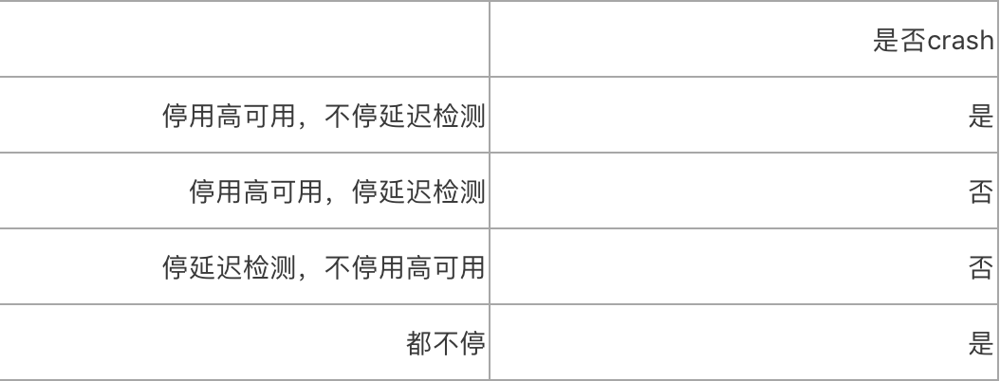
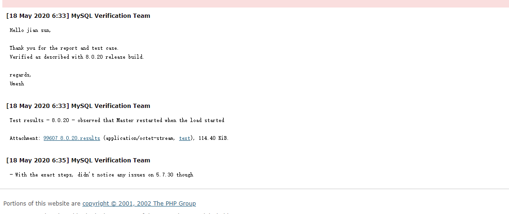

# 故障分析 | MySQL : slave_compressed_protocol 导致 crash

**原文链接**: https://opensource.actionsky.com/%e6%95%85%e9%9a%9c%e5%88%86%e6%9e%90-mysql-slave_compressed_protocol-%e5%af%bc%e8%87%b4-crash/
**分类**: MySQL 新特性
**发布时间**: 2021-12-28T01:14:19-08:00

---

作者：胡呈清
爱可生 DBA 团队成员，擅长故障分析、性能优化，个人博客：https://www.jianshu.com/u/a95ec11f67a8，欢迎讨论。
本文来源：原创投稿
*爱可生开源社区出品，原创内容未经授权不得随意使用，转载请联系小编并注明来源。
## 现象
MySQL版本：8.0.18
create.sql：zabbix 初始化脚本，包含建表、插入数据语句，10M+大小
一个新客户，部署了一套我司的数据库管理平台，接管进来一主两从实例，其中一主一从在无锡机房，为半同步复制，另一个从库在北京机房，为异步复制。当在主库上 source create.sql 时，会 crash。但没接管进平台前，不会出现 crash。
说明：这里提到的管理平台，不会影响理解整篇文章。
## 排查过程
#### 1. 在测试环境进行复现
为方便排查，需要在可控的环境下进行复现：
- 
与客户相同的 my.cnf
- 
相同的 MySQL 版本
- 
相同的复制架构
- 
执行相同的 create.sql
确实可以稳定复现 crash，error log 如下：
> 
2020-04-28T17:51:47.441886+08:00 0 [ERROR] [MY-013129] [Server] A message intended for a client cannot be sent there as no client-session is attached. Therefore, we&#8217;re sending the information to the error-log instead: MY-001158 &#8211; Got an error reading communication packets
09:51:47 UTC &#8211; mysqld got signal 11 ;
Most likely, you have hit a bug, but this error can also be caused by malfunctioning hardware.
Thread pointer: 0x0
Attempting backtrace. You can use the following information to find out
where mysqld died. If you see no messages after this, something went
terribly wrong&#8230;
stack_bottom = 0 thread_stack 0x46000
2020-04-28T17:51:47.447907+08:00 218 [ERROR] [MY-011161] [Server] Semi-sync master failed on net_flush() before waiting for slave reply.
/opt/mysql/base/8.0.18/bin/mysqld(my_print_stacktrace(unsigned char const*, unsigned long)+0x2e) [0x1ed6cce]
/opt/mysql/base/8.0.18/bin/mysqld(handle_fatal_signal+0x323) [0xfb2d23]
/lib64/libpthread.so.0(+0xf5f0) [0x7f3d781a75f0]
The manual page at http://dev.mysql.com/doc/mysql/en/crashing.html contains
information that should help you find out what is causing the crash.
#### 2. 排除管理平台的影响
由于接管到管理平台才会出现 crash，管理平台对数据库最大的操作来自于高可用组件：
- 
延迟检测（写操作：每 500ms 写入一个时间戳）
- 
状态查询（读操作）
所以接下来停用高可用、延迟检测进行测试，结果如下：

#### 初步结论：延迟检测关闭后，不会 crash。
#### 3. 延迟检测影响了什么，导致 crash？
在测试过程中，发现一个与 crash 伴生的现象：
- 
不停用延迟检测，会crash，但是执行sql 的效率高一些（毫秒级）：
`mysql> source /tmp/insert.sql
Query OK, 1 row affected (0.21 sec)
Query OK, 1 row affected (0.50 sec)
Query OK, 1 row affected (0.03 sec)
Query OK, 1 row affected (0.47 sec)
Query OK, 1 row affected (0.51 sec)
Query OK, 1 row affected (0.02 sec)
`
- 
而停用高可用检测，不会crash，每个 sql 执行时间都是 1s 多一点：
`mysql> source /tmp/insert.sql                            
Query OK, 1 row affected (0.01 sec)
Query OK, 1 row affected (1.01 sec)
Query OK, 1 row affected (1.01 sec)
Query OK, 1 row affected (1.00 sec)
Query OK, 1 row affected (1.01 sec)
Query OK, 1 row affected (1.01 sec)
`
这个看起来很像是组提交机制导致的，但是并没有配置组提交参数：
`mysql> show global variables like '%group_commit%';
+-----------------------------------------+-------+
| Variable_name                           | Value |
+-----------------------------------------+-------+
| binlog_group_commit_sync_delay          | 0     |
| binlog_group_commit_sync_no_delay_count | 0     |
+-----------------------------------------+-------+
2 rows in set (0.01 sec)
`
关闭半同步复制后，此现象也会消失。猜测：是半同步和组提交结合在一起触发的问题。
#### 4. longblob 大对象
在前面的测试中，每次复现 crash，解析 binlog 查看最后一个事务都有一个共性：都是对同一张表插入数据：
`### INSERT INTO `zabbix`.`images`
### SET
###   @1=108 /* LONGINT meta=0 nullable=0 is_null=0 */
###   @2=1 /* INT meta=0 nullable=0 is_null=0 */
###   @3='Rackmountable_3U_server_3D_(64)' /* VARSTRING(256) meta=256 nullable=0 is_null=0 */
###   @4=
`
查看表结构，发现有 lonngblob 大对象，插入的是图片，用的是二进制格式存储：
`CREATE TABLE `images` (
`imageid` bigint(20) unsigned NOT NULL,
`imagetype` int(11) NOT NULL DEFAULT '0',
`name` varchar(64) NOT NULL DEFAULT '0',
`image` longblob NOT NULL,
PRIMARY KEY (`imageid`),
UNIQUE KEY `images_1` (`name`)
) ENGINE=InnoDB DEFAULT CHARSET=utf8mb4 COLLATE=utf8mb4_0900_ai_ci;
`
截取出 create.sql 中的 images 表的所有 insert 语句，接下来只执行这些 insert 语句，也能复现 crash 的问题：
`sed -n '2031,2217p' create.sql > insert.sql
`
#### 所以 crash 的第2个条件是：插入 longblob 大对象
#### 5. slave_compressed_protocol
前面的分析已经找到 2 个触发 crash 的条件：
- 
插入数据时，存在 longblob 大对象
- 
半同步复制，并且在 insert longblob 大对象时伴随有其他外部写入流量
但是实际上用数据库管理平台自带的标准安装的同样版本的 MySQL 环境，并不能复现 crash 问题。区别在于 my.cnf 不同，所以一定还有某个参数作为触发条件。
经过不断的测试，每次修改一批参数（注意前面已经定位到跟半同步复制有关，所以一定要同时修改主、从库的参数），不断缩小范围，最终定位到是从库设置 slave_compressed_protocol=on 的影响。
从库 slave_compressed_protocol=ON 时，还会导致从库 slave io thread 一直断开与主库的连接，并不断重连，从库 error log 报错如下：
> 
2020-04-29T10:34:42.361584+08:00 1998 [ERROR] [MY-010557] [Repl] Error reading packet from server for channel &#8221;: Lost connection to MySQL server during query (server_errno=2013)
2020-04-29T10:34:42.361668+08:00 1998 [Warning] [MY-010897] [Repl] Storing MySQL user name or password information in the master info repository is not secure and is therefore not recommended. Please consider using the USER and PASSWORD connection options for START SLAVE; see the &#8216;START SLAVE Syntax&#8217; in the MySQL Manual for more information.
主库 error log 报如下错：
> 
2020-04-29T10:23:29.480529+08:00 0 [ERROR] [MY-013129] [Server] A message intended for a client cannot be sent there as no client-session is attached. Therefore, we&#8217;re sending the information to the error-log instead: MY-001158 &#8211; Got an error reading communication packets
2020-04-29T10:23:30.330242+08:00 1950 [ERROR] [MY-011161] [Server] Semi-sync master failed on net_flush() before waiting for slave reply.
相应的，因为从库 slave io 线程不断重连，可以观察到主库的 binlog dump 线程会不断重启，有时还可以观察到 2 个：
`show processlist;select sleep (1);show processlist;
....
| 2131 | admin | 172.16.21.3:37926 | NULL | Binlog Dump GTID | 3 | Waiting to finalize termination | NULL |
| 2132 | admin | 172.16.21.3:37932 | NULL | Binlog Dump GTID | 1 | Sending binlog event to slave | NULL |
....
+-----------+
| sleep (1) |
+-----------+
| 0         |
+-----------+
...
| 2132 | admin | 172.16.21.3:37932 | NULL | Binlog Dump GTID | 2 | Sending binlog event to slave | NULL |
...
`
与之相关的bug：
https://jira.percona.com/browse/PS-6876
https://bugs.mysql.com/bug.php?id=85382
## 结论
此次 crash 的触发条件有3个：
- 
插入 longblob 大对象；
- 
半同步复制，并且在 insert longblob 大对象时伴随有其他外部写流量；
- 
slave_compressed_protocol=on .
为什么接管到平台之前没有发生过 crash？
因为这个库还没上线，在执行 create.sql 时没有其他写入流量（等同于关闭延迟检测的效果）。
## 解决方案
> 
set slave_compressed_protocol=OFF 即可，另外官方文档也说明不要配置此参数，后续版本将会删除此参数：
As of MySQL 8.0.18, this system variable is deprecated. It will be removed in a future MySQL version.
## 后续
我司研发大神后面向官方提交了一个bug：https://bugs.mysql.com/bug.php?id=99607。
因为一些安全问题（更具体就不能透露了），这个bug 被官方设置成了私密 bug，截图如下，不过截止到今天（2021.12.28）官方还是没有修复：

