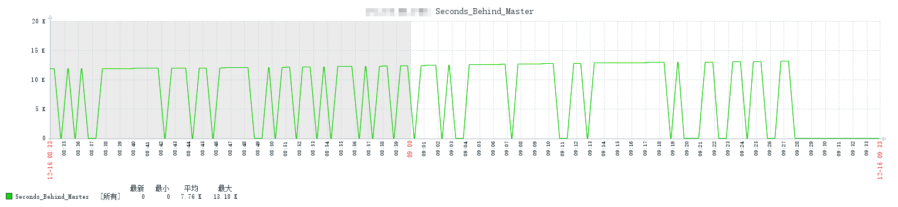
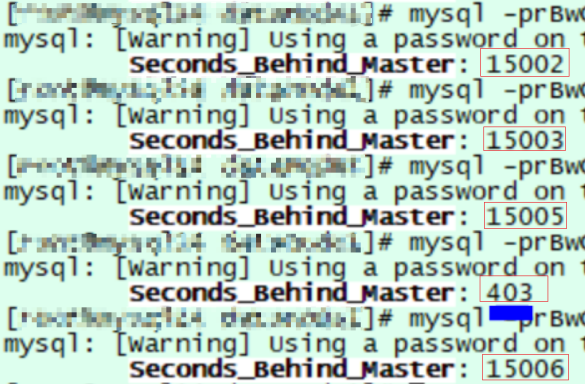
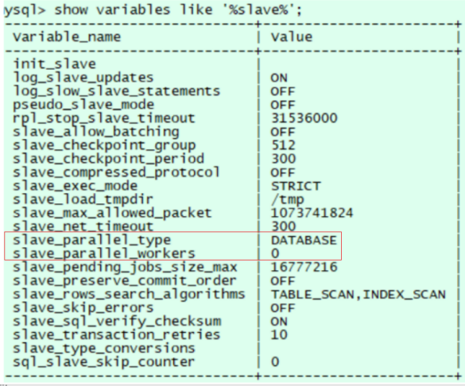

# 故障分析 | MySQL 主从延时值反复跳动

**原文链接**: https://opensource.actionsky.com/202313-guzhangfenxi/
**分类**: 技术干货
**发布时间**: 2023-01-02T22:36:18-08:00

---

作者：徐文梁
爱可生DBA成员，负责客户项目的需求和维护。目前在数据库新手村打怪升级中。喜欢垂钓，如果你也喜欢垂钓，可以约个晴好天气，咱们一边钓鱼一边聊聊数据库，岂不快哉。
本文来源：原创投稿
*爱可生开源社区出品，原创内容未经授权不得随意使用，转载请联系小编并注明来源。
#### 问题现象
某天早上，正在搬砖，客户发来消息，反馈某个实例主从延时值反复在一万多到0之间来回跳动，如下:

手动执行show slave status\G命令查看Seconds_Behind_Master延时值，结果如下：

#### 问题定位
接到问题，作为一个认真工作的我，立马行动起来。首先确认了下客户的数据库版本，客户反馈是5.7.31，紧接着找客户确认了下复制方式，如下图:

客户现场的slave_parallel_type值为DATABASE,slave_parallel_workers值为0，此时主从同步使用的是单SQL线程方式，在遇到大事务时产生延迟的可能性更大。推荐客户换成MTS方式，但是客户反馈之前一直使用的是该种方式，之前未发生此种现象，需要排查原因。
于是和客户确认异常期间是否有业务变动，客户反馈发生问题之前有新业务上线，qps相对平时大很多，同时存在大量insert和update批量写操作，另外，客户服务器使用的云服务器，配置不高。出现问题后，新业务已经临时下线。
了解背景后，就有了排查的方向了。从根源进行分析，second-behind-master值与三个值有关，1.当前从服务器的系统时间。2.从库服务器和主库服务器的系统时间的差值。3.mi->last_timestamp。
对于单线程模式下的dml操作，记录在binlog中，query_event 的ev->exec_time基本为0，可以忽略，因为query_event的exec_time只记录第一条数据更改消耗的时间，且我们一般看到是begin。所以last_master_timestamp就基本等于各个event中header的timestamp。一个事务中，GTID_EVENT和XID_EVENT中记录的是提交时刻的时间，而对于其他event都是命令发起时刻的时间，此时second-behind-master的计算方式为从库服务器时间-各个event中header中time stamp的时间-主从服务器时间差，因此如果存在长时间未提交的事务或者存在大事务在SQL线程应用的时候可能会观察到seconds_behind_master的瞬间跳动。
由于目前新业务已经下线，业务量已经渐渐恢复到正常状态，故暂未做其他处理，建议客户观察一段时间，一段时间后客户反馈恢复正常，到此，问题解决了。
#### 问题思考
问题解决了，但是爱琢磨的我却陷入了思考。脑海中浮现出几个问题，第一，怎样尽可能避免这种现象？第二，怎么确定是否有长时间未提交的事务和大事务呢？第三，发现这种问题如何挽救呢?
其实从事务发展历程来看，这三个问题也恰恰对应着问题处理过程中的预防，诊治，治疗三个阶段。
对于预防，即第一个问题，可以从以下几个点出发:1.生产环境条件允许的情况下建议开启并行复制。2.在业务上线前进行业务量评估和SQL审核，避免某些不规范SQL或业务逻辑导致出现上述问题。
对于排查，即第二个问题，排查长时间未提交的事务或者大事务可以通过show processlist命令或查看information_schema.innodb_trx表进行排查，但是这个只能查询当前的事务，对于历史的则无法进行查找，此时可以通过mysqlbinlog或者my2sql工具解析binlog日志，但是结果往往不直观，咨询了一些前辈，推荐了一款infobin工具，自己测试了下还是挺好用的，使用示例:
执行命令 infobin mysql-bin.000005 20 2000000 10 -t >/root/result.log
其中，mysql-bin.000005表示需要解析的binlog文件名，20表示是分片数量,将binlog分为大小相等的片段，生成时间越短则这段时间生成binlog量越大，则事务越频繁，2000000表示将大于2M左右的事物定义为大事务，10表示将大于10秒未提交的事物定义为长期未提交的事务，-t 表示不做详细event解析输出，仅仅获取相应的结果。
输出结果如下:
#表示是小端平台
Check is Little_endian
[Author]: gaopeng [QQ]:22389860 [blog]:http://blog.itpub.net/7728585/
Warning: This tool only Little_endian platform!
Little_endian check ok!!!
-------------Now begin--------------
#MySQL的版本
Check Mysql Version is:5.7.25-log
#binlog格式版本
Check Mysql binlog format ver is:V4
#binlog不在写入
Check This binlog is closed!
#binlog文件总大小，单位字节
Check This binlog total size:399899873(bytes)
#load data infile场景不做检查
Note:load data infile not check!
-------------Total now--------------
#事务总数
Trx total[counts]:1345
#event总数
Event total[counts]:58072
#最大的事务大小
Max trx event size:7986(bytes) Pos:560221[0X88C5D]
#平均每秒写binlog大小
Avg binlog size(/sec):610534.125(bytes)[596.225(kb)]
#平均每分钟写binlog大小
Avg binlog size(/min):36632048.000(bytes)[35773.484(kb)]
#binlog分配大小
--Piece view:
(1)Time:1671419439-1671420094(655(s)) piece:19994993(bytes)[19526.359(kb)]
(2)Time:1671420094-1671420094(0(s)) piece:19994993(bytes)[19526.359(kb)]
(3)Time:1671420094-1671420094(0(s)) piece:19994993(bytes)[19526.359(kb)]
(4)Time:1671420094-1671420094(0(s)) piece:19994993(bytes)[19526.359(kb)]
(5)Time:1671420094-1671420094(0(s)) piece:19994993(bytes)[19526.359(kb)]
(6)Time:1671420094-1671420094(0(s)) piece:19994993(bytes)[19526.359(kb)]
(7)Time:1671420094-1671420094(0(s)) piece:19994993(bytes)[19526.359(kb)]
(8)Time:1671420094-1671420094(0(s)) piece:19994993(bytes)[19526.359(kb)]
(9)Time:1671420094-1671420094(0(s)) piece:19994993(bytes)[19526.359(kb)]
(10)Time:1671420094-1671420094(0(s)) piece:19994993(bytes)[19526.359(kb)]
(11)Time:1671420094-1671420094(0(s)) piece:19994993(bytes)[19526.359(kb)]
(12)Time:1671420094-1671420094(0(s)) piece:19994993(bytes)[19526.359(kb)]
(13)Time:1671420094-1671420094(0(s)) piece:19994993(bytes)[19526.359(kb)]
(14)Time:1671420094-1671420094(0(s)) piece:19994993(bytes)[19526.359(kb)]
(15)Time:1671420094-1671420094(0(s)) piece:19994993(bytes)[19526.359(kb)]
(16)Time:1671420094-1671420094(0(s)) piece:19994993(bytes)[19526.359(kb)]
(17)Time:1671420094-1671420094(0(s)) piece:19994993(bytes)[19526.359(kb)]
(18)Time:1671420094-1671420094(0(s)) piece:19994993(bytes)[19526.359(kb)]
(19)Time:1671420094-1671420094(0(s)) piece:19994993(bytes)[19526.359(kb)]
(20)Time:1671420094-1671420094(0(s)) piece:19994993(bytes)[19526.359(kb)]
#超过大事务规定的事务
--Large than 2000000(bytes) trx:
(1)Trx_size:13310235(bytes)[12998.276(kb)] trx_begin_p:560029[0X88B9D] trx_end_p:13870264[0XD3A4B8]
(2)Trx_size:385990249(bytes)[376943.594(kb)] trx_begin_p:13909131[0XD43C8B] trx_end_p:399899380[0X17D5FAF4]
Total large trx count size(kb):#389941.870(kb)
#超过规定长时间未提交的事务
--Large than 10(secs) trx:
No trx find!
#每张表执行对应操作的binlog大小和次数
--Every Table binlog size(bytes) and times:
Note:size unit is bytes
---(1)Current Table:test.sbtest2::
Insert:binlog size(0(Bytes)) times(0)
Update:binlog size(107440(Bytes)) times(1343)
Delete:binlog size(0(Bytes)) times(0)
Total:binlog size(107440(Bytes)) times(1343)
---(2)Current Table:test.sbtest1::
Insert:binlog size(0(Bytes)) times(0)
Update:binlog size(399300036(Bytes)) times(50001)
Delete:binlog size(0(Bytes)) times(0)
Total:binlog size(399300036(Bytes)) times(50001)
---Total binlog dml event size:399407476(Bytes) times(51344)
对于挽救，也即是第三个问题，当然是对症下药了，利用排查阶段找出的信息，让业务侧去改造了。如果业务侧顽固拖拉，拒不改造，下次晚上半夜收到告警的时候先一个电话打给业务人员，要熬夜一起熬，哈哈，开个玩笑。DBA同学大多数都像我一样性格温和的。好了，就到这里吧。