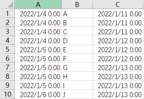
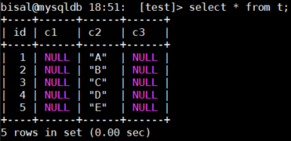
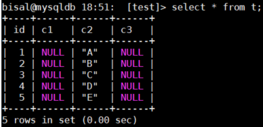
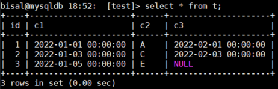
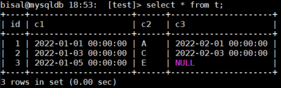
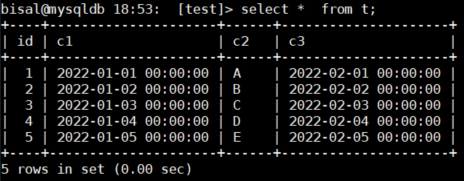

# 故障分析 | MySQL 使用 load data 导入数据错误的一个场景

**原文链接**: https://opensource.actionsky.com/20221208-load-data/
**分类**: 技术干货
**发布时间**: 2022-12-07T22:32:14-08:00

---

作者：刘晨
网名 bisal ，具有十年以上的应用运维工作经验，目前主要从事数据库应用研发能力提升和技术管理相关的工作，Oracle ACE ，腾讯云TVP，拥有 Oracle OCM & OCP 、EXIN DevOps Master 、SCJP 等国际认证，国内首批 Oracle YEP 成员，OCMU 成员，《DevOps 最佳实践》中文译者之一，CSDN & ITPub 专家博主，公众号&#8221;bisal的个人杂货铺&#8221;，长期坚持分享技术文章，多次在线上和线下分享技术主题。
本文来源：原创投稿
*爱可生开源社区出品，原创内容未经授权不得随意使用，转载请联系小编并注明来源。
同事提了一个MySQL数据导入的问题，使用load data将本地文件（.csv）导入数据库表的时候，提示这个错误，
| Warning | 1265 | Data truncated for column 'c1' at row 1 |
为了能更好的说明问题，屏蔽业务信息，我们来构造测试数据模拟。
#### 一、准备工作
（1）csv测试文件，如下所示，简化了原始文件，包含两个日期类型的数据，和一个字符串类型的数据，
ccat online.csv
"2022-01-01 00:00:00","A","2022-02-01 00:00:00"
"2022-01-02 00:00:00","B","2022-02-02 00:00:00"
"2022-01-03 00:00:00","C","2022-02-03 00:00:00"
"2022-01-04 00:00:00","D","2022-02-04 00:00:00"
"2022-01-05 00:00:00","E","2022-02-05 00:00:00"
我们知道，csv 文件可以用 excel 打开，如下所示，

（2）测试表结构，如下所示，
bisal@mysqldb 18:21:  [test]> desc t;
+-------+-------------+------+-----+---------+----------------+
| Field | Type        | Null | Key | Default | Extra          |
+-------+-------------+------+-----+---------+----------------+
| id    | bigint      | NO   | PRI | NULL    | auto_increment |
| c1    | datetime    | YES  |     | NULL    |                |
| c2    | varchar(10) | YES  |     | NULL    |                |
| c3    | datetime    | YES  |     | NULL    |                |
+-------+-------------+------+-----+---------+----------------+
4 rows in set (0.00 sec)
（3）原始执行的导入指令是，
load data local infile '/home/mysql/online.csv' 
into table test fields terminated by ',' lines terminated by '\n' 
(c1, c2, c3) 
set c1=date_format(@c1, '%Y-%m-%d %H:%i:%s'), 
c3=date_format(@c3, '%Y-%m-%d %H:%i:%s');
P. S. 如果执行出现这个错误，
ERROR 3948 (42000): Loading local data is disabled; this must be enabled on both the client and server sides
可以看下local_infile变量值，
bisal@mysqldb 18:23:  [test]> show global variables like 'local_infile';
+---------------+-------+
| Variable_name | Value |
+---------------+-------+
| local_infile  | OFF   |
+---------------+-------+
1 row in set (0.01 sec)
如果是OFF，需要改为ON，
bisal@mysqldb 18:23:  [test]> set global local_infile=1;
Query OK, 0 rows affected (0.00 sec)
再次执行导入，如果报这个错，
ERROR 2068 (HY000): LOAD DATA LOCAL INFILE file request rejected due to restrictions on access.
可以在客户端登录的时候，加上参数&#8211;local-infile=1，
mysql -ubisal -pbisal --local-infile=1
#### 二、实际测试
（1）第一次尝试
如下导入指令，提示了1265的错误，
bisal@mysqldb 18:50:  [test]> load data local infile '/home/mysql/online.csv' into table t fields
-> terminated by ',' lines terminated by '\n'
-> (c1, c2, c3) set c1=date_format(@c1, '%Y-%m-%d %H:%i:%s'), c3=date_format(@c3, '%Y-%m-%d %H:%i:%s');
Query OK, 5 rows affected, 10 warnings (0.01 sec)
Records: 5  Deleted: 0  Skipped: 0  Warnings: 10
bisal@mysqldb 18:51:  [test]> show warnings;
+---------+------+-----------------------------------------+
| Level   | Code | Message                                 |
+---------+------+-----------------------------------------+
| Warning | 1265 | Data truncated for column 'c1' at row 1 |
| Warning | 1265 | Data truncated for column 'c3' at row 1 |
| Warning | 1265 | Data truncated for column 'c1' at row 2 |
| Warning | 1265 | Data truncated for column 'c3' at row 2 |
| Warning | 1265 | Data truncated for column 'c1' at row 3 |
| Warning | 1265 | Data truncated for column 'c3' at row 3 |
| Warning | 1265 | Data truncated for column 'c1' at row 4 |
| Warning | 1265 | Data truncated for column 'c3' at row 4 |
| Warning | 1265 | Data truncated for column 'c1' at row 5 |
| Warning | 1265 | Data truncated for column 'c3' at row 5 |
+---------+------+-----------------------------------------+
10 rows in set (0.00 sec)
检索数据，虽然导入了文件中的5条记录，但日期字段，都给截断了，存储的是空值，

（2）第二次尝试
从（1）的指令看，要将文件online.csv的数据，按照&#8221;,&#8221;分隔，导入t表的字段中，其中c1和c3是datetime日期类型的，而且load data指令中使用了set，需要对数据进行二次处理，按照日期格式，进行转换存储，
c1=date_format(@c1,'%Y-%m-%d%H:%i:%s')
c3=date_format(@c3,'%Y-%m-%d%H:%i:%s')，
因此，load data指令中()括号内的字段，应该使用变量，
load data local infile '/home/mysql/online.csv' into table t fields 
terminated by ',' lines terminated by '\n' 
(@c1, c2, @c3) 
set c1=date_format(@c1, '%Y-%m-%d %H:%i:%s'), 
c3=date_format(@c3, '%Y-%m-%d %H:%i:%s');
检索数据，虽然导入了文件中的5条记录，但日期字段，都给截断了，存储的是空值，
bisal@mysqldb 18:51:  [test]> load data local infile '/home/mysql/online.csv' into table t fields
-> terminated by ',' lines terminated by '\n'
-> (@c1, c2, @c3) set c1=date_format(@c1, '%Y-%m-%d %H:%i:%s'), c3=date_format(@c3, '%Y-%m-%d %H:%i:%s');
Query OK, 5 rows affected, 10 warnings (0.02 sec)
Records: 5  Deleted: 0  Skipped: 0  Warnings: 10
bisal@mysqldb 18:51:  [test]> show warnings;
+---------+------+-------------------------------------------------------+
| Level   | Code | Message                                               |
+---------+------+-------------------------------------------------------+
| Warning | 1292 | Incorrect datetime value: '"2022-01-01 00:00:00"'     |
| Warning | 1292 | Incorrect datetime value: '"2022-02-01 00:00:00"\x0D' |
| Warning | 1292 | Incorrect datetime value: '"2022-01-02 00:00:00"'     |
| Warning | 1292 | Incorrect datetime value: '"2022-02-02 00:00:00"\x0D' |
| Warning | 1292 | Incorrect datetime value: '"2022-01-03 00:00:00"'     |
| Warning | 1292 | Incorrect datetime value: '"2022-02-03 00:00:00"\x0D' |
| Warning | 1292 | Incorrect datetime value: '"2022-01-04 00:00:00"'     |
| Warning | 1292 | Incorrect datetime value: '"2022-02-04 00:00:00"\x0D' |
| Warning | 1292 | Incorrect datetime value: '"2022-01-05 00:00:00"'     |
| Warning | 1292 | Incorrect datetime value: '"2022-02-05 00:00:00"\x0D' |
+---------+------+-------------------------------------------------------+
10 rows in set (0.00 sec)
当然这两个日期字段还是被截断的，

（3）第三次尝试
我们先解决双引号的问题，向指令中增加 enclosed by &#8216;&#8221;&#8216; ，目的是删除包裹的双引号，
bisal@mysqldb 18:52:  [test]> load data local infile '/home/mysql/online.csv' into table t fields
-> terminated by ',' enclosed by '"' lines terminated by '\n'
-> (@c1, c2, @c3) set c1=date_format(@c1, '%Y-%m-%d %H:%i:%s'), c3=date_format(@c3, '%Y-%m-%d %H:%i:%s');
Query OK, 3 rows affected, 5 warnings (0.01 sec)
Records: 3  Deleted: 0  Skipped: 0  Warnings: 5
bisal@mysqldb 18:52:  [test]> show warnings;
+---------+------+----------------------------------------------------------------------------------+
| Level   | Code | Message                                                                          |
+---------+------+----------------------------------------------------------------------------------+
| Warning | 1292 | Truncated incorrect datetime value: '2022-02-01 00:00:00"
"2022-01-02 00:00:00' |
| Warning | 1262 | Row 1 was truncated; it contained more data than there were input columns        |
| Warning | 1292 | Truncated incorrect datetime value: '2022-02-03 00:00:00"
"2022-01-04 00:00:00' |
| Warning | 1262 | Row 2 was truncated; it contained more data than there were input columns        |
| Warning | 1292 | Incorrect datetime value: '"2022-02-05 00:00:00"
'                              |
+---------+------+----------------------------------------------------------------------------------+
5 rows in set (0.00 sec)
可以看到，有两行数据正确插入了，但是另外三行存在错误，要么是第三个字段被截断了，要么就是没插入进来，要解决回车问题，

（4）第四次尝试
除了回车问题，我们可以看到，此处用的是date_format函数，但实际上从文件中读到的是字符串，因此可改为str_to_date函数，格式相同，
bisal@mysqldb 18:53:  [test]> load data local infile '/home/mysql/online.csv' into table t fields
-> terminated by ',' enclosed by '"' lines terminated by '\n'
-> (@c1, c2, @c3) set c1=str_to_date(@c1, '%Y-%m-%d %H:%i:%s'), c3=str_to_date(@c3, '%Y-%m-%d %H:%i:%s');
Query OK, 3 rows affected, 5 warnings (0.01 sec)
Records: 3  Deleted: 0  Skipped: 0  Warnings: 5
bisal@mysqldb 18:53:  [test]> show warnings;
+---------+------+----------------------------------------------------------------------------------+
| Level   | Code | Message                                                                          |
+---------+------+----------------------------------------------------------------------------------+
| Warning | 1292 | Truncated incorrect datetime value: '2022-02-01 00:00:00"
"2022-01-02 00:00:00' |
| Warning | 1262 | Row 1 was truncated; it contained more data than there were input columns        |
| Warning | 1292 | Truncated incorrect datetime value: '2022-02-03 00:00:00"
"2022-01-04 00:00:00' |
| Warning | 1262 | Row 2 was truncated; it contained more data than there were input columns        |
| Warning | 1411 | Incorrect datetime value: '"2022-02-05 00:00:00"
' for function str_to_date     |
+---------+------+----------------------------------------------------------------------------------+
5 rows in set (0.00 sec)
数据还是没都插入成功，

（5）第五次尝试
我们这次解决回车的问题，lines terminated by增加\r，执行指令，正常，
bisal@mysqldb 18:53:  [test]> load data local infile '/home/mysql/online.csv' into table t fields
-> terminated by ',' enclosed by '"' lines terminated by '\r\n'
-> (@c1, c2, @c3) set c1=str_to_date(@c1, '%Y-%m-%d %H:%i:%s'), c3=str_to_date(@c3, '%Y-%m-%d %H:%i:%s');
Query OK, 5 rows affected (0.01 sec)
Records: 5  Deleted: 0  Skipped: 0  Warnings: 0
验证一下数据，都正常插入了，

针对这个问题，从表象上是load data指令各种参数的用法，但实际上考查了很多内容，有技术上的，有问题排查思路的，
（1）是否了解load data不让执行的原因，需要做什么配置改动。
（2）是否了解load data中各个参数的含义，terminated by、enclosed by、lines terminated by，包括()括号内用的是字段名称还是@变量名称，set二次处理数据应该怎么用。
（3）是否了解csv用txt和excel打开显示不同？用txt打开，会看到每个字段有双引号，逗号分隔，而excel打开，则是正常的单元格显示，会产生误解。
（4）是否了解date_format函数和str_to_date函数有什么不同？
（5）MySQL中执行各种指令报错，通过show warnings显示的错误信息中，能看到些端倪，例如Truncated incorrect date time value:&#8217;2022-02-0100:00:00&#8243;，可以知道是文件中的第一个字段还是第三个字段存在问题，当然因为这是为了做测试，特意将数据做成有规律的，如果是生产实际执行的，不一定能很有规律的呈现出来，这就要更仔细地理解这些错误提示，从中找到线索，往往这种能力，除了具备天赋，是碰到更多的问题锻炼出来的，这就要关注平时的积累。