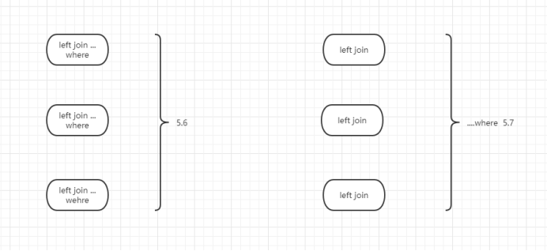

# 故障分析 | MySQL 数据库升级后，数据库怎么卡住了

**原文链接**: https://opensource.actionsky.com/20220606-mysql/
**分类**: MySQL 新特性
**发布时间**: 2022-06-06T06:17:44-08:00

---

作者：王顺
爱可生 DBA 团队成员，在公司负责项目中处理数据库问题，喜欢学习技术，钻研技术问题。
本文来源：原创投稿
*爱可生开源社区出品，原创内容未经授权不得随意使用，转载请联系小编并注明来源。
## 问题背景：
第一天晚上 MySQL 数据库升级，版本从5.6.22到5.7.32，升级过程很顺利，业务验证正常。
两天后业务人员反馈数据库卡住了，sql 执行下去数据库没反应。
## 现象：
连上数据库看看发现了什么……
mysql> show processlist;
+-------+-------------+---------------------+-------+-------------+--------+---------------------------------------------------------------+------------------------------------------------------------------------------------------------------+
| Id    | User        | Host                | db    | Command     | Time   | State                                                         | Info                                                                                                 |
+-------+-------------+---------------------+-------+-------------+--------+---------------------------------------------------------------+------------------------------------------------------------------------------------------------------+
|     1 | system user |                     | NULL  | Connect     | 138205 | Waiting for master to send event                              | NULL                                                                                                 |
|     2 | system user |                     | NULL  | Connect     | 137998 | Slave has read all relay log; waiting for more updates        | NULL                                                                                                 |
|  6891 | user05      | %:37029             | db01  | Query       | 110410 | Sending data                                                  | INSERT 
INTO db01.tb_mrt_par_user_order_info_d 
(
deal_date                           |
| 11528 | user05      | %:44043             | db01  | Query       |  91406 | Sending data                                                  | INSERT 
INTO db01.tb_mrt_par_user_order_info_d 
(
deal_date                           |
| 12126 | user02      | %:44966             | db02  | Query       |  89331 | Waiting for table metadata lock                               | ALTER TABLE db02.TB_MID_PAR_USER_PDT_ORDER_DAY TRUNCATE PARTITION P20210810                        |
| 20896 | repl        | 172.24.64.88:54437  | NULL  | Binlog Dump |  53695 | Master has sent all binlog to slave; waiting for more updates   | NULL                                                                                               |
| 26520 | user03      | 172.24.64.197:45044 | db03  | Sleep       |     80 |                                                               | NULL                                                                                               |
| 26886 | user04      | 172.24.64.73:39607  | db04  | Execute     |  29567 | Waiting for table metadata lock                               | TRUNCATE TABLE tb_par_user_develop                                                                 |
| 26887 | user04      | 172.24.64.73:39608  | db04  | Execute     |  29565 | Waiting for table metadata lock                               | TRUNCATE TABLE tb_par_user_accid_day                                                               |
......                                                                                                                                                          |
| 28069 | user02      | %:41400             | db02  | Query       |  24872 | Waiting for table metadata lock                               | ALTER TABLE db02.TB_MID_PAR_USER_PDT_ORDER_DAY ADD PARTITION (PARTITION P20210811 VALUES IN ('202108 |
......                                                                                                                                     |
| 33666 | user05      | 10.1.16.10:47068    | db04  | Sleep       |   2275 |                                                               | NULL                                                                                                 |
| 33788 | user04      | 172.24.64.73:50227  | db04  | Execute     |   1833 | Waiting for table metadata lock                               | TRUNCATE TABLE tb_par_user_accid_day                                                                 |
| 33791 | user04      | 172.24.64.73:50236  | db04  | Execute     |   1826 | Waiting for table metadata lock                               | TRUNCATE TABLE tb_par_user_develop                                                                   |
......                                                                                                                                      |
| 34095 | user05      | 10.1.16.10:54601    | db04  | Query       |    710 | Waiting for table metadata lock                               | SELECT * FROM `tb_par_user_accid_day` LIMIT 0, 1000                                                  |
......                                                     | show processlist                                                                                     |
+-------+-------------+---------------------+-------+-------------+--------+---------------------------------------------------------------+------------------------------------------------------------------------------------------------------+
70 rows in set (0.00 sec)
通过输出信息可以看到，有多个 session 出现 Waiting for table metadata lock ，查看执行最久的两个 sq 分别是 i d为 6891 和 11528 的两个 insert 语句。
insert 涉及的 schema 是db01 ，出现 Waiting for table metadata lock 是 db02/db04 。
很奇怪，执行语句来自不同的 schema ，是谁持有 MDL 锁堵住后面的语句？想不通……
Waiting for table metadata lock 看到 MDL 锁等待信息，需要查看一下原因。
mysql> select * from performance_schema.metadata_locks;
Empty set (0.00 sec)
返回空，没有查到 MDL 锁相关信息，检查环境发现 MDL 相关 instrument 并没有开启。
#### 备注：
临时生效
修改performance_schema.setup_instrume nts表，但实例重启后，又会恢复为默认值。
UPDATE performance_schema.setup_instruments SET ENABLED = &#8216;YES&#8217;, TIMED = &#8216;YES&#8217;
WHERE NAME = &#8216;wait/lock/metadata/sql/mdl&#8217;;
永久生效
在配置文件中设置
[mysqld]
performance-schema-instrument=&#8217;wait/lock/metadata/sql/mdl=ON&#8217;
#### 继续检查大事务
经过多次执行 select * from INNODB_TRX 查看正在运行的事务，可以看到两个正在执行的 insert 语句一直执行未提交。
mysql> select * from INNODB_TRX\G
*************************** 1. row ***************************
trx_id: 328588354171408
trx_state: RUNNING
trx_started: 2021-08-11 09:06:34
trx_requested_lock_id: NULL
trx_wait_started: NULL
trx_weight: 1755570
trx_mysql_thread_id: 11528
trx_query: INSERT 
INTO db01.tb_mrt_par_user_order_info_d 
(
deal_date                    
……忽略字段信息          
,copartner_code          
trx_operation_state: NULL
trx_tables_in_use: 15
trx_tables_locked: 3442
trx_lock_structs: 1755570
trx_lock_memory_bytes: 159899856
trx_rows_locked: 91807791
trx_rows_modified: 0
trx_concurrency_tickets: 3903
trx_isolation_level: REPEATABLE READ
trx_unique_checks: 1
trx_foreign_key_checks: 1
trx_last_foreign_key_error: NULL
trx_adaptive_hash_latched: 0
trx_adaptive_hash_timeout: 0
trx_is_read_only: 0
trx_autocommit_non_locking: 0
*************************** 2. row ***************************
trx_id: 328588354177792
trx_state: RUNNING
trx_started: 2021-08-11 03:49:50
trx_requested_lock_id: NULL
trx_wait_started: NULL
trx_weight: 1856514
trx_mysql_thread_id: 6891
trx_query: INSERT 
INTO db01.tb_mrt_par_user_order_info_d 
(
deal_date                   
……忽略字段信息             
,copartner_code       
trx_operation_state: fetching rows
trx_tables_in_use: 15
trx_tables_locked: 3597
trx_lock_structs: 1856514
trx_lock_memory_bytes: 169681104
trx_rows_locked: 101871982
trx_rows_modified: 0
trx_concurrency_tickets: 2338
trx_isolation_level: REPEATABLE READ
trx_unique_checks: 1
trx_foreign_key_checks: 1
trx_last_foreign_key_error: NULL
trx_adaptive_hash_latched: 0
trx_adaptive_hash_timeout: 0
trx_is_read_only: 0
trx_autocommit_non_locking: 0
2 rows in set, 2 warnings (0.06 sec)
看看完整的 sql 语句是啥？
执行 show full processlist ；看一下完整的执行语句。前面的排查只执行了 show processlist 没有看到完成的语句。
mysql> show full processlist;
| Id    | User        | Host                | db                 | Command     | Time   | State                                                         | Info                                                                                                                                                                                                                                                                                                                                                                                                                                                                                                                                 
|     1 | system user |                     | NULL               | Connect     | 141084 | Waiting for master to send event                              | NULL                                                                                                                                                                                                                                                                                                                                                                                                                                                                                                                                                                                                                                                                                                                                                                                                                                                                                                                                                                                                                                                       |
|     2 | system user |                     | NULL               | Connect     | 140877 | Slave has read all relay log; waiting for more updates        | NULL                                                                                                                                                                                                                                                                                                                                                                                                                                                                                                                                                                                                                                                                                                                                                                                                                                                                                   |
|  6891 | user05      | %:37029             | db01               | Query       | 113289 | Sending data                                                  | INSERT 
INTO db01.tb_mrt_par_user_order_info_d 
(                   
……忽略字段信息  																 
)
SELECT                      
……忽略字段信息  							 								 
FROM
(
SELECT DISTINCT
t1.cust_no           as cust_no          	
……忽略字段信息  ID 					 
,t2.PRODPRCname			 as PRODPRCname					 
FROM (select * from db02.tb_mid_par_user_day where deal_date=20210810) t1
left join (select * from db02.TB_MID_PAR_USER_PDT_ORDER_DAY where deal_date=20210810 and effdate<=SYSDATE() and expdate>=SYSDATE())t2
on t1.user_no=t2.user_no
left join db04.TB_PAR_USER_ACCID_DAY t3
on t1.user_no=t3.id_no
left join db04.TB_PAR_USER_EXTEND_INFO t4
on t1.user_no=t4.user_no
left join (select * from db04.TB_PDT_PRIVATENETWORK_DAY where deal_date=20210810) t5
on t4.USER_ATTR2=t5.net_id
left join (select * from db04.TB_PAR_USERCONTRACT_REL_DAY where deal_date=20210810 and EXPDATE>=SYSDATE() and EFFDATE<=SYSDATE() and STATUS='1' and BUSI_TYPE='1' and TENANCY_CODE='008' GROUP BY ID_NO,CONTRACT_NO ) t6
on t1.user_no=t6.id_no
left join (select * from db04.TB_PAR_USER_CONTACT_INFO where deal_date=20210810) t7
on t1.user_no=t7.user_no
left join (SELECT * from db04.TB_FIN_CONGRPUSER_RELA_DAY where deal_date=20210810) t8
on t1.user_no=t8.id_no
left join (select * from db04.TB_PAR_ACCT_DAY where deal_date=20210810 and account_type='5') t9
on t8.contract_no=t9.contract_no
left join (SELECT * from db04.TB_CDE_PAR_RUNCODE where tenancy_code=008) t10
on t1.USER_STAT_CODE=t10.run_code
left join db04.TB_PAR_USER_DEVELOP t11
on t11.user_no=t1.user_no
left join (SELECT * from db04.TB_RES_CHNL_ORG_INFO where deal_date=20210810) t12
on t11.develop_dep=t12.group_id
left join db04.TB_RES_LOGIN_NO t13
on t11.develop_name=t13.system_user_code
left join db04.TB_RES_STAFF_INFO t14
on t13.system_user_id=t14.STAFF_ID
/*group by 
……忽略字段信息			 				
) t
/*GROUP BY
……忽略字段信息
| 11528 | user05        | %:44043             | db01               | Query       |  94285 | Sending data                                                  | INSERT 
INTO db01.tb_mrt_par_user_order_info_d 
(                    
……忽略字段信息  										 								 
)
SELECT                  
……忽略字段信息  																	 
FROM
(
SELECT DISTINCT
t1.cust_no           as cust_no          		
……忽略字段信息  			
,t2.PRODPRCname			 as PRODPRCname					
FROM (select * from db02.tb_mid_par_user_day where deal_date=20210810) t1
left join (select * from db02.TB_MID_PAR_USER_PDT_ORDER_DAY where deal_date=20210810 and effdate<=SYSDATE() and expdate>=SYSDATE())t2
on t1.user_no=t2.user_no
left join db04.TB_PAR_USER_ACCID_DAY t3
on t1.user_no=t3.id_no
left join db04.TB_PAR_USER_EXTEND_INFO t4
on t1.user_no=t4.user_no
left join (select * from db04.TB_PDT_PRIVATENETWORK_DAY where deal_date=20210810) t5
on t4.USER_ATTR2=t5.net_id
left join (select * from db04.TB_PAR_USERCONTRACT_REL_DAY where deal_date=20210810 and EXPDATE>=SYSDATE() and EFFDATE<=SYSDATE() and STATUS='1' and BUSI_TYPE='1' and TENANCY_CODE='008' GROUP BY ID_NO,CONTRACT_NO ) t6
on t1.user_no=t6.id_no
left join (select * from db04.TB_PAR_USER_CONTACT_INFO where deal_date=20210810) t7
on t1.user_no=t7.user_no
left join (SELECT * from db04.TB_FIN_CONGRPUSER_RELA_DAY where deal_date=20210810) t8
on t1.user_no=t8.id_no
left join (select * from db04.TB_PAR_ACCT_DAY where deal_date=20210810 and account_type='5') t9
on t8.contract_no=t9.contract_no
left join (SELECT * from db04.TB_CDE_PAR_RUNCODE where tenancy_code=008) t10
on t1.USER_STAT_CODE=t10.run_code
left join db04.TB_PAR_USER_DEVELOP t11
on t11.user_no=t1.user_no
left join (SELECT * from db04.TB_RES_CHNL_ORG_INFO where deal_date=20210810) t12
on t11.develop_dep=t12.group_id
left join db04.TB_RES_LOGIN_NO t13
on t11.develop_name=t13.system_user_code
left join db04.TB_RES_STAFF_INFO t14
on t13.system_user_id=t14.STAFF_ID
/*group by 
……忽略字段信息	 				
) t
/*GROUP BY
……忽略字段信息			
通过完整的 sql 我们可以看到，inster 语句中出现了多表关连子查询，查询涉及的库有 db02 和 db04 。
从业务人员那了解到这两条 insert 是跑批任务，涉及的查询语句在升级前20多分钟能跑出数据，升级后1天多都没出数据，这又是什么原因？
#### 先恢复业务
已确认两个跑批任务可以先终止重新再跑，终止不会影响线上业务。
kill 掉两个 insert，kill 过程很快，两个语句的查询语句并没有跑出数据，insert 一直没有开始执行。kill 执行成功后，MDL 锁等待现象很快就消失了。
#### 原因分析
根据前面业务人员的描述，升级前直接运行 insert 语句中的查询语句20分钟可以出数据，数据库升级后查询跑不出数据。测试环境升级后并没有验证这两个跑批。
想对比同一条 sql 在 5.6 和 5.7 环境的执行计划的区别，因 5.6 环境已经升级，无法进行比对。
以前遇到过同样 5.6 升级 5.7 后，sql 运行慢的是因为派生表问题。

5.7 默认 derived_merge = on ，会将派生表合并，然后在执行 where 条件过滤，但是这样会造成的现象是多个未经过滤的表直接合并，数据量过大 sql 执行速度变慢。
官方文档：https://dev.mysql.com/doc/refman/5.7/en/derived-table-optimization.html
## 解决方案
- 是在数据库中关闭这个优化器配置
- 是改写业务 sql
因需要尽快恢复业务使用和业务人员协商关闭 derived_merge 项，再次验证跑批运行正常。