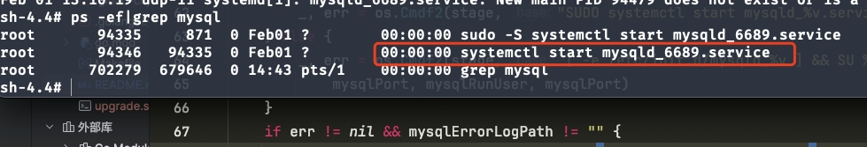
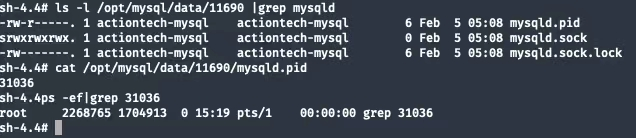
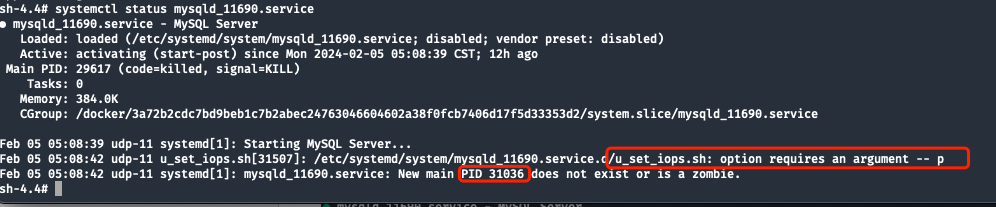
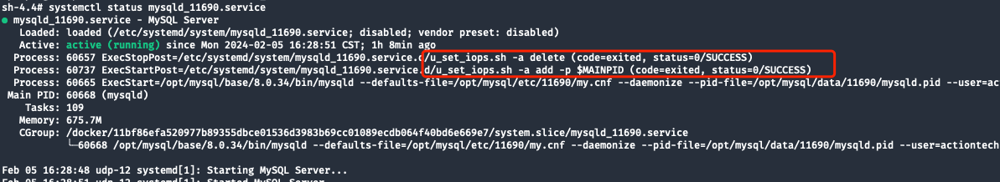
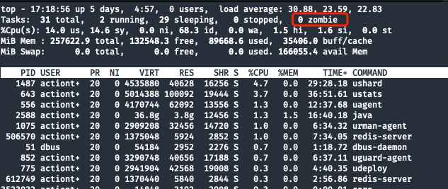
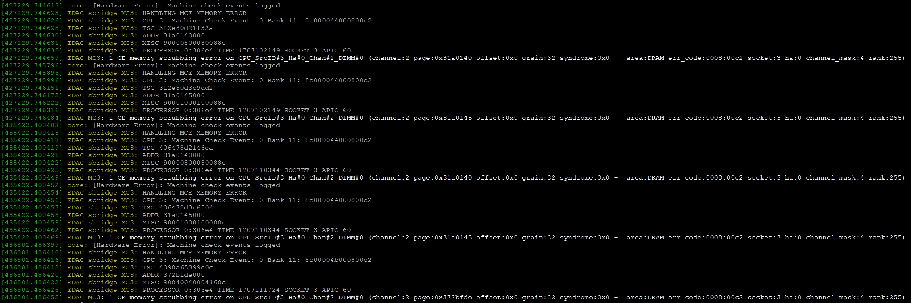
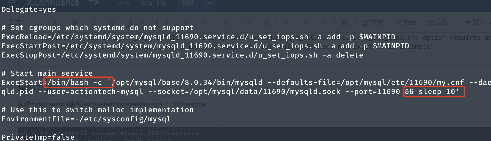
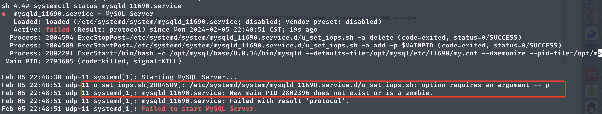

# 故障分析 | MySQL 通过 systemd 启动时 hang 住了

**原文链接**: https://opensource.actionsky.com/%e6%95%85%e9%9a%9c%e5%88%86%e6%9e%90-mysql-%e9%80%9a%e8%bf%87-systemd-%e5%90%af%e5%8a%a8%e6%97%b6-hang-%e4%bd%8f%e4%ba%86/
**分类**: MySQL 新特性
**发布时间**: 2024-05-09T01:21:11-08:00

---

mysqld：哥，我起不来了……
> 作者：贲绍华，爱可生研发中心工程师，负责项目的需求与维护工作。其他身份：柯基铲屎官。
爱可生开源社区出品，原创内容未经授权不得随意使用，转载请联系小编并注明来源。
本文约 2100 字，预计阅读需要 7 分钟。
# 引言
正如题目所述，在自动化测试场景下，通过 *systemd* 无法启动 MySQL。
连续 `kill -9` 结束实例进程，检测 *mysqld* 在退出后是否会被正确拉起。
具体信息如下：
- 主机信息：CentOS 8（Docker 容器）
- 使用 *systemd* 的方式管理 *mysqld* 进程
- *systemd service* 的运行模式为：**forking**
- 启动命令如下：
`# systemd 启动命令
sudo -S systemctl start mysqld_11690.service
# systemd service 内的 ExecStart 启动命令
/opt/mysql/base/8.0.34/bin/mysqld --defaults-file=/opt/mysql/etc/11690/my.cnf --daemonize --pid-file=/opt/mysql/data/11690/mysqld.pid --user=actiontech-mysql --socket=/opt/mysql/data/11690/mysqld.sock --port=11690
`
# 现象描述
**启动命令持续 hang 住，既不成功，也无任何返回，尝试几次后均无法手动复现该场景。**
> 下图为复现场景，*service* 端口号不一致请忽略。

MySQL 错误日志无任何信息。查看 *systemd service* 状态，发现启动脚本中由于缺少参数 `MAIN PID`，执行失败。

*systemd* 最后输出的信息为：`New main PID 31036 does not exist or is a zombie`

# 原因总结
*systemd* 启动 *mysqld* 的过程中，会先根据 *service* 模板中的配置，执行：
- ExecStart（启动 *mysqld*）
- *mysqld* 启动创建 `pid` 文件
- ExecStartPost（自定义的一些后置脚本：调整权限、将 `pid` 写入 *cgroup* 等）
在 **步骤 2-3** 的中间态，也就是 `pid` 文件刚创建出来时，主机上接收到了自动化测试下发的命令：`sudo -S kill -9 $(cat /opt/mysql/data/11690/mysqld.pid)`。
由于这个 `pid` 文件和 `pid` 进程确实存在（如果不存在 `kill` 命令或 `cat` 会报错），自动化的 CASE 认为 `kill` 操作已成功结束。但由于 `mysqld.pid` 这个文件是由 MySQL 自身维护的，在 *systemd* 的视角中，还需要继续等待 **步骤 3** 完成，才认为启动成功。
在 *systemd* 使用 **forking** 模式时，会根据子进程的 `PID` 值判断服务是否成功启动。
**如果子进程成功启动，并且没有发生意外退出，则 *systemd* 会认为服务已启动，并将子进程的 `PID` 作为 `MAIN PID`。**
而如果子进程启动失败或意外退出，则 *systemd* 会认为服务未能成功启动。
## 结论
在执行 ExecStartPost 时，由于子进程 **ID 31036** 已经被 `kill` 掉，后置 `shell` 缺少了启动参数，但 ExecStart 步骤已完成，导致 **MAIN PID 31036** 成为了只存在于 *systemd* 里的 **僵尸进程**。
# 排查过程
当遇到这个问题时是有点懵的，简单检查了一下内存、磁盘基本信息。符合预期并没有出现资源不足的情况。
先从 MySQL 的 Error Log 看看有什么发现。查看结果如下：
`...无关内容省略...
2024-02-05T05:08:42.538326+08:00 0 [Warning] [MY-010539] [Repl] Recovery from source pos 3943309 and file mysql-bin.000001 for channel ''. Previous relay log pos and relay log file had been set to 4, /opt/mysql/log/relaylog/11690/mysql-relay.000004 respectively.
2024-02-05T05:08:42.548513+08:00 0 [System] [MY-010931] [Server] /opt/mysql/base/8.0.34/bin/mysqld: ready for connections. Version: '8.0.34'  socket: '/opt/mysql/data/11690/mysqld.sock'  port: 11690  MySQL Community Server - GPL.
2024-02-05T05:08:42.548633+08:00 0 [System] [MY-013292] [Server] Admin interface ready for connections, address: '127.0.0.1'  port: 6114
2024-02-05T05:08:42.548620+08:00 5 [Note] [MY-010051] [Server] Event Scheduler: scheduler thread started with id 5
`
通过观察 Error Log 发现并无任何有用信息，因为启动的时间点之后无任何日志信息输出。
查看 *systemctl status* 确认服务当前状态：

下图为正常情况下的 *status* 信息：

通过对比后，整理两条有用信息：
- 后置 `shell` 由于缺少 `-p` 参数导致执行失败（`-p` 参数为 `MAIN PID`，也就是 fork 子进程启动后的 `PID`）。
- *systemd* 无法获取 `PID 31036`，不存在或者为僵尸进程。
先来检查进程 `ID` 与 `mysqld.pid` 看看：

确认线索：
- `PID 31036` 不存在
- `mysqld.pid` 文件存在，且文件内容为 31036
- `top` 命令查看不存在僵尸进程
还需要获取更多的线索来确认原因，检查 `journalctl -u` 内容，看看是否有帮助：
`sh-4.4# journalctl -u mysqld_11690.service
-- Logs begin at Mon 2024-02-05 04:00:35 CST, end at Mon 2024-02-05 17:08:01 CST. --
Feb 05 05:07:54 udp-11 systemd[1]: Starting MySQL Server...
Feb 05 05:07:56 udp-11 systemd[1]: Started MySQL Server.
Feb 05 05:08:31 udp-11 systemd[1]: mysqld_11690.service: Main process exited, code=killed, status=9/KILL
Feb 05 05:08:31 udp-11 systemd[1]: mysqld_11690.service: Failed with result 'signal'.
Feb 05 05:08:32 udp-11 systemd[1]: Starting MySQL Server...
Feb 05 05:08:36 udp-11 systemd[1]: Started MySQL Server.
Feb 05 05:08:37 udp-11 systemd[1]: mysqld_11690.service: Main process exited, code=killed, status=9/KILL
Feb 05 05:08:37 udp-11 systemd[1]: mysqld_11690.service: Failed with result 'signal'.
Feb 05 05:08:39 udp-11 systemd[1]: Starting MySQL Server...
Feb 05 05:08:42 udp-11 u_set_iops.sh[31507]: /etc/systemd/system/mysqld_11690.service.d/u_set_iops.sh: option requires an argument -- p
Feb 05 05:08:42 udp-11 systemd[1]: mysqld_11690.service: New main PID 31036 does not exist or is a zombie.
`
这里的 `journalctl -u` 内容也只描述了现象，无法分析具体原因，与 *systemctl status* 的内容相差不多，帮助不大。
查看 `/var/log/messages` 系统日志内容：

发现循环报出了一些内存方面的错误信息，通过搜索后发现该错误可能为硬件问题。询问了自动化测试的同事后，得到结论：
- 场景为偶发问题，执行 4 次用例，2 次成功，2 次失败
- 每次执行均为同一台宿主机，同一份容器镜像
- 失败时 hang 住的容器为同一个
既然有成功执行的结果，这里就先忽略硬件问题导致的。
既然提到了容器，此时想到了 *cgroup* 会不会映射宿主机的时候出现了问题？在上边排查的 *systemctl status* 中，观察可知 *cgroup* 映射的宿主机目录为：`CGroup: /docker/3a72b2cdc7bd9beb1c7b2abec24763046604602a38f0fcb7406d17f5d33353d2/system.slice/mysqld_11690.service`
检查父级文件夹 `system.slice` 的读写权限并无异常。先暂时排除 *cgroup* 的映射问题（因为主机上还有其他 *systemd* 接管的 *service* 也在使用同一份 *cgroup*）。
打算试试 *pstack* 能不能看到 *systemd* 具体 hang 在了哪个地方，`3048143` 为 *systemctl start* 的 `pid`：
`sh-4.4# pstack 3048143
#0  0x00007fdfaef33ade in ppoll () from /lib64/libc.so.6
#1  0x00007fdfaf7768ee in bus_poll () from /usr/lib/systemd/libsystemd-shared-239.so
#2  0x00007fdfaf6a8f3d in bus_wait_for_jobs () from /usr/lib/systemd/libsystemd-shared-239.so
#3  0x000055b4c2d59b2e in start_unit ()
#4  0x00007fdfaf7457e3 in dispatch_verb () from /usr/lib/systemd/libsystemd-shared-239.so
#5  0x000055b4c2d4c2b4 in main ()
`
观察发现 *start_unit* 比较可疑，`start_unit()` 函数位于可执行文件中，它用于启动 *systemd units*，并没有什么帮助。
根据已有线索，推测后可知：
- `mysqld.pid` 文件存在，则表示之前确实有一个 *mysqld* 且进程号为 `31036` 的进程被启动了
- 进程启动后被自动化用例 `kill -9` 结束掉
- *systemd* 获取到了一个已经被结束的 `MAIN PID`，后置 *shell* 执行失败，*fork* 流程失败
通过梳理 *systemd* 启动流程的步骤，推测可能性。MySQL 实例只有在 *mysqld* 成功启动后才会生成 `mysqld.pid` 文件，所以可能是在后续步骤里被意外 `kill -9` 结束掉导致的。
# 复现方式
既然没什么其他头绪和线索了，打算根据推测结论尝试复现一下试试。
## 4.1 调整 systemd mysql serivce 模板
编辑模板文件 `/etc/systemd/system/mysqld_11690.service`，在 *mysqld* 启动后，`sleep10` 秒，方便在这时间窗口内模拟kill掉实例进程的场景。

## 4.2 配置重载
执行 `systemctl daemon-reload` 令变更生效。
## 4.3 场景重现
- [ssh seesion A] 首先准备一个新的容器，做好相关配置后执行 `sudo -S systemctl start mysqld_11690.service` 启动一个 *mysqld* 进程，此时会因为 `sleep` 的原因 hang 住会话。
- [ssh seesion B] 在另一个会话窗口，`start` 命令 hang 住时，检查 `mysqld.pid` 文件，一旦文件被创建后，立刻执行 `sudo -S kill -9 $(cat /opt/mysql/data/11690/mysqld.pid)`。
- 此时观察 *systemctl status*，表现与预期一致

# 解决方式
先 `kill` 掉 hang 住的 *systemctl start* 命令，执行 `systemctl stop mysqld_11690.service`，这可以让 *systemd* 主动结束僵尸进程，虽然 `stop` 命令可能会报错但这并不影响。
等待 `stop` 执行完成后再次使用 `start` 命令启动，恢复正常。