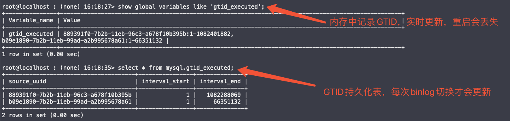
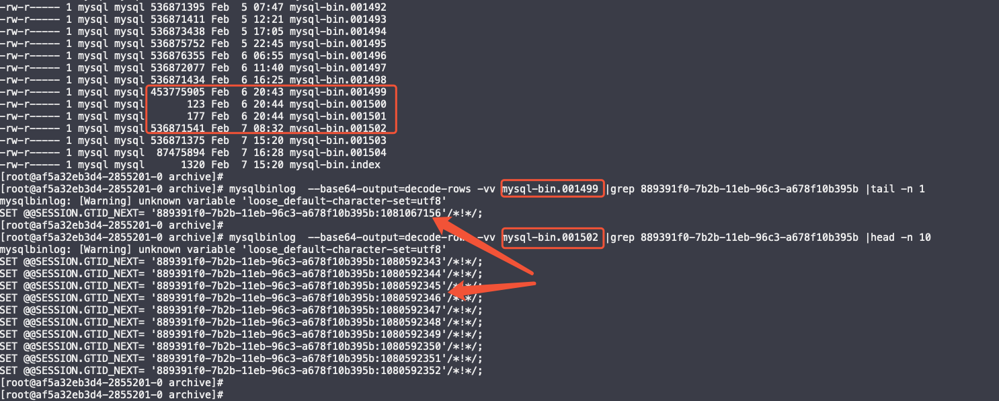
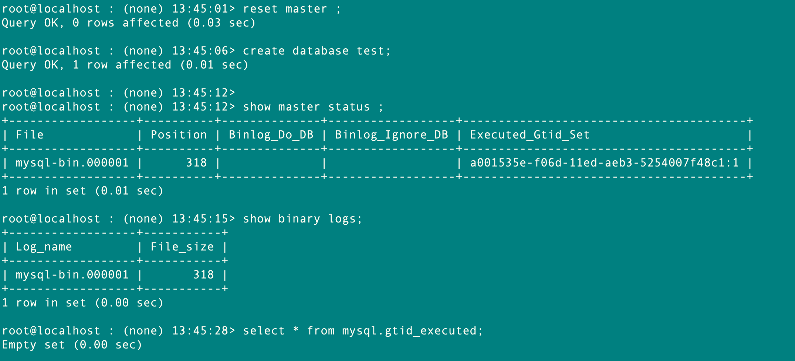
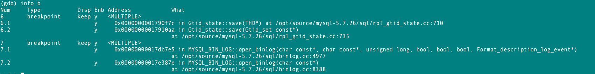
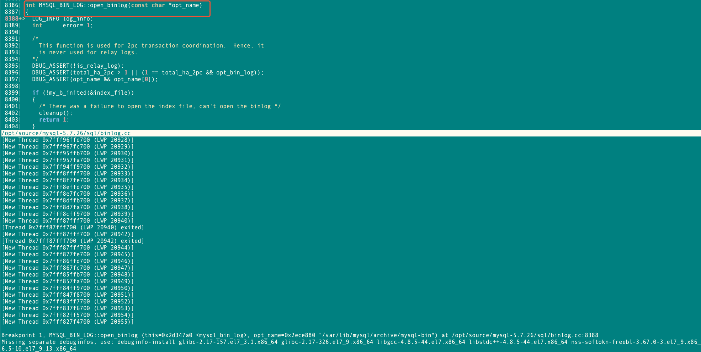
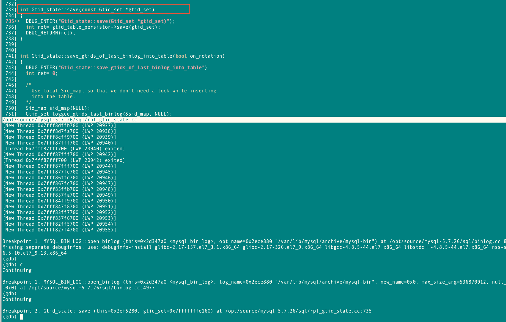
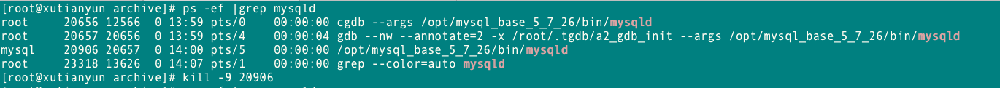
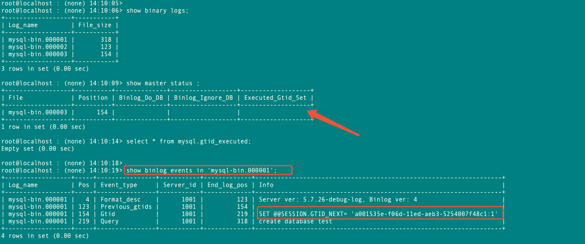

# 故障分析 | MySQL5.7 中连续 Crash 引发 GTID 丢失

**原文链接**: https://opensource.actionsky.com/%e6%95%85%e9%9a%9c%e5%88%86%e6%9e%90-mysql5-7-%e4%b8%ad%e8%bf%9e%e7%bb%ad-crash-%e5%bc%95%e5%8f%91-gtid-%e4%b8%a2%e5%a4%b1/
**分类**: MySQL 新特性
**发布时间**: 2024-08-07T18:34:18-08:00

---

生产环境中 MySQL 5.7.26 版本下，当主库短时间内连续遇到 2 次 Crash 的特殊场景时报错！
> 
作者：xuty。
爱可生开源社区出品，原创内容未经授权不得随意使用，转载请联系小编并注明来源。
本文约 1400 字，预计阅读需要 5 分钟。
## 问题现象
生产环境中 MySQL 5.7.26 版本下，当主库短时间内连续遇到 2 次 Crash 的特殊场景时，会导致备库重新建立复制时会抛出错误 `Slave has more GTIDs than the master has`，IO 线程复制报错。
*2023-12-11T10:32:43.433707+08:00 1457551 [ERROR] Error reading packet from server for channel &#8221;: Slave has more GTIDs than the master has, using the master&#8217;s SERVER_UUID. This may indicate that the end of the binary log was truncated or that the last binary log file was lost, e.g., after a power or disk failure when sync_binlog != 1. The master may or may not have rolled back transactions that were already replicated to the slave. Suggest to replicate any transactions that master has rolled back from slave to master, and/or commit empty transactions on master to account for transactions that have been (server_errno=1236)*
如下图所示，备库比主库多了几十万个 GTID，且解析对应 Binlog 都是业务操作，更像是主库把这部分 GTID“丢掉了”；
- 
主库：1-1080678246； 
- 
备库：1-1081067155；

## 问题分析
先来复习下 MySQL 5.7 GTID 持久化原理：
- **gtid_executed 变量**：它是一个处于内存中的 `GTID SET`，表示数据库中执行了那些 GTID，会实时更新，但是一旦重启就会丢失。`show slave status` 的 `Executed_Gtid_Set` 和 `show master status` 中的 `Executed_Gtid_Set`  都来自于这个变量。
- **mysql.gtid_executed 表**： GTID 持久化的介质，只有在 binlog 切换时才会触发更新。将该 binlog 中的 `GTID SET` 记录到表中，所以该表中会记录所有历史 binlog 中的 `GTID SET`。
> 
📌当 MySQL 启动时，会初始化 `gtid_executed` 变量。通过读取 `mysql.gtid_executed` 表的持久化记录（已持久化的 GTID），再加上扫描最后一个 binlog 的 GTID（未持久化的 GTID）合并后完成初始化，新的 GTID 会基于 `gtid_executed` 变量递增产生。

基于上述 GTID 持久化的原理，我们就有理由怀疑是主库没有持久化最后 1 个 binlog 中的所有 GTID，导致备库比主库多了很多的 GTID。
通过对比 Crash 前后的 binlog 中 GTID，发现主库确实并没有持久化到 `mysql-bin.001499` 中的 binlog，导致后续新产生的 GTID 反而比之前的还小。（正常情况下 GTID 肯定是随着 binlog 越来越大的）。

## GDB 调试复现
基于 MySQL 5.7.26 版本，通过GDB调试模拟复现了上述问题现象，主库连续崩溃恢复后会丢失最后1个binlog中的GTID，引发备库GTID大于主库。
先讲下原因：
- 在mysql 第一次崩溃恢复过程中，会先创建新的binlog，再将崩溃前最后1个binlog中的GTID持久化到表中；
- 如果在这个间隙，再次发生崩溃，就可能会导致mysql已经产生了新的binlog，但是还未将第一次崩溃前最后1个binlog持久化到表中；
- mysql再次启动时，就不会再读取第一次崩溃前最后1个binlog做持久化了，而是读取新产生的binlog作持久化，那么就会丢失第一次崩溃前最后1个binlog中的GTID ；
`#mysql5.7.26 crash启动流程
|main
|mysqld_main
|ha_recover         #mysqld.cc:4256 恢复数据流程
|open_binlog        #mysqld.cc:4282 生成新的binlog
|Gtid_state::save   #mysqld.cc:4870 读取最后1个binlog写入mysql.gtid_executed
|Gtid_table_persistor::save
|Gtid_table_persistor::write_row
`
### 本地 GDB 模拟复现过程
- 使用 MySQL 5.7.26 mysqld-debug 版本启动 MySQL。

- 连入 MySQL，创建 test库，生成 1 个GTID。当前 binlog 为 `mysql-bin.000001`，`mysql.gtid_executed` 表为空，GTID 还未持久化。

- `kill -9 mysql` 进程模拟 OOM。

- 使用 GDB 启动 MySQL，并打了2个断点，分别是`MYSQL_BIN_LOG::open_binlog`（创建新的binlog） 和 `Gtid_state::save`（崩溃启动过程中持久化最后1个binlog的GTID）；

- RUN开始，会停在第一个断点 `MYSQL_BIN_LOG::open_binlog` 处，此时可以看到还未产生新的 binlog。

- continue 继续跑，会卡在第二个断点 `Gtid_state::save`，此时已经生成了新的 binlog，但是还未将 `mysql-bin.000001` 中的 GTID 持久化。

- 正常情况下 `Gtid_state::save` 走完，就会把 `mysql-bin.000001` 中的 GTID 持久化到表中，这里模拟把 mysql 给 kill 了，此时产生了新的 binlog 但是还未做完 GTID 持久化。

- 再次正常启动 MySQL，就会发现“丢掉了”`mysql-bin.000001` 中的 GTID，此次启动并不会再次读取 `mysql-bin.000001` 中的 GTID 做持久化；所以备库会比主库多整整 1 个 binlog 的 GTID。

同样的测试在 MySQL v5.7.26、v5.7.36、v5.7.44 均可以复现，说明 MySQL 5.7 中都存在该现象。而 MySQL 8.0 因为 GTID 持久化做了优化，所以不会有此类问题。
## 总结
在 MySQL 5.7 版本下，因为 GTID 持久化机制的原因，当 MySQL 处于崩溃恢复阶段时，如果再次遇到 Crash，就可能会丢失最后 1 个 binlog 中的 GTID。