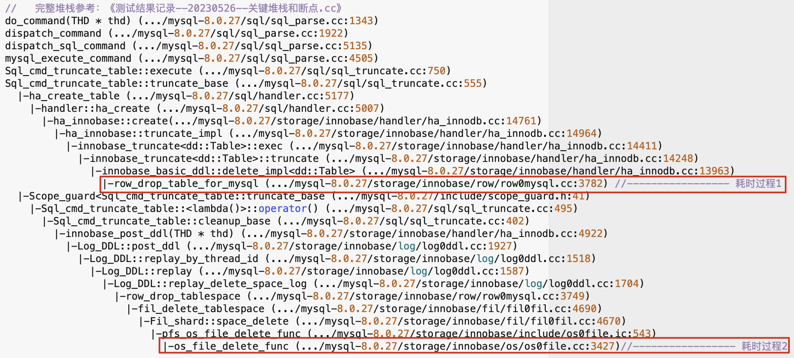
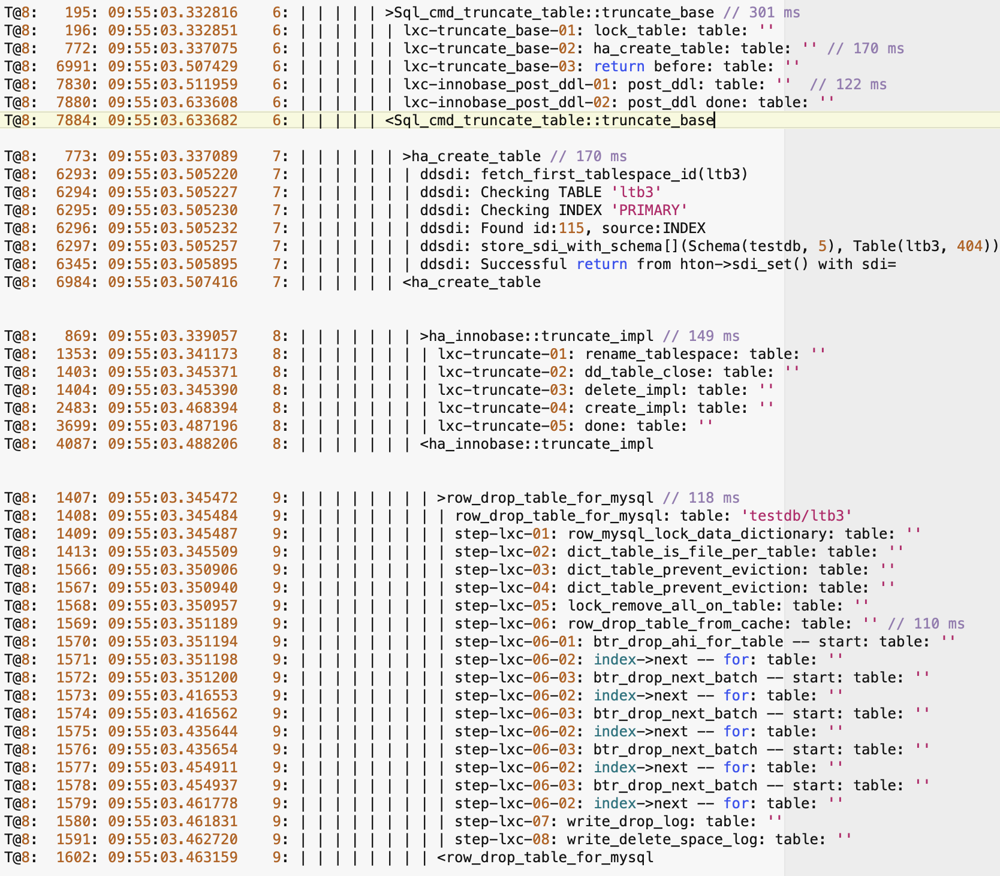
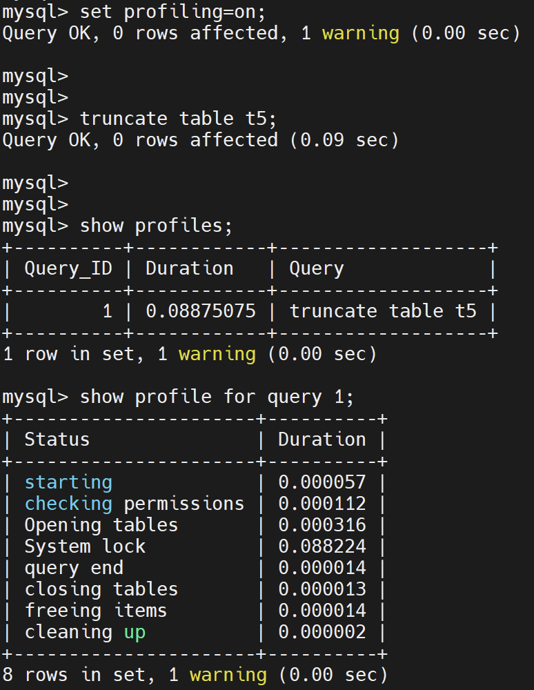
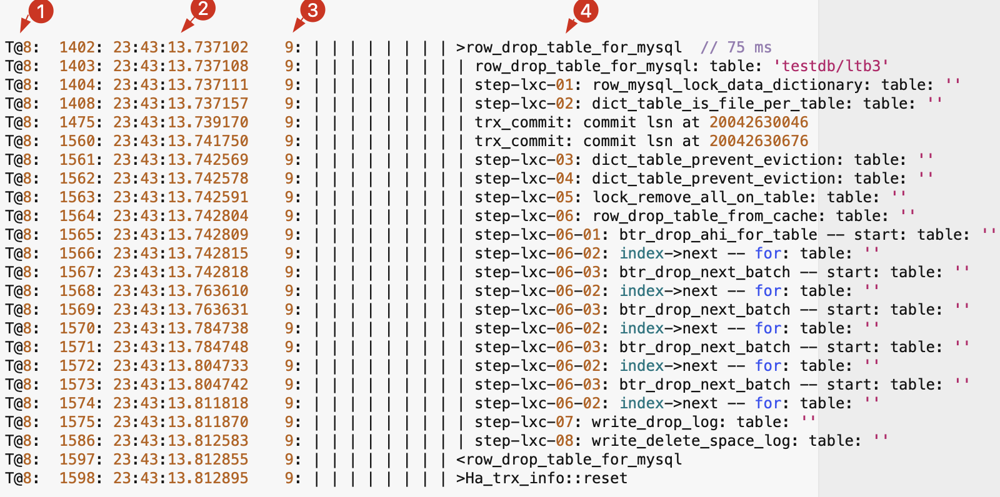
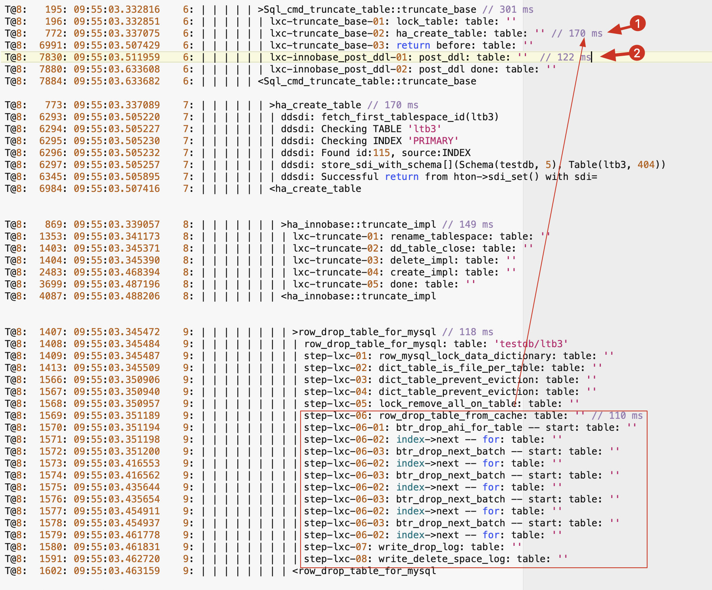
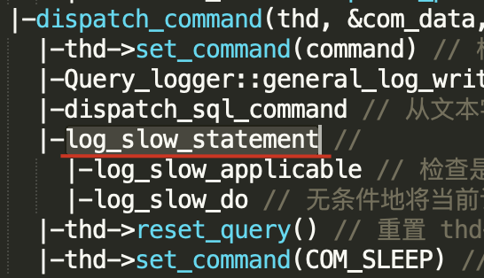
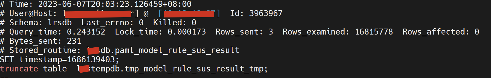

# 故障分析 | TRUNCATE 到底因何而慢？

**原文链接**: https://opensource.actionsky.com/%e6%95%85%e9%9a%9c%e5%88%86%e6%9e%90-truncate-%e5%88%b0%e5%ba%95%e5%9b%a0%e4%bd%95%e8%80%8c%e6%85%a2%ef%bc%9f/
**分类**: 技术干货
**发布时间**: 2023-06-19T00:42:39-08:00

---

作者通过源码分析 truncate 语句形成慢 SQL 的原因和解决方案，并与 MySQL 5.7就相关实现逻辑进行对比。
> 
作者：李锡超
一个爱笑的江苏苏宁银行 数据库工程师，主要负责数据库日常运维、自动化建设、DMP 平台运维。擅长 MySQL、Python、Oracle，爱好骑行、研究技术。
本文来源：原创投稿
- 爱可生开源社区出品，原创内容未经授权不得随意使用，转载请联系小编并注明来源。
# 问题现象
收到反馈某测试环境执行批量操作时，有 `truncate` 语句存在于慢查询日志中。担心上线后可能影响数据库，请求 DBA 配合分析。
## 关键配置
| 配置项 | 说明 |
| --- | --- |
| 数据库版本 | MySQL 5.7 |
| 参数 `long_query_time`  慢查询阈值，单位为秒 | 0.1（100 毫秒） |
| 参数 `innodb_adaptive_hash_index` | ON |
## 问题分析总结
总结下来主要有如何几个问题：
## Q1: TRUNCATE 语句是如何执行的？fd 句柄不变化？为什么执行时间长？
### TRUNCATE 语句如何执行？
关键堆栈：

关键操作 debug：

### 为什么执行时间长？

从以上堆栈可以看到，耗时过程主要是 `row_drop_table_for_mysql`、`os_file_delete_func`。
其中：`row_drop_table_for_mysql` 主要是调用 `btr_drop_ahi_for_table` 执行 AHI 的 page 页的删除。`os_file_delete_func` 主要调用 `unlink` 执行文件的清理。
### 句柄为什么不变化？
假如需要 `truncate` 的表分配的 fd 为 43，`truncate` 过程中，会先将表 `rename`。这个时候这个 fd 会被关闭，43 就被释放了。然后执行 `create table` 操作。一般这个间隙过程很短，因此新建立的表可以使用被释放的 43 了，所以会看到 fd 没有变化。
如果 `rename` 之后，在内部执行 `create table` 之前，又打开了新文件，那这时候 fd 43 就会被其它打开的文件持有，`truncate` 之后表的 fd 也就会发生变化。
> 
注意：MySQL 8.0 是真正使用 `rename` + `create` + `drop`实现的 `truncate`，但 MySQL 5.7 是通过文件的 `truncate` 实现的。
## Q2: 如何分析 TRUNCATE 慢的问题？
### 方式一：慢日志？
只能看到慢的结果，无法确认原因。
### 方式二：执行计划？
不支持 `truncate` 语句。
### 方式三：profile
从 `profile` 结果来看，对于 `truncate` 语句，只能看到耗时过程都在`System lock` 上，无法看到更近一步的原因。

### 方式四：DEBUG
`// 推荐设置
// 其中 T 其实是 MySQL 支持（在 trace 中打印时间）的，但官方文档中缺少了说明。已提交bug说明：Bug #111174
set global debug='d:t:T:i:n:N:o,/tmp/debug_3306.trace.f';
set global debug='';
`

- ① 表示 `show processlist` 的线程 ID
- ② 执行时间
- ③ 函数调用层级
- ④ 函数名称
### MySQL 8.0 切换对比
`// TRUNCATE
// 默认规范配置
// innodb_flush_method = on & innodb_flush_method = O_DIRECT
(root@127.1) [eolbimsdb] 08:44:46 15> truncate table t5;
Query OK, 0 rows affected (0.98 sec)
// 设置 innodb_adaptive_hash_index = off
(root@127.1) [eolbimsdb] 08:52:03 5> truncate table t5;
Query OK, 0 rows affected (0.03 sec)
// 设置 innodb_flush_method = fsync
(root@127.1) [eolbimsdb] 09:03:34 28> truncate table t5;
Query OK, 0 rows affected (1.04 sec)
// 设置  innodb_adaptive_hash_index = off & innodb_flush_method = fsync
(root@127.1) [eolbimsdb] 09:20:24 5> truncate table t5;
Query OK, 0 rows affected (0.22 sec)
// DROP
// 默认规范配置
// innodb_flush_method = on & innodb_flush_method = O_DIRECT
(root@127.1) [eolbimsdb] 10:05:41 9> drop table t5;
Query OK, 0 rows affected (0.94 sec)
// 设置 innodb_adaptive_hash_index = off & innodb_flush_method = O_DIRECT
(root@127.1) [eolbimsdb] 09:44:24 5> drop table t5;
Query OK, 0 rows affected (0.01 sec)
// 设置 innodb_flush_method = on & innodb_flush_method = fsync
(root@127.1) [eolbimsdb] 09:32:15 13> drop table t5;
Query OK, 0 rows affected (1.13 sec)
// 设置  innodb_adaptive_hash_index = off & innodb_flush_method = fsync
(root@127.1) [eolbimsdb] 09:25:10 14> drop table t5;
Query OK, 0 rows affected (0.19 sec)
`
## Q3: 能否优化？慢在哪里？post_ddl 如何调用？
从 Q1 的结果中可以看出，执行的主要耗时在 `row_drop_table_for_mysql`、`os_file_delete_func`：

### MySQL 8.0 的优化措施
- `row_drop_table_for_mysql` 慢的问题，可以通过设置 `innodb_adaptive_hash_index = off` 进行优化；
- `os_file_delete_func` 慢的问题，可以设置 `innodb_flush_method = O_DIRECT` 或者配置表的 HARD LINK 进行优化。
### MySQL 5.7 的优化措施
详见后面 3-Q1、3-Q4 部分。
### post_ddl 如何调用？
MySQL 8.0 引入了 [scope guard](https://www.bookstack.cn/read/aliyun-rds-core/20cbcfdcbd68888c.md) 功能：当定义了 scope guard 之后，会创建 Scope_guard 对象。正常情况下，当执行 `return` 操作前，会执行 scope guard 定义的逻辑。除非在函数结束前执行 Scope_guard 对象的 `commit` 操作。文件的删除功能实在 scope guard 的 cleanup_base 阶段调用是现的。
## Q4: 生产执行 TRUNCATE 是否存在隐患？
从实现机制来看，主要有以下风险：
### IO 压力
当触发 `truncate` 操作后，需要在短时间由数据库线程将文件 `unlink` 或 `truncate`，如果被处理的文件很大，服务器的 IO 压力可能会影响正常的数据库请求。
### 内存并发
在执行 `truncate`、`drop` 的过程中，由于需要对内存的数据进行清理，特别是对 LRU 和 flush_LRU 进行扫描，并释放对应的数据块。这个过程是需要逐个根据 `buffer pool instance` 获取 mutex 资源的。如果在业务高峰期，特别是 `buffer pool` 较大时，可能会影响正常的业务情况。
同时，执行 `create drop table` 操作时需要 `dict_operation_lock` 的 X 锁（RW_X_LATCH），而一些其他后台线程，比如 Main Thread 检查 dict cache 时，也需要获取 `dict_operation_lock` 的 X 锁，因此被阻塞。然后用户线程可能由于获取不到锁而处于挂起状态，当无法立刻获得锁时。更多参考：[《Drop Table 对 MySQL 的性能影响分析》](https://www.cnblogs.com/CtripDBA/p/11465315.html)。
## Q5: 不同版本对于 TRUNCATE 的实现是否存在差异？
### 通过对比 2-Q1 与 3-Q4:
MySQL 8.0 的 `truncate` 实现方式基本和 `drop` 实现方式相同，包括主要的耗时位置（都在 `row_drop_table_for_mysql`、`os_file_delete_func`）都是相同的。
MySQL 5.7 的 `truncate` 和 `drop` 实现差异较大，整个实现过程几乎是完全独立的代码。`truncate` 使用 `row_truncate_table_for_mysql`，`drop` 使用 `row_drop_table_for_mysql`；`truncate` 操作的主要的耗时有 `dict_drop_index_tree`、`os_file_truncate`。
# DROP TABLE 优化失败分析
下面来看一个 MySQL 5.7 测试环境上线 DROP TABLE 优化方案失败问题。
## Q1：上线为什么会失败？HARD LINK 为什么不生效？AHI 为什么不生效?
- 当 MySQL 5.7 使用规范配置启动时，从 `debug-trace` 过程来看，在`row_drop_single_table_tablespace`、`row_drop_table_from_cache` 函数执行期间根本没有耗时，所以实施优化方案后，没有效果；
- 耗时的过程在 `que_eval_sql: query: PROCEDURE DROP_TABLE_PROC ---> dict_drop_index_tree`；
- `row_drop_single_table_tablespace` 的耗时被 MySQL 5.7 配置`innodb_flush_method=O_DIRECT` 优化了。
## Q2：该优化是否适用于 MySQL 8.0？
设置 `innodb_flush_method=O_DIRECT` 的优化操作，同样适用于 MySQL 8.0。
## Q3：MySQL 8.0 如何解决 DROP TABLE 时执行 DROP_TABLE_PROC 慢的问题？
- WL#9536: InnoDB_New_DD: Support crash-safe DDL；
- 依赖于自 Version 8.0.3 的 NEW DD；
- 整个 `drop` 慢的 `que_eval_sql`、`DROP_TABLE_PROC` 被整体砍掉；
- 包括 `dict_drop_index_tree` 在内的整个函数，都被砍了；
- 具体实现机制，参考分析 NEW DD 实现方法。
## Q4：MySQL 5.7 DROP TABLE 和 TRUNCATE 在实现机制、优化措施有何区别呢？
- 执行 `truncate` 操作的耗时，仍然是在 `dict_drop_index_tree`、`os_file_truncate` 这两个阶段；
- `os_file_truncate` 的耗时：可以通过设置 `innodb_flush_method=O_DIRECT` 时间进行优化（不可以通过 `hard link` 进行优化）；
- `dict_drop_index_tree` 的耗时，暂时没有优化思路。了解更多：[InnoDB 文件系统之文件物理结构](http://mysql.taobao.org/monthly/2016/02/01/)。
## Q5：5.7 慢查询为什么有时记录 TRUNCATE 执行慢，有时不记录?
根据源码，MySQL 是否记录慢查询判断时，主要有两个维度：一个是执行时间（不包括 `utime_alter_lock`）；一个是执行扫描的行数，并对特殊的语句（如 `call`）进行了忽略。对于 `truncate` 操作而言，无论执行时间是多少，扫描行数都是 0。当配置了 `min_examined_row_limit` 大于 0 之后，一般 `truncate` 操作由于不满足该条件，都不会被记录到慢查询。
但是当 `truncate` 操作位于存储过程中时，在 `truncate` 操作之前有其它 DML 操作（如 `insert selecct`），这时候由于位于同一个 THD 下，在 MySQL 5.7 版本里面 `thd->get_examined_row_count()` 返回的结果其实是上一个 DML 语句的（这里应该是缺陷）。如果此时 `truncate` 操作的执行时间又超过了 `long_query_time`，那么此时这个 `truncate` 语句就会被记录慢查询。
同时，在 MySQL 8.0 针对 `call` 的语句，将不在单独记录记录的语句。而是记录为统一的 `call` 语句里面。需要看存储过程里面的语句执行情况，可以用 `show profiles` 查看。
### 慢查询记录堆栈

### 测试存储过程
`DROP PROCEDURE truncate_test;
DELIMITER //
CREATE PROCEDURE truncate_test()
BEGIN
insert into t1 select * from t1_bak;
truncate table t1;
END
//
DELIMITER ;
call truncate_test();
mysql> call truncate_test();
Query OK, 0 rows affected (1 min 59.58 sec)
# Time: 2023-06-08T00:28:30.969993+08:00
# User@Host: root[root] @ localhost []  Id:     2
# Schema: db2  Last_errno: 0  Killed: 0
# Query_time: 119.177518  Lock_time: 0.000233  Rows_sent: 0  Rows_examined: 131072  Rows_affected: 131072
# Bytes_sent: 0
# Stored_routine: db2.truncate_test
use db2;
SET timestamp=1686155310;
insert into t1 select * from t1_bak;
# Time: 2023-06-08T00:28:31.375873+08:00
# User@Host: root[root] @ localhost []  Id:     2
# Schema: db2  Last_errno: 0  Killed: 0
# Query_time: 0.405734  Lock_time: 0.003310  Rows_sent: 0  Rows_examined: 131072  Rows_affected: 0
# Bytes_sent: 0
# Stored_routine: db2.truncate_test
SET timestamp=1686155311;
truncate table t1;
`

### 与 MySQL 8.0 对比
`mysql> call truncate_test();
Query OK, 0 rows affected (2 min 28.51 sec)
# Time: 2023-06-07T17:18:39.215632Z
# User@Host: root[root] @ localhost []  Id:     8
# Query_time: 148.516478  Lock_time: 0.000372 Rows_sent: 0  Rows_examined: 172032
use testdb;
SET timestamp=1686158318;
call truncate_test();
`
### MySQL 8.0 如何跟踪？
```
mysql> call truncate_test();
Query OK, 0 rows affected (2 min 24.84 sec)
mysql> 
mysql> 
mysql> show profiles;
+----------+--------------+-----------------------------------------+
| Query_ID | Duration     | Query                                   |
+----------+--------------+-----------------------------------------+
|        1 | 144.55113600 | insert into ltb2 select * from ltb3_bak |
|        2 |   0.29312375 | truncate table ltb2                     |
+----------+--------------+-----------------------------------------+
2 rows in set, 1 warning (0.00 sec)
```
以上包括 `truncate` 执行慢的分析，如针对细节有任何疑问和建议，欢迎留言交流。