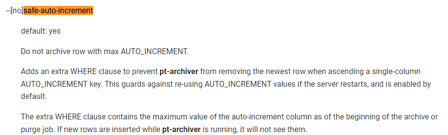
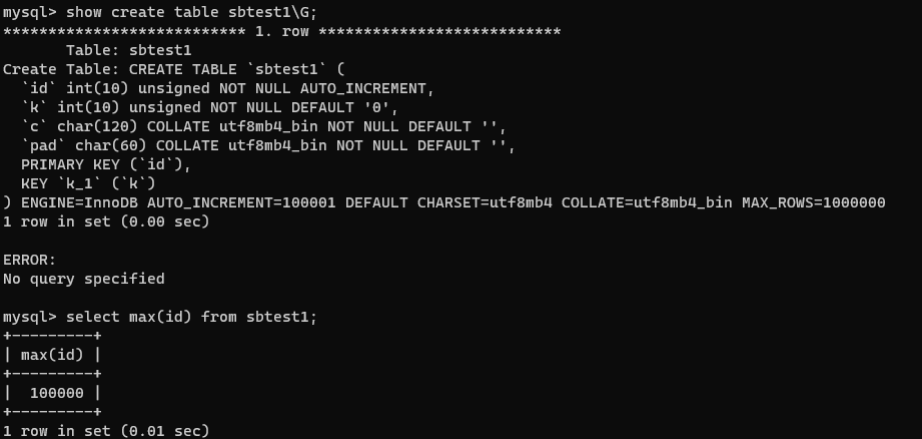
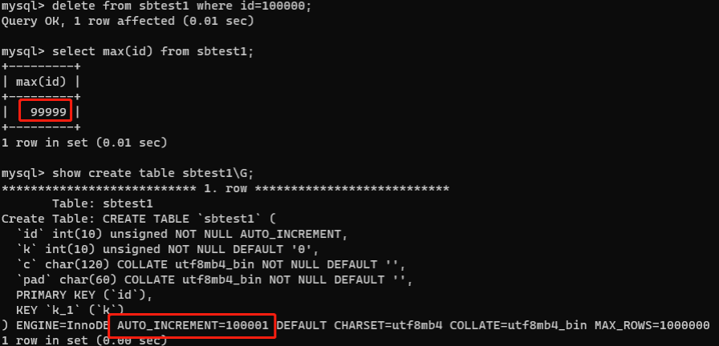
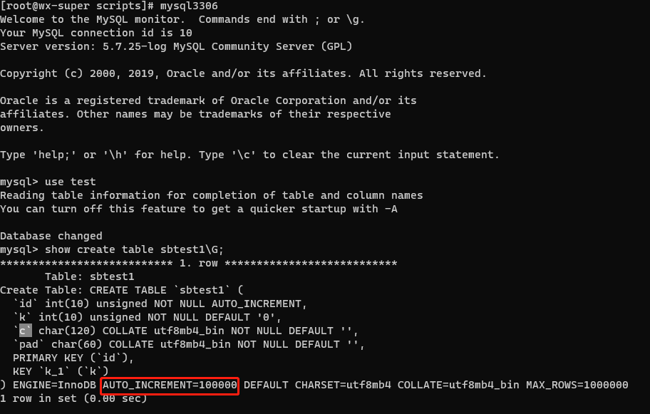

# 故障分析 | pt-archiver 归档丢失一条记录

**原文链接**: https://opensource.actionsky.com/20220926-mysql/
**分类**: MySQL 新特性
**发布时间**: 2022-09-27T18:33:44-08:00

---

作者：王向
爱可生 DBA 团队成员，负责公司 DMP 产品的运维和客户 MySQL 问题的处理。擅长数据库故障处理。对数据库技术和 python 有着浓厚的兴趣。
本文来源：原创投稿
*爱可生开源社区出品，原创内容未经授权不得随意使用，转载请联系小编并注明来源。
#### 前言
在不久前有位客户在进行数据迁移时发现。自己使用pt-archiver备份时总是会少一条数据；如源数据库中某表数据为2333，导入目的数据库后select结果只有2332。
于是本篇文章就此展开，因为这个问题在先前研究过，我这里就直接先上结论后实验了。
#### 结论
在pt-archiver中有这样一个参数&#8211;[no]safe-auto-increment官方文档中作用如下：

指定不使用自增列(AUTO_INCREMENT)最大值对应的行进行归档默认开启，该选项在进行归档清除时会额外添加一条WHERE子句以防止工具删除单列升序字段具有的具有AUTO_INCREMENT属性最大值的数据行，为了在数据库重启之后还能使用到AUTO_INCREMENT对应的值，防止引起无法归档或清除字段对应最大值的行。
简单总结以下里面包含的信息：
- pt-archiver工具对自增列(AUTO_INCREMENT)最大值默认行为是：
会在进行归档清除时额外添加一条WHERE子句防止对，自增列(AUTO_INCREMENT)字段的最大值如“max(id)”,的数据行进行保护。其行为是不归档也不删除此行。
- 为什么要保护这一行数据？
为了防止AUTO_INCREMENT值重置
- 防止AUTO_INCREMENT值重置的意义？
防止数据冲突，一旦AUTO_INCREMENT值重置，将会出现相同自增id。势必会导致下一次的归档失败，影响归档的持续进行。间接影响业务
综上所述，pt-archiver工具默认开启safe-auto-increment参数是很有必要的。可以防止某些意外发生。
那么什么情况下需要关闭safe-auto-increment参数？
- 确定自己要对本表的全量数据进行归档时，应开启此参数&#8211;nosafe-auto-increment
- 归档部分数据时包含自增列(AUTO_INCREMENT)字段的最大值时，应开启此参数&#8211;nosafe-auto-increment
- 确定只归档数据不做删除数据的情况下。可以始终开启此参数&#8211;nosafe-auto-increment
- 如果使用的是MySQL8.0版本请忽略上面3条直接&#8211;nosafe-auto-increment，因为MySQL8不会重置AUTO_INCREMENT
#### 问题重现
1.准备好源库数据如下
mysql> select count(*) from sbtest1; 
+----------+ 
| count(*) |
+----------+
|   100000 | 
+----------+ 
1 row in set (0.08 sec)
2.进行归档
[root@wx ~]# pt-archiver --source 
u=root,p=xxx,h=127.0.0.1,P=3306,D=test,t=sbtest1 --dest
u=root,p=xxx,h=10.186.61.9,P=3306,D=test,t=sbtest1 --where="1=1" --progress=1000 
--statistics --bulk-insert --bulk-delete --txn-size=1000 --limit=1000 --no-delete 
--no-check-charset --skip-foreign-key-checks 
TIME                ELAPSED  COUNT 
2021-09-09T23:23:38       0      0 
2021-09-09T23:23:38       0   1000 
2021-09-09T23:23:38       0   2000 
2021-09-09T23:23:38       0   3000 
2021-09-09T23:23:38       0   4000 
2021-09-09T23:23:38       0   5000 
2021-09-09T23:23:38       0   6000 
...1 
2021-09-09T23:23:46       7 2394000 
2021-09-09T23:23:46       7 95000 
2021-09-09T23:23:46       7 96000 
2021-09-09T23:23:46       8 97000 
2021-09-09T23:23:46       8 98000 
2021-09-09T23:23:46       8 99000 
2021-09-09T23:23:46       8 99999 
Started at 2021-09-09T23:23:38, ended at 2021-09-09T23:23:46 
Source: D=test,P=3306,h=127.0.0.1,p=...,t=sbtest1,u=root 
Dest: D=test,P=3306,h=10.186.61.9,p=...,t=sbtest1,u=root 
SELECT 99999 
INSERT 99999 # 只有99999行
3.查看新表的行数
mysql> select count(*) from sbtest1;
+----------+ 
| count(*) |
+----------+ 
|    99999 |
+----------+ 
1 row in set (0.08 sec)
#### 关于AUTO_INCREMENT值重置
通过这个实验我们可以很轻易的发现AUTO_INCREMENT值的重置过程

删除max最大的id，此时AUTO_INCREMENT值不会受到影响

当我们重启数据库
systemctl restart mysqld_3306
此时AUTO_INCREMENT值会随着max(id)而增加1

MySQL重启后自增列的初始化过程：
MySQL通过一个计数器，实现自增值的维护和分配。但因为但该计数器仅存储在内存里，而没有刷新到磁盘，这就意味着，一旦MySQL重启，自增列会从初始值开始自增，而不是表中当前的最大值。所以MySQL重启后，需要重新初始化计数器为自增列最大值。
#### MySQL 8.0 auto-increment 计数器逻辑
在 MySQL 8.0 中，这个计数器的逻辑变了：
每当计数器的值有变，InnoDB 会将其写入 redo log，保存到引擎专用的系统表中。MySQL 正常关闭后重启：从系统表中获取计数器的值。MySQL 故障后重启：从系统表中获取计数器的值；从最后一个检查点开始扫描 redo log 中记录的计数器值；取这两者的最大值作为新值。
#### 参考：
[https://docs.percona.com/percona-toolkit/pt-archiver.html](https://docs.percona.com/percona-toolkit/pt-archiver.html)
[https://zhuanlan.zhihu.com/p/405768253](https://zhuanlan.zhihu.com/p/405768253)
[https://dev.mysql.com/doc/refman/8.0/en/innodb-auto-increment-handling.html](https://dev.mysql.com/doc/refman/8.0/en/innodb-auto-increment-handling.html)