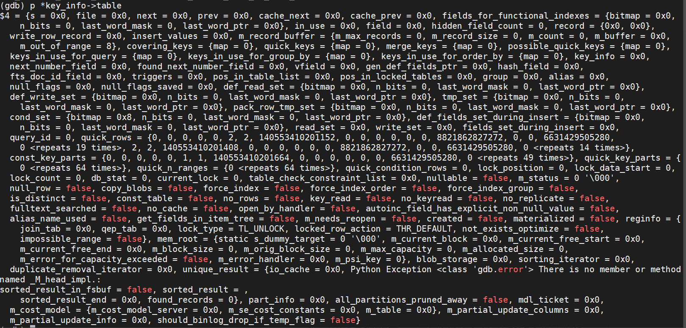

# 故障分析 | 一条 SELECT 语句跑崩了 MySQL ，怎么回事？

**原文链接**: https://opensource.actionsky.com/20220801-mysql/
**分类**: MySQL 新特性
**发布时间**: 2022-08-01T18:07:01-08:00

---

作者：刘开洋
爱可生交付服务团队北京 DBA，对数据库及周边技术有浓厚的学习兴趣，喜欢看书，追求技术。
本文来源：原创投稿
*爱可生开源社区出品，原创内容未经授权不得随意使用，转载请联系小编并注明来源。
在很多疑难问题的排查中，小编最近又遇到了一个 select 语句执行就会导致 MySQL 崩溃的问题，特来分享给大家。
#### 先看下报错
一般来讲，只要数据库崩了，那么错误日志一定会留下线索的，先来看下具体的报错：
06:08:23 UTC - mysqld got signal 11 ;
Most likely, you have hit a bug, but this error can also be caused by malfunctioning hardware.
Thread pointer: 0x7f55ac0008c0
Attempting backtrace. You can use the following information to find out
where mysqld died. If you see no messages after this, something went
terribly wrong...
stack_bottom = 7f56f4074d80 thread_stack 0x46000
/usr/local/mysql/bin/mysqld(my_print_stacktrace(unsigned char const*, unsigned long)+0x2e) [0x1f1b71e]
/usr/local/mysql/bin/mysqld(handle_fatal_signal+0x323) [0xfcfac3]
/lib64/libpthread.so.0(+0xf630) [0x7f5c28c85630]
/usr/local/mysql/bin/mysqld(actual_key_parts(KEY const*)+0xa) [0xef55ca]
/usr/local/mysql/bin/mysqld(calculate_key_len(TABLE*, unsigned int, unsigned long)+0x28) [0x10da428]
/usr/local/mysql/bin/mysqld(handler::ha_index_read_map(unsigned char*, unsigned char const*, unsigned long, ha_rkey_function)+0x261) [0x10dac51]
/usr/local/mysql/bin/mysqld(check_unique_constraint(TABLE*)+0xa3) [0xe620e3]
/usr/local/mysql/bin/mysqld(do_sj_dups_weedout(THD*, SJ_TMP_TABLE*)+0x111) [0xe62361]
/usr/local/mysql/bin/mysqld(WeedoutIterator::Read()+0xa9) [0x1084cd9]
/usr/local/mysql/bin/mysqld(MaterializeIterator::MaterializeQueryBlock(MaterializeIterator::QueryBlock const&, unsigned long long*)+0x17c) [0x10898bc]
/usr/local/mysql/bin/mysqld(MaterializeIterator::Init()+0x1e1) [0x108a021]
/usr/local/mysql/bin/mysqld(SELECT_LEX_UNIT::ExecuteIteratorQuery(THD*)+0x251) [0xf5d241]
/usr/local/mysql/bin/mysqld(SELECT_LEX_UNIT::execute(THD*)+0xf9) [0xf5f3f9]
/usr/local/mysql/bin/mysqld(Sql_cmd_dml::execute_inner(THD*)+0x20b) [0xeedf8b]
/usr/local/mysql/bin/mysqld(Sql_cmd_dml::execute(THD*)+0x3e8) [0xef7418]
/usr/local/mysql/bin/mysqld(mysql_execute_command(THD*, bool)+0x39c9) [0xeab3a9]
/usr/local/mysql/bin/mysqld(mysql_parse(THD*, Parser_state*)+0x31c) [0xead0cc]
/usr/local/mysql/bin/mysqld(dispatch_command(THD*, COM_DATA const*, enum_server_command)+0x156b) [0xeaeb6b]
/usr/local/mysql/bin/mysqld(do_command(THD*)+0x174) [0xeb0104]
/usr/local/mysql/bin/mysqld() [0xfc1a08]
/usr/local/mysql/bin/mysqld() [0x23ffdec]
/lib64/libpthread.so.0(+0x7ea5) [0x7f5c28c7dea5]
/lib64/libc.so.6(clone+0x6d) [0x7f5c26db9b0d]
Trying to get some variables.
Some pointers may be invalid and cause the dump to abort.
Query (7f55ac0ca298): SELECT DISTINCT T.CUST_NO FROM testDB.TABLE_TRANSACTION T  WHERE EXISTS (SELECT 1  FROM testDB.Table1 T1 WHERE T.CUST_NO = T1.CUST_NO ) AND T.AGENT_CERT_NO IS NOT NULL
Connection ID (thread ID): 65
Status: NOT_KILLED
从上述错误日志的输出中可以找到较为明显的几处信息：
1、导致崩溃的 SQL 语句为：SELECT DISTINCT T.CUST_NO FROM testDB.TABLE_TRANSACTION T  WHERE EXISTS (SELECT 1  FROM testDB.Table1 T1 WHERE T.CUST_NO = T1.CUST_NO ) AND T.AGENT_CERT_NO IS NOT NULL
2、数据库发出的信号为 signal 11 ，即是 MySQL 访问到了一个错误的内存地址。
#### 分析过程
1、查看 OS 日志以及系统资源使用情况：
OS 日志的输出对排查方向没有影响，无 MySQL OOM 的现象。
查看监控在 MySQL 崩溃时间段没有任何异常输出，且任何时候都可以在环境中执行 select 触发数据库 crash 。
2、从业务一侧获取完整的 SQL 以及表结构信息。
# 完整的SQL语句：
SELECT 'testPA' AS INDIC_KEY, A.CUST_NO AS OBJ_KEY,
CASE WHEN B.CUST_NO IS NULL THEN 1 ELSE  END AS INDICVAL1,'2222-06-06' AS GRADING_DATE
FROM testDB.Table1 A
LEFT JOIN (
SELECT DISTINCT T.CUST_NO
FROM testDB.TABLE_TRANSACTION T
WHERE
EXISTS (SELECT 1 FROM testDB.Table1 T1 WHERE T.CUST_NO = T1.CUST_NO)
AND T.AGENT_CERT_NO IS NOT NULL
) B ON A.CUST_NO = B.CUST_NO;
# 表结构
CREATE TABLE `TABLE_TRANSACTION` (
`cert_key` varchar(32) CHARACTER SET utf8mb4 COLLATE utf8mb4_0900_ai_ci DEFAULT NULL,
`cust_no` varchar(32) CHARACTER SET utf8mb4 COLLATE utf8mb4_0900_ai_ci DEFAULT NULL,
···
CREATE TABLE `Table1` (
`CUST_NO` varchar(32) CHARACTER SET utf8 COLLATE utf8_general_ci NOT NULL,
···
3、查看该 select 语句的执行计划

4、堆栈分析
通过堆栈可以看到优化器将 EXISTS 子查询转换成了 `semi-join` 操作，由于优化器默认选择了 `DuplicateWeedout` 执行策略，所以会通过建立临时表来实现对外层查询记录进行去重操作。
执行过程可以通过执行计划得到验证：执行计划的 Extra 列将驱动表显示 `Start temporary` 提示，被驱动表将显示 `End temporary` 提示。
5、堆栈问题点输出：
`(/usr/local/mysql/bin/mysqld(actual_key_parts(KEY const*)+0xa) [0xef55ca]`
该堆栈是在内存地址为 `0xef55ca` 的位置崩溃的，该地址可以通过 gdb 分析得到对应的代码位：
`#4  0x0000000000ef55ce in actual_key_parts (key_info=0x7fd5241641b0) at ../../mysql-8.0.19/sql/sql_class.h:1487`
`sql_class.h:1487` 源码地址为：

通过 `inline` 得知 `optimizer_switch_flag` 函数为 `actual_key_parts` 的内联调用，找到 `actual_key_parts` 函数的位置：

6、使用 gdb 进行调试:
6.1. 使用 gdb 的 frame 下推4层堆栈到 `actual_key_parts` 函数：

6.2. 打印 `actual_key_parts` 函数返回的指针所对应的内存地址

6.3. 发现在使用 `in_use` 时返回值为空，出现 `0x0` ，说明 table 内存取址错误。

6.4. 由于 `in_use` 返回为空，在调用 `in_use` 后面的代码 `optimizer_switch_flag` 的时候就会出现非法地址，导致数据库的 crash 。

## 得出结论
经过分析，目前可以确定该问题是 MySQL 函数内存地址错乱引起的 bug ，经过对高版本代码的轮询，发现 8.0.24 版本之后对上述代码做出了修订：

以下为该 bug 的相关描述：https://github.com/mysql/mysql-server/commit/7fde9072e1f62b1b3cf857757a3be41cec5c8e48

#### 解决方案
在上述排查分析中，我们得到这个 bug 是由于使用了 `semi-join` 的 `DuplicateWeedout` 执行策略导致了问题的发生，如果在短时间内无法升级变更数据库，而又想尽量避免这个问题的发生。
一方面肯定是业务侧避免该 SQL 的执行，从 DBA 的角度上考虑的是该 SQL 怎样才能正常执行，那么经过验证：
以下三种解决方案均可解决当前 select 查询导致的数据库崩溃问题。
1、业务表设置合理统一的字符集（utf8mb4）和排序规则，避免exist在半连接中使用了 `DuplicateWeedout` 策略，加快 SQL 执行效率；
2、关闭数据库级别的 `DuplicateWeedout` 优化策略：
`SET [GLOBAL|SESSION] optimizer_switch='duplicateweedout=off'；`
3、升级 MySQL 版本到 8.0.24 ；
#### 其他解决思路
1、直接在谷歌等平台检索相关堆栈代码，查找 MySQL 类似的 bug ，然后在修复版本进行相关 SQL 的验证，确认该 bug 在对应的已经修复，完成问题排查。
2、数据库开启 coredump 完成堆栈的辅助验证。
**特别鸣谢：爱可生 CTO 黄炎 先生**