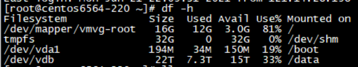
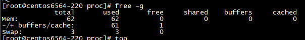
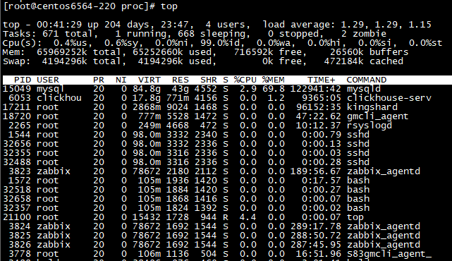
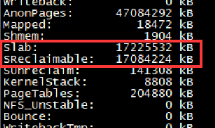
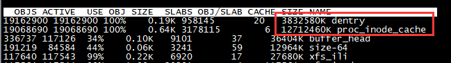
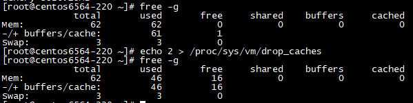

# 故障分析 | 一条du命令引发的内存不足报警

**原文链接**: https://opensource.actionsky.com/20210810-du/
**分类**: 技术干货
**发布时间**: 2021-08-09T23:54:10-08:00

---

作者：任坤
现居珠海，先后担任专职 Oracle 和 MySQL DBA，现在主要负责 MySQL、mongoDB 和 Redis 维护工作。
本文来源：原创投稿
*爱可生开源社区出品，原创内容未经授权不得随意使用，转载请联系小编并注明来源。
## 1、背景
上班时间收到一条磁盘空间报警

登录该机器查看，根分区只有不到16G，此刻已经使用超过了80%。

查看根分区下最大的10个文件并按照size降序排列
`du ‐Sm / ‐‐exclude="/data" | sort ‐k1nr | head ‐10
`
这条命令在其他环境执行几秒钟就返回了，在这个机器上执行了将近1分钟，最后定位到是几个日志文件，直接删除即可。
刚准备退出登录，又收到一条内存报警，还是这台机器。

## 2、诊断
查看内存使用情况，确实已经被耗尽

top查看最耗内存的几个进程

消耗内存每多的mysqld只占用了43G，就算加上截图中的其他几个进程，顶多占用44G。
为避免漏算，统计一下所有进程占用的物理内存总和:
`[root@centos6564‐220 ~]# more RSS.sh
#/bin/bash
for PROC in `ls /proc/|grep "^[0‐9]"`
do
if [ ‐f /proc/$PROC/statm ]; then
TEP=`cat /proc/$PROC/statm | awk '{print ($2)}'`
RSS=`expr $RSS + $TEP`
fi
done
RSS=`expr $RSS \* 4 / 1024 / 1024`
echo $RSS"GB"
[root@centos6564‐220 ~]# sh RSS.sh
44GB
`
注：该脚本来自于褚霸多年前的一篇文章 http://blog.yufeng.info/archives/2456
问题来了，剩余的10多G内存被谁占用了？
top 和 ps 都给不出答案，只能查看/proc/meminfo文件

注意红框中的信息，slab 消耗了太多的缓存，且都是可回收的，看大小正好有16G左右。
联想到刚刚执行的巨慢的du -Sm命令，答案似乎很明显了。
执行slabtop

dentry 和 inode 占用了很多内存，但是输出结果不够直观。
查看超过100M的 slab 缓存组件
`[root@centos6564‐220 ~]# cat /proc/slabinfo |awk '{if($3*$4/1024/1024 > 1
00){print $1,$3*$4/1024/1024 "MB"} }'
xfs_inode 113.586MB
proc_inode_cache 11989.1MB
dentry 3526.19MB
`
inode 占用了将近12G，dentry 占用了3.5G，一切都对上了。
既然是 slab 缓存导致的内存不足，可以直接用 echo 2 > /proc/sys/vm/drop_caches 命令回收。

至此，内存不足的问题已解决。
## 3、寻源
新的疑问产生，到底是哪个目录消耗了海量的 inode/dentry？
执行如下命令，统计根目录下每个目录拥有的文件和子目录总数。
`for i in `ls / `; do
count=`ls ‐lR /$i | wc ‐l`
echo "$i has $count files and dirs"
done
...
proc has 32940780 files and dirs
root has 462 files and dirs
sbin has 287 files and dirs
tmp has 2 files and dirs
....
`
/proc是元凶，继续探查/proc下的子目录，这次统计细化分为文件和子目录
`for i in `ls /proc `; do
files=`ls ‐lR /proc/$i | grep "^‐" | wc ‐l`
dirs=`ls ‐lR /proc/$i | grep "^d" | wc ‐l`
echo "$i has $files files and $dirs dirs" >> /tmp/count_tmps
done
7
#15049进程占用了1600w个文件
[root@centos6564‐220 tmp]# more count_tmps | sort ‐k3nr | head ‐5
15049 has 16381888 files and 964 dirs
17211 has 7653 files and 349 dirs
6053 has 7511 files and 384 dirs
18720 has 2289 files and 269 dirs
sys has 1166 files and 119 dirs
[root@centos6564‐220 tmp]# ps ‐ef | grep 15049
mysql 15049 13839 41 Jan07 ? 85‐09:04:44 /usr/sbin/mysqld ‐‐basedir=/usr
‐‐datadir=/data/var ‐‐plugin‐dir=/usr/lib64/mysql/plugin ‐‐user=mysql ‐‐
log‐error=/data/var/err.log ‐‐pid‐file=/data/var/mysql.pid ‐‐socket=/data/v
ar/mysql.sock ‐‐port=3306
root 24912 25232 0 01:10 pts/3 00:00:00 grep 15049
`
多尴尬，查半天居然还是 mysql 的问题。
统计/proc/15049下的子目录信息
`dest=/proc/15049
for i in `ls $dest `; do
files=`ls ‐lR $dest/$i | grep "^‐" | wc ‐l`
dirs=`ls ‐lR $dest/$i | grep "^d" | wc ‐l`
echo "$i has $files files and $dirs dirs" >> /tmp/15049
done
[root@centos6564‐220 task]# cat /tmp/15049 | sort ‐k3nr | head ‐5
task has 20428788 files and 955 dirs
fdinfo has 106921 files and 0 dirs
net has 60 files and 3 dirs
attr has 6 files and 0 dirs
autogroup has 1 files and 0 dirs
`
/proc/15432/task目录，记录的是 mysqld 衍生的每个子线程的信息。
查看 mysqld 当前的子线程数量
`[root@centos6564‐220 task]# cat /proc/15049/status | grep ‐i threads
Threads: 191
`
继续查看每个子线程具体信息
`dest=/proc/15049/task
for i in `ls $dest `; do
files=`ls ‐lR $dest/$i | grep "^‐" | wc ‐l`
dirs=`ls ‐lR $dest/$i | grep "^d" | wc ‐l`
echo "$i has $files files and $dirs dirs" >> /tmp/15049_task
done
[root@centos6564‐220 tmp]# more 15049_task | sort ‐k3nr | head ‐5
15049 has 106957 files and 4 dirs
15058 has 106957 files and 4 dirs
15117 has 106957 files and 4 dirs
15118 has 106957 files and 4 dirs
15119 has 106957 files and 4 dirs
`
每个子线程打开的文件数量是一样的，进入任意1个子线程的 fd 目录，
`[root@centos6564‐220 fd]# pwd
/proc/15432/task/15120/fd
[root@centos6564‐220 fd]# ls | wc ‐l
85286
#每一个fd都是1个mysql文件，看命名格式是分区表
[root@centos6564‐220 fd]# ll 39326
lrwx‐‐‐‐‐‐ 1 root root 64 Jul 31 01:34 39326 ‐> /data/tokudb/_*_sql_204d_
542_P_p20161105_188_status_3f14ef598_1_1d.tokudb
`
## 4、结论
登录数据库查看 information_schema.partitions ，发现了100多个分区表，每个表1000个分区起步。
这套实例是其他部门半路转交给我们的，该组同学使用 mysql 最大的特点就是喜欢创建分区表。
另外，诊断全程 free -g 显示空闲物理内存为0，但是 mysqld 并没有因此 OOM ，这是因为被额外消耗的那16G内存全属于可回收类型，可以被其他内存请求复用