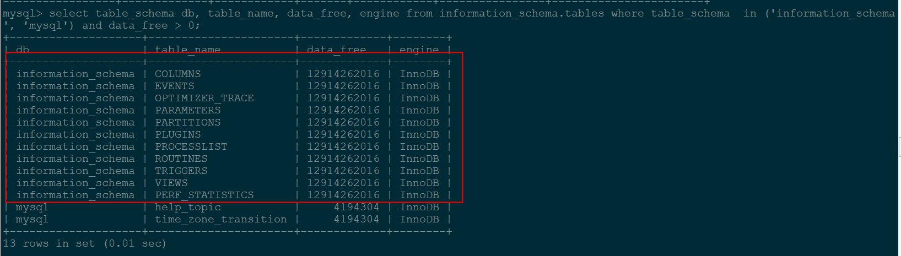
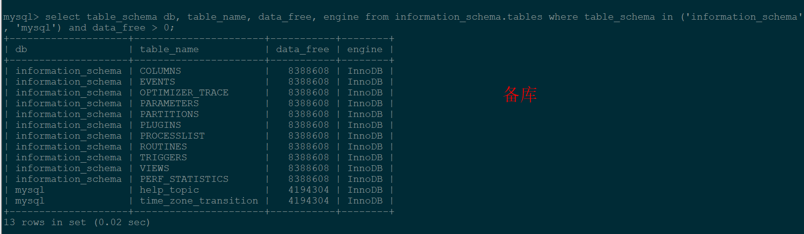
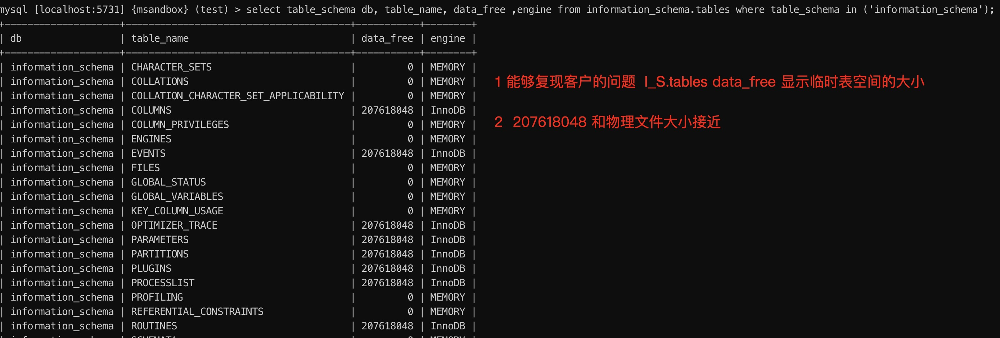

# 故障分析 | 从 data_free 异常说起

**原文链接**: https://opensource.actionsky.com/20220624-mysql/
**分类**: MySQL 新特性
**发布时间**: 2022-06-23T21:21:26-08:00

---

作者：杨奇龙
网名“北在南方”，资深 DBA，主要负责数据库架构设计和运维平台开发工作，擅长数据库性能调优、故障诊断。
本文来源：原创投稿
*爱可生开源社区出品，原创内容未经授权不得随意使用，转载请联系小编并注明来源。
### 一 前言
某个客户反馈查询数据库发现  `information_schema.tables` 的 `data_free` 值突发异常，达到 13G 左右。如图：

需要排查什么原因导致的，本文梳理排查的过程和和解决问题的方法。
### 二 排查
#### 2.1  分析
首先  `data_free` 的含义是 表空间 ibd 文件经过写入和删除之后，留下的没有回收的碎片空间大小。
让现场的同学同时检查主备库，对比有没有文件大小和配置上的差异。 发现主库的`data_free` 值是 13G 左右， 备库正常。

看结果猜测和主库上的某些请求动作有关，空洞是 MySQL 因为 sql  写入而请求分配的空间没有自动回收的结果。基于前线给的信息，没有其他思路，再看前线发的截图:

意外从 截图的 ibtmp1 文件大小找到一些线索，截图显示 ibtmp1 文件大小也是 13G ，备库则是初始值大小。
> 忽略红色的箭头，查看 ibtmp1 文件大小为 13G ，似乎有些头绪，`data_free` 是否和 ibtmp1 有关。
#### 2.2 验证猜想
使用 sysbench 创建测试表 sbtest1 ，构造2w条记录，然后创建 sbtest2 ，将 sbtest1 的数据 导入到 sbtest2 。为何这么操作，后面会说明。
mysql > show  variables like 'innodb_temp_data_file_path';+----------------------------+-----------------------+| Variable_name              | Value                 |+----------------------------+-----------------------+| innodb_temp_data_file_path | ibtmp1:12M:autoextend |+----------------------------+-----------------------+1 row in set (0.00 sec)
查看物理ibtmp1 文件大小:
[root@tidb00 data]# du -sm ibtmp112 ibtmp1
沟通测试用例，让系统自动生成临时表
mysql  > create table sbtest2 like sbtest1;Query OK, 0 rows affected (0.01 sec)mysql > insert into sbtest2(k,c,pad) select k,c ,pad from sbtest1;Query OK, 200000 rows affected (1.18 sec)Records: 200000  Duplicates: 0  Warnings: 0mysql > insert into sbtest2(k,c,pad) select k,c ,pad from sbtest1;Query OK, 200000 rows affected (1.06 sec)mysql > insert into sbtest2(k,c,pad) select k,c ,pad from sbtest2;Query OK, 400000 rows affected (2.49 sec)Records: 400000  Duplicates: 0  Warnings: 0mysql > insert into sbtest2(k,c,pad) select k,c ,pad from sbtest2;Query OK, 800000 rows affected (6.18 sec)Records: 800000  Duplicates: 0  Warnings: 0
再次检查 ibtmp1 文件大小 204MB
[root@tidb00 data]# du -sm ibtmp1204 ibtmp1mysql > SELECT FILE_NAME, TABLESPACE_NAME, ENGINE, INITIAL_SIZE, TOTAL_EXTENTS*EXTENT_SIZE    ->        AS TotalSizeBytes, DATA_FREE, MAXIMUM_SIZE FROM INFORMATION_SCHEMA.FILES    ->        WHERE TABLESPACE_NAME = 'innodb_temporary'\G*************************** 1. row ***************************      FILE_NAME: ./ibtmp1TABLESPACE_NAME: innodb_temporary         ENGINE: InnoDB   INITIAL_SIZE: 12582912 TotalSizeBytes: 213909504      DATA_FREE: 207618048  ## 和物理文件大小对应   MAXIMUM_SIZE: NULL1 row in set (0.00 sec)
查看 `I_S.tables` 的`data_free` 的值:

查看  insert select from table 在执行过程中的确使用了临时表。
mysql > explain insert into sbtest2(k,c,pad) select k,c ,pad from sbtest2\G*************************** 1. row ***************************..*************************** 2. row ***************************           id: 1  select_type: SIMPLE        table: sbtest2   partitions: NULL         type: ALLpossible_keys: NULL          key: NULL      key_len: NULL          ref: NULL         rows: 1578168     filtered: 100.00        Extra: Using temporary  ## 2 rows in set (0.00 sec)Records: 200000  Duplicates: 0  Warnings: 0
至此，可以确定客户的实例因为执行某些 SQL 过程中占用系统临时表空间，使用完之后临时表空间并未被回收导致开头的问题。接下来我们详细了解  MySQL 临时表的相关知识。
### 三 临时表空间
#### 3.1 介绍
ibtmp1 是非压缩的 innodb 临时表的独立表空间, 通过 `innodb_temp_data_file_path`参数指定文件的路径，文件名和大小，默认配置为`ibtmp1:12M:autoextend`，如果没有指定位置，临时表空间会被创建到`innodb_data_home_dir` 指定的路径。
需要注意的是: 按照默认值，这个文件大小是可以无限增长的。而且 5.7 版本并不会随着 SQL 语句结束主动回收该临时表空间，导致空间资源不足的安全风险。
#### 3.2 什么情况下会用到临时表
当 explain 查看执行计划结果的 extra 列中，如果包含 Using Temporary 就表示会用到临时表,例如如下几种常见的情况通常就会用到：
- insert into tab1  select &#8230;  from tab2 。
- group by 无索引字段或 group by  order by 的字段不一样。
- distinct 的值和 group by 的值不一样，无法利用稀疏索引。
其他的欢迎补充。
#### 3.3 临时表相关的参数和元数据
5.7 版本:
innodb_temp_data_file_pathdefault_tmp_storage_engine internal_tmp_disk_storage_engine 
8.0 版本分为会话级和全局级临时表空间
innodb_temp_tablespaces_dir #指定会话级创建临时表到BASEDIR/data/#innodb_tempinnodb_temp_data_file_path # 全局变量internal_tmp_disk_storage_engine 
用户自己创建的临时表可以通过查询 `INFORMATION_SCHEMA.INNODB_TEMP_TABLE_INFO`
mysql > CREATE TEMPORARY TABLE t1 (c1 INT PRIMARY KEY) ENGINE=INNODB;Query OK, 0 rows affected (0.00 sec)mysql  > SELECT * FROM INFORMATION_SCHEMA.INNODB_TEMP_TABLE_INFO\G*************************** 1. row ***************************            TABLE_ID: 54                NAME: #sqlfd5_b_0              N_COLS: 4               SPACE: 36PER_TABLE_TABLESPACE: FALSE       IS_COMPRESSED: FALSE1 row in set (0.00 sec)
MySQL 在执行 sql 过程中被优化器创建的表，则无法通过 `INFORMATION_SCHEMA.INNODB_TEMP_TABLE_INFO` 直接查看。比如本文的案例。
#### 3.4 怎么解决 ibtmp1 文件空间占用的问题
- 万能的重启大法, 找个合适的时间，切换数据库，重启老的主库。
- 通过配置  `innodb_temp_data_file_path ` 控制ibtmp1 文件的最大值，避免表空间大小无限增加。
`innodb_temp_data_file_path` = ibtmp1:12M:autoextend:max:10G
12M是文件的初始大小，10G是文件的最大值，超过最大值则系统会提示报错
ERROR 1114 (HY000): The table &#8216;/data/msb_5_7_31/tmp#sql_xxxxx_0&#8217; is full
### 参考文章
[https://dev.mysql.com/doc/refman/5.7/en/innodb-temporary-tablespace.html](https://dev.mysql.com/doc/refman/5.7/en/innodb-temporary-tablespace.html)
[https://dev.mysql.com/doc/refman/8.0/en/innodb-temporary-tablespace.html](https://dev.mysql.com/doc/refman/8.0/en/innodb-temporary-tablespace.html)