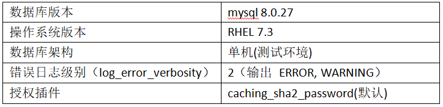

# 故障分析 | 从一则错误日志到 MySQL 认证机制与 bug 的深入分析

**原文链接**: https://opensource.actionsky.com/20230411-mysql/
**分类**: MySQL 新特性
**发布时间**: 2023-04-10T23:20:18-08:00

---

作者：李锡超
一个爱笑的江苏苏宁银行 数据库工程师，主要负责数据库日常运维、自动化建设、DMP平台运维。擅长MySQL、Python、Oracle，爱好骑行、研究技术。
本文来源：原创投稿
*爱可生开源社区出品，原创内容未经授权不得随意使用，转载请联系小编并注明来源。
研发同学反馈某系统性能测试环境MySQL数据库相关的业务系统运行正常，但存在大量警告日志，需配合分析原因。
#### 一、异常现象
MySQL错误日志文件中存在大量如下信息：
2023-01-10T01:07:23.035479Z 13 [Warning] [MY-013360] [Server] Plugin sha256_password reported: ''sha256_password' is deprecated and will be removed in a future release. Please use caching_sha2_password instead'
#### 关键环境信息

#### 二、初步分析
当看到如上警告日志时，根据经验主义，第一反应应该是客户端的版本过低，其授权认证插件是服务端将要废弃的版本，所以产生了以上告警信息。特别是一些常见的客户端的工具，可能会由于更新频率，会很容易触发该问题。
#### 尝试复现
根据初步分析建议，将初步分析建议与研发同学沟通后，通过常见的数据库工具访问数据库，看是否能否复现该错误。但通过数据库里面常见的数据库用户，通过不同的工具访问数据库，均未在访问时刻触发该异常。
由此，第一次尝试复现失败。难道是因为其它原因？
再第一次尝试访问的过程，通过实时观察数据库错误日志。在用客户端尝试访问的过程中，没有复现该错误。但是仍然看到对应的警告日志在持续输出到错误日志文件。且频率较高、间隔时间固定，由此也证明在错误不是数据库工具人工访问的。
应用系统运行正常，又不是客户端导致的！作为DBA的你，应该如何进一步分析呢？
#### 初放小招
由于所处测试环境，针对该错误，可以执行如下操作启用MySQL的一般日志：
-- 开通一般日志：
show variables like 'general_log';
set global general_log=on;
show variables like 'general_log';
-- 查看一般日志路径：
show variables like 'general_log_file';
启用日志后，观察错误日志，发现一般日志中如下记录：

提示：发现异常后，立即关闭一般日志，避免产生过多日志耗尽磁盘空间：
-- 开通一般日志：
show variables like 'general_log';
set global general_log=off;
show variables like 'general_log';
即用户dbuser2 在问题时刻从10.x.y.43 服务器发起了访问数据库的请求。确认异常访问的用户和服务器后，检查数据库mysql.user表、skip-grant-tables等配置，发现数据库并不存在该用户，且没有跳过授权表等配置。使用该用户将无法登录到数据库。
将信息反馈至研发同学，很快就确认了是由于部分应用配置不合理，使用了不存在的数据库用户，并定时连接数据库执行任务。于是研发同学修改配置后，警告日志不再产生。
**那么该问题分析到此，可以结束了么？**
**修改配置后，警告日志不在发生！但既然是不存在的用户，访问时为什么还提示认证插件将废弃呢？**
#### 三、源码分析
带着问题，首先想到的是：既然数据库用户为存在于mysql.user表，登录也会产生警告，难道这个用户是mysql的内部用户，被硬编码了么！于是取到对应版本源码，通过如下命令进行确认：
cd mysql-8.0.27/
grep -rwi "dbuser2" *
其访问结果为空，即不存在猜想的“内部用户”。
#### 正常登录认证逻辑
既然没有硬编码，那就只能是内部逻辑导致。于是首先对正常情况下mysql用户登录过程，源码分析结果如下：
|—> handle_connection
|—> thd_prepare_connection
|—> login_connection
|—> check_connection
// 判断客户端的主机名是否可以登录(mysql.user.host)，如果 mysql.user.host 有 '%' 那么将 allow_all_hosts，允许所有主机。
|—> acl_check_host   
|—> acl_authenticate
|—> server_mpvio_initialize // 初始化mpvio对象，包括赋值 mpvio->ip / mpvio->host
|—> auth_plugin_name="caching_sha2_password"
|—> do_auth_once
|—> caching_sha2_password_authenticate // auth->authenticate_user
|—> server_mpvio_read_packet // vio->read_packet(vio, &pkt) // pkt=passwd
|—> parse_client_handshake_packet
|—> char *user = get_string(&end, &bytes_remaining_in_packet, &user_len);
|—> passwd = get_length_encoded_string(&end, &bytes_remaining_in_packet, &passwd_len);
|—> mpvio->auth_info.user_name = my_strndup(key_memory_MPVIO_EXT_auth_info, user, user_len, MYF(MY_WME))
// 根据 user 搜索 mysql.user.host ,并与客户端的 hostname/ip 进行比较：匹配记录后，赋值 mpvio->acl_user
|—> find_mpvio_user(thd, mpvio) 
|—> list = cached_acl_users_for_name(mpvio->auth_info.user_name); // 根据 user 搜索 mysql.user.host 
|—> acl_user_tmp->host.compare_hostname(mpvio->host, mpvio->ip) //  与客户端的 hostname/ip 进行比较
|—> mpvio->acl_user_plugin = mpvio->acl_user->plugin; // 赋值 acl_user_plugin 属性为用户的plugin名
|—> mpvio->auth_info.multi_factor_auth_info[0].auth_string = mpvio->acl_user->credentials[PRIMARY_CRED].m_auth_string.str; 
|—> mpvio->auth_info.auth_string = mpvio->auth_info.multi_factor_auth_info[0].auth_string; 
|—> if (my_strcasecmp(system_charset_info, mpvio->acl_user_plugin.str,plugin_name(mpvio->plugin)->str) != 0)
|—> my_strcasecmp(system_charset_info, client_plugin,user_client_plugin_name) //检查客户端的认证插件与用户插件是否相同
|—> make_hash_key(info->authenticated_as, hostname ? hostname : nullptr, authorization_id);  // 生成 authorization_id = user1\000% 
|—> g_caching_sha2_password->fast_authenticate(authorization_id,*scramble,20,pkt,false) // 进行快速授权操作
|—> m_cache.search(authorization_id, digest) // 根据 user、host 搜索密码，赋值到digest
|—> Validate_scramble validate_scramble_first(scramble, digest.digest_buffer[0], random, random_length);
|—> validate_scramble_first.validate(); // 校验 scramble
// 如验证成功
|—> vio->write_packet(vio, (uchar *)&fast_auth_success, 1)
|—> return CR_OK;
// 否则进行进行慢授权操作
|—> g_caching_sha2_password->authenticate( authorization_id, serialized_string, plaintext_password);
|—> server_mpvio_update_thd(thd, &mpvio);
|—> check_and_update_password_lock_state(mpvio, thd, res);
// 继续其它授权操作
即核心的认证操作在函数 caching_sha2_password_authenticate() 中执行，先调用函数find_mpvio_user()，通过user、hostname找到已经配置的用户，然后调用函数fast_authenticate()对密码进行快速验证。
#### 使用不存在用户认证逻辑
当用户不存在时，mysql用户登录过程，源码分析结果如下：
|—> handle_connection
|—> thd_prepare_connection
|—> login_connection
|—> check_connection
// 判断客户端的主机名是否可以登录(mysql.user.host)，如果 mysql.user.host 有 '%' 那么将 allow_all_hosts，允许所有主机。
|—> acl_check_host   
|—> acl_authenticate
|—> server_mpvio_initialize // 初始化mpvio对象，包括赋值 mpvio->ip / mpvio->host
|—> auth_plugin_name="caching_sha2_password"
|—> do_auth_once
|—> caching_sha2_password_authenticate // auth->authenticate_user
|—> server_mpvio_read_packet // vio->read_packet(vio, &pkt) // pkt=passwd
|—> parse_client_handshake_packet
|—> char *user = get_string(&end, &bytes_remaining_in_packet, &user_len);
|—> passwd = get_length_encoded_string(&end, &bytes_remaining_in_packet, &passwd_len);
|—> mpvio->auth_info.user_name = my_strndup(key_memory_MPVIO_EXT_auth_info, user, user_len, MYF(MY_WME))
|—> find_mpvio_user(thd, mpvio) 
|—> list = cached_acl_users_for_name(mpvio->auth_info.user_name); // 根据 user 搜索 mysql.user.host, 由于用户不存在，搜索不到记录
|—> mpvio->acl_user = decoy_user(usr, hst, mpvio->mem_root, mpvio->rand, initialized); // 
|—> Auth_id key(user);
// 判断是否用户存在于 unknown_accounts
|—> unknown_accounts->find(key, value)
// 如存在：
|—> user->plugin = Cached_authentication_plugins::cached_plugins_names[value];
// 如不存在：
|—> const int DECIMAL_SHIFT = 1000;
|—> const int random_number = static_cast<int>(my_rnd(rand) * DECIMAL_SHIFT);
|—> uint plugin_num = (uint)(random_number % ((uint)PLUGIN_LAST));
|—> user->plugin = Cached_authentication_plugins::cached_plugins_names[plugin_num];
|—> unknown_accounts->insert(key, plugin_num)
|—> mpvio->acl_user_plugin = mpvio->acl_user->plugin; // 赋值 acl_user_plugin 属性为用户的plugin名
|—> mpvio->auth_info.multi_factor_auth_info[0].auth_string = mpvio->acl_user->credentials[PRIMARY_CRED].m_auth_string.str; // ""
|—> mpvio->auth_info.auth_string = mpvio->auth_info.multi_factor_auth_info[0].auth_string; // ""
|—> mpvio->auth_info.additional_auth_string_length = 0; // 0
|—> mpvio->auth_info.auth_string_length = mpvio->auth_info.multi_factor_auth_info[0].auth_string_length; // 0
|—> if (my_strcasecmp(system_charset_info, mpvio->acl_user_plugin.str,plugin_name(mpvio->plugin)->str) != 0)
|—> return packet_error;
|—> if (pkt_len == packet_error) goto err;
|—> return -1;
|—> auth_plugin_name = mpvio.acl_user->plugin;
|—> res = do_auth_once(thd, auth_plugin_name, &mpvio);
|—> sha256_password_authenticate() //auth->authenticate_user(mpvio, &mpvio->auth_info);
|—> LogPluginErr // Deprecate message for SHA-256 authentication plugin.
// 打印: 2023-01-10T01:07:23.035479Z 13 [Warning] [MY-013360] [Server] Plugin sha256_password reported: ''sha256_password' is deprecated and will be removed in a future release. Please use caching_sha2_password instead'
|—> server_mpvio_read_packet() // vio->read_packet(vio, &pkt)
|—> if (info->auth_string_length == 0 && info->additional_auth_string_length == 0) // info -> auth_info
|—>   return CR_ERROR;
|—> return res; // 0
|—> server_mpvio_update_thd(thd, &mpvio);
|—> check_and_update_password_lock_state(mpvio, thd, res); // 直接返回
...
|—> login_failed_error // 打印登录报错信息
// 2023-01-10T02:02:44.659796Z 19 [Note] [MY-010926] [Server] Access denied for user 'user2'@'localhost' (using password: YES)
|—> thd->send_statement_status();  // 客户端终止
即当使用不存在的用户登录数据库时，通过函数 decoy_user() 创建的 acl_user 对象。在创建这个对象时，其 plugin 属性采用随机方式从 cached_plugins_enum 选择。从而有可能选择到 PLUGIN_SHA256_PASSWORD 插件。但在函数sha256_password_authenticate() 的入口，就会生成Warning级别的提示，以提示该验证PLUGIN_SHA256_PASSWORD 将被废弃。随后，由于在decoy_user() 创建的 acl_user 对象auth_string_length 长度未0，在后续的认证逻辑中会直接返回CR_ERROR，即认证失败。
#### 根因总结
根据以上认证过的分析，导致错误日志存在 PLUGIN_SHA256_PASSWORD 将被废弃的根本原因为：在当前版本，当使用不存在的用户登录数据库时，mysql会随机选择用户的密码认证插件，在当前的版本版本中，有1/3的概率会选择到  PLUGIN_SHA256_PASSWORD 插件。选择该插件后，在后续的认证逻辑将会触发警告日志生成。
#### 四、问题解决
综合以上分析过程，导致该问题的直接原因是应用配置了不存在的数据库用户，根本原因为数据库登录认证逻辑存在一定缺陷。那么解决该问题可参考如下几种方案：
1.参考初步分析中的方案，将应用的连接配置修改为正确的用户信息；
2.可以在mysql数据库中通过参数将该告警过滤，避免该告警信息输入到错误日志文件。相关配置如下：
show variables like 'log_error_suppression_list';
set global log_error_suppression_list='MY-013360;
show variables like 'log_error_suppression_list';
注意，使用该方案也会导致某个存在且使用SHA256_PASSWORD认证插件产生的告警。可以作为临时方案；
3.修改mysql代码，避免在使用不存在用户登录数据库时，选择 SHA256_PASSWORD认证插件。目前针对该方案已提交Bug #109635。
##### 附：关键函数位置
find_mpvio_user() (./sql/auth/sql_authentication.cc:2084)
parse_client_handshake_packet() (./sql/auth/sql_authentication.cc:2990)
server_mpvio_read_packet() (./sql/auth/sql_authentication.cc:3282)
caching_sha2_password_authenticate() (./sql/auth/sha2_password.cc:955)
do_auth_once() (./sql/auth/sql_authentication.cc:3327)
acl_authenticate() (./sql/auth/sql_authentication.cc:3799)
check_connection() (./sql/sql_connect.cc:651)
login_connection() (./sql/sql_connect.cc:716)
thd_prepare_connection() (./sql/sql_connect.cc:889)
handle_connection() (./sql/conn_handler/connection_handler_per_thread.cc:298)